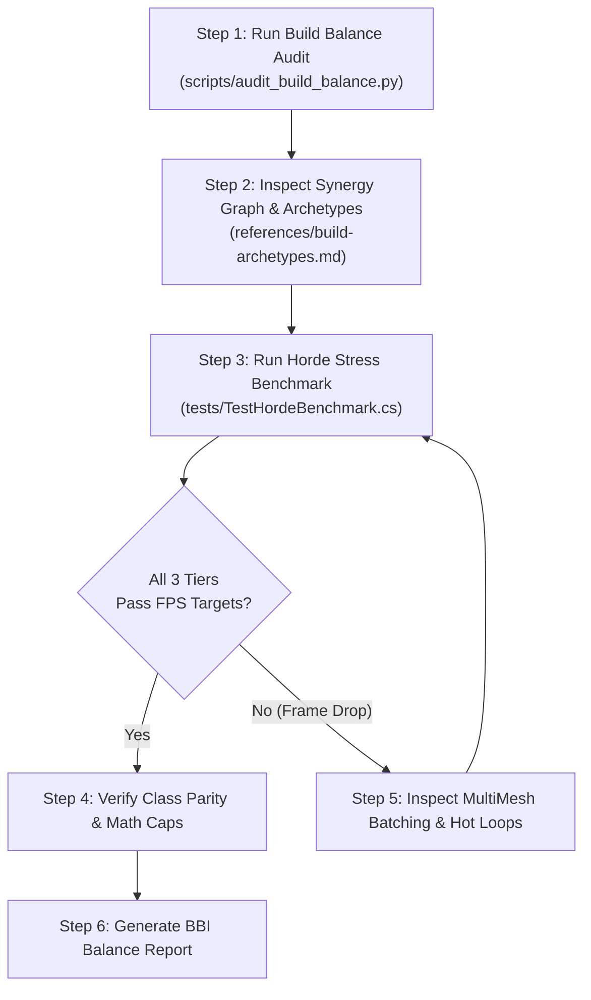

# Game Build Synergy & Dynamic Balance Evaluation Workflow (Phagocyte)

## Overview

This skill establishes the canonical evaluation protocol for **Project: Phagocyte's roguelite build synergies, dynamic numerical balance, and extreme horde scalability**.

In a survivor-like roguelite, the core fun stems from **emergent build variety, synergistic discovery, and overcoming escalating swarms**. If one build monopolizes the game, or if high-density waves drop frame rates into unplayable slideshows, the game fails.

This skill provides automated static balance linters, mathematical synergy matrices, concrete performance benchmarks (`TestHordeBenchmark.cs`), and a 5-pillar scoring framework.

---

## ⚠️ The Iron Balance & Scalability Rules

### 1. The Anti-Monopoly Rule (Zero Dead Cards)
- Every single organelle, skill, and passive tree trait must have at least one viable archetype pairing.
- Zero "no-brainer" mandatory items: No single organelle should exceed a 40% pick-rate across runs.

### 2. The 5-Class Parity Rule
- Every immune cell class (Macrophage, CTL, Neutrophil, B-Cell, Dendritic) must possess viable, distinct winning strategies on Hard and Endless Overdrive modes.
- Win-rate spread between the strongest and weakest cell class must not exceed 15% under optimal play.

### 3. Hard Caps on Exponential Runaways
- Single stats must never scale to infinity:
  - Cooldown Reduction capped at $75\%$.
  - Evasion capped at $60\%$.
  - Block capped at $50\%$.
  - Area of Effect capped at $+150\%$.

### 4. 500-Entity Horde Scalability
- The game must maintain stable frame pacing under 500 active pathogen bodies.
- MultiMesh batching must automatically absorb high-density micro-pathogens (norovirus, influenza) to keep draw calls below 80 per frame.

---

## The 5 Balance Evaluation Pillars

```mermaid
radar-chart
    title Build Balance Index (BBI)
    axis Class Diversity, Organelle Utility, Archetype Synergy, Stat Economy & Caps, Pathogen Escalation
```

| Pillar | Weight | Primary Focus | Reference Standard |
|:---|:---:|:---|:---|
| **1. Class Diversity & Distinctiveness** | 20% | 5-class stat differentiation, exclusive skills, and win-rate parity | [Balance Rubric](./references/balance-rubric.md) §1 |
| **2. Organelle Utility & Anti-Monopoly** | 25% | Energy cost vs stat potency, full 6-category taxonomy, zero dead cards | [Balance Rubric](./references/balance-rubric.md) §2 |
| **3. Archetype Synergy Depth** | 25% | Coverage and depth of the 5 canonical immunological archetypes | [Build Archetypes](./references/build-archetypes.md) |
| **4. Stat Economy & Diminishing Returns** | 15% | Energy budgeting, passive tree depth, and asymptotic mathematical caps | [Balance Rubric](./references/balance-rubric.md) §3 |
| **5. Pathogen Escalation & Scalability** | 15% | Multi-tier threat ramp and 500-entity horde performance stability | [Balance Rubric](./references/balance-rubric.md) §4 |

---

## Step-by-Step Balance Evaluation Workflow



---

### Step 1: Run Automated Build Balance Audit

Execute the automated Python linter to verify data catalogs, energy costs, and archetype coverage:

```bash
# High-level Build Balance Index (BBI)
python3 .agents/skills/game-balance-eval/scripts/audit_build_balance.py --summary

# Detailed diagnostic logs and item breakdowns
python3 .agents/skills/game-balance-eval/scripts/audit_build_balance.py --detail

# Export markdown report
python3 .agents/skills/game-balance-eval/scripts/audit_build_balance.py --report /tmp/balance_eval_report.md
```

### Step 2: Run Automated Horde Stress Benchmark

Execute the automated GdUnit4 C# horde benchmark to measure FPS and frame pacing under 100, 300, and 500 active enemies:

```bash
/Applications/Godot_mono.app/Contents/MacOS/Godot \
  --headless --path . -s res://tests/TestHordeBenchmark.cs
```

Verify that:
- Tier 1 (100 enemies): Avg FPS $\ge 60$.
- Tier 2 (300 enemies): Avg FPS $\ge 60$.
- Tier 3 (500 enemies): Avg FPS $\ge 55$, 1% Low FPS $\ge 40$, Max Spike $\le 25\text{ms}$.
- MultiMesh batching operates properly on batched species.

### Step 3: Audit Changes Against the 5 Canonical Archetypes

When adding new skills or organelles, check [Build Archetypes](./references/build-archetypes.md):
- Does the new item support at least one of the 5 archetypes:
  1. *Respiratory Burst (ROS) Oxidation Melt*
  2. *Cytotoxic Piercing Sniper*
  3. *Engulf-and-Digest Heavy Tank*
  4. *Complement Cascade Trap Network*
  5. *Antibody Opsonization Swarm*
- Does the item introduce unwanted single-stat exponential loops?

---

## Skill Directory Structure

```text
.agents/skills/game-balance-eval/
├── SKILL.md                                 # This workflow manual
├── references/
│   ├── build-archetypes.md                  # The 5 canonical immunological archetypes and synergies
│   └── balance-rubric.md                    # Quantitative balance metrics, stat caps, and horde criteria
└── scripts/
    └── audit_build_balance.py               # Automated Python CLI for data balance and archetype auditing
```
