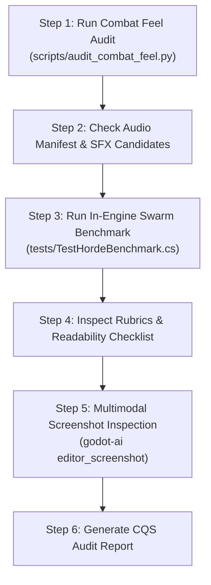

# Game Combat Feel, Kinesthetics & "Juice" Evaluation Workflow (Phagocyte)

## Overview

This skill establishes the canonical evaluation protocol for **Project: Phagocyte's combat feel, tactile kinesthetics, audiovisual feedback ("juice"), and visual readability under extreme swarm densities**.

While scientific authenticity (`game-educational-eval`) and confocal microscopy aesthetic (`game-visual-eval`) provide narrative and visual identity, survivor-like roguelites (*Vampire Survivors*, *Brotato*, *Halls of Torment*) succeed or fail based on **how satisfying it feels to move, attack, impact, and destroy hundreds of pathogens**.

This skill provides automated static and runtime linters, quantified 5-level scoring rubrics, and a repeatable verification procedure.

---

## ⚠️ The Iron Combat & Kinesthetic Rules

### 1. The Low-Reynolds Locomotion Rule (Viscous Drag, Not Vacuum)
- Microscopic cells navigate interstitial lymph fluid where viscous forces dominate over inertia (Low Reynolds number).
- Locomotion must feel distinct from floating in outer space: instantaneous acceleration with rapid drag settling, differentiated across all 5 classes (Neutrophil rapid chemotactic twitch vs Macrophage heavy ameboid crawl).

### 2. The Impact Feedback Rule (Silence & Stiff Hits Are Bugs)
- Every hit must provide multisensory confirmation within 1 frame:
  - **Visual**: Hit-flash modulation (`FlashModulate`), particle burst (`VfxManager`), floating combat text (`DamageNumberSpawner`).
  - **Acoustic**: Crit-differentiated SFX playback routed through `AudioManager`.
  - **Kinesthetic**: Micro-pauses (30–60ms hit-stop) and physical knockback.

### 3. Quadratic Camera Trauma ($\text{Shake} = \text{Trauma}^2$)
- Camera shake must compute via non-linear quadratic trauma decay rather than linear noise jitter, preventing motion sickness while maximizing punch.
- Screen shake MUST be gated by `SettingsManager.ScreenShake` for photosensitivity and accessibility compliance.

### 4. Zero GC Allocation in Combat Loops
- Floating combat text, particle effects, and projectiles MUST utilize pre-allocated struct or node pools.
- Heap allocations (`0 KB/frame`) in combat `_Process` or `_PhysicsProcess` hot paths are strictly enforced to eliminate micro-stutters.

---

## The 5 Combat Evaluation Pillars

```mermaid
radar-chart
    title Combat Quality Score (CQS)
    axis Kinesthetics & Hit-Stop, Camera Trauma Dynamics, Damage Typography, Bio-Acoustic Mix, Swarm Readability & Ergonomics
```

| Pillar | Weight | Primary Focus | Reference Standard |
|:---|:---:|:---|:---|
| **1. Kinesthetics & Hit-Stop** | 25% | Micro-pauses, knockback inertia, sprite flash, and visceral impact weight | [Combat Juice Rubric](./references/combat-juice-rubric.md) §1 |
| **2. Screen Trauma Dynamics** | 20% | Non-linear $\text{Trauma}^2$ decay, directional offsets, and user settings gating | [Combat Juice Rubric](./references/combat-juice-rubric.md) §2 |
| **3. Damage Typography Pop** | 20% | Zero-allocation struct pooling, font size scaling, and color coding | [Combat Juice Rubric](./references/combat-juice-rubric.md) §3 |
| **4. Bio-Acoustic Integrity** | 20% | 3-band frequency staging, dynamic ducking, manifest validation | [Combat Juice Rubric](./references/combat-juice-rubric.md) §4 |
| **5. Swarm Readability & Ergonomics** | 15% | Player nucleus contrast, elite auric halos, telegraphed attack cones | [Swarm Readability Checklist](./references/swarm-readability-checklist.md) |

---

## Step-by-Step Evaluation Workflow



---

### Step 1: Run Automated Combat Feel Audit

Execute the automated Python linter to verify code patterns, pool allocations, and camera parameters:

```bash
# High-level Combat Quality Score (CQS)
python3 .agents/skills/game-combat-eval/scripts/audit_combat_feel.py --summary

# Detailed diagnostic logs
python3 .agents/skills/game-combat-eval/scripts/audit_combat_feel.py --detail

# Export markdown report
python3 .agents/skills/game-combat-eval/scripts/audit_combat_feel.py --report /tmp/combat_eval_report.md
```

### Step 2: Validate In-Engine Swarm Stability & Performance

Run the headless benchmark suite to test frame pacing and collision performance under 100, 300, and 500 active enemies:

```bash
/Applications/Godot_mono.app/Contents/MacOS/Godot \
  --headless --path . -s res://tests/TestHordeBenchmark.cs
```

Verify that:
- Average FPS remains $>60$ (or $>100$ in headless emulation).
- 1% Low FPS does not drop below 45 FPS.
- Zero unhandled exceptions or memory leaks occur during 500-entity swarms.

### Step 3: Evaluate Visual Readability in Combat

When modifying active weapon skills or enemy particle shaders:
1. Launch headed combat scene or run custom scene preview via `godot-ai`:
   ```json
   project_run(mode="custom", scene="res://scenes/main.tscn")
   ```
2. Capture screenshot of 300+ enemy battle:
   ```json
   editor_screenshot(source="game", user_prompt="Inspect swarm readability and player nucleus contrast")
   ```
3. Audit against [Swarm Readability Checklist](./references/swarm-readability-checklist.md):
   - Is player nucleus immediately identifiable?
   - Are elite pathogens visually distinct from minions?
   - Are danger telegraphs obscured by weapon particles?

---

## Skill Directory Structure

```text
.agents/skills/game-combat-eval/
├── SKILL.md                                 # This workflow manual
├── references/
│   ├── combat-juice-rubric.md               # 5-Level rubric for hit-stop, camera shake, and audio mix
│   └── swarm-readability-checklist.md       # Visual ergonomics and accessibility checklist
└── scripts/
    └── audit_combat_feel.py                 # Automated Python CLI for combat juice and audio auditing
```
