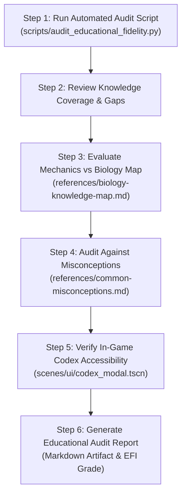

# Game Educational & Scientific Knowledge Evaluation Workflow (Phagocyte)

## Overview

This skill defines the canonical workflow for **evaluating, auditing, and benchmarking Project: Phagocyte's educational efficacy and real-world biological knowledge similarity**.

Project: Phagocyte is founded upon the design mission articulated in `docs/real.md`:
> **「玩遊戲即理解免疫學」 (Play the game to understand immunology)**  
> *We reject "generic video games dressed in a biology skin" and "dry didactic classroom lecture software". Our mission is: to make genuine physiological and biochemical mechanisms themselves the most thrilling gameplay mechanics.*

This skill provides deterministic automated auditing scripts, a 5-dimension scoring rubric, an immunological Single Source of Truth (SSOT), and an actionable evaluation workflow to ensure the game remains both an exhilarating survivor-like roguelite and a world-class interactive immunology simulation.

---

## ⚠️ The Iron Educational Rules

### 1. Mandatory Scientific Authenticity (No Fantasy Reskins)
- Every weapon, organelle, cell type, and enemy trait MUST trace back to real, peer-reviewed human biology, immunology, or biochemistry.
- Fantasy tropes (fire magic, mana, arbitrary forcefields) are strictly forbidden unless directly translated into a legitimate physiological equivalent (e.g. respiratory burst $\text{H}_2\text{O}_2$, ATP phosphorylation, Arp2/3 cortical actin mesh).

### 2. The Mechanism-as-Gameplay Rule (No Intrusive Lectures)
- Education must occur **incidentally through high-feedback gameplay loops ("stealth edutainment")**, NOT through disruptive text popups, unskippable lectures, or classroom multiple-choice quizzes.
- If a player learns that opsonization enhances phagocytosis, they should learn it because tagged enemies glow with yellow fluorophores and take massive critical hits, not because a text box told them so.

### 3. The Dual-Audience Accessibility Rule
- **Medical/Biology Experts** must be able to recognize genuine mechanisms immediately (e.g., ANT translocase exporting ATP, V-ATPase acidifying lysosomes to pH 4.5, perforin assembling transmembrane pore cylinders).
- **Non-Biologist Players** must find mechanics intuitive and fun through clear tactile metaphors (e.g., fast couriers, acidic disintegrators, armor-piercing spears).

### 4. Misconception Quarantine
- The game must never propagate or reinforce dangerous pop-culture medical myths (e.g., "antibiotics cure viral infections", "boosting immunity indefinitely is harmless", "all bacteria are evil germs").
- All design choices must be audited against `references/common-misconceptions.md`.

---

## The 5-Dimension Educational Evaluation Framework

The game's educational fidelity is scored across five quantified pillars (0–100 scale):

```mermaid
radar-chart
    title Educational Fidelity Index (EFI)
    axis Mechanistic Fidelity, Pathogen-Host Accuracy, Scientific Nomenclature, Incidental Learning Loop, Misconception Resistance
```

| Dimension | Weight | Primary Focus | Reference Standard |
|:---|:---:|:---|:---|
| **1. Mechanistic Scientific Fidelity** | 25% | Authenticity of biochemical transduction and biophysical mechanics | `references/biology-knowledge-map.md` §1–§3 |
| **2. Pathogen-Host Interaction Accuracy** | 20% | Clinical microbiology, microbial motility, virulence traits, and evasion | `references/biology-knowledge-map.md` §4 |
| **3. Scientific Nomenclature & Rigor** | 20% | Latin binomials, IUPAC biochemical naming, and multilingual translation parity | `references/educational-rubric.md` Dim 3 |
| **4. Incidental Learning & Cognitive Ergonomics** | 20% | Cognitive scaffolding, readability, tactical vs deep bio text layers, Codex accessibility | `references/educational-rubric.md` Dim 4 |
| **5. Scientific Misconception Resistance** | 15% | Resilience against pop-science health myths and biological fallacies | `references/common-misconceptions.md` |

---

## Step-by-Step Educational Evaluation Workflow



---

### Step 1: Run Automated Educational Audit Script

Run the automated Python linter to inspect all 139+ registered game entities, translation keys, and nomenclature formats:

```bash
# Print high-level Educational Fidelity Index (EFI) and dimension scores
python3 .agents/skills/game-educational-eval/scripts/audit_educational_fidelity.py --summary

# Print full per-item audit logs and missing bio keys
python3 .agents/skills/game-educational-eval/scripts/audit_educational_fidelity.py --detail

# Export comprehensive markdown report
python3 .agents/skills/game-educational-eval/scripts/audit_educational_fidelity.py --report /tmp/educational_eval_report.md
```

### Step 2: Audit Scientific Nomenclature & Translations

1. Inspect `assets/translations/translations.csv` to ensure every new or modified entity contains both:
   - `_DESC`: A punchy, tactical 1-sentence tooltip explaining the gameplay effect.
   - `_BIO`: A scientifically rigorous explanation describing the real-world biological mechanism (e.g. `Biochem: Adenine nucleotide translocase ferries ATP...`).
2. Verify pathogen naming in `assets/data/pathogens.json`:
   - Bacteria must use standard binomials (*Staphylococcus aureus*, *Pseudomonas aeruginosa*).
   - Viruses must be properly characterized (*Coronaviral Spike Virion*, *Antigen-Drift Influenza*).

### Step 3: Evaluate Mechanics Against the Biology Knowledge Map

Compare new skills, organelles, or balance tweaks against `references/biology-knowledge-map.md`:
- Do organelle stat modifiers logically match their category?
  - **Metabolism** $\rightarrow$ Cooldown reduction, Duration, Might.
  - **Digestion** $\rightarrow$ Ailment damage, Health regeneration, Life steal.
  - **Cytoskeleton** $\rightarrow$ Move speed, Area, Knockback, Pierce, Evasion.
  - **Synthesis** $\rightarrow$ Projectile amount, Projectile speed, Crit damage.
  - **Sensing** $\rightarrow$ Armor, Block, Magnet, Evasion.
  - **Symbiosis** $\rightarrow$ Energy generation paired with realistic metabolic trade-offs.

### Step 4: Misconception Audit

Review changes against `references/common-misconceptions.md`:
- Does any new skill imply that antibiotics destroy viruses?
- Does any balance change remove metabolic trade-offs or treat cell energy as infinite?
- Are beneficial microbes represented alongside pathogenic threats?

### Step 5: Check In-Game Codex Accessibility

Verify that in-game UI surfaces expose biological knowledge to the player:
1. Check `scenes/ui/codex_modal.tscn` and `scripts/ui/CodexModal.cs`.
2. Ensure players can view the detailed `_BIO` lore outside of fast-paced combat.
3. Confirm all active categories (Skills, Passives, Cells, Pathogens, Maps, Organelles) have accessible tabs.

### Step 6: Generate the Educational Evaluation Report

Compile findings into an agent artifact or report covering:
1. **EFI Composite Score & Grade** (A+ to F).
2. **5-Dimension Radar Breakdown**.
3. **Identified Knowledge Gaps** (missing `_BIO` keys, un-codified items).
4. **Actionable Pedagogical Recommendations** to level up learning impact without diminishing combat pacing.

---

## Skill Directory Structure

```text
.agents/skills/game-educational-eval/
├── SKILL.md                                 # This workflow manual
├── references/
│   ├── educational-rubric.md                # 5-Level rubric for each evaluation dimension
│   ├── biology-knowledge-map.md             # Real immunology SSOT vs game entity mapping
│   └── common-misconceptions.md             # Checklist of 15 biology & medical fallacies
└── scripts/
    └── audit_educational_fidelity.py        # Automated Python CLI for data auditing and EFI scoring
```
