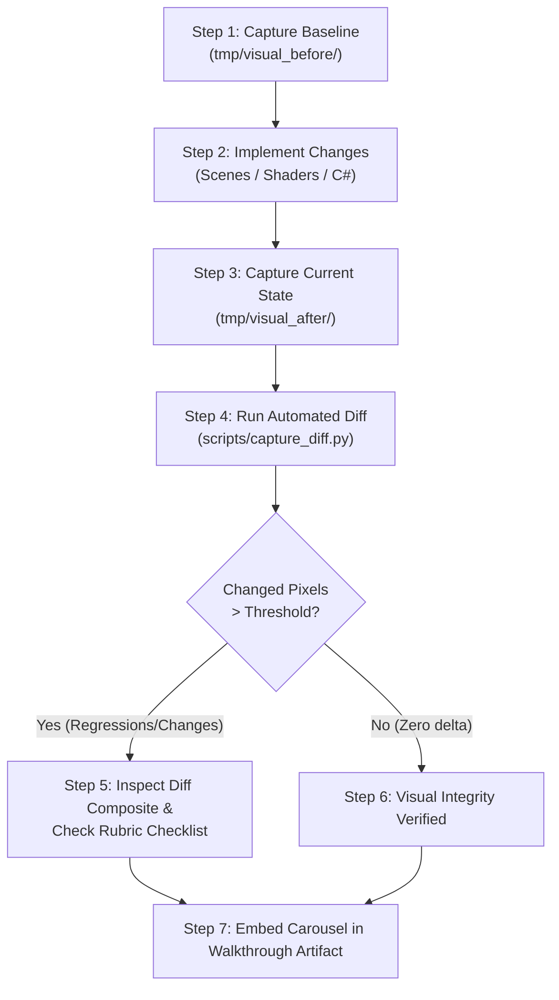

# Game Visual Evaluation Workflow (Phagocyte)

## Overview

This skill establishes the canonical, end-to-end workflow for **inspecting, capturing, comparing, and validating the visual quality of Project: Phagocyte**. 

All visual assets and UI surfaces adhere to the **Confocal Laser Scanning Microscopy & Microscopic Bio-Fluorescence** aesthetic (暗視野顯微鏡 / 共軛焦螢光顯微鏡視覺體系). This skill provides deterministic tools and structured rubrics to ensure that code, shader, theme, and scene changes maintain pixel-perfect fidelity without regressions.

---

## ⚠️ The Iron Evaluation Rules

### 1. Project-Local Isolated Captures (`tmp/`)
- All temporary screenshots and visual diffs MUST be placed under **`tmp/`** at the project root (e.g. `tmp/visual_before/`, `tmp/visual_after/`, `tmp/visual_diff/`).
- **NEVER** write preview captures into tracked asset directories (`assets/`, `gen/`, `scenes/`).
- **NEVER** commit PNG files to version control (`tmp/` is gitignored and protected by `tmp/.gdignore` to prevent Godot from importing ephemeral captures).

### 2. No Blind Headless Viewport Captures
- Godot's `--headless` mode disables the visual rendering server; viewport screenshots taken under headless execution return blank or empty textures.
- Use **godot-ai MCP** (`editor_screenshot(source="game")`) or a headed SceneTree run (`Godot --path . -s res://tests/TestAchievementPreview.cs`) to produce real pixel buffers.

### 3. Baseline-First Protocol
- Before touching UI scenes (`.tscn`), theme files (`.tres`), shaders (`.gdshader`), or layout scripts (`.cs`), **always capture the baseline state first** to `tmp/visual_before/`.
- Never attempt before/after comparison by relying on memory; let `scripts/capture_diff.py` measure exact pixel deltas.

---

## Workspace Directory Conventions

```text
tmp/
├── .gdignore                   # Prevents Godot from importing ephemeral captures
├── visual_before/              # Baseline PNG captures before modification
│   ├── title_view.png
│   ├── gallery_all.png
│   └── hud_hp.png
├── visual_after/               # New PNG captures after modification
│   ├── title_view.png
│   ├── gallery_all.png
│   └── hud_hp.png
└── visual_diff/                # Automated 3-column composites generated by comparator
    ├── diff_title_view.png
    └── diff_gallery_all.png
```

---

## Step-by-Step Visual Evaluation Workflow



---

### Step 1: Capture Baseline (`tmp/visual_before/`)

Choose the capture method appropriate for your task:

#### Method A: Interactive Surface Capture via `godot-ai` MCP (Recommended)
When Godot editor is open or you want targeted capture of any specific scene:
```json
// 1. Run the target scene (e.g. main menu or combat arena)
project_run(mode="custom", scene="res://scenes/ui/main_menu.tscn")

// 2. (Optional) Simulate input to reach desired modal/view
game_manage(op="input_mouse", params={"event": "button", "position": {"x": 640, "y": 480}})

// 3. Capture high-resolution framebuffer directly
editor_screenshot(
  source="game",
  max_resolution=0,
  user_prompt="Baseline capture of achievement gallery view"
)

// 4. Terminate playback session
project_manage(op="stop")
```
Save the returned image to `tmp/visual_before/<surface_name>.png`. Refer to [Capture Catalog](./references/capture-catalog.md) for pre-mapped recipes.

#### Method B: Automated Batch Harness Capture (Recommended for Sweeps)
For full automated sweeps of **ALL 21 visual surfaces and live skill VFX** with frame settling:
```bash
PHAGOCYTE_CAPTURE_DIR=tmp/visual_before \
  /Applications/Godot_mono.app/Contents/MacOS/Godot \
  --path . -s res://tests/TestFullVisualPreview.cs
```
This automatically produces 21 screenshots:
- **UI Surfaces**: `title_view.png`, `class_view.png`, `loadout_view.png`, `passive_view.png`, `map_view.png`, `gallery_all.png`, `gallery_locked.png`, `endgame_setup.png`, `codex_modal.png`, `settings_modal.png`, `run_records.png`, `toast_banner.png`, `achievement_toast.png`, `upgrade_modal.png`, `hud_hp.png`.
- **Active Skills in Combat**: `skill_mac_mine.png`, `skill_mac_blast.png`, `skill_antibody_missile.png`, `skill_perforin_lance.png`, `skill_grasp_chain.png`, `skill_ros_torrent.png`.

#### Method C: Auto-Discovery & Coverage Linter
To audit visual coverage and detect any newly added UI scenes or weapon skills:
```bash
python3 .agents/skills/game-visual-eval/scripts/discover_visual_targets.py
```

---

### Step 2: Implement Changes
Modify your target `.tscn`, `.cs`, `.tres`, or `.gdshader` files. Ensure the C# build remains clean:
```bash
make build   # dotnet build Phagocyte.csproj --warnaserror
```

---

### Step 3: Capture Current State (`tmp/visual_after/`)
Repeat the capture procedure from Step 1 using the same surfaces, directing output to `tmp/visual_after/`:
```bash
PHAGOCYTE_CAPTURE_DIR=tmp/visual_after \
  /Applications/Godot_mono.app/Contents/MacOS/Godot \
  --path . -s res://tests/TestFullVisualPreview.cs
```

---

### Step 4: Run Automated Pixel Comparator (`capture_diff.py`)

Execute the built-in diff comparator:
```bash
python3 .agents/skills/game-visual-eval/scripts/capture_diff.py \
  --before tmp/visual_before \
  --after  tmp/visual_after \
  --output tmp/visual_diff \
  --threshold 0.02
```

#### What `capture_diff.py` Does:
1. Compares matching image pairs channel-by-channel with pixel tolerance (`tolerance=5`).
2. Generates an amplified fluorescent difference map highlighting modified regions in neon magenta/red over a dimmed scene context.
3. Produces a 3-column composite: `[ 1. BEFORE | 2. AFTER | 3. DIFF MAP ]` saved to `tmp/visual_diff/diff_<name>.png`.
4. Reports exact changed pixel percentage and maximum color delta per surface.
5. Exits with code `0` if all differences remain under `--threshold` (default 2%), or `1` if unexpected visual regressions occur.

---

### Step 5: Evaluate Quality Against the Visual Rubric

Open and verify against [Visual Quality Checklist & Rubric](./references/visual-checklist.md):

1. **Color Language & Fluorophores**:
   - Deep void black substrate (`#000000`) without gray hazing or bounding box artifacts.
   - Distinct fluorescent channels: GFP Emerald (`#00FF88`), RFP Crimson (`#FF3366`), DAPI Blue (`#00D2FF`), YFP Gold (`#FFD700`).
   - Active 2D WorldEnvironment glow/bloom on emissive membrane rims.
2. **Typography & Layout**:
   - No missing font glyphs / tofu boxes (`□`) in English or Chinese text.
   - Uniform dimensions for card items (`TestCardUniformSize.cs` principle).
   - Centered modal windows with dimming backdrops.
3. **Asset Boundaries & Keying**:
   - No alpha halos or white borders around circular or organic cell sprites.
   - Clean transparent corners.
   - Proper grayscale dimmed rendering for locked items (`*_unachieved.png`).

---

### Step 6: AI-Assisted Qualitative Review & Artifact Reporting

For qualitative aesthetics (e.g. assessing whether a new shader looks organic and fluid rather than noisy), use multimodal image review:

1. Copy the relevant composite image into the current artifact directory:
   ```bash
   cp tmp/visual_diff/diff_gallery_all.png /Users/zelin/.gemini/antigravity/brain/<conv-id>/
   ```
2. Present a carousel comparison in your `walkthrough.md`:

````markdown
# Visual Evaluation Walkthrough

## Before vs. After Comparison
````carousel

<!-- slide -->

<!-- slide -->

````
````

---

## References & Resources

- [Visual Quality Checklist & Rubric](./references/visual-checklist.md): Detailed aesthetic criteria, optical physics, and diagnostic fix matrix.
- [Capture Catalog & MCP Recipes](./references/capture-catalog.md): Complete list of scenes, interactive MCP steps, and output filenames.
- [Comparator Script](./scripts/capture_diff.py): Pure-Pillow image diffing tool.
