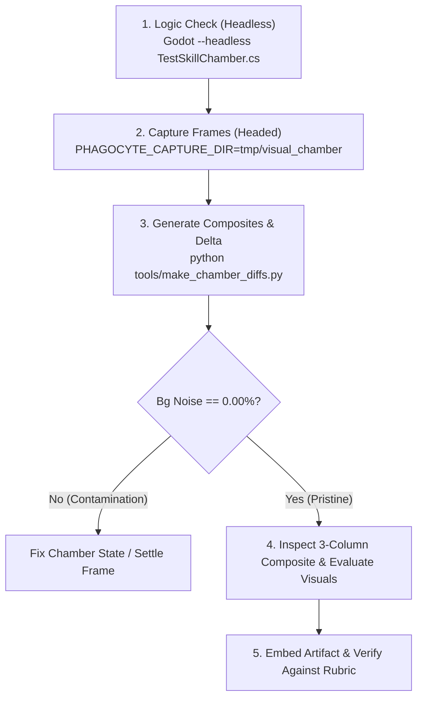

# Skill Visual Effects (VFX) Testing & Evaluation Workflow

## 1. Overview & Core Philosophy

In *Project: Phagocyte*, evaluating active skill visual effects requires **absolute visual determinism**. Testing visual effects inside standard gameplay scenes (`main.tscn`) introduces uncontrolled visual contamination:
1. **Dynamic Fluid Shaders**: Fluid turbulence, peristalsis background shaders, and ambient floating cellular debris drift across frames.
2. **EXP & Level-Up Mutation Modals**: Standard enemies drop EXP gems on death, which can trigger player level-up dialogs (`UpgradeModal`) that occlude the game arena.
3. **Enemy Brownian Motion**: Regular enemies move via wandering/steering physics, creating false positional delta noise between frames.

To eliminate all visual contamination, all skill VFX testing **must be conducted inside the Isolated Testing Chamber (`SkillTestChamber`)**, ensuring **strictly 0.00% background noise** and pixel-perfect isolation of energy beams, particle bursts, and impact decals.

---

## 2. Cleanroom Architecture (SSOT)

```
+-------------------------------------------------------------------------------+
| SkillTestChamber (1280x720 Cleanroom Canvas)                                 |
|                                                                               |
|  [Static Dark Bio-Laboratory Backdrop (#0a0d14) - 0.00% Noise]                |
|                                                                               |
|                     Concentric Scientific Range Rings                         |
|                           (100px, 200px, 300px)                               |
|                                                                               |
|                               (0, 360)                                        |
|                                  |                                            |
|           (-640, 0)        (Center: 640, 360)         (640, 0)                |
|         ------+------------------(*)------------------+------> [Line/Cluster] |
|                               [Subject]              [TargetDummy]            |
|                                  |                                            |
|                               (0, -360)                                       |
+-------------------------------------------------------------------------------+
```

### 2.1 Core Components
- **`SkillTestChamber` ([`scripts/testing/SkillTestChamber.cs`](file:///c:/Users/skyro/project/phagocyte/scripts/testing/SkillTestChamber.cs))**:
  - **Coordinates**: Standard 1280×720 viewport with `Center = Vector2(640, 360)`.
  - **Backdrop**: Solid `#0a0d14` `ColorRect` (no moving textures or shader noise).
  - **Grid Overlay**: Static Cartesian coordinate crosshairs and concentric millimeter range rings (100px, 200px, 300px) centered exactly on `Subject`.
  - **Skill Isolation**: Disarms other skill slots (`CooldownTimer = 999999f`) to prevent auto-firing cross-talk.
  - **EXP Shielding**: Subject configured with `ExpToNextLevel = int.MaxValue` to prevent mutation modals.
  - **Transient Cleanup**: `ClearTransientVfx()` purges projectile beams and particles between skill tests.
- **`TargetDummy` ([`scripts/testing/TargetDummy.cs`](file:///c:/Users/skyro/project/phagocyte/scripts/testing/TargetDummy.cs))**:
  - Inherits `BaseEnemy`, `EnemyId = "target_dummy"`.
  - `AtpValue = 0` (zero EXP drops).
  - `CurrentHealth = MaxHealth` auto-reset on damage (never dies, triggers no death telemetry).
  - `SetPhysicsProcess(false)` (zero movement or Brownian jitter).
  - Cyan reticle and concentric target rings for clear hit-point visualization.

---

## 3. Tag-Adaptive Dummy Formations

Different skill mechanics require specialized dummy configurations. Use the appropriate `DummyFormation` from [`references/formation-matrix.md`](./references/formation-matrix.md):

| Formation | Structure | Applicable Mechanics & Skills |
| :--- | :--- | :--- |
| **`Single`** | Single target at `Center + (160, 0)` | Melee grabs, single-target laser locks (`phagocytic_grasp`, `pseudopod_lunge`, `mhc_tracer_beam`) |
| **`Line`** | 3 targets at `+100px, +165px, +230px` | Piercing projectiles, linear columns (`perforin_lance`, `ros_torrent`) |
| **`Cluster`** | 3 targets in a compact triangle | Chaining lightning, bouncing enzymes, pull vortexes (`pro_inflammatory_arc`, `lysozyme_ricochet`, `antibody_salvo`, `exosome_singularity`, `granzyme_detonation`) |
| **`Radial`** | 8 targets in a 135px radius circle | 360° novas, orbiting shields, shockwaves (`nitric_oxide_halo`, `nuclease_blades`, `interferon_wave`, `defensin_barbs`, `histamine_surge`) |
| **`GroundHazard`**| Target placed at `+150px` inside hazard zone | Acid pools, digestive fluid trails (`lysosomal_overload`, `phagolysosome_vent`) |

---

## 4. Standard Operating Procedure (SOP)



### Step 1: Headless Logic Verification (Fast CI)
Ensure the test harness and skills instantiate and execute without runtime errors:
```powershell
Godot --headless --path . -s res://tests/TestSkillChamber.cs
```
*Validation*: Must output `ALL 18 SKILLS VERIFIED IN ISOLATED CHAMBER PASSED SUCCESSFULLY!`.

### Step 2: Headed Framebuffer Capture
Capture the actual rendered pixel buffers:
```powershell
$env:PHAGOCYTE_CAPTURE_DIR="tmp/visual_chamber"
& 'C:\Users\skyro\OneDrive\桌面\Godot_v4.7.1-stable_mono_win64\Godot_v4.7.1-stable_mono_win64.exe' --path . -s res://tests/TestSkillChamber.cs
```
This produces two frames per skill:
- `skill_<id>_pre.png`: Pre-cast baseline ($T_0$, idle macrophage + dummy formation).
- `skill_<id>_post.png`: Peak-cast frame ($T_{peak}$, skill active and impacting dummies).

### Step 3: Composite Generation & Noise Verification
Run the composite generator to create 3-column verification images:
```powershell
python tools/make_chamber_diffs.py
```
The script generates `diff_chamber_<id>.png` with 3 panels:
1. `1. PRE-CAST (T0 BASELINE)`: Subject + Dummy formation.
2. `2. ACTIVE SKILL VFX (Tpeak)`: Active VFX in motion.
3. `3. ISOLATED VFX HEATMAP`: Absolute difference highlighting pure skill VFX.

*Mandatory Check*: The terminal output table **must report `Bg Noise: 0.00%`** for all skills.

---

## 5. Before-vs-After Redesign Protocol

When redesigning or upgrading a skill's visual effects:

```
[ Baseline Skill (Original) ]                [ Redesigned Skill (New) ]
             |                                            |
    Capture Peak Frame                           Capture Peak Frame
             v                                            v
    tmp/visual_chamber/                          tmp/visual_chamber/
    skill_<id>_baseline.png                      skill_<id>_redesign.png
             \                                            /
              \----------> Composite Generator <---------/
                                  |
                                  v
                [ 1. ORIGINAL | 2. REDESIGNED | 3. VFX DIFF ]
```

1. **Capture Baseline ($T_{peak, old}$)**:
   Run the test chamber on the current codebase to record the original visual state.
2. **Implement Redesign**:
   Upgrade `_Draw()` rendering, add multi-pass glow, configure `SkillAssetPalette`, or integrate particle emitters.
3. **Capture Redesign ($T_{peak, new}$)**:
   Run the chamber test on the modified codebase.
4. **Compare Directly**:
   Generate side-by-side composites showing the old VFX vs new redesigned VFX in the same cleanroom coordinates.

---

## 6. Bio-Fluorescence Visual Quality Rubric

Every active skill VFX must be evaluated against the [Bio-Fluorescence Rubric](./references/vfx-rubric.md):

1. **3-Pass Confocal Glow**:
   - High-energy excitation core: White/off-white (`#ffffff` or lerped 60% with white).
   - Primary fluorescent halo: Color sampled from `SkillAssetPalette.Accent(skillId)`.
   - Subtle outer aura: Alpha 0.15–0.30 extending 1.5× the core radius.
2. **Organic Shape Language**:
   - Avoid flat primitive computer graphics (single 1px lines, untextured circles).
   - Use biological textures: actin filaments, Ca²⁺ corkscrews, fluid vesicles, caspase runes.
3. **Hit-Reaction Readability**:
   - Piercing weapons must produce membrane rupture decals (`PerforinPore`).
   - Impact points must produce radial micro-flashes on target dummies.
4. **Zero Lingering Artifacts**:
   - All transient visual nodes must implement proper lifespans and auto-queue-free (`QueueFree()` on timer).

---

## 7. Anti-Patterns & Common Pitfalls

- ❌ **Headless Viewport Capture**: Never attempt screenshot diffs under `--headless`. Godot disables rendering servers in headless mode, resulting in black viewports.
- ❌ **Testing in `main.tscn`**: Never test skill VFX in the combat arena where background fluid shaders and wave spawners introduce non-zero background noise.
- ❌ **Hardcoded Colors**: Never hardcode colors in skill `_Draw()` methods. Always use `SkillAssetPalette.Accent(SkillId)` and `SkillAssetPalette.Core(SkillId)` to ensure palette fidelity.
- ❌ **EXP Contamination**: Never spawn regular enemies in a VFX test. Regular enemies drop ATP gems which trigger level-up cards over the camera. Always use `TargetDummy`.
