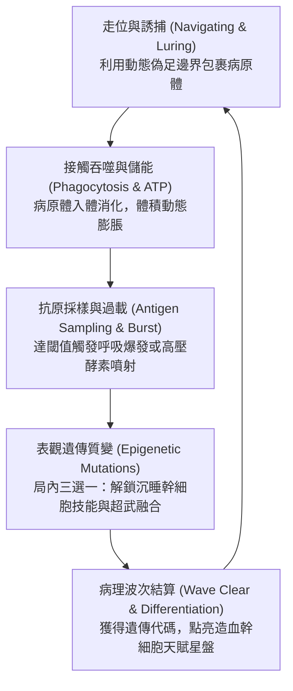
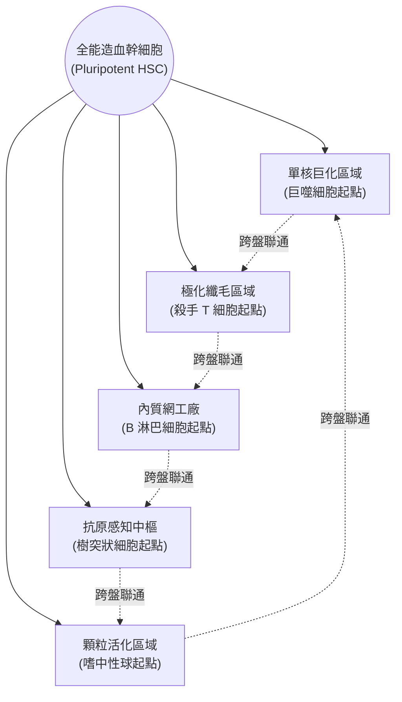

# 《Project: Phagocyte（吞噬體）》產品設計需求書（GDD / PRD）

---

## 1. 產品概述與核心定位

- **遊戲類型**：2D 俯視角微觀動作肉鴿（Top-Down Microscopic Survivor-like）。
- **平台目標**：PC（Steam），支援手把與鍵鼠操作。
- **引擎選型**：Godot 4.x（基於 2D 物理與 RenderingServer 高併發優勢）。
- **核心價值主張（USP）**：
  - **所見即所得的有機物理變形**：白血球外形動態隨機伸展，多邊形邊界與碰撞箱完全即時同步。
  - **硬核生理學機制遊戲化**：將抗原呈遞、調理作用、過載消化、NETosis 轉化為核心爽點，實現「遊玩即理解免疫學」。
  - **「底盤 ＋ 形態模組 ＋ 外掛細胞器」解耦架構**：所有白血球共享相同微絲微管底盤，形態與行為完全技能化與參數化，支持自由裝配與異變。
  - **PoE 式單一聯合造血幹細胞天賦大星盤**：基於骨髓系與淋巴系真實分化路徑，所有細胞共享星盤但具備不同起始特化門戶，支持跨界生化流派構築（Build）。

---

## 2. 核心玩法與變形解耦架構

### 核心戰鬥迴圈（Core Loop）



### 「底盤 ＋ 形態參數模組 ＋ 外掛細胞器」解耦架構

為解決「細胞形態與專有動畫綁定導致技能無法複用」的架構難題，本專案將細胞解構為三層生物學模型：

1. **統一底盤（Unified Chassis）**：
   - 所有白血球在物理底層均具備相同的微絲微管系統。
   - **初始半徑標準化**：統一設定為 `base_radius = 24.0`，確保所有細胞在 1 級時擁有公平平等的受擊面積與基礎機動性，消弭前期數值失衡。
2. **頂點噪聲參數模組（Morphology Modifiers）**：
   - 不使用骨骼動畫，而是透過 `FastNoiseLite` 驅動 `Polygon2D` 頂點動態位移。
   - 提煉三大底層噪聲參數池，供技能與天賦系統隨時動態修改：
     - **Amplitude（偽足伸展振幅）**：控制偽足伸出的長度。數值越高，偽足越長、越具攻擊侵略性。
     - **Frequency（突觸/刺突密度）**：控制邊緣起伏的頻率。數值越高，毛刺與突起越密集（如樹突細胞）；數值越低，輪廓越圓滑平整（如未活化 T/B 細胞）。
     - **Smoothness（黏滯流體度）**：決定邊界如阿米巴流體般蠕動，或是像堅硬細胞壁般緊湊微顫。
3. **外掛式細胞器（Modular Organelles）**：
   - 超出本體網格拓撲範圍的特殊攻擊，做成獨立子節點掛載（PackedScene）：
     - **偽足捕捉爪（`PseudopodLimb.tscn`）**：基於 2D 骨骼逆向運動學（IK Chain）或平滑貝茲曲線，平時縮於質內，攻擊時彈射向外抓怪拖回。
     - **受體棘刺陣列（`ReceptorSpikes.tscn`）**：圍繞細胞邊緣排列的環狀懸浮受體，提供旋轉射擊、接觸反傷或化學感應。
4. **生物學合理化包裝（表觀遺傳與異變嵌合體）**：
   - **世界觀設定**：「所有白血球體內皆沉睡著造血幹細胞的完整基因庫。」
   - 當 B 細胞裝備巨噬專屬的「偽足猛擊」時，UI 提示：【解鎖沉睡基因：清道夫受體 CD36】；視覺上 B 細胞浮現溶酶體並突發長出巨型肉質偽足。
   - 跨界組合被包裝為【異變嵌合體（Chimera Mutation）】，賦予玩家培育出生化怪物極致 build 的中二感與策略樂趣。

---

## 3. 角色矩陣與細胞形態學（Cell Morphology & Visual Matrix）

### 初始底盤與顯微特徵對照表

所有角色初始碰撞判定面積統一（`base_radius = 24.0`），但依據真實顯微鏡觀察，在多邊形噪聲參數、細胞核幾何圖元與細胞器細節上建立鮮明辨識度：

| 細胞種類 | 體型大小（真實 μm） | 遊戲外觀形態與邊界特徵 | 細胞核形狀（顯微鏡辨識關鍵） | 初始天賦起點定位 |
| :--- | :--- | :--- | :--- | :--- |
| **巨噬細胞<br>(Macrophage)** | 極大<br>($20 \sim 40\,\mu\text{m}$) | **流體阿米巴狀**。邊界劇烈起伏，表面皺褶多、粗大偽足持續伸張，體內可見深色溶酶體吞噬泡。 | **巨大腎形 / 馬蹄形單核**（偏心排列）。 | 【單核巨化區域】<br>近戰重裝、吞噬成長、全傷減免 |
| **殺手 T 細胞<br>(CTL / CD8+)** | 偏小<br>($7 \sim 10\,\mu\text{m}$) | **緊湊微絨毛球體**。表面平滑圓整，高頻微幅顫動；衝刺活化時前端形成極化扁平「免疫突觸」。 | **超大正圓形核**（佔據體內 $\sim 80\%$ 空間，邊緣僅留薄圈胞質）。 | 【極化纖毛區域】<br>高速刺客、穿刺破膜、單體處決 |
| **嗜中性球<br>(Neutrophil)** | 中等<br>($10 \sim 15\,\mu\text{m}$) | **高頻焦躁顫膜**。邊界極不穩定，易破碎呈顆粒狀；胞質內密布細小微白殺菌顆粒。 | **分節多葉核（3～5 葉）**（如串聯香腸或念珠狀）。 | 【顆粒活化區域】<br>陣地自爆、高頻拋射、酸液濺射 |
| **B 淋巴細胞<br>(B-Cell)** | 中偏小<br>($8 \sim 12\,\mu\text{m}$) | **受體密布圓球**。靜息時緊湊圓潤，外圍環繞一圈 Y 型受體光點；活化轉為漿細胞時體積膨脹，內質網如工廠排布。 | **車輪狀 / 鐘面狀核**（染色質呈放射狀輪輻排列）。 | 【內質網工廠】<br>遠端制導、高頻抗體射擊、自動追蹤 |
| **樹突狀細胞<br>(Dendritic Cell)** | 大型伸展<br>($15 \sim 30\,\mu\text{m}$) | **星芒樹突海葵狀**。本體緊湊，但向 360 度四面八方伸展出密密麻麻的樹枝狀長分支，感知半徑極大。 | **中心不規則卵形核**。 | 【抗原感知中樞】<br>廣域採樣、信號傳導、巡邏軍召喚 |

---

### 動態體積平衡與縮放矩陣（Volume Balancing & Scaling Matrix）

在「接觸吞噬」為核心的機制下，體積大不只是負擔，其表面邊界即是攻擊判定區（**「受擊箱越大，嘴巴也越大」**）。

#### 體積動態聯動公式

定義全域即時體積縮放係數 $\alpha$：
$$\alpha = \frac{R_{\text{current}}}{R_{\text{base}}} = (1.0 + \Delta_{\text{talent}}) \times \left(1.0 + \frac{\text{Satiety}}{\text{MaxSatiety}} \times 1.5\right)$$

- **投射物尺寸（Projectile Scaling）**：投射物半徑 $R_{\text{proj}} = R_{\text{proj\_base}} \times \alpha$。大細胞發射的酸霧是覆蓋半屏的巨浪，小細胞發射的則是細針穿透束。
- **AoE 與光環半徑（Aura Scaling）**：生化地雷（補體瀑布）或被動酸霧範圍直接乘上 $\alpha$。
- **表面發射點數量（Emission Points）**：周長 $C = 2\pi R_{\text{current}} \propto \alpha$。小細胞發射 3 枚抗體；巨大化細胞邊緣周長擴增，如刺蝟般全向齊射 12～24 枚。
- **質量慣性與擊退穿透（Mass & Knockback）**：大細胞具備極高物理質量與擊退抗性，衝撞時附帶壓碎判定；小細胞慣性小，轉向急停無延遲，投射物自帶高暴擊穿刺。

#### 大小細胞數值平衡與生態剋制

| 戰鬥維度 | 巨型細胞（巨噬型態 / 飽食膨脹） | 微型細胞（T 細胞型態 / 靜息基底） |
| :--- | :--- | :--- |
| **判定面特性** | 受擊判定面龐大，易觸碰病毒刺突；但**吞噬覆蓋面同等巨大**。 | 受擊判定面極小，可在彈幕縫隙走位；但吞噬需貼臉精準操作。 |
| **機動與手感** | 啟動具黏滯滑行感，轉向阻尼大，具備重型機甲壓迫感。 | 零延遲急停、瞬間響應，具備穿梭刺客手感。 |
| **生存機制** | 依賴龐大血池、常駐百分比減傷（生化厚壁）與高額吞噬吸血。 | 依賴衝刺無敵幀（i-frames）、高閃避率與能量護盾。 |
| **剋制：微型病毒潮** | **天生優勢**：如吸塵器般直接碾過整群流感雜兵，瞬間秒殺清場。 | **處於劣勢**：必須依靠高頻穿刺技能開闢走位血路。 |
| **剋制：毒素/刺突菁英怪** | **處於劣勢**：體型巨大極易被刺突刮傷或陷入毒霧，需靠外掛遠程破甲。 | **天生優勢**：靈活繞背刺殺，精準鎖定核心打出凋亡暴擊。 |

#### 局內體積戰術調節

- **飽食膨脹（Satiety Expansion）**：吞噬累積能量使半徑暫時擴增至最高 2.5 倍，提供極致清怪爽感，但也使躲避 Boss 必殺技難度飆升。
- **脫水穿梭（Squeeze Mode）**：按住特定鍵消耗生化質，將細胞強制壓縮至 $40\%$ 體積並大幅提升移速，專門用於鑽過毛細血管死角或規避全屏轟炸。

---

## 4. 技能體系、特質與表觀遺傳突變（Skills & Epigenetics）

本系統分為：**主動生化技能（6種）**、**被動代謝特質（5種）**、以及二者滿級合成的**終極表觀遺傳質變（4種超武）**。

### 主動生化技能（Active Cytokines & Weapons）

| 技能名稱 | 醫學底層機制 | 遊戲內表現與機制 | 戰術定位 |
| :--- | :--- | :--- | :--- |
| **活性氧射流<br>(ROS Spray)** | 呼吸爆發釋放超氧陰離子與 $\text{H}_2\text{O}_2$ | 朝滑鼠方向持續噴射高壓生化酸霧，擊中溶解敵方蛋白質外殼，造成 DoT 持續腐蝕並削減抗性。 | 中近程錐形穿透、破防撕裂 |
| **穿孔素長矛<br>(Perforin Lance)** | 殺手 T 細胞在靶膜打孔導入溶酶素 | 朝最近的菁英怪射出高初速螺旋射線，貫穿路徑雜兵，並在目標身上留下破孔標記（孔洞承受增傷）。 | 直線遠程貫穿、單體重創 |
| **補體瀑布<br>(Complement Cascade)** | 補體蛋白（C3b 至 C9）沉積引發連鎖反應 | 在周圍隨機生成化學共振環，標記踏入的病毒；2 秒後引發連鎖生化裂解爆破，直接溶解所有標記目標。 | 延遲地雷、大範圍群控清場 |
| **Y 型抗體齊射<br>(Antibody Salvo)** | 漿細胞向體液持續噴發特異性抗體 | 週期性自細胞表面受體彈出 3～8 枚自動尋航 Y 型微型飛彈，命中定身病毒並附加「調理狀態（易傷）」。 | 全自動制導、雜兵點殺、增傷 |
| **NETs 網狀纖維陷阱<br>(NETs Extrusion)** | 嗜中性球主動拋射 DNA 與組蛋白網 | 在移動軌跡後方留下一長條黏滯纖維網，大幅減速穿過的敵群，並持續消耗病毒外殼耐久度。 | 風箏防守、後方防線阻絕 |
| **偽足猛擊<br>(Pseudopod Lunge)** | 肌動蛋白微絲瞬間定向聚合彈射 | 朝指定方向猛烈彈射一條阿米巴長偽足（IK 捕捉爪），將路徑上的敵群強行向內拖拽直接拉入體內吞噬。 | 主動控制、強力聚怪、抓取單體 |

---

### 被動細胞特質與胞器（Passive Organelles & Metabolic Traits）

| 特質名稱 | 生理機制聯動 | 遊戲核心數值與形態影響 |
| :--- | :--- | :--- |
| **肌動蛋白微絲聚合<br>(Actin Polymerization)** | 骨架微絲聚合驅動變形 | 直接放大 `Polygon2D` 噪聲振幅（Amplitude $+25\%$）；移速 $+15\%$；衝刺（Dash）時附帶 0.3 秒無敵判定。 |
| **溶酶體酶活性<br>(Lysosome Priming)** | 加速內部酸性水解酶水解週期 | 體內病原體消化速度 $+30\%$；呼吸爆發所需吞噬量降低 $20\%$；每次消化完畢散發一波微型酸性脈衝。 |
| **趨化因子受體<br>(Chemokine Receptors)** | 強化對碎屑與化學趨化信號的敏感度 | 等同倖存者磁鐵（Magnet），大幅提升 ATP 能量滴、抗原碎片與遺傳代碼的自動吸附半徑（$+50\%$）。 |
| **線粒體超頻<br>(Mitochondrial Overclock)** | 強化三羧酸循環與 ATP 合成速率 | 冷卻時間縮減（CDR）$+12\%$，全主動生化技能施放頻率顯著加快。 |
| **調理素親和性<br>(Opsonin Affinity)** | 特化對被抗體/補體標記病原體的受體識別 | 對處於負面狀態（定身、破甲、減速）的目標，暴擊率提升 $40\%$，且吞噬判定半徑對其直接翻倍。 |

---

### 終極表觀遺傳質變（Epigenetic Evolutions / 超武二合一）

當特定主動技能升至滿級（Lv.5）並持有對應被動特質時，於精英掉落物或升級箱中解鎖質變形態：

```mermaid
graph LR
    subgraph 超武合成矩陣
        A1["穿孔素長矛 (Max)"] + B1["溶酶體酶活性"] --> EVO1["【顆粒酶死刑】<br>(Granzyme Apoptosis)"]
        A2["補體瀑布 (Max)"] + B2["肌動蛋白聚合"] --> EVO2["【膜攻擊終結陣列】<br>(MAC Hyper-Array)"]
        A3["Y型抗體齊射 (Max)"] + B3["調理素親和性"] --> EVO3["【中和高壓風暴】<br>(Neutralizing Tempest)"]
        A4["活性氧射流 (Max)"] + B4["線粒體超頻"] --> EVO4["【過氧化利維坦】<br>(Superoxide Leviathan)"]
    end
```

1. **顆粒酶死刑 (Granzyme Apoptosis)**：
   - **配方**：穿孔素長矛（Max）＋ 溶酶體酶活性
   - **質變機制**：穿孔長矛命中後注入高活性顆粒酶，強制引發病毒核酸「程序性凋亡」。目標 1 秒後裂解自爆，並向 360 度噴射 6 枚連鎖穿孔射線，引發骨牌式連鎖清屏。
2. **膜攻擊終結陣列 (MAC Hyper-Array)**：
   - **配方**：補體瀑布（Max）＋ 肌動蛋白微絲聚合
   - **質變機制**：補體共振環不再固定於地面，而是直接附著於延伸的偽足末端。細胞每次伸展偽足即在戰場留下移動化學渦流，接觸的病毒直接形成膜攻擊複合物（MAC）穿孔裂解，轉化為高濃度能量液。
3. **中和高壓風暴 (Neutralizing Tempest)**：
   - **配方**：Y 型抗體齊射（Max）＋ 調理素親和性
   - **質變機制**：全向抗體齊射量暴增至 32 發。當抗體命中不同目標時，會在它們之間拉起一道「高壓免疫網線」，穿過網線的所有其餘雜兵承受最大生命值百分比的真實傷害。
4. **過氧化利維坦 (Superoxide Leviathan)**：
   - **配方**：活性氧射流（Max）＋ 線粒體超頻
   - **質變機制**：取消前方定向噴射。細胞周身邊界包裹一層青藍色超氧離子等離子光膜，整隻細胞化為高速旋轉粉碎機，所有非 Boss 病原體接觸即刻融化。

---

## 5. 造血幹細胞天賦星盤（Hematopoiesis Talent Matrix）

本系統採用 PoE 式全域相連大星盤，所有角色從中央【全能造血幹細胞 (HSC)】出發，但各自緊鄰專屬的分化起始門戶：



### 五大特化區域節點規劃

#### 1. 巨噬起點：【單核巨化區域 (Macrocytic Hub)】
- **出門小節點（Minor）**：
  - 細胞膜延展性：基礎半徑 $+5\%$。
  - 胞質耐受度：最大生命上限 $+10\%$。
  - 吞噬消化速率：消化時間 $-8\%$。
- **關鍵節點（Notable）**：
  - 【**貪婪偽足 (Voracious Pseudopod)**】：基礎半徑額外 $+25\%$，且吞噬判定對所有半徑小於自身的非精英病原體直接產生秒殺吸入效果。
  - 【**生化厚壁 (Biochemical Fortress)**】：細胞半徑每比基準值擴大 $10\%$，獲得常駐 $3\%$ 全傷害減免（最高減免 $45\%$）。

#### 2. 殺手 T 細胞起點：【極化纖毛區域 (Polarized Motility)】
- **出門小節點（Minor）**：
  - 微管剛性：衝刺冷卻時間 $-8\%$。
  - 受體靈敏度：全攻擊暴擊率 $+5\%$。
  - 免疫突觸極化：衝刺後 1.5 秒內傷害 $+20\%$。
- **關鍵節點（Notable）**：
  - 【**穿膜衝鋒 (Transmembrane Rush)**】：當細胞體積保持小於等於基準值時，衝刺自帶穿透判定與 0.4 秒完全無敵幀，貫穿敵人時造成破甲。
  - 【**靶向凋亡處決 (Apoptotic Execution)**】：對生命值低於 $25\%$ 的被標記菁英怪，攻擊直接觸發細胞程序性死亡（秒殺）。

#### 3. 嗜中性球起點：【顆粒活化區域 (Degranulation Core)】
- **出門小節點（Minor）**：
  - 酸性囊泡儲備：生化酸液傷害 $+12\%$。
  - 脆弱胞膜：移動速度 $+8\%$，但本體防禦力 $-5\%$。
  - 殺菌顆粒釋放頻率：彈道射速 $+10\%$。
- **關鍵節點（Notable）**：
  - 【**臨界過載 (Critical Overload)**】：受到傷害時向四周猛烈噴濺破甲酸液；當生命值低於 $30\%$ 時，酸液覆蓋範圍與傷害直接翻倍。
  - 【**NETosis 殉爆激化**】：死亡或觸發致命傷時，在原地留下的 DNA 黏網持續時間延長至 12 秒，並將周圍敵人強行向中心吸引。

#### 4. B 細胞起點：【內質網工廠 (Endoplasmic Matrix)】
- **出門小節點（Minor）**：
  - 核醣體轉錄效率：投射物發射速度 $+6\%$。
  - 抗體誘導半徑：尋航投射物鎖定射程 $+10\%$。
  - 內質網擴充：投射物穿透次數 $+1$。
- **關鍵節點（Notable）**：
  - 【**全向發射槽 (Omni-Receptor Slots)**】：細胞表面生成環狀發射陣列，所有發射類技能的散射彈道數量常駐 $+2$。
  - 【**抗體親和力成熟 (Affinity Maturation)**】：同一技能每次連續命中相同目標，該技能對其造成的傷害遞增 $15\%$（最高疊加 $150\%$）。

#### 5. 樹突細胞起點：【抗原感知中樞 (Antigenic Nexus)】
- **出門小節點（Minor）**：
  - 樹突分支密度：邊界噪聲頻率（Frequency）$+10\%$，觸鬚更密集。
  - 細胞因子傳導力：所有光環與輔助效果範圍 $+15\%$。
  - 抗原採樣效率：擊殺掉落經驗/抗原機率 $+15\%$。
- **關鍵節點（Notable）**：
  - 【**神經網共振 (Network Resonance)**】：被任何一根長樹突觸碰的敵人，其身上的負面狀態會即時以電化學信號傳導給周邊 5 個敵人。
  - 【**微血管巡邏援軍 (Patrol Summoner)**】：每隔 20 秒自屏幕邊緣呼叫 3 隻巡邏淋巴球協同作戰，吸引火力並發射微型干擾素。

---

## 6. 關卡病理機制與敵人圖鑑

### 動態病理關卡

關卡不再是單純背景，而是宿主器官的病理狀態：

- **急性表皮裂口（Acute Wound）**：微血管破裂，週期性產生指向傷口外緣的強大組織液吸力；地面覆蓋血纖維蛋白網，阻礙常規移動。
- **肺泡腔室（Alveolar Space）**：週期性呼吸氣流帶來大範圍流體推力；需利用偽足錨定在肺泡上皮細胞壁以防失控。
- **全域危機：細胞因子風暴（Cytokine Storm）**：擊殺頻率過高導致促炎因子超標，全場進入過熱發燒狀態：玩家輸出提升 $100\%$，但宿主生命條持續遞減，需在器官衰竭前清場。

### 病原體行為矩陣

| 病原體名稱 | 生物特徵 | 遊戲內 AI 與機制表現 |
| :--- | :--- | :--- |
| **冠狀病毒<br>(S-Virus)** | 表面覆滿刺突蛋白 | 碰撞玩家時施加減速黏著效果；隨時間入侵周邊紅血球進行複製繁殖。 |
| **金黃色葡萄球菌<br>(Staph)** | 產生凝固酶，聚集呈葡萄串狀 | 抱團成群移動，外層包裹纖維蛋白護盾，需以酸液破盾後方可吞噬。 |
| **變異流感病毒<br>(Flu-Drift)** | 高頻抗原漂移 | 每隔 45 秒更換一次表面抗原，強制重置玩家已獲得的特異性靶向暴擊加成。 |
| **異變癌細胞<br>(Malignant Cell)** | 下調表面 MHC-I 標籤 | 免疫常規 T 細胞鎖定；必須由巨噬細胞直接接觸破膜，或由 NK 模組擊破。 |

---

## 7. 技術管線與 Godot 4 程式架構

### 自訂資源架構（Custom Resource Data Pipeline）

所有細胞數值與特徵完全與節點代碼分離，定義於 `CellData.gd`：

```gdscript
class_name CellData
extends Resource

@export var cell_name: String = "Macrophage"
@export var base_radius: float = 24.0
@export var base_health: float = 100.0
@export var base_speed: float = 230.0
@export var inertia_drag: float = 4.0 # 阻尼係數：巨噬細胞大，T細胞小

# 形態噪聲參數池 (Morphology Modifier Parameters)
@export var noise_amplitude: float = 28.0   # 偽足伸展長度
@export var noise_frequency: float = 0.65   # 邊緣突觸頻率
@export var deformation_speed: float = 3.6  # 蠕動頻率
@export var vertex_count: int = 32

# 細胞核外觀定義
@export var nucleus_type: String = "kidney" # kidney, large_round, multi_lobed, cartwheel, dendritic_oval
@export var nucleus_color: Color = Color(0.42, 0.22, 0.68, 0.85)

# 初始裝配技能與起點門戶
@export var starting_skill_scene: PackedScene
@export var starting_hub_id: String = "macrocytic_hub"
```

### 即時變形與物理深拷貝管線

由 `CellMorphController` 控制器統籌運算，保證「所見即所得」：

```gdscript
# 綜合即時半徑運算公式
var effective_radius: float = cell_data.base_radius * (1.0 + passive_radius_modifier) * (1.0 + (satiety / max_satiety) * 1.5)

# 頂點噪聲變形計算後深拷貝至物理判定
cytoplasm_polygon.polygon = generated_points
engulf_collider.polygon = generated_points
```

### 效能優化標準

- **同屏千怪渲染**：病原體統一採用 `MultiMeshInstance2D` 批次提交 GPU 繪製，邏輯更新與物理檢測採用四叉樹（QuadTree）空間分割。
- **物理碰撞優化**：僅玩家實體使用 `CollisionPolygon2D` 動態同步；海量病原體一律配置輕量級 `CircleShape2D`。
- **擬真微觀渲染**：2D CanvasItem Shader 實現菲涅爾邊緣螢光（Fresnel Glow）。背景多層次視差滾動（`ParallaxBackground`），低層模糊紅血球模擬顯微鏡景深（DoF）。

---

## 8. 知識傳遞與教育功能設計（Edutainment）

為保證知識準確性且不破壞遊戲節奏，知識模組採「非侵入式分層呈現」：

- **機制即科普**：抗原呈遞、調理作用、補體裂解、呼吸爆發等名詞直接作為核心戰鬥機制與數值名稱。
- **微觀檔案館（Immunology Codex）**：收錄真實冷凍電鏡（Cryo-EM）結構圖像與高倍光學縮時攝影對比，以百字短文闡釋致病機制與人體實際防禦手段。
- **病歷單結算系統**：
  - **通關面板**：「宿主成功產生特異性中和抗體，感染受控。」
  - **陣亡面板**：「宿主死於全身性發炎反應綜合徵（SIRS），嗜中性球浸潤過載。」
  - **病因分析**：隨附本次戰鬥中佔比最高的致死病原體成因分析。

---

## 9. 研發實施任務清單（Implementation TODO Checklist）

### Phase 1: 核心玩法與變形物理原型 (Core Gameplay Prototype)
- [ ] 搭建通用玩家白血球底盤節點場景 (`Player.tscn`)，統一初始半徑 `base_radius = 24.0`
- [ ] 實現 `CellMorphController` 與 `FastNoiseLite` 驅動的頂點參數化算法（振幅、頻率、平滑度）
- [ ] 實現每幀頂點深拷貝至 `CollisionPolygon2D` 的「所見即所得」物理碰撞同步
- [ ] 實現慣性與阻尼滑行控制器（手把 / 鍵鼠）
- [ ] 實現基礎病原體生成與碰撞包裹/吞噬檢測邏輯

### Phase 2: 飽食能量循環與戰鬥機制 (Combat & Energy Loop)
- [ ] 實現飽食度（ATP / 生化質）計算與動態半徑擴展公式（最高 2.5 倍）
- [ ] 實現飽食度 100%「呼吸爆發（Respiratory Burst）」狀態（移速 $+150\%$、酸性腐蝕力場）
- [ ] 實現脫水縮小穿梭機制（Squeeze Mode：體積壓縮至 $40\%$、急加速避險）
- [ ] 實現擊殺掉落抗原採樣與局內三選一突變卡（Rogue Mutation）抽取系統

### Phase 3: 角色矩陣與細胞形態實作 (Immune Cell Classes & Morphology)
- [ ] 實現 `CellData.gd` Custom Resource 數值與形態配置
- [ ] **巨噬細胞 (Macrophage)**：流體阿米巴邊界、偏心腎形核、大偽足伸展
- [ ] **殺手 T 細胞 (CTL)**：微絨毛緊湊球體、80% 佔比大圓核、極化突觸衝刺
- [ ] **嗜中性球 (Neutrophil)**：高頻焦躁顫膜、3～5 葉分節核、殺菌顆粒釋放
- [ ] **B 淋巴細胞 (B-Cell)**：圓球外觀、車輪狀核、外圍受體光點、漿細胞活化膨脹
- [ ] **樹突狀細胞 (Dendritic)**：星狀長樹突突起、中心卵形核、廣域感知觸角

### Phase 4: 主被動技能體系與超武質變 (Skills & Epigenetic Evolutions)
- [ ] 建立 6 大主動生化技能：活性氧射流、穿孔素長矛、補體瀑布、Y 型抗體齊射、NETs 陷阱、偽足猛擊
- [ ] 建立外掛細胞器子節點：`PseudopodLimb.tscn` (IK 捕捉爪)、`ReceptorSpikes.tscn` (受體棘刺)
- [ ] 建立 5 大被動代謝特質：肌動蛋白微絲聚合、溶酶體酶活性、趨化因子受體、線粒體超頻、調理素親和性
- [ ] 實現 4 大終極表觀遺傳超武合成邏輯：
  - [ ] 【顆粒酶死刑】（穿孔素長矛 ＋ 溶酶體酶活性）
  - [ ] 【膜攻擊終結陣列】（補體瀑布 ＋ 肌動蛋白微絲聚合）
  - [ ] 【中和高壓風暴】（Y 型抗體齊射 ＋ 調理素親和性）
  - [ ] 【過氧化利維坦】（活性氧射流 ＋ 線粒體超頻）

### Phase 5: 造血幹細胞天賦星盤實作 (Hematopoiesis Talent Matrix)
- [ ] 搭建 PoE 式全域相連天賦星盤 UI 與數據儲存架構
- [ ] 實現中央幹細胞向五大起點門戶分化邏輯
- [ ] 實現【單核巨化區域】節點（貪婪偽足、生化厚壁）
- [ ] 實現【極化纖毛區域】節點（穿膜衝鋒、靶向凋亡）
- [ ] 實現【顆粒活化區域】節點（臨界過載、NETosis 激化）
- [ ] 實現【內質網工廠】節點（全向發射槽、抗體親和力成熟）
- [ ] 實現【抗原感知中樞】節點（神經網共振、巡邏援軍鏈）
- [ ] 驗證跨盤點法（如 T 細胞跨點巨化節點的重裝突擊流派）

### Phase 6: 敵人體系與高併發效能優化 (Enemies & Performance Pipeline)
- [ ] 實現 2D `QuadTree` 空間分割管理
- [ ] 使用 `MultiMeshInstance2D` 實現同屏海量病原體 GPU 批次渲染
- [ ] 為大量病原體配置輕量級 `CircleShape2D` 碰撞
- [ ] **冠狀病毒 (S-Virus)**：刺突減速黏著、紅血球入侵複製 AI
- [ ] **金黃色葡萄球菌 (Staph)**：葡萄串抱團移動 AI、纖維蛋白護盾判定
- [ ] **變異流感病毒 (Flu-Drift)**：45 秒抗原漂移重置靶向暴擊加成機制
- [ ] **異變癌細胞 (Malignant Cell)**：MHC-I 隱匿、巨噬破膜 / NK 模組判定

### Phase 7: 動態關卡病理環境 (Pathological Level Stages)
- [ ] **急性表皮裂口 (Acute Wound)**：組織液向外吸力場、血纖維蛋白網移動減速黏網
- [ ] **肺泡腔室 (Alveolar Space)**：呼吸氣流推力場、偽足錨定上皮細胞機制
- [ ] **全域危機：細胞因子風暴 (Cytokine Storm)**：促炎超標過熱狀態、雙刃劍數值加成與宿主倒數計時

### Phase 8: 微觀美學、Shader 渲染與科普檔案 (Microscopic Visuals & Edutainment)
- [ ] 2D CanvasItem Shader：菲涅爾邊緣螢光（Fresnel Glow）
- [ ] $1024 \times 1024$ 無縫半透明原生質、凝膠流體貼圖 (Normal / Roughness)
- [ ] 細胞核懸浮微幅延遲彈簧物理（Spring Physics）
- [ ] 多層次視差滾動 (`ParallaxBackground`) 與景深模擬 (DoF)
- [ ] 微觀檔案館（Immunology Codex）圖鑑系統與冷凍電鏡資料
- [ ] 病歷單結算系統（通關抗體中和 / 陣亡 SIRS 分析）