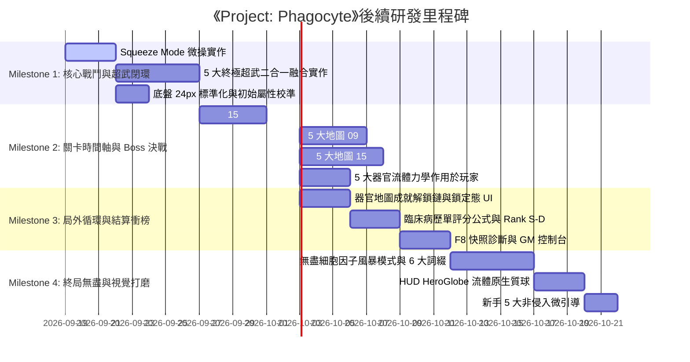

# 《Project: Phagocyte（吞噬體）》開發待辦清單 (TODO Roadmap)

> **基於 `docs/*.md` 全域設計規格庫與目前程式碼實作調研**  
> 最後更新時間：2026-09-18 ｜ 專案架構：Godot 4.x (.NET 8 / C#)

---

## 📌 總覽與模組進度看板 (Progress Dashboard)

| 系統模組 | 對應規格文檔 | 核心成熟度 | 關鍵缺失與主要瓶頸 |
| :--- | :--- | :---: | :--- |
| **1. 白血球底盤與形態微操** | `docs/cell.md`, `spec.md` | 🟡 65% | 缺少脫水穿梭避險 (Squeeze Mode)、未落實 24px 統一標準半徑、外掛細胞器未實作 |
| **2. 技能體系與超武進化** | `docs/skill.md`, `spec.md` | 🟡 60% | 5 大終極超武二合一融合尚未實作、升級池未收斂為 5+5 核心閉環 |
| **3. 關卡環境與波次導演** | `docs/map.md`, `spec.md` | 🔴 35% | 缺少 15:00 波次時間軸、缺少 300/450 隻同屏即時動態回補、流體力學未作用於玩家、缺雙軌難度切換 |
| **4. 病原體圖鑑與 Boss 體系** | `docs/pathogen.md`, `map.md` | 🟡 55% | 缺少 5 大地圖 09:00 次級領主與 15:00 終末原發 Boss 實體、怪物缺少 BaseScore 積分定義 |
| **5. 造血幹細胞天賦星盤** | `docs/passivetree.md` | 🟢 85% | 正交佈局與單格節點已實作，缺少地圖首通天賦點發放聯動與部分視覺微調 |
| **6. 成就里程碑與解鎖鏈** | `docs/achievement.md` | 🔴 30% | 5 地圖通關成就未實作、地圖預設全部解鎖違背設計、現有成就數值閾值嚴重偏差 |
| **7. 臨床病歷單結算與衝榜** | `docs/record.md` | 🟡 50% | 缺少 Boss 擊破勝利判定、缺少 Kills/KPM/BaseScore 綜合評分公式與 Rank S~D 劃分 |
| **8. 終局無盡細胞因子風暴** | `docs/endgame.md` | 🔴 0% | 尚未實作（無上限時間軸、指數過載、同屏 500 隻、6 大自選病理詞綴、雙生 Boss） |
| **9. 新手微引導與直覺 UI/UX** | `docs/tutorial.md` | 🔴 20% | 前 3 分鐘 5 大非侵入式微引導、開局防呆自動吞噬、超武共鳴提示均未實作 |
| **10. 臨床反饋、F8診斷與GM** | `docs/feedback.md` | 🔴 20% | 僅有基礎傷害統計，缺少 F8 快照送檢單、GM 控制台、確定性種子重現與 Webhook |
| **11. 微觀美學與 HUD 流體** | `docs/real.md`, Vistrace | 🟡 55% | 原生質 Shader 已有初版，HUD HeroGlobe 流體原生質球、受損菲涅爾環待整合 |

---

## 🧬 模組一：五大白血球形態學、底盤與微操系統 (Chassis & Cell Morphology)
> **對應規格**：[`docs/cell.md`](file:///Users/zelin/project/Phagocyte/docs/cell.md), [`docs/spec.md`](file:///Users/zelin/project/Phagocyte/docs/spec.md), [`docs/real.md`](file:///Users/zelin/project/Phagocyte/docs/real.md)

- [x] **微絲微管底盤基礎類**：`BaseCell.cs` 封裝移動、生命、細胞核、吞噬與經驗升級訊號。
- [x] **動態多邊形變形**：`FastNoiseLite` 在極座標系驅動 32 頂點位移，並逐幀即時烘焙至 `CollisionPolygon2D`。
- [x] **四階段漏斗式受擊管線**：流體閃避 (Evasion) $\to$ 糖萼格擋 (Block) $\to$ 護甲減傷 (Armor DR) $\to$ 生命扣減 (HP Loss)。
- [x] **[P1] 五大白血球初始屬性矩陣校準** (`docs/cell.md` 第 3 節)：
  - **巨噬細胞 (Macrophage)**：HP 140 ｜ Armor 10 ｜ Speed 210 ｜ Area 1.25 ｜ Might 1.0 ｜ Block 8%
  - **殺手 T 細胞 (CTL)**：HP 90 ｜ Armor 0 ｜ Speed 260 ｜ Crit 15% ｜ Evasion 10% ｜ Pierce +1
  - **嗜中性球 (Neutrophil)**：HP 100 ｜ Armor 5 ｜ Speed 230 ｜ Might 1.2 ｜ Knockback 1.4 ｜ Regen 0.5
  - **B 淋巴細胞 (B-Cell)**：HP 95 ｜ Armor 0 ｜ Speed 220 ｜ ProjSpeed 1.3 ｜ CDR 10% ｜ Amount +1
  - **樹突狀細胞 (Dendritic)**：HP 110 ｜ Armor 2 ｜ Speed 225 ｜ Magnet 260 ｜ Duration 1.2 ｜ CDR 10%
  - **影響檔案**：`scripts/player/Macrophage.cs`, `CtlCell.cs`, `NeutrophilCell.cs`, `BCell.cs`, `DendriticCell.cs`
- [x] **[P1] 白血球專屬固有技能 (Innate Skills) 校對與綁定**：
  - 巨噬細胞：更正為固有技能【微絲變形】(`MacrophageDeformationSkill`，目前誤配為 RosTorrent)。
  - 殺手 T：固有技能【穿孔素長矛】(`PerforinLanceSkill`)。
  - 嗜中性球：固有技能【顆粒酶殉爆】(`GranzymeDetonationSkill`)。
  - B 細胞：固有技能【Y 型抗體齊射】(`AntibodySalvoSkill`)。
  - 樹突狀細胞：固有技能【MHC 抗原追蹤束】(`MhcTracerBeamSkill`)。
  - **影響檔案**：`scripts/player/*.cs`, `scripts/core/GameManager.cs`
- [x] **[P2] 外掛式細胞器 (Modular Organelles)**：
  - `scenes/skills/PseudopodLimb.tscn`：基於 2D 骨骼逆向運動學（IK Chain）的阿米巴抓手，彈射抓怪拖回。
  - `scenes/skills/ReceptorSpikes.tscn`：懸浮於細胞膜外圍的環狀旋轉受體陣列，提供接觸反傷與旋轉攔截。

---

## ⚔️ 模組二：技能架構、超武體系與升級機制 (Skills, Epigenetic Evolutions & Draft)
> **對應規格**：[`docs/skill.md`](file:///Users/zelin/project/Phagocyte/docs/skill.md), [`docs/spec.md`](file:///Users/zelin/project/Phagocyte/docs/spec.md), [`docs/stat.md`](file:///Users/zelin/project/Phagocyte/docs/stat.md)

- [x] **「主動 5 ＋ 被動 5」槽位架構**：`SkillManager.cs` 獨立維護 5 個主動武器與 5 個被動特質槽位。
- [x] **18 項全域通用 Stat 數值系統**：`Stat.cs` 與 `CellStats.cs` 實現標準雙軌公式 $(Base + Flat) \times (1 + Pct)$，零複雜 Scaling。
- [x] **5 大核心主動技能類**：穿孔素長矛、補體瀑布、Y 型抗體齊射、活性氧射流、偽足猛擊。
- [x] **5 大核心被動代謝特質類**：溶酶體酵素、肌動蛋白微絲、調理素親和、線粒體超頻、趨化因子受體。
---

## 🩹 模組三：關卡病理環境、流體力學與波次導演 (Maps, Fluid Mechanics & Wave Director)
> **對應規格**：[`docs/map.md`](file:///Users/zelin/project/Phagocyte/docs/map.md), [`docs/spec.md`](file:///Users/zelin/project/Phagocyte/docs/spec.md)

- [x] **5 大器官元數據配置**：`GameManager.MapData` 註冊皮下創口、肺泡微腔、肝血竇、胃黏膜、血腦屏障。
- [x] **全息掃描儀地圖選擇**：`HoloBodyScanner.cs` 實現器官高亮與射線指示。
- [x] **[P0] 15 分鐘標準波次時間軸與 3 分鐘高頻進階循環 (3-Minute Escalation Loop)**：
  - 廢棄現有 300 秒粗略計時，全關卡統一落地 15:00（900 秒）標準波次：
    - `00:00 - 03:00`（侵入定植期）：`03:00` 首波機制精英突襲（單體走位考驗）。
    - `03:00 - 06:00`（局部炎症期）：`06:00` 初次小蜂擁潮 ＋ 雙精英夾擊（AOE 清場考驗）。
    - `06:00 - 09:00`（組織浸潤期）：`09:00` 中期次級領主決戰（轉階段機制、**必掉超武寶箱**）。
    - `09:00 - 12:00`（全身播散期）：`12:00` 極限大蜂擁絕境潮 ＋ 混合兵種（超武成型驗收）。
    - `12:00 - 15:00`（終末危象期）：異變癌細胞與高危病原體密集混編。
    - `15:00`：鎖屏決戰，原發病原體 Boss 登場！擊破後達成特異性中和通關。
  - **影響檔案**：`scripts/enemies/PathogenSpawner.cs`, `scripts/Main.cs`
- [x] **[P0] 同屏怪物上限與殺戮驅動即時回補 (Kill-Driven Dynamic Backfill)**：
  - 廢除現有 `MaxPathogens = 50` 與每 1.5s 僅補 3 隻的機制。
  - **常態同屏上限**：普通波次鎖定 **300 隻**（`MAX_ACTIVE_NORMAL = 300`）。
  - **蜂擁潮同屏上限**：06:00 與 12:00 事件期間動態擴張至 **450 隻**（`MAX_ACTIVE_SWARM = 450`）。
  - **即時缺額回補**：以每幀（或 $<0.15\text{s}$）輪詢缺額 $\text{Deficit} = \text{ScreenCap} - \text{ActiveCount}$。一旦有怪死亡或被吞噬，立即在視野外 150～250px 處回補生成新怪。
  - 實現「殺得越快、重生越快」：極限割草 Build 整場可擊殺 5,000～8,000 隻，消極苟活 Build 僅能擊殺 800～1,200 隻，結算拉開 5～8 倍積分差。
  - **影響檔案**：`scripts/enemies/PathogenSpawner.cs`, `scripts/Main.cs`
- [ ] **[P0] 5 大器官專屬流體力學與生理環境機制（直接作用於玩家細胞）**：
  - **01. 皮下創口 (`acute_wound`)**：
    - 傷口滲出吸力：向右上方拖拽向量 `Vector2(16.0, 10.0)` 直接疊加於玩家游動速度。
    - 地面血纖維蛋白網 (`Fibrin Clots`)：玩家踏入移速 $-20\%$，但阻擋敵方投射物。Hard 難度轉為酸蝕生物膜。
  - **02. 肺泡氣體微腔 (`alveolar_space`)**：
    - 呼吸氣流剪切：正弦波 12s 週期，吸氣產生持續 3s 下推力 `Vector2(0, 35.0)`，呼氣反推。
    - 高氧激發力場 (`Hyperoxic Pockets`)：場景漂浮青色氣泡，進入範圍內 CDR 暫時 $+25\%$。
  - **03. 肝血竇微循環 (`hepatic_sinusoid`)**：
    - 膽汁酸水解流：週期性橫掃，破除全場護甲 3 秒（Armor 歸零）。
    - 內皮窗孔篩選 (`Endothelial Fenestrae`)：窄孔阻擋巨化細胞，考驗 Space 脫水穿梭避險。
  - **04. 胃腔極酸黏膜 (`gastric_lumen`)**：
    - 胃酸潮湧：地面週期性強酸浪湧，未在安全區持續承受腐蝕 DoT。
    - 中和保護圈 (`Neutralization Zones`)：幽門螺桿菌水解尿素生成的局部鹼性避難光環。
  - **05. 血腦屏障毛細血管 (`blood_brain_barrier`)**：
    - 極窄血管高剪切血流拖拽。
    - 星形膠質腳突阻滯通道迷宮。
    - 隨機神經電脈衝干擾玩家移動方向。
  - **影響檔案**：`scripts/environment/`, `scripts/Main.cs`, `scripts/player/BaseCell.cs`
- [ ] **[P1] 雙軌難度制 (Normal 常規感染 vs Hard 急性危象)**：
  - 地圖選擇介面支援 Normal / Hard 切換。
  - Hard 難度修正：怪物血量 $+40\%$、移速 $+20\%$、環境危害頻率 $+50\%$、專屬器官危害常態化。
  - 通關每張地圖的 Normal 與 Hard 各發放 1 點微管天賦點（共 10 點）。
  - **影響檔案**：`scripts/core/GameManager.cs`, `scripts/ui/MainMenu.cs`, `scripts/Main.cs`

---

## 🦠 模組四：病原體圖鑑、行為矩陣與 Boss 決戰體系 (Pathogens & Bosses)
> **對應規格**：[`docs/pathogen.md`](file:///Users/zelin/project/Phagocyte/docs/pathogen.md), [`docs/map.md`](file:///Users/zelin/project/Phagocyte/docs/map.md)

- [x] **20 種微生物基礎實體類與危害組件**：涵蓋細菌、病毒、真菌、原蟲寄生蟲、朊病毒、異變惡性細胞 6 大門類。
- [x] **無硬編碼特殊克制原則**：全病原體繼承 `BaseEnemy.cs`，依賴純屬性矩陣與通用狀態機。
- [x] **[P0] 5 大地圖 09:00 次級領主 (Sub-Boss) 實體實作**：
  - [x] 地圖 1：**化膿性鏈球菌巨噬長鏈 (Streptococcus Chain-Lord)**：超長蛇形游動穿刺，多節段碰撞判定。
  - [x] 地圖 2：**甲型變異流感暴風核心 (Flu-Drift Cyclone)**：每 30 秒全屏抗原漂移，重置靶向暴擊標記。
  - [x] 地圖 3：**結核肉芽腫巨核 (TB Granuloma Behemoth)**：緻密蠟質外壁高額減傷，死亡留下乾酪樣阻礙障礙。
  - [x] 地圖 4：**空泡毒素 VacA 分泌原體**：移動留下大面積擴散強酸黏液池。
  - [x] 地圖 5：**剛地弓形蟲巨型假包囊 (Toxoplasma Mega-Cyst)**：瀕死時向正交四向彈射高初速速殖子。
  - **影響檔案**：新增 `scripts/enemies/bosses/SubBosses.cs`
- [x] **[P0] 5 大地圖 15:00 終末原發 Boss (Terminal Boss) 鎖屏決戰實體**：
  - [x] 地圖 1：**耐甲氧西林金葡菌母體 (MRSA Super-Colony)**：巨大耐藥性包囊，破膜後分裂為 4 隻暴怒子精英。
  - [x] 地圖 2：**融合性合胞體病毒複合體 (Syncytial Mega-Capsid)**：全屏肺泡牽引纖毛限制走位縮圈。
  - [x] 地圖 3：**惡性瘧原蟲裂殖複合體 (Plasmodium Macro-Schizont)**：定時吞噬周邊紅血球回血，破裂爆發大量裂殖子。
  - [x] 地圖 4：**幽門螺桿菌生物膜母核 (H. pylori Biofilm Core)**：螺旋毒素風暴與永久強酸爛泥。
  - [x] 地圖 5：**錯誤折疊朊病毒晶體 (PrPsc Amyloid Aggregate)**：極高護甲結晶外殼，需破膜擊碎。
  - 整合 `BossPhaseComponent.cs` 多階段血量轉換、狂暴倒數與地面危險預警 (`TelegraphedAttack`)。
  - **影響檔案**：新增 `scripts/enemies/bosses/TerminalBosses.cs`, `scripts/combat/BossPhaseComponent.cs`
- [x] **[P1] 病原體固定基礎積分 (BaseScore) 注入** (`docs/record.md`)：
  - 在 `BaseEnemy.cs` 中增加 `BaseScore` 屬性：
    - 微型蜂擁群 (諾羅病毒、瘧疾裂殖子)：`5` 分
    - 標準病原體 (大腸桿菌、冠狀病毒、葡萄球菌)：`15` 分
    - 高危/敏捷 (幽門螺桿菌、狂犬病毒、綠膿桿菌)：`35` 分
    - 重裝精英 (結核桿菌、炭疽桿菌、異變癌細胞)：`100` 分
    - 次級領主 (09:00 Sub-Boss)：`600` 分
    - 終末原發 Boss (15:00 Terminal Boss)：`3,000` 分
  - **影響檔案**：`scripts/enemies/BaseEnemy.cs`, `scripts/enemies/*.cs`
- [x] **[P1] 特殊 AI 行為細節精修**：
  - 炭疽芽孢二階段破殼復甦機制 (`anthrax_spore` 受到 50% 傷害後破殼化為狂暴桿菌)。
  - 白色念珠菌接近玩家時本體定格伸展 $150\text{px}$ 尖銳假菌絲穿刺。
  - 異變癌細胞存活超過 20 秒自主週期複製分裂出半血子細胞。
- [x] **[P1] 四模式威脅意圖 AI 轉向架構 (Threat-Intent Steering)**：
  - 廢除病原體無意義的純隨機遊蕩：`EnemyThreatMode` ＋ `EnemySteering` 統一路由四種戰術意圖。
  - 趨化追獵型 (ChemoChaser)：基礎怪潮直撲細胞，帶個體化航向抖動防止直線肉球化。
  - 預判包抄型 (Interceptor)：計算玩家移動向量，提前 100～200px 攔截，懲罰單向放風箏。
  - 風箏定距型 (Standoff)：S 病毒維持 ~280px 環繞並發射刺突微粒（`EnemyPellet`，軟上限 120）；破傷風保留原有 350～500px 脈衝砲台。
  - 侵蝕宿主型 (Invader)：幽門螺旋桿菌無視玩家，游向 6 處宿主組織錨點（`EnemySteering` 組織錨點），定植後每 3 秒噴發 VacA 酸蝕病灶。
  - **影響檔案**：`scripts/enemies/EnemyThreatMode.cs`, `scripts/enemies/EnemySteering.cs`, `scripts/enemies/hazards/EnemyPellet.cs`, `scripts/enemies/BaseEnemy.cs`, `scripts/Main.cs`
- [x] **[P2] 中立環境實體與宿主潰爛系統 (Neutral Matter & Host Ulceration)**：
  - 衰老紅血球 (`SenescentRBC`)：順流漂移的中立掩體，阻擋敵方微粒；需玩家主動吞噬才計擊殺與掉落 ATP（避免割草刷分漏洞）。
  - 休眠毒素囊泡 (`DormantToxinVesicle`)：漂流微觀地雷，任何實體撞擊即範圍引爆。
  - 宿主潰爛計量 (`UlcerationLevel`)：侵蝕宿主型累積酸蝕後惡化全圖環境，並讓侵蝕型改以紅血球為優先目標。
  - **影響檔案**：新增 `scripts/enemies/hazards/SenescentRBC.cs`, `DormantToxinVesicle.cs`, `scripts/Main.cs`

---

## 🕸️ 模組五：造血幹細胞天賦星盤與成長體系 (Hematopoiesis Talent Matrix)
> **對應規格**：[`docs/passivetree.md`](file:///Users/zelin/project/Phagocyte/docs/passivetree.md), [`docs/stat.md`](file:///Users/zelin/project/Phagocyte/docs/stat.md)

- [x] **90 度正交網格佈局**：單格單節點，連線嚴格上下左右相鄰，絕無斜線交叉重疊。
- [x] **五大細胞獨立起點中心**：巨噬（左上）、殺手 T（右側）、嗜中性球（左側）、B 細胞（右下）、樹突狀（正上）。
- [x] **零複雜 Scaling 純數值原則**：所有節點僅提供透明純 Flat 與純 Percent 加成，每節點限購一次。
- [x] **本地持久化與單鍵重置**：`user://passive_tree.json` 隨時支援 Reset All 免費重置。
- [ ] **[P1] 地圖首通天賦點發放管線聯動**：
  - 5 大器官地圖 Normal / Hard 難度首次通關各獎勵 1 點微管天賦點（共 10 點），作為核心點亮資糧。
  - 當前出戰細胞的起點中心節點先天永久點亮、消耗 0 點。
  - **影響檔案**：`scripts/core/PassiveTreeManager.cs`, `scripts/core/AchievementManager.cs`
- [ ] **[P2] 共軛焦螢光顯微視覺美化**：
  - 微管連線沿線流動的 ATP 生物電脈衝光效。
  - 囊泡節點呼吸發光效果與布朗運動背景塵埃。
  - **影響檔案**：`scripts/ui/PassiveTreeView.cs`

---

## 🏆 模組六：成就、里程碑與器官/角色解鎖鏈 (Achievements & Meta Progression)
> **對應規格**：[`docs/achievement.md`](file:///Users/zelin/project/Phagocyte/docs/achievement.md)

- [x] **成就管理器與持久化**：`AchievementManager.cs` 支援解鎖事件廣播與 `user://achievements.json` 本地存儲。
- [x] **遊戲內浮窗通知**：`AchievementToast.cs` 微觀螢光解鎖彈窗。
- [x] **[P0] 器官地圖成就解鎖鏈與預設鎖定狀態實作**：
  - **修正 `GameManager.MapData`**：除初始地圖 `acute_wound` 預設解鎖外，**其餘 4 張地圖預設全部鎖定 (`unlocked: false`)**。
  - **落實成就解鎖鏈條**：
    - `ach_wound_clear`（通關創口 Normal）：解鎖【肺泡氣體微腔】Normal ＋ 創口 Hard。
    - `ach_alveolar_clear`（通關肺泡 Normal）：解鎖【肝血竇微循環】Normal ＋ 肺泡 Hard。
    - `ach_hepatic_clear`（通關肝血竇 Normal）：解鎖【胃腔極酸黏膜】Normal ＋ 肝血竇 Hard。
    - `ach_gastric_clear`（通關胃腔 Normal）：解鎖【血腦屏障】Normal ＋ 胃腔 Hard。
    - `ach_bbb_clear`（通關血腦屏障 Normal）：解鎖血腦屏障 Hard ＋ 微管天賦點 $+2$。
    - `ach_wound_hard_clear`（通關創口 Hard）：解鎖【終局無盡細胞因子風暴模式】。
  - **影響檔案**：`scripts/core/GameManager.cs`, `scripts/core/AchievementManager.cs`
- [x] **[P0] 全息人體掃描儀與選關介面鎖定態 UI**：
  - 在 `HoloBodyScanner.cs` 中增加未解鎖器官的暗化濾鏡、鎖頭圖示與未解鎖 HUD 提示。
  - 在 `MainMenu.cs` 選關面板中，鎖定地圖顯示前置解鎖成就要求，禁用「出戰 (Deploy)」按鈕。
  - **影響檔案**：`scripts/ui/HoloBodyScanner.cs`, `scripts/ui/MainMenu.cs`
- [x] **[P1] 校準現有角色與技能解鎖成就指標**：
  - `ach_engulf_20`：單局吞噬修正為 **200 隻**（解鎖殺手 T 細胞及【穿孔素長矛】）。
  - `ach_devour_50`：單局吞噬修正為 **500 隻**（解鎖嗜中性球及【顆粒酶殉爆】）。
  - `ach_reach_level_5`：單局等級修正為 **Lv.15**（解鎖 B 淋巴細胞及【Y 型抗體齊射】）。
  - `ach_survive_180s`：存活時長修正為 **8 分鐘（480 秒）**（解鎖樹突狀細胞及【MHC 抗原追蹤束】）。
  - `ach_full_arsenal`：單局同時裝備滿 **5 個主動生化技能**。
  - `ach_first_evolution`：首次合成任意 1 組終極表觀遺傳超武。
  - `ach_prion_cleared`：擊碎並消化 1 顆錯誤折疊朊病毒晶體。
  - **影響檔案**：`scripts/core/AchievementManager.cs`
- [x] **[P3] Steamworks SDK API 整合預留** (`#if USE_STEAMWORKS` 雙向同步)。

---

## 📊 模組七：臨床病歷單結算、歷史記錄與衝榜系統 (Settlement & Leaderboard)
> **對應規格**：[`docs/record.md`](file:///Users/zelin/project/Phagocyte/docs/record.md)

- [x] **歷史病歷本地持久化**：`RunRecordManager.cs` 支援最新 50 筆記錄循環保存。
- [x] **病歷單彈窗基礎框架**：`RunRecordsModal.cs` 支援展示基本時長與等級。
- [x] **[P0] 勝利與失敗判準校正**：
  - 勝利判定：在地圖中存活達 15:00 且成功擊殺原發 Boss（【特異性中和成功】）。
  - 失敗判定：細胞膜耐久度歸零（【SIRS / 敗血性休克陣亡】）。
  - **影響檔案**：`scripts/Main.cs`, `scripts/core/RunRecordManager.cs`
- [x] **[P0] 臨床生化評分與評級系統實作**：
  - 統計並記錄：`kills`（總擊殺)。
  - 臨床評級標準實作：
    - **Rank S**：Hard 通關，總擊殺量 $\ge 3,500$ 隻（$\text{KPM} \ge 230$），無陣亡。
    - **Rank A**：Normal 通關或 Hard 存活 $> 12:00$，總擊殺量 $\ge 2,000$ 隻（$\text{KPM} \ge 130$）。
    - **Rank B**：存活 $> 08:00$，總擊殺量 $\ge 800$ 隻。
    - **Rank C**：存活 $> 04:00$，總擊殺量 $\ge 300$ 隻。
    - **Rank D**：存活 $< 04:00$ 早期破膜。
  - **影響檔案**：`scripts/core/RunRecordManager.cs`, `scripts/ui/RunRecordsModal.cs`
- [x] **[P1] 歷史病歷介面功能完善**：
  - 支援雙標籤分類：一鍵切換【治癒中和病歷 (Victories)】與【潰敗陣亡病歷 (Defeats)】。
  - 最高分歷史病歷置頂展示。
  - 點擊歷史病歷查看完整細胞形態、器官、與各項生化指標。
  - **影響檔案**：`scripts/ui/RunRecordsModal.cs`

---

## ♾️ 模組八：終局無盡細胞因子風暴模式 (End Game: Endless Cytokine Storm)
> **對應規格**：[`docs/endgame.md`](file:///Users/zelin/project/Phagocyte/docs/endgame.md)

- [x] **[P1] 無盡模式入口與解鎖流程**：
  - 通關任意器官地圖 Hard 難度（成就 `ach_wound_hard_clear`）後開放無盡模式入口。
  - 跨過 15:00 不強制結算，計時器轉為燃燒暗金螢光色繼續推進。
  - **影響檔案**：`scripts/core/GameManager.cs`, `scripts/Main.cs`
- [x] **[P1] 3 分鐘指數級過載階梯與同屏 500 隻怪物上限**：
  - 每 3 分鐘難度指數暴增（15~18分 +50% HP/+15% Spd, 18~21分 +120%/+30%, 21~24分 +220%/+50%, 24~27分 +360%/+70%, 27分+ 複合環境）。
  - 無盡同屏怪物上限擴展至 **500 隻**（`MAX_ACTIVE_ENDLESS = 500`）。
  - **影響檔案**：`scripts/enemies/PathogenSpawner.cs`, `scripts/Main.cs`
- [x] **[P1] 連環雙生 / 三聯 Boss 突襲**：
  - 每 3 分鐘整點隨機跨地圖抽取 2 隻原發 Boss 同場突襲；30:00+ 遭遇 3 隻原發 Boss 群體圍攻。
- [ ] **[P1] 6 大自選病理過載詞綴系統 (Pathological Afflictions)**：
  - 入場前自選負面詞綴，疊加結算積分倍率：
    - 【高熱驚厥】：每 5 秒承受最大生命 2% 灼傷（積分 $+25\%$）。
    - 【內毒素血症】：受碰撞傷害 $+50\%$（積分 $+30\%$）。
    - 【自噬衰竭】：`health_regen` 強制歸零（積分 $+40\%$）。
    - 【微管硬化】：禁用脫水穿梭 Squeeze Mode（積分 $+35\%$）。
    - 【抗原全漂移】：每 20 秒重置特異性易傷標記（積分 $+20\%$）。
    - 【極限黏滯】：基礎移速 $-25\%$（積分 $+25\%$）。
  - **影響檔案**：新增 `scripts/endgame/AfflictionManager.cs`, `scripts/ui/EndgameSetupModal.cs`
- [ ] **[P2] 終末慢性病歷單與 Rank SSS / Rank EX**：
  - 專屬金色全息病歷，記錄詞綴清單、存活時長、超武配裝與 KPM。
  - 開放最高評級 Rank SSS 與 Rank EX。
  - 預留 Steamworks 全球天梯榜對接。

---

## 🧭 模組九：新手非侵入微引導與顯微鏡 UI/UX (Onboarding & Intuitive UI/UX)
> **對應規格**：[`docs/tutorial.md`](file:///Users/zelin/project/Phagocyte/docs/tutorial.md)

- [ ] **[P1] 前 3 分鐘 5 大核心微引導 (Non-Intrusive Micro-Cues)**：
  - 1. **移動與吞噬引導**：開局前 5 秒細胞周邊浮現微弱 `[WASD]` 呼吸圈，正前方 150px 刷新 2 隻靜止微型葡萄球菌。
  - 2. **初次升級引導**：吞噬第 3 隻怪升級時，平滑進入 0.5s 慢動作（Bullet Time）最後定格切入三選一。
  - 3. **脫水穿梭避險引導**：首次受傷或周圍怪物 $>15$ 隻時，頭頂彈出極簡懸浮提示：`按住 [Space] 脫水穿梭`。
  - 4. **超武共鳴預兆**：主動技能達 Lv.5 時，三選一中對應被動卡牌泛出金色共鳴光環與 `【超武催化劑】` 標籤。
  - 5. **流體力學波紋**：踏入吸力或氣流場時，畫面四周浮現微觀流體動態箭頭粒子拖尾。
  - **影響檔案**：`scripts/ui/Hud.cs`, `scripts/player/BaseCell.cs`
- [ ] **[P2] 防呆機制與局後星盤鏡頭平滑導引**：
  - 開局 5 秒無操作防呆：細胞自動微幅向前漂移並吞食路徑上第一隻微型雜菌。
  - 首局結算點擊確定後，相機平滑平移聚焦於星盤中央 HSC 細胞核並發出流動脈衝引導點亮。

---

## 🛠️ 模組十：臨床異常反饋、F8 快照診斷與 GM 控制台 (Feedback, Diagnostics & GM Tools)
> **對應規格**：[`docs/feedback.md`](file:///Users/zelin/project/Phagocyte/docs/feedback.md)

- [ ] **[P0] 戰鬥現場快照採集器 (`DiagnosticManager.cs`)**：
  - 毫秒級生成包含確定性 RNG Seed、戰鬥時長、地圖與難度、細胞類別與各項屬性、活躍怪數、坐標速度、200 行環形日誌緩存與輕量螢幕截圖的結構化 JSON。
  - 支援將 Seed 輸入控制台 100% 精確重現地圖與波次。
  - **影響檔案**：新增 `scripts/core/DiagnosticManager.cs`
- [ ] **[P0] 一鍵反饋送檢單介面 (`IncidentReportDialog.cs`)**：
  - 戰鬥中按下 **`F8`** 或暫停選單按鈕呼出，底層自動暫停遊戲。
  - 四大分類（Bug、Balance、Suggestion、Text）、描述輸入、聯絡方式、自動快照附件。
  - 雙軌提交：Discord Webhook / GitHub API ＋ 離線 Base64 剪貼簿代碼。
  - **影響檔案**：新增 `scripts/ui/IncidentReportDialog.cs`
- [ ] **[P1] 研發專用 GM 控制台與實時診斷 HUD (`DebugConsole.cs`)**：
  - 按 **`~` / `F1`** 呼出指令列（僅在 Debug 構建可用）。
  - 核心 GM 指令：`god`, `time_scale <val>`, `wave_jump <mm:ss>`, `spawn <id> [count]`, `give_skill <id> [lv]`, `give_tp <count>`, `kill_all`, `dump_state`。
  - 左上角半透明診斷 HUD（FPS、Active Monsters/Cap、KPM、流體力學向量、當前 Seed、記憶體佔用）。
  - **影響檔案**：新增 `scripts/ui/DebugConsole.cs`
- [ ] **[P2] 匿名數值平衡遙測服務 (`TelemetryService.cs`)**：
  - 單局結算發送匿名摘要（$<2\text{KB}$），監控五大白血球勝率、技能選取率/DPS 貢獻比、猝死時間熱點與致命怪物排行。

---

## 🎨 模組十一：微觀美學、Shader 渲染與音頻反饋 (Microscopic Aesthetics & Audio)
> **對應規格**：[`docs/real.md`](file:///Users/zelin/project/Phagocyte/docs/real.md), [`docs/spec.md`](file:///Users/zelin/project/Phagocyte/docs/spec.md), Vistrace 評估成果

- [x] **2D CanvasItem Shader**：菲涅爾邊緣螢光與細胞質凝膠流體 (`cytoplasm_gel.gdshader`, `nucleus_sphere.gdshader`)。
- [x] **細胞核懸浮微幅延遲彈簧物理**：阻尼簡諧運動 (`Damped Harmonic Oscillator`)。
- [x] **多層次視差滾動與景深**：`MicroscopeParallax.cs` 模擬暗視野顯微鏡。
- [x] **音頻管理**：`AudioManager.cs` 支援 BGM 與各類音效切換。
- [ ] **[P1] 動態流體原生質 / 生命能量球 (`HeroGlobe.cs` + `globe_liquid.gdshader`)** *(來自 Vistrace 評估)*：
  - 正弦波動頻率、表面張力波紋、球體玻璃邊緣發光 (Rim Glow)、頂部高光與流體平滑插值 (`Lerp`)。
  - 用於替換 HUD 左下角扁平線性進度條為 **「巨噬細胞原生質體積球 (HP)」** 與 **「ATP 粒線體能量儲量球」**。
  - **影響檔案**：`shaders/globe_liquid.gdshader`, `scripts/ui/HeroGlobe.cs`, `scenes/ui/hud.tscn`
- [ ] **[P1] 細胞膜菲涅爾環受損視覺反饋** (`docs/tutorial.md` 第 3 節)：
  - 膜健康 100% 鮮亮青藍色；$<50\%$ 轉為橙紅色微顫並向外脫落顆粒；$<20\%$ 全螢幕四周浮現暗紅色溶血光暈與心跳脈衝音效。
  - **影響檔案**：`scripts/player/BaseCell.cs`, `scenes/ui/hud.tscn`
- [ ] **[P2] 微環境病理詞綴系統 (Tissue Microenvironment Affixes)** *(來自 Vistrace 評估)*：
  - 為 5 大組織引入隨機詞綴（低氧酸中毒、急性發炎風暴、纖維蛋白沉積）。
- [ ] **[P2] 免疫援軍 / 守護伴隨微粒系統 (Immune Companions)** *(來自 Vistrace 評估)*：
  - 補體 MAC 微粒（環繞射刺）、血小板防護環（抵擋彈幕）、趨化外泌體（施加調理易傷標記）。

---

## ⚡ 模組十二：高併發效能管線與底層架構優化 (Performance & Architecture Pipeline)
> **對應規格**：[`docs/spec.md`](file:///Users/zelin/project/Phagocyte/docs/spec.md) 第 9 節

- [ ] **[P2] 同屏 300～500 隻怪物高併發效能管線**：
  - 實現 2D `QuadTree` 空間分割管理或優化 Godot 2D 物理碰撞層。
  - 使用 `MultiMeshInstance2D` 實現同屏海量微型病毒（諾羅病毒、流感微粒）GPU 批次渲染。
- [ ] **[P2] 趨化性自動巡航與壓測機器人 (`BotPlayerInputProvider.cs`)** *(來自 Vistrace 評估)*：
  - 基於向量位能場的自動走位 Bot，用於一鍵長時間無人自動數值壓測。
- [ ] **[P2] 運行期異常看門狗與黑盒子記錄器 (`AnomalyWatchdog.cs`)** *(來自 Vistrace 評估)*：
  - 偵測 NaN/無窮大物理向量、殭屍實體與記憶體洩漏，自動輸出診斷日誌。

---

## 📋 迭代里程碑路線圖 (Milestone Roadmap)

