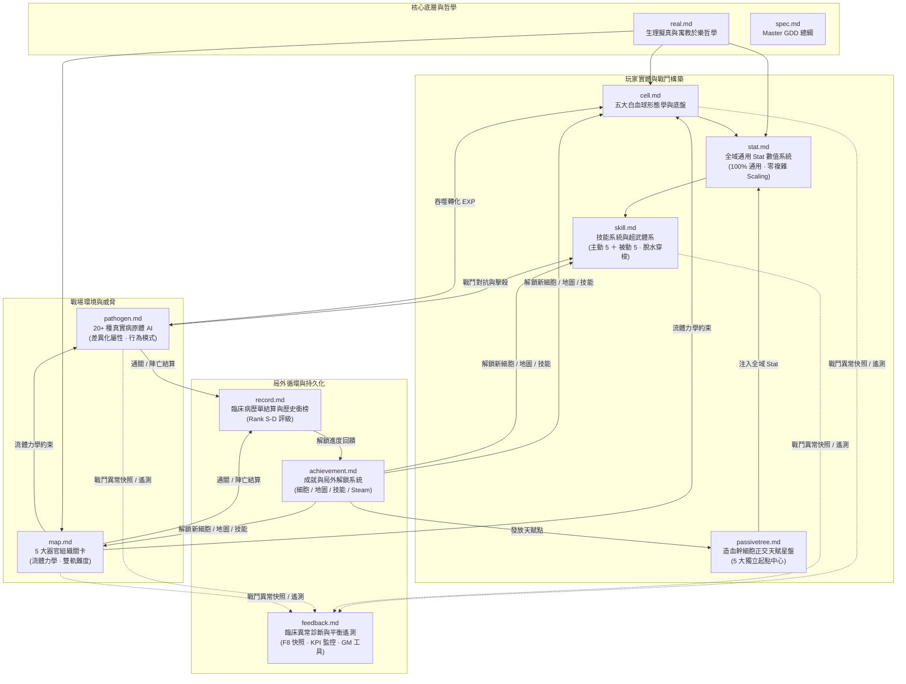

# 《Project: Phagocyte（吞噬體）》全域設計規格文件庫 (Documentation Portal)

歡迎查閱《Project: Phagocyte》的官方設計規格與技術架構文件庫。本文件庫包含遊戲設計、醫學擬真哲學、系統數值模型、關卡流體力學及程式架構的完整規格文檔。

---

## 1. 知識庫地圖與文檔索引 (Documentation Index)

文件庫按系統模組進行深度解耦與專業拆解，各專題文檔如下：

```
docs/
├── README.md         # [本頁] 文件庫總導覽與架構全景圖
├── spec.md           # 專案總綱 Master GDD / PRD（全域主規格書）
├── real.md           # 生物擬真與遊戲化設計哲學（寓教於樂、機制直覺性與反枯燥心流）
├── cell.md           # 五大白血球形態學與底盤系統（微絲微管底盤、動態噪聲與細胞核物理）
├── stat.md           # 全域通用 Stat 數值系統規格書（100%通用屬性池、標準雙軌計算模型、零複雜Scaling）
├── skill.md          # 技能系統、超武體系與微操規格書（主動5+被動5、超武二合一融合、脫水穿梭Squeeze）
├── map.md            # 關卡病理環境、流體力學與波次導演（5大人體器官、吸力/剪切流、難度雙軌制）
├── pathogen.md       # 病原體圖鑑與免疫對抗機制（20+種細菌、病毒、真菌、寄生蟲、朊病毒、癌細胞）
├── passivetree.md    # 造血幹細胞正交天賦星盤（DBD血網轉化、90度正交微管、四階稀有度、五大分化譜系）
├── achievement.md    # 成就、里程碑與局外解鎖系統（角色解鎖鏈、固有技能、Steamworks 整合）
├── record.md         # 臨床病歷單結算、歷史記錄與衝榜系統（SIRS 陣亡 vs 中和通關、評級 S/A/B/C/D）
├── tutorial.md       # 新手引導與直覺 UI/UX（見形知意、非侵入微引導、漸進式揭露）
├── endgame.md        # 終局無盡細胞因子風暴模式（突破15分鐘、病理過載詞綴、雙生Boss、全球天梯榜）
└── feedback.md       # 臨床異常反饋、Bug 診斷快照與數值平衡遙測（F8一鍵回報、確定性種子、平衡KPI、GM工具）
```

---

## 2. 系統架構互聯關係全景圖 (System Interconnection Architecture)



---

## 3. 各專題文檔速覽導引

### 🌟 總綱與設計哲學
- **[spec.md](file:///Users/zelin/project/Phagocyte/docs/spec.md)**：專案全景總規格書，涵蓋產品定位、核心循環、研發 Checklist 與技術管線。
- **[real.md](file:///Users/zelin/project/Phagocyte/docs/real.md)**：深層闡述「玩遊戲即理解免疫學」的核心設計哲學，探討如何將真實醫學術語轉化為頂級割草爽感。

### 🧬 細胞與戰鬥構築
- **[cell.md](file:///Users/zelin/project/Phagocyte/docs/cell.md)**：解密「底盤 ＋ 形態參數模組 ＋ 外掛細胞器」解耦架構，詳述巨噬細胞、殺手 T、嗜中性球、B 細胞與樹突狀細胞的顯微鏡特徵與平衡性。
- **[stat.md](file:///Users/zelin/project/Phagocyte/docs/stat.md)**：規範全域 100% 通用 Stat 數值矩陣（17 項通用屬性）、純雙軌標準計算模型、零二次 Scaling 與動態物理幾何聯動。
- **[skill.md](file:///Users/zelin/project/Phagocyte/docs/skill.md)**：「主動 5 ＋ 被動 5」經典閉環槽位、5 大主動技能、5 大被動代謝特質、5 大表觀遺傳超武二合一融合機制，以及脫水穿梭避險模式（Squeeze Mode）。
- **[passivetree.md](file:///Users/zelin/project/Phagocyte/docs/passivetree.md)**：融合 DBD 血網與 PoE 星盤靈感的 90 度正交微管棋盤系統，詳解五大細胞獨立起點中心、曼哈頓層級與零 Scaling 純屬性節點。

### 🦠 關卡與病原體
- **[map.md](file:///Users/zelin/project/Phagocyte/docs/map.md)**：詳解 5 大微觀人體器官切片（皮下創口、肺泡微腔、肝血竇、胃黏膜、血腦屏障）的專屬流體力學、15 分鐘波次導演與「殺越快生越快」同屏動態回補系統。
- **[pathogen.md](file:///Users/zelin/project/Phagocyte/docs/pathogen.md)**：百科全書式的病原體圖鑑，涵蓋細菌、病毒、真菌、寄生蟲、朊病毒與惡性腫瘤等 20 餘種真實微生物的純屬性矩陣與 AI 運動學行為。

### 🏆 局外養成與結算
- **[achievement.md](file:///Users/zelin/project/Phagocyte/docs/achievement.md)**：規範角色與器官地圖解鎖鏈、固有技能解鎖、廣譜生化武器投放，以及與 Steamworks Achievements API 的無縫對接。
- **[record.md](file:///Users/zelin/project/Phagocyte/docs/record.md)**：將每局結算包裝為臨床病理報告單，定義「特異性中和成功」與「SIRS 敗血陣亡」判準，以及依據 KPM 吞噬通量劃分的 Rank S～D 評級模型。

### 🧭 引導與介面體驗
- **[tutorial.md](file:///Users/zelin/project/Phagocyte/docs/tutorial.md)**：堅持「見形知意、非侵入式微引導」的 UX 規範，梳理 5 項核心微觀物理與機制教學，以及病歷單與星盤的自然銜接。

### ♾️ 終局模式 (End Game)
- **[endgame.md](file:///Users/zelin/project/Phagocyte/docs/endgame.md)**：規範通關後的「全身細胞因子風暴無盡模式」，涵蓋無上限時間軸、3 分鐘指數級過載、雙生 Boss 突襲與病理負面詞綴系統（Afflictions）。

### 🛠️ 診斷、反饋與平衡 (Diagnostics & Balance)
- **[feedback.md](file:///Users/zelin/project/Phagocyte/docs/feedback.md)**：設計「顯微鏡臨床異常報告系統」，支援戰鬥中 F8 一鍵捕獲確定性 RNG 種子與現場快照、單局匿名數據遙測（技能選取率、猝死熱點、致命傷害排行）以及研發專用 GM 控制台。

