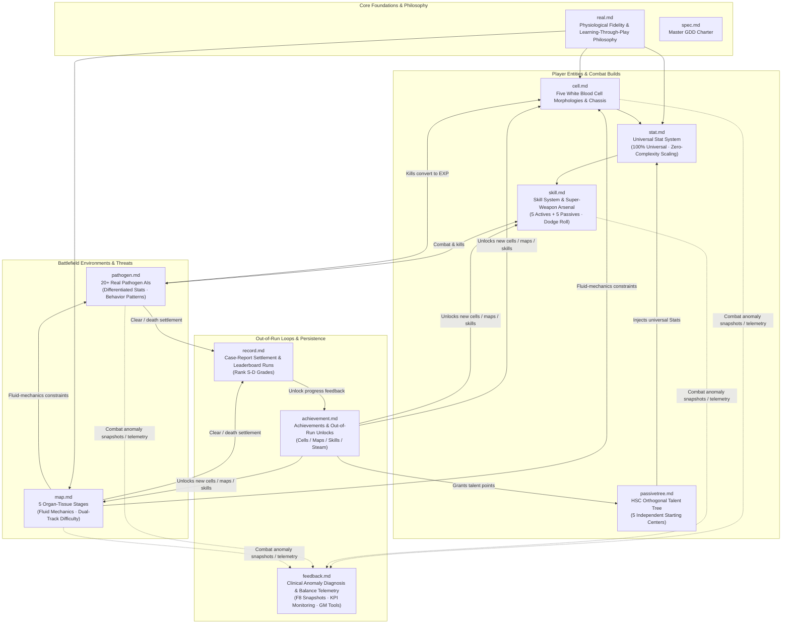

# Project: Phagocyte Design Spec Library (Documentation Portal)

Welcome to the official design-spec and technical-architecture library for Project: Phagocyte. It contains the complete spec documents for game design, medical-simulation philosophy, system numerical models, stage fluid mechanics, and code architecture.

---

## 1. Knowledge Map & Document Index (Documentation Index)

The library is deeply decoupled by system module; the topic docs are:

```
docs/
├── README.md         # [This page] Library overview and architecture panorama
├── spec.md           # Master GDD / PRD project charter (global master spec)
├── real.md           # Bio-fidelity and gamification design philosophy (learning through play, intuitive mechanics, anti-boredom flow)
├── cell.md           # Five white blood cell morphologies and chassis systems (filament/microtubule chassis, dynamic noise, nuclear physics)
├── stat.md           # Universal Stat system spec (100% universal stat pool, standard dual-track computation model, zero-complexity scaling)
 ├── skill.md          # Skill system, super-weapon arsenal & micro-control spec (5 actives + 5 passives, super-weapon two-in-one fusion, dodge roll)
├── map.md            # Stage pathological environments, fluid mechanics & wave direction (5 human organs, suction/shear flow, dual-track difficulty)
├── pathogen.md       # Pathogen codex and immune-countermeasure mechanics (20+ bacteria, viruses, fungi, parasites, prions, cancer cells)
├── passivetree.md    # HSC orthogonal talent tree (DBD bloodweb adaptation, 90-degree orthogonal microtubules, four rarity tiers, five differentiation lineages)
├── achievement.md    # Achievements, milestones & out-of-run unlocks (character unlock chains, innate skills, Steamworks integration)
├── record.md         # Clinical case-report settlement, history & leaderboard runs (SIRS death vs. neutralization clear, S/A/B/C/D grades)
├── tutorial.md       # New-player onboarding and intuitive UI/UX (readable-at-sight, non-intrusive micro-guidance, progressive disclosure)
├── endgame.md        # Endgame endless cytokine storm mode (beyond 15 minutes, pathological overload affixes, twin Bosses, global leaderboards)
├── cheats.md         # Test cheat full-unlock guide (F9/F10, --cheats=all, CheatTools API)
└── feedback.md       # Clinical anomaly reports, bug diagnosis snapshots & balance telemetry (F8 one-key reporting, deterministic seeds, balance KPIs, GM tools)
```

---

## 2. System Interconnection Panorama (System Interconnection Architecture)


```mermaid
graph TD
    subgraph CorePillars [Core Foundations & Philosophy]
        PHIL["real.md<br>Physiological Fidelity & Learning-Through-Play Philosophy"]
        SPEC["spec.md<br>Master GDD Charter"]
    end

    subgraph PlayerSystems [Player Entities & Combat Builds]
        CELL["cell.md<br>Five White Blood Cell Morphologies & Chassis"]
        STAT["stat.md<br>Universal Stat System<br>(100% Universal · Zero-Complexity Scaling)"]
         SKILL["skill.md<br>Skill System & Super-Weapon Arsenal<br>(5 Actives + 5 Passives · Dodge Roll)"]
        TREE["passivetree.md<br>HSC Orthogonal Talent Tree<br>(5 Independent Starting Centers)"]
    end

    subgraph WorldSystems [Battlefield Environments & Threats]
        MAP["map.md<br>5 Organ-Tissue Stages<br>(Fluid Mechanics · Dual-Track Difficulty)"]
        PATH["pathogen.md<br>20+ Real Pathogen AIs<br>(Differentiated Stats · Behavior Patterns)"]
    end

    subgraph MetaSystems [Out-of-Run Loops & Persistence]
        ACH["achievement.md<br>Achievements & Out-of-Run Unlocks<br>(Cells / Maps / Skills / Steam)"]
        REC["record.md<br>Case-Report Settlement & Leaderboard Runs<br>(Rank S-D Grades)"]
        DIAG["feedback.md<br>Clinical Anomaly Diagnosis & Balance Telemetry<br>(F8 Snapshots · KPI Monitoring · GM Tools)"]
    end

    PHIL --> CELL & STAT & MAP
    CELL --> STAT
    TREE -->|Injects universal Stats| STAT
    STAT --> SKILL
    SKILL <-->|Combat & kills| PATH
    MAP -->|Fluid-mechanics constraints| CELL & PATH
    PATH -->|Kills convert to EXP| CELL
    PATH & MAP -->|Clear / death settlement| REC
    REC -->|Unlock progress feedback| ACH
    ACH -->|Grants talent points| TREE
    ACH -->|Unlocks new cells / maps / skills| CELL & MAP & SKILL
    CELL & SKILL & PATH & MAP -.->|Combat anomaly snapshots / telemetry| DIAG
```

---

## 3. Topic Document Quick Guide

### 🌟 Charter & Design Philosophy
- **[spec.md](file:///Users/zelin/project/Phagocyte/docs/spec.md)**: the panoramic master spec, covering product positioning, the core loop, the dev Checklist, and the tech pipeline.
- **[real.md](file:///Users/zelin/project/Phagocyte/docs/real.md)**: explains the core design philosophy of "playing the game is understanding immunology": how real medical terminology becomes top-tier mow-down satisfaction.

### 🧬 Cells & Combat Builds
- **[cell.md](file:///Users/zelin/project/Phagocyte/docs/cell.md)**: documents the decoupled "chassis + morphology parameter module + bolt-on organelle" architecture, detailing the microscopic signatures and balance of Macrophages, killer T cells, Neutrophils, B cells, and dendritic cells.
- **[stat.md](file:///Users/zelin/project/Phagocyte/docs/stat.md)**: specifies the universal 100% generic Stat matrix (17 universal stats), the pure dual-track standard computation model, zero-secondary scaling, and dynamic physics-geometry linkage.
- **[skill.md](file:///Users/zelin/project/Phagocyte/docs/skill.md)**: the "5 actives + 5 passives" classic-loop slots, 5 active skills, 5 passive metabolic traits, the 5 epigenetic super-weapon two-in-one fusion mechanics, and dodge-roll micro-control (Dodge Roll).
- **[passivetree.md](file:///Users/zelin/project/Phagocyte/docs/passivetree.md)**: a 90-degree orthogonal-microtubule board system inspired by the DBD bloodweb and the PoE passive tree, detailing five independent cell starting centers, Manhattan tiers, and zero-scaling pure-stat nodes.

### 🦠 Stages & Pathogens
- **[stages.md](file:///Users/zelin/project/Phagocyte/docs/stages.md)**: details the bespoke fluid mechanics of 5 microscopic human-organ slices (Acute Wound, Alveolar Space, Hepatic Sinusoid, Gastric Lumen, Blood-Brain Barrier), the 15-minute wave direction, and the "the faster you kill, the faster they spawn" on-screen dynamic replenishment system.
- **[pathogen.md](file:///Users/zelin/project/Phagocyte/docs/pathogen.md)**: an encyclopedic pathogen codex covering the pure-stat matrices and AI kinematic behaviors of 20+ real microbes: bacteria, viruses, fungi, parasites, prions, and malignant tumors.

### 🏆 Out-of-Run Progression & Settlement
- **[achievement.md](file:///Users/zelin/project/Phagocyte/docs/achievement.md)**: specifies character and organ-map unlock chains, innate-skill unlocks, broad-spectrum biochemical weapon drops, and seamless integration with the Steamworks Achievements API.
- **[record.md](file:///Users/zelin/project/Phagocyte/docs/record.md)**: wraps each run's settlement as a clinical pathology case report, defining "specific-neutralization success" vs. "SIRS septic death" criteria plus a KPM-kill-throughput Rank S-D grading model.

### 🧭 Onboarding & Interface Experience
- **[tutorial.md](file:///Users/zelin/project/Phagocyte/docs/tutorial.md)**: UX guidelines upholding "readable-at-sight, non-intrusive micro-guidance", covering 5 core micro-physics and mechanics lessons plus natural handoffs to the case report and talent tree.

### ♾️ Endgame Mode (End Game)
- **[endgame.md](file:///Users/zelin/project/Phagocyte/docs/endgame.md)**: specifies the post-clear "systemic cytokine storm endless mode": an uncapped timeline, 3-minute exponential overload, twin-Boss raids, and the pathological affix system (Afflictions).

### 🛠️ Diagnostics, Feedback & Balance (Diagnostics & Balance)
- **[feedback.md](file:///Users/zelin/project/Phagocyte/docs/feedback.md)**: designs the "microscopic clinical anomaly reporting system": mid-combat F8 one-key capture of deterministic RNG seeds and live snapshots, per-run anonymized telemetry (skill pick rates, sudden-death hotspots, lethal-damage rankings), and a dev-only GM console.
- **[cheats.md](file:///Users/zelin/project/Phagocyte/docs/cheats.md)**: test-only full-unlock cheat guide (F9/F10 hotkeys, `--cheats=all`, environment variables, the `CheatTools` API, and headless-suite usage).
