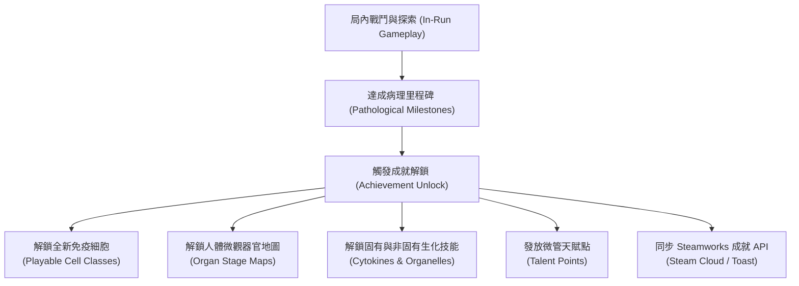

# 《Project: Phagocyte》成就、里程碑與局外解鎖規格書 (Achievements & Meta-Progression)

---

## 1. 系統目標與解鎖哲學

成就系統是《Phagocyte》局外長期養成與心流激勵的核心樞紐。本系統遵循四大解鎖原則：



1. **里程碑驅動解鎖**：拒絕無意義的枯燥數值積累，所有解鎖均對應顯著的階段性戰鬥成就（如吞噬數量、存活時間、病原體載量清零、特定器官感染清除）。
2. **器官地圖成就解鎖**：除新手教學關「皮下創口」預設開放外，**後續所有人體器官關卡（肺泡、肝血竇、胃黏膜、血腦屏障）以及各器官的「急性危象（Hard）」難度，皆需透過達成對應的臨床通關與病理成就解鎖**。
3. **細胞與固有技能一體化**：解鎖全新免疫細胞時，其**專屬固有生化技能同步解鎖**並加入全域可選池。
4. **非固有廣譜技能成就解鎖**：非細胞特化的廣譜生化技能與特殊超武，透過高難度或趣味性成就逐步釋放，持續維持玩家構築新鮮感。
5. **全平台整合（Steamworks 關聯）**：成就系統與 Steam API 雙向聯動，具備遊戲內顯微鏡風格的浮窗提示（Toast）與離線快取同步。

---

## 2. 角色、地圖與技能解鎖鏈 (Class, Map & Skill Unlock Chain)

### 2.1 器官地圖解鎖成就 (Map Unlock Achievements)
每張器官地圖的解鎖均代表免疫系統成功控制該感染病灶，阻止病原體沿微血管向後續重要臟器擴散：

| 成就代碼 (ID) | 成就名稱 | 達成條件 | 解鎖地圖獎勵 (Map Reward) |
| :--- | :--- | :--- | :--- |
| *(預設起始)* | **皮下屏障防線** | 無 (初始提供)。 | **預設解鎖：地圖 01「皮下創口 (`acute_wound`)」Normal**。 |
| `ach_wound_clear` | **創口閉合：局部穩態** | 通關地圖 01「皮下創口」Normal 難度。 | **解鎖地圖 02：【肺泡氣體微腔 (`alveolar_space`)】Normal**；<br>解鎖地圖 01【皮下創口 Hard (急性危象)】。 |
| `ach_alveolar_clear` | **呼吸暢通：氣血屏障** | 通關地圖 02「肺泡微腔」Normal 難度。 | **解鎖地圖 03：【肝血竇微循環 (`hepatic_sinusoid`)】Normal**；<br>解鎖地圖 02【肺泡微腔 Hard (急性危象)】。 |
| `ach_hepatic_clear` | **門脈清道夫：解毒重鎮** | 通關地圖 03「肝血竇」Normal 難度。 | **解鎖地圖 04：【胃腔極酸黏膜 (`gastric_lumen`)】Normal**；<br>解鎖地圖 03【肝血竇 Hard (急性危象)】。 |
| `ach_gastric_clear` | **抗酸壁壘：黏膜重構** | 通關地圖 04「胃黏膜」Normal 難度。 | **解鎖地圖 05：【血腦屏障毛細血管 (`blood_brain_barrier`)】Normal**；<br>解鎖地圖 04【胃黏膜 Hard (急性危象)】。 |
| `ach_bbb_clear` | **終極要塞：神經淨化** | 通關地圖 05「血腦屏障」Normal 難度。 | 解鎖地圖 05【血腦屏障 Hard (急性危象)】；<br>獲得通關紀念外觀與微管天賦點 $+2$。 |

---

### 2.2 細胞角色與技能解鎖成就 (Class & Skill Unlock Achievements)

| 成就代碼 (ID) | 成就名稱 | 達成條件 (單一清晰指標) | 解鎖角色與技能獎勵 (Rewards) |
| :--- | :--- | :--- | :--- |
| `ach_first_digestion` | **生命之源：初次吞噬** | 首次將任意 1 隻病原體吸入體內並完全消化。 | 解鎖基礎病歷圖鑑功能。 |
| `ach_engulf_20` | **極化獵手：穿刺之刃** | 單局累積吞噬消化 **200 隻病原體**。 | **解鎖角色：殺手 T 細胞 (CTL)**；<br>同步解鎖其固有技能【穿孔素長矛】。 |
| `ach_reach_level_5` | **內質工廠：抗體工匠** | 單局體內經驗代謝達到 **等級 15 (Lv.15)**。 | **解鎖角色：B 淋巴細胞 (B-Cell)**；<br>同步解鎖其固有技能【Y 型抗體齊射】。 |
| `ach_survive_180s` | **免疫前哨：感知觸角** | 在任意地圖持續存活滿 **8 分鐘（480 秒）**。 | **解鎖角色：樹突狀細胞 (Dendritic Cell)**；<br>同步解鎖其固有技能【MHC 抗原追蹤束】。 |
| `ach_devour_50` | **狂暴顆粒：焦躁殉職** | 單局累積吞噬消化 **500 隻病原體**。 | **解鎖角色：嗜中性球 (Neutrophil)**；<br>同步解鎖其固有技能【顆粒酶殉爆】。 |
| `ach_giant_volume` | **宏觀巨獸：原形過載** | 透過被動與升級使細胞半徑達到原始大小的 **2.0 倍以上（$\alpha \ge 2.0$）**。 | **解鎖非固有主動技能：【偽足猛擊】**（加入全域三選一升級池）。 |
| `ach_full_arsenal` | **滿配生化：全能武裝** | 單局內同時裝備滿 **5 個主動生化技能**。 | **解鎖被動特質：【線粒體超頻】**；獎勵 1 點微管天賦點。 |
| `ach_first_evolution`| **極限質變：超武誕生** | 首次合成任意 1 組終極表觀遺傳超武。 | 解鎖微觀檔案館【超武深層生化機轉】資料庫；獎勵 1 點微管天賦點。 |
| `ach_wound_hard_clear`| **創口清道夫：膿毒終結**| 通關地圖 01「皮下創口」Hard 急性危象難度。 | 獎勵 1 點微管天賦點；解鎖稀有被動【內毒素屏障】。 |
| `ach_prion_cleared`  | **結晶粉碎：打破不滅** | 擊碎並消化 1 顆錯誤折疊朊病毒晶體。 | 解鎖傳奇天賦節點【表觀溶酶體自噬】。 |

---

## 3. Steamworks API 整合架構

遊戲透過 Godot / C# 封裝的 `AchievementManager.cs` 與 Steamworks SDK 對接：

```csharp
// 成就解鎖回調、地圖解鎖與 Steam 廣播
public static bool Unlock(string achId)
{
    if (IsUnlocked(achId)) return false;

    UnlockedIds[achId] = true;
    var data = Achievements[achId].AsGodotDictionary();

    // 1. 若成就獎勵包含解鎖細胞
    string rewardCell = data.GetValueOrDefault("reward_cell", "").AsString();
    if (!string.IsNullOrEmpty(rewardCell))
    {
        GameManager.UnlockClass(rewardCell);
    }

    // 2. 若成就獎勵包含解鎖地圖
    string rewardMap = data.GetValueOrDefault("reward_map", "").AsString();
    if (!string.IsNullOrEmpty(rewardMap))
    {
        GameManager.UnlockMap(rewardMap);
    }

    SaveToDisk();

    // 3. 觸發遊戲內顯微鏡螢光 Toast 彈窗
    Instance.EmitSignal(SignalName.AchievementUnlocked, achId, GetAchievementInfo(achId));

    // 4. 同步 Steam 成就 (若已整合 Steamworks)
    #if USE_STEAMWORKS
    if (SteamManager.IsInitialized)
    {
        SteamUserStats.SetAchievement(achId.ToUpperInvariant());
        SteamUserStats.StoreStats();
    }
    #endif

    return true;
}
```

- **離線與在線容錯**：所有成就首先持久化至本地 `user://achievements.json`。若玩家處於離線模式，下次聯網啟動時自動批量補發並同步至 Steam 伺服器。
- **進度即時監聽**：`AchievementManager.RecordEvent(eventName, value)` 在戰鬥中即時監聽殺怪數、等級、存活時間、器官通關狀態與體積縮放，達成目標瞬間立即彈出提示並持久化解鎖狀態。
