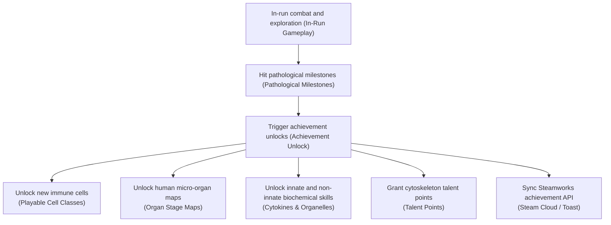

# Project: Phagocyte — Achievements, Milestones & Meta-Progression (Achievements & Meta-Progression)

---

## 1. System Goals and Unlock Philosophy

The achievement system is the central hub of *Phagocyte*'s out-of-run long-term progression and flow incentives. It follows four unlock principles:


```mermaid
flowchart TD
    A["In-run combat and exploration (In-Run Gameplay)"] --> B["Hit pathological milestones (Pathological Milestones)"]
    B --> C["Trigger achievement unlocks (Achievement Unlock)"]
    C --> D1["Unlock new immune cells<br>(Playable Cell Classes)"]
    C --> D2["Unlock human micro-organ maps<br>(Organ Stage Maps)"]
    C --> D3["Unlock innate and non-innate biochemical skills<br>(Cytokines & Organelles)"]
    C --> D4["Grant cytoskeleton talent points<br>(Talent Points)"]
    C --> E["Sync Steamworks achievement API<br>(Steam Cloud / Toast)"]
```

1. **Milestone-driven unlocks**: no meaningless grindy accumulation — every unlock maps to a notable combat milestone (kill counts, survival time, pathogen-load clearance, specific organ-infection clears).
2. **Organ-map achievement unlocks**: except the tutorial stage "Subcutaneous Wound", which is open by default, **all subsequent human organ stages (Alveolar Space, Hepatic Sinusoid, Gastric Lumen, Blood-Brain Barrier) plus each organ's "Acute Crisis (Hard)" difficulty unlock exclusively through the corresponding clinical-clear and pathology achievements**.
3. **Cell-plus-innate-skill bundling**: unlocking a new immune cell **simultaneously unlocks its signature innate biochemical skill** into the global option pool.
4. **Achievement-gated broad-spectrum skills**: non-cell-specific broad-spectrum biochemical skills and special super-weapons release gradually through high-difficulty or playful achievements, keeping builds perpetually fresh.
5. **Full platform integration (Steamworks linkage)**: the achievement system syncs both ways with the Steam API, with microscope-styled in-game floating toasts plus offline cache sync.

---

## 2. Class, Map & Skill Unlock Chains (Class, Map & Skill Unlock Chain)

### 2.1 Organ Map Unlock Achievements (Map Unlock Achievements)
Unlocking each organ map means the immune system has successfully contained that infectious focus, stopping pathogens from spreading along microvessels into vital downstream organs:

| Achievement ID | Achievement Name | Requirement | Map Reward |
| :--- | :--- | :--- | :--- |
| *(Default start)* | **Subcutaneous Barrier Defense** | None (provided initially). | **Default unlock: Map 01 Acute Wound (`acute_wound`) Normal**. |
| `wound_clear` | **Wound Closure: Local Homeostasis** | Clear Map 01 Acute Wound on Normal. | **Unlock Map 02: [Alveolar Space (`alveolar_space`)] Normal**;<br>unlock Map 01 [Acute Wound Hard (Acute Crisis)]. |
| `alveolar_clear` | **Clear Breathing: Air-Blood Barrier** | Clear Map 02 Alveolar Space on Normal. | **Unlock Map 03: [Hepatic Sinusoid (`hepatic_sinusoid`)] Normal**;<br>unlock Map 02 [Alveolar Space Hard (Acute Crisis)]. |
| `hepatic_clear` | **Portal Scavenger: Detox Stronghold** | Clear Map 03 Hepatic Sinusoid on Normal. | **Unlock Map 04: [Gastric Lumen (`gastric_lumen`)] Normal**;<br>unlock Map 03 [Hepatic Sinusoid Hard (Acute Crisis)]. |
| `gastric_clear` | **Acid-Proof Rampart: Mucosa Rebuilt** | Clear Map 04 Gastric Mucosa on Normal. | **Unlock Map 05: [Blood-Brain Barrier capillaries (`blood_brain_barrier`)] Normal**;<br>unlock Map 04 [Gastric Mucosa Hard (Acute Crisis)]. |
| `bbb_clear` | **Final Fortress: Neural Purge** | Clear Map 05 Blood-Brain Barrier on Normal. | Unlock Map 05 [Blood-Brain Barrier Hard (Acute Crisis)];<br>earn a commemorative clear skin plus cytoskeleton talent points $+2$. |

---

### 2.2 Class & Skill Unlock Achievements (Class & Skill Unlock Achievements)

| Achievement ID | Achievement Name | Requirement (single clear metric) | Class & Skill Rewards |
| :--- | :--- | :--- | :--- |
| `first_digestion` | **Source of Life: First Kill** | Kill any 1 pathogen for the first time. | Unlock the basic case-report codex. |
| `engulf_20` | **Polarized Hunter: Piercing Blade** | Kill **200 pathogens** cumulatively in a single run. | **Unlock: killer T cell (CTL)**;<br>also unlock its innate skill [Perforin Lance]. |
| `reach_level_5` | **ER Factory: Antibody Artisan** | Reach **level 15 (Lv.15)** via in-run XP metabolism in a single run. | **Unlock: B lymphocyte (B-Cell)**;<br>also unlock its innate skill [Y-Shaped Antibody Salvo]. |
| `survive_180s` | **Immune Outpost: Sensory Antennae** | Survive **8 full minutes (480 seconds)** on any map. | **Unlock: dendritic cell (Dendritic Cell)**;<br>also unlock its innate skill [MHC Tracer Beam]. |
| `devour_50` | **Frenzied Granules: Restless Martyrdom** | Kill **500 pathogens** cumulatively in a single run. | **Unlock: Neutrophil (Neutrophil)**;<br>also unlock its innate skill [Granzyme Detonation]. |
| `giant_volume` | **Macro Behemoth: Form Overload** | Grow the cell radius to **2.0x or more of its original size ($\alpha \ge 2.0$)** via passives and level-ups. | **Unlock non-innate active skill: [Pseudopod Slam]** (joins the global draft pool). |
| `full_arsenal` | **Full Biochemical Loadout: Omnipotent Arsenal** | Equip **5 active biochemical skills** simultaneously in a single run. | **Unlock passive trait: [Mitochondrial Overclock]**; award 1 cytoskeleton talent point. |
| `first_evolution`| **Ultimate Transformation: Super-Weapon Birth** | Fuse any 1 ultimate epigenetic super-weapon for the first time. | Unlock the microscopy archive's [Super-Weapon Deep Biochemistry] database; award 1 cytoskeleton talent point. |
| `wound_hard_clear`| **Wound Scavenger: Septic Finale**| Clear Map 01 Acute Wound on Hard Acute-Crisis difficulty. | Award 1 cytoskeleton talent point; unlock the rare passive [Endotoxin Barrier]. |
| `prion_cleared`  | **Crystal Crusher: Shattering the Indestructible** | Shatter 1 misfolded prion crystal. | Unlock the legendary talent node [Epigenetic Lysosomal Autophagy]. |

---

## 3. Steamworks API Integration Architecture

The game talks to the Steamworks SDK through the Godot/C#-side `AchievementManager.cs`:

```csharp
// Achievement unlock callback, map unlocks, and Steam broadcast
public static bool Unlock(string achId)
{
    if (IsUnlocked(achId)) return false;

    UnlockedIds[achId] = true;
    var data = Achievements[achId].AsGodotDictionary();

    // 1. If the achievement reward includes a cell unlock
    string rewardCell = data.GetValueOrDefault("reward_cell", "").AsString();
    if (!string.IsNullOrEmpty(rewardCell))
    {
        GameManager.UnlockClass(rewardCell);
    }

    // 2. If the achievement reward includes a map unlock
    string rewardStage = data.GetValueOrDefault("reward_stage", "").AsString();
    if (!string.IsNullOrEmpty(rewardStage))
    {
        GameManager.UnlockStage(rewardStage);
    }

    SaveToDisk();

    // 3. Fire the in-game microscope-fluorescence toast popup
    Instance.EmitSignal(SignalName.AchievementUnlocked, achId, GetAchievementInfo(achId));

    // 4. Sync the achievement to Steam (once Steamworks is integrated)
    #if USE_STEAMWORKS
    if (SteamManager.IsInitialized)
    {
        SteamUserStats.SetAchievement(achId.ToUpperInvariant());
        SteamUserStats.StoreStats();
    }
    #endif

    return true;
}
```

- **Offline/online tolerance**: all achievements persist locally to `user://achievements.json` first. If the player is offline, the next online launch batch-reports and syncs them to Steam servers automatically.
- **Real-time progress listening**: `AchievementManager.RecordEvent(eventName, value)` listens live during combat to kill counts, levels, survival time, organ-clear states, and volume scaling — popping the toast and persisting the unlock the instant a goal lands.
