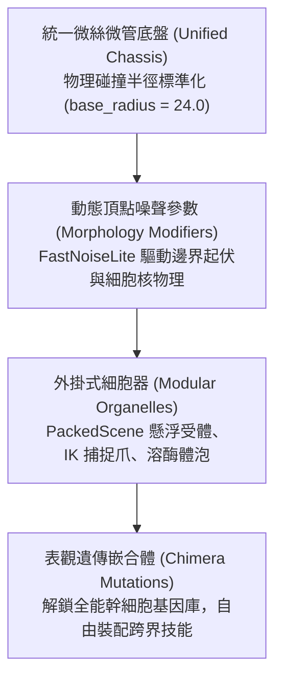

# 《Project: Phagocyte》細胞角色形態學與底盤系統規格書 (Cell Morphology & Chassis Architecture)

---

## 1. 架構概述：解耦三層生物學模型

為解決傳統 2D 骨骼動畫「形態與技能強耦合、無法自由換裝細胞器與複用技能」的架構瓶頸，本專案將所有白血球解構為三層生物學模型：



### 1.1 統一底盤（Unified Chassis）
- 所有白血球在物理底層均共享相同的微絲微管動力學系統。
- **初始半徑標準化**：所有角色在 Lv.1 時初始受擊與碰撞半徑統一為 `base_radius = 24.0`（直徑 $48\,\text{px}$）。此舉確保前期走位手感一致，消弭前期數值失衡。
- **多邊形與碰撞即時同步**：底層使用 `Polygon2D` 繪製細胞邊界，並在 `_PhysicsProcess` 中將頂點座標逐幀即時烘焙至 `CollisionPolygon2D`，實現「所見即所得」的物理邊界。

### 1.2 頂點噪聲參數模組（Morphology Modifiers）
透過 `FastNoiseLite` 在極座標系下對多邊形頂點進行動態半徑位移：
$$R(\theta, t) = R_{\text{base}} \times \left(1.0 + \text{Amplitude} \times \text{Noise}(\theta \cdot \text{Frequency}, t \cdot \text{Speed})\right)$$
- **Amplitude（偽足伸展振幅）**：控制邊界突起與偽足延伸的長度。受全域通用屬性 `area` 動態加成。
- **Frequency（突觸/刺突密度）**：控制邊緣波峰波谷的密集程度。數值高則毛刺密集（如樹突狀細胞）；數值低則圓潤平滑（如未活化 T 細胞）。
- **Smoothness（黏滯流體度）**：決定邊界如同阿米巴原蟲般緩慢流動，或是像緊繃細胞膜般高頻微顫。

### 1.3 外掛式細胞器（Modular Organelles）
超出主網格拓撲範圍的特殊構造，封裝為獨立的子節點（PackedScene）：
- **偽足捕捉爪（`PseudopodLimb.tscn`）**：基於 2D 骨骼逆向運動學（IK Chain），平時縮入質內，主動攻擊時彈射向外抓取病原體拖回胞體。
- **受體棘刺陣列（`ReceptorSpikes.tscn`）**：圍繞細胞邊緣排列的環狀旋轉受體，提供化學感應、接觸反傷與旋轉攔截。

---

## 2. 五大白血球角色矩陣 (The 5 Immune Cell Classes)

所有角色在 `GameManager.ClassData` 中註冊，具備鮮明的顯微鏡可辨識特徵、細胞核形狀、專屬固有技能與起始星盤定位：

| 細胞種類 | 英文/代碼 | 真實尺寸 | 遊戲外觀形態與邊界特徵 | 細胞核辨識形狀 | 固有技能 (Innate) | 初始天賦起點定位 | 解鎖條件 (成就) |
| :--- | :--- | :--- | :--- | :--- | :--- | :--- | :--- |
| **巨噬細胞** | `macrophage` | $20 \sim 40\,\mu\text{m}$ | **流體阿米巴狀**。邊界劇烈起伏，粗大偽足持續伸張，體內可見深色溶酶體泡。 | **巨大腎形 / 馬蹄形單核**（偏心排列）。 | **微絲變形**<br>(Macrophage Deformation) | 【單核巨化區域】<br>近戰重裝、吞噬成長、高減傷 | **預設解鎖** |
| **殺手 T 細胞** | `ctl` | $7 \sim 10\,\mu\text{m}$ | **緊湊微絨毛球體**。平滑圓整，高頻微幅顫動；衝刺時前端極化為免疫突觸。 | **超大正圓形核**（佔據體內 $\sim 80\%$ 空間，僅留薄層胞質）。 | **穿孔素長矛**<br>(Perforin Lance) | 【極化纖毛區域】<br>高速刺客、穿刺破膜、高暴擊處決 | 單局吞噬消滅 200 隻病原體<br>(`ach_engulf_20`) |
| **嗜中性球** | `neutrophil` | $10 \sim 15\,\mu\text{m}$ | **高頻焦躁顫膜**。邊界極不穩定，易破碎呈顆粒狀；胞質密布細微殺菌顆粒。 | **分節多葉核（3～5 葉）**（呈念珠或香腸串狀）。 | **顆粒酶殉爆**<br>(Granzyme Detonation) | 【顆粒活化區域】<br>陣地自爆、高頻拋射、酸液濺射 | 單局吞噬消滅 500 隻病原體<br>(`ach_devour_50`) |
| **B 淋巴細胞** | `b_cell` | $8 \sim 12\,\mu\text{m}$ | **受體密布圓球**。靜息時緊湊圓潤，外圍環繞 Y 型受體；活化時內質網如工廠展開。 | **車輪狀 / 鐘面狀核**（染色質呈輪輻放射狀排列）。 | **Y 型抗體齊射**<br>(Antibody Salvo) | 【內質網工廠】<br>遠端制導、高頻抗體射擊、自動追蹤 | 單局代謝達到等級 15<br>(`ach_reach_level_5`) |
| **樹突狀細胞** | `dendritic` | $15 \sim 30\,\mu\text{m}$ | **星芒樹突海葵狀**。向 360 度四面八方伸出密集的樹枝狀感知觸角，感應半徑極大。 | **中心不規則卵形核**。 | **MHC 抗原追蹤束**<br>(MHC Tracer Beam) | 【抗原感知中樞】<br>廣域採樣、信號傳導、經驗倍增 | 單局存活滿 8 分鐘 (480 秒)<br>(`ach_survive_180s`) |

---

## 3. 初始基礎屬性分佈 (Base Stat Profiles)

依據各細胞的生物機能，在通用屬性矩陣中設定差異化起始基準：

```
[巨噬細胞]   HP: 140 | Armor: 10 | Speed: 210 | Area: 1.25 | Might: 1.0  | Magnet: 160
[殺手 T]     HP:  90 | Armor:  0 | Speed: 260 | Crit: 15%  | C-Dmg: 2.5  | Pierce: +1
[嗜中性球]   HP: 100 | Armor:  5 | Speed: 230 | Might: 1.2  | Knock: 1.4  | Regen: 0.5
[B 細胞]     HP:  95 | Armor:  0 | Speed: 220 | ProjSpd: 1.3| CDR:  10%   | Amount: +1
[樹突細胞]   HP: 110 | Armor:  2 | Speed: 225 | Magnet: 250 | Growth: 1.3 | Luck: 1.25
```

---

## 4. 動態體積平衡與縮放矩陣 (Volume Balancing & Scaling Matrix)

在以「接觸吞噬」為核心機制的玩法下，體積龐大具有雙刃劍效應：**「受擊箱越大，嘴巴也越大」**。

### 4.1 即時體積縮放係數 $\alpha$
$$\alpha = \frac{R_{\text{current}}}{R_{\text{base}}} = \text{stats.area.get_value()}$$

- **投射物與 AoE 等比縮放**：所有技能判定範圍直接隨 $\alpha$ 等比放大。巨化細胞發射的酸霧是覆蓋半屏的巨浪，微型細胞發射的則是細針穿透束。
- **表面發射點數量（Emission Points）**：
  $$\text{Emission Points} = \max\left(1, \lfloor \text{Base Points} \times \alpha \rfloor\right)$$
  隨體積增大，周長擴展，抗體齊射等多發射源技能自動獲得更多發射點。
- **質量慣性與衝撞判定（Mass & Inertia）**：
  - $\alpha > 1.3$（重型）：物理質量極大，免除普通小怪擊退衝量；衝刺時直接對接觸目標施加壓碎判定。
  - $\alpha < 0.9$（輕型）：慣性極小，變向急停零延遲；投射物附帶額外貫穿與致命特異性暴擊。

---

## 5. 世界觀：表觀遺傳與異變嵌合體 (Chimera Mutations)

- **世界觀背景**：「所有白血球皆源自全能造血幹細胞，體內皆沉睡著分化譜系的完整基因組。」
- **跨界組合包裝**：
  - 當 B 淋巴細胞裝配巨噬細胞專屬的「偽足猛擊」時，UI 提示：`【解鎖沉睡基因：清道夫受體 CD36】`。
  - 視覺上，B 細胞周圍浮現溶酶體顆粒，並突發長出肉質阿米巴抓手。
  - 這種自由 Build 被定義為**「異變嵌合體（Chimera Mutation）」**，兼顧嚴謹生物學依據與玩家建構跨界流派的極致爽點。
