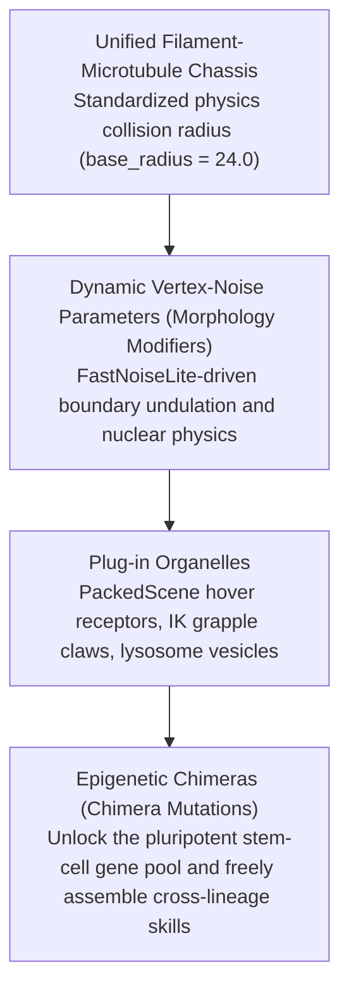

# Project: Phagocyte — Cell Morphology & Chassis Architecture

---

## 1. Architecture Overview: Decoupled Three-Layer Biological Model

To solve the classic 2D skeletal-animation bottleneck of "morphology hard-coupled to skills, no free organelle reskins or skill reuse", this project decomposes every white blood cell into a three-layer biological model:


```mermaid
graph TD
    A["Unified Filament-Microtubule Chassis<br>Standardized physics collision radius (base_radius = 24.0)"] --> B["Dynamic Vertex-Noise Parameters (Morphology Modifiers)<br>FastNoiseLite-driven boundary undulation and nuclear physics"]
    B --> C["Plug-in Organelles<br>PackedScene hover receptors, IK grapple claws, lysosome vesicles"]
    C --> D["Epigenetic Chimeras (Chimera Mutations)<br>Unlock the pluripotent stem-cell gene pool and freely assemble cross-lineage skills"]
```

### 1.1 Unified Chassis
- All white blood cells share the same filament-microtubule dynamics system at the physics layer.
- **Standardized starting radius**: every character starts at Lv.1 with a unified hit and collision radius of `base_radius = 24.0` (diameter $48\,\text{px}$). This keeps early-game positioning feel consistent and eliminates early balance skew.
- **Real-time polygon-collision sync**: the base layer draws the cell boundary with a `Polygon2D` and bakes vertex positions into the `CollisionPolygon2D` every frame inside `_PhysicsProcess`, delivering true what-you-see-is-what-you-collide-with physics.

### 1.2 Vertex-Noise Parameter Module (Morphology Modifiers)
Dynamic radial vertex displacement in polar coordinates via `FastNoiseLite`:
$$R(\theta, t) = R_{\text{base}} \times \left(1.0 + \text{Amplitude} \times \text{Noise}(\theta \cdot \text{Frequency}, t \cdot \text{Speed})\right)$$
- **Amplitude (pseudopod extension)**: controls the length of boundary protrusions and pseudopod reaches. Scaled dynamically by the universal `area` stat.
- **Frequency (synapse/spike density)**: controls how densely packed the edge peaks and valleys are. High values yield dense bristles (e.g., dendritic cells); low values yield smooth round shapes (e.g., resting T cells).
- **Smoothness (viscous fluidity)**: decides whether the boundary flows slowly like an amoeba or trembles at high frequency like a taut cell membrane.

### 1.3 Plug-in Organelles (Modular Organelles)
Special structures extending beyond the main mesh topology, packaged as standalone child nodes (PackedScene):
- **Phagocytic pseudopod chain strike (`PseudopodChainVisual`)**: transient chained pseudopods fired by devouring pseudopods, tinted with the host cell palette, striking in two phases — chain extension, then on-hit burst; the old `PseudopodLimb` IK grapple-claw organ has been merged into this mechanism and deleted.
- **Receptor spike array (`ReceptorSpikes.tscn`)**: a rotating ring of receptors arranged around the cell edge, providing chemosensing, contact retaliation, and spinning interception.

### 1.4 Organelle Chamber Loadout (Organelle Chamber 2x2, Third System)

Beyond visual attachments, every cell carries a `GearChamber` node alongside the `SkillManager` (`BaseCell._Ready` wiring, with a code fallback that builds it when missing, matching the `CellStats` missing-node pattern):
- **Slots and energy**: 2x2 = up to 4 pieces, base energy 6, `energy_cost ∈ [-1, 4]` (`-1` = generates `+1` power but always carries a heavy drawback); spent = sum of positive costs, cap = 6 + total generated; unequip/replace rolls back precisely via `CellStats.Add/RemoveModifier`, with `_ExitTree` cleanup.
- **Pre-run flow**: pick cell, then pick loadout (`LoadoutManager` keeps multiple preset profiles per cell; default is 4 empty slots, i.e., naked start), then pick talents, then pick map; at run start `Main.ApplyChamberLoadout` reads the active profile and skips illegal/locked entries.
- **In-run acquisition**: monster drops unlock gear (`GearUnlockManager`, base 2% chance, single entry via `BaseEnemy.Die`) — level-up draft offers a `new_gear` card (only unlocked-and-unowned gear, at most 1 per round) — with a full loadout the swap happens in the same modal (replace / stash to backpack / discard + heal 15% / cancel). The backpack is run-scoped, capped at 12.
- See `docs/skill.md` §4.1 for the six-category 12-item stat table, and `docs/stat.md` §3.1 for energy constraints.

---

## 2. Five White Blood Cell Class Matrix (The 5 Immune Cell Classes)

All classes are registered in `GameManager.ClassData` with distinct microscope-readable silhouettes, nuclear shapes, signature innate skills, and starting talent-tree positions:

| Cell Type | English/Code | Real Size | In-Game Morphology & Boundary | Identification Nucleus Shape | Innate Skill | Starting Talent Hub | Unlock Condition (Achievement) |
| :--- | :--- | :--- | :--- | :--- | :--- | :--- | :--- |
| **Macrophage** | `macrophage` | $20 \sim 40\,\mu\text{m}$ | **Fluid amoeboid**. Violently undulating boundary with thick extending pseudopods and dark lysosome vesicles visible inside. | **Giant kidney/horseshoe-shaped single nucleus** (eccentrically placed). | **Phagocytic Grasp**<br>(Phagocytic Grasp, active: grabs 2 nearest targets plus `amount` bonus, chained shot dealing contact damage) | **[Macrophage Start Hub]**<br>(top-left · bulk/HP/armor/block) | **Unlocked by default** |
| **Killer T cell** | `ctl` | $7 \sim 10\,\mu\text{m}$ | **Compact microvilli sphere**. Smooth and round with high-frequency low-amplitude shimmer; front polarizes into an immune synapse when dashing. | **Oversized perfectly round nucleus** (occupying $\sim 80\%$ of the interior, leaving only a thin cytoplasmic rim). | **Perforin Lance**<br>(Perforin Lance) | **[Killer T Start Hub]**<br>(right · move speed/crit/pierce/evasion) | Kill 200 pathogens in a single run<br>(`engulf_20`) |
| **Neutrophil** | `neutrophil` | $10 \sim 15\,\mu\text{m}$ | **High-frequency jittery membrane**. Extremely unstable boundary that fragments into granules; cytoplasm packed with fine bactericidal granules. | **Segmented multi-lobed nucleus (3-5 lobes)** (beaded or sausage-string shaped). | **Granzyme Detonation**<br>(Granzyme Detonation) | **[Neutrophil Start Hub]**<br>(left · damage/knockback/self-heal) | Kill 500 pathogens in a single run<br>(`devour_50`) |
| **B cell** | `b_cell` | $8 \sim 12\,\mu\text{m}$ | **Receptor-studded sphere**. Compact and round at rest with a ring of Y-shaped receptors; endoplasmic reticulum unfolds like a factory when activated. | **Cartwheel/clock-face nucleus** (chromatin arranged in radial spokes). | **Antibody Salvo**<br>(Antibody Salvo) | **[B Cell Start Hub]**<br>(bottom-right · projectile count/speed/CDR/leech) | Reach level 15 in a single run<br>(`reach_level_5`) |
| **Dendritic cell** | `dendritic` | $15 \sim 30\,\mu\text{m}$ | **Stellate dendritic anemone**. Dense branch-like sensory antennae extending in all 360 degrees, with a huge sensing radius. | **Central irregular ovoid nucleus**. | **MHC Tracer Beam**<br>(MHC Tracer Beam) | **[Dendritic Start Hub]**<br>(top · pickup/duration/cooldown) | Survive 8 full minutes (480 seconds) in a single run<br>(`survive_180s`) |

---

## 3. Starting Base Stat Profiles (Base Stat Profiles)

Differentiated starting baselines on the universal stat matrix, matched to each cell's biological role:

```
[Macrophage]   HP: 140 | Armor: 10 | Speed: 210 | Area: 1.25 | Damage: 1.0 | Block:   8%
[Killer T]     HP:  90 | Armor:  0 | Speed: 260 | Crit: 15%  | Evasion: 10%| Pierce: +1
[Neutrophil]   HP: 100 | Armor:  5 | Speed: 230 | Damage: 1.2 | Knock: 1.4  | Regen: 0.5
[B Cell]       HP:  95 | Armor:  0 | Speed: 220 | ProjSpd: 1.3| CDR:  10%   | Amount: +1
[Dendritic]    HP: 110 | Armor:  2 | Speed: 225 | Magnet: 260 | Duration: 1.2| CDR: 10%
```

The class-pick detail panel (`ClassView/HBox/DetailPanel`) reads directly from the table above: HP/move speed/armor show raw values, and the fourth row shows each class's signature stat (block/crit/damage/projectile speed/pickup, with plain-language labels); bios (`CLASS_<ID>_BIO`) and innate skills come from the copy table and the skill catalog (`type=innate`) respectively. The numeric source of truth remains each `*Cell.cs`'s `ApplyClassBaseStats`; `classes.json` is only a display mirror, so both sides must be synced when tuning values.

---

## 4. Dynamic Volume and Area Scaling (Volume & Area Scaling)

In *Phagocyte*, body size strictly follows an intuitive, pure **Area-linkage mechanism** (like AoE scaling in Path of Exile), with all redundant inertia and extra-spawn-point math stripped out to keep combat feeling snappy and clean:

### 4.1 Real-Time Volume Scale Factor $\alpha$
$$\alpha = \frac{R_{\text{current}}}{R_{\text{base}}} = \text{stats.area.get_value()}$$

- **"Bigger body, bigger contact surface" (collision area scales proportionally)**:
  - The cell polygon collider scales directly with $\alpha$.
  - **Upside**: pseudopod chain range grows with it, enabling long-range first strikes.
  - **Cost**: the hittable cross-section grows in lockstep, triggering more concurrent collision ticks when hugging monsters.
- **Skill hitboxes and projectiles scale proportionally (PoE-style AoE scaling)**:
  - All active biochemical skills' hitbox areas, projectile sizes, and blast radii multiply directly by $\alpha$.
  - Examples: ROS acid-fog coverage expands proportionally, complement-waterfall mine blast radius widens proportionally, perforin lance beam width widens.
- **Purity principle (no hidden complexity)**:
  - **No mass inertia or impact delay**: no matter how large the body, white blood cell turning and hard stops stay equally agile, with zero input-lag feel.
  - **Body size never grants extra projectiles**: bonus projectile count is 100% governed by the universal `amount` stat — stat responsibilities stay cleanly separated, never blended.

---

## 5. Worldbuilding: Epigenetics and Chimera Mutations (Chimera Mutations)

- **World premise**: "Every white blood cell descends from a pluripotent hematopoietic stem cell, and each carries the complete lineage genome dormant inside."
- **Cross-lineage build packaging**:
  - When a B lymphocyte equips the Macrophage-exclusive "Pseudopod Slam", the UI announces: `[Unlocked dormant gene: Scavenger Receptor CD36]`.
  - Visually, lysosome granules surface around the B cell as fleshy amoeboid graspers burst out.
  - This freeform building is defined as **"Chimera Mutation"**, grounding rigorous biology while delivering the ultimate joy of cross-lineage buildcraft.
