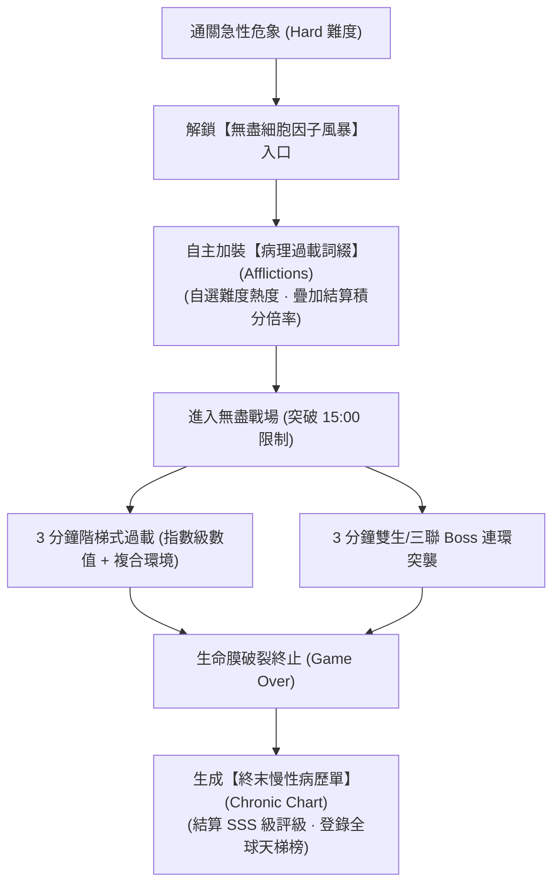

# 《Project: Phagocyte》終局系統：無盡細胞因子風暴模式規格書 (End Game: Endless Cytokine Storm Mode)

---

## 1. 終局願景：極限 Build 的終極試煉場

在常規 15 分鐘關卡全部通關後，玩家往往面臨「Build 成型後無處施展、全破後不知道能幹嘛」的長草痛點。

《Phagocyte》設計了專屬的終局機制——**【全身性細胞因子風暴無盡模式（Endless Cytokine Storm Overdrive）】**。本模式定位為硬核玩家測試極限配裝、挑戰操作上限與全球衝榜的終極舞台。

---

## 2. 解鎖條件與世界觀包裝

- **解鎖條件**：通關任意器官地圖的「急性危象（Hard 難度）」，達成成就【創口清道夫：膿毒終結】（`wound_hard_clear`）。
- **生物學世界觀**：
  - *臨床診斷*：`【慢性重症感染 · 不可逆全身性細胞因子風暴 (CRS)】`。
  - 宿主雖然在局部病灶抵禦了最初 15 分鐘的急性入侵，但促炎因子（TNF-$\alpha$、IL-6）大量失控入血。全體器官進入持續高熱過載狀態，白血球必須在不可逆的生理崩潰前盡可能多地清除病原體，延緩多器官衰竭。

---

## 3. 無盡核心機制 (Core Endless Mechanics)

### 3.1 無上限時間軸 (Uncapped Timeline)
- 進入無盡模式後，計時器跨過 15:00 不會強制結算，而是轉為燃燒的暗金螢光色繼續推進（`15:01`、`18:00`、`24:00`、`30:00+`），直至玩家生命值歸零。

### 3.2 3 分鐘指數級過載階梯 (3-Min Overdrive Escalation)
每 3 分鐘為一個過載週期，全場難度階梯式暴增：

| 存活時長 | 怪物血量修正 | 怪物移速修正 | 複合器官環境異變事件 |
| :--- | :--- | :--- | :--- |
| **15:00～18:00** | $+50\%$ | $+15\%$ | 組織液吸力加劇，地面隨機出現血纖維蛋白黏網。 |
| **18:00～21:00** | $+120\%$ | $+30\%$ | 呼吸風暴強烈剪切流襲來，週期性產生劇烈推力。 |
| **21:00～24:00** | $+220\%$ | $+50\%$ | 膽汁酸水解流席捲，週期性破除全場護甲 3 秒。 |
| **24:00～27:00** | $+360\%$ | $+70\%$ | 胃酸潮湧酸蝕爆發，場景可安全游動區域大幅縮減。 |
| **27:00+ (終末極限)** | 指數級無上限增長 | 移速達上限 (+100%) | **雙器官複合環境**（如呼吸剪切流 ＋ 胃酸潮湧同時存在）。 |

### 3.3 連環雙生/三聯 Boss 突襲 (Multi-Boss Incursions)
- 在 `18:00`、`21:00`、`24:00` 等每個 3 分鐘整點，系統將跨地圖隨機抽取 **雙生 Boss（2 隻不同器官的原發 Boss 同場出現）**！
- 在 `30:00+` 的極限階段，將直接遭遇 **三聯原發 Boss 群體圍攻**，極度考驗滿配超武的瞬間爆發與走位微操。

### 3.4 無盡同屏上限與動態擊殺通量 (Endless Screen Cap & Kill-Driven Loop)
- **無盡同屏上限擴展**：無盡模式同屏活躍怪物上限提升至 **500 隻**（`MAX_ACTIVE_ENDLESS = 500`）。
- **「通量 vs 血量膨脹」博弈**：
  - 前期（15:00～21:00）：滿配超武瞬秒病原體，缺額即刻補滿，形成「殺得越快生得越快」的極限割草漩渦，KPM 與 ATP 瘋狂飆升。
  - 後期（24:00+）：怪物血量指數級膨脹 $+360\%+$，玩家清怪速度逐漸跟不上回補速度，怪物開始長時間佔據 500 隻同屏上限，形成巨大的物理與彈道包圍網，直至胞膜破裂。
- 這使全球排行榜不再是單純「堆肉裝繞圈苟活比時間」，而是必須在「極限輸出清怪衝分數」與「保命生存」之間取得完美平衡。

---

## 4. 自選病理過載詞綴系統 (Pathological Afflictions / Risk Modifiers)

借鑑《Hades》熱度契約與《PoE》地圖詞綴理念，玩家進入無盡模式前，可自主勾選病理負面詞綴：

| 詞綴名稱 | 生物學機制 | 負面懲罰效果 | 衝榜積分倍率 |
| :--- | :--- | :--- | :--- |
| **【高熱驚厥】** | 宿主核心體溫持續 $>41^\circ\text{C}$ | 玩家細胞每 5 秒承受最大生命 2% 的環境灼傷。 | $+25\%$ |
| **【內毒素血症】** | 血液遍布革蘭氏陰性菌 LPS | 受到的一切病原體碰撞傷害增加 $+50\%$。 | $+30\%$ |
| **【自噬衰竭】** | 溶酶體酵素耗盡，無法自愈 | 全域通用屬性 `health_regen` 強制歸零（無法自然回血）。 | $+40\%$ |
| **【微管硬化】** | 骨架微絲聚合受阻 | 禁止翻滾閃避（Dodge Roll）。 | $+35\%$ |
| **【抗原全漂移】** | 病毒突變頻率超頻 | 全場病原體每 20 秒強制重置一次所有特異性易傷標記。 | $+20\%$ |
| **【極限黏滯】** | 血液濃縮高凝狀態 | 玩家基礎移動速度降低 $-25\%$。 | $+25\%$ |

> [!TIP]
> 玩家可自由疊加多個詞綴，總積分倍率為累加計算（最高可達 $+175\%$ 積分加成），激勵頂級玩家挑戰極限。

---

## 5. 終局追求與榮譽殿堂 (Endless Rewards & Hall of Fame)

1. **終末慢性病歷單 (Chronic Pathology Chart)**：
   - 專屬的金色全息病歷外觀，詳細記錄本次挑戰所勾選的詞綴、存活時長、超武配裝與總擊殺數（Kills）。
   - 結算評級開放最高 **Rank SSS（超載神話）** 與 **Rank EX（破格存在）**。
2. **微管天賦重鑄結晶 (Cytoskeleton Catalysts)**：
   - 無盡模式結算依據存活時長，獎勵微管重鑄道具，可用於在天賦星盤中解鎖專屬的傳奇螢光外觀塗裝與粒子拖尾。
3. **Steam 全球微觀天梯榜 (Global Leaderboards)**：
   - 接入 Steamworks 排行榜，即時展示全球玩家在無盡模式下的最高存活時長與積分排名。
