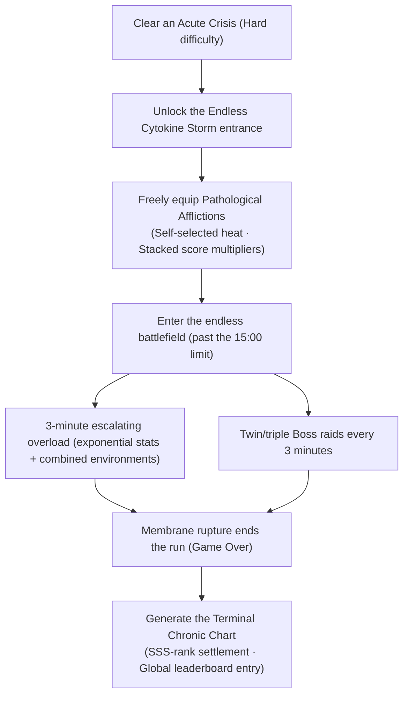

# Project: Phagocyte — Endgame System: Endless Cytokine Storm Mode (End Game: Endless Cytokine Storm Mode)

---

## 1. Endgame Vision: The Ultimate Proving Ground for Extreme Builds

After clearing all standard 15-minute stages, players often hit the dried-up content slump of "my build is complete but has nowhere to shine — nothing left to do after 100%."

*Phagocyte* answers with a dedicated endgame — **[Systemic Cytokine Storm Endless Mode (Endless Cytokine Storm Overdrive)]**. This mode is the ultimate stage for hardcore players to test extreme loadouts, push execution ceilings, and climb the global leaderboards.

```mermaid
flowchart TD
    A["Clear an Acute Crisis (Hard difficulty)"] --> B["Unlock the Endless Cytokine Storm entrance"]
    B --> C["Freely equip Pathological Afflictions<br>(Self-selected heat · Stacked score multipliers)"]
    C --> D["Enter the endless battlefield (past the 15:00 limit)"]
    D --> E["3-minute escalating overload (exponential stats + combined environments)"]
    D --> F["Twin/triple Boss raids every 3 minutes"]
    E & F --> G["Membrane rupture ends the run (Game Over)"]
    G --> H["Generate the Terminal Chronic Chart<br>(SSS-rank settlement · Global leaderboard entry)"]
```

---

## 2. Unlock Conditions and Worldbuilding

- **Unlock condition**: clear any organ map's "Acute Crisis (Hard difficulty)", earning the achievement [Wound Scavenger: Septic Finale] (`wound_hard_clear`).
- **Biological framing**:
  - *Clinical diagnosis*: `[Chronic severe infection · Irreversible systemic cytokine storm (CRS)]`.
  - Although the host survived the first 15 minutes of acute invasion at the local lesion, pro-inflammatory factors (TNF-$\alpha$, IL-6) have flooded the blood out of control. All organs enter a sustained hyperpyretic overload state, and white blood cells must clear as many pathogens as possible before irreversible physiological collapse, delaying multi-organ failure.

---

## 3. Endless Core Mechanics (Core Endless Mechanics)

### 3.1 Uncapped Timeline
- Entering endless mode, the timer sails past 15:00 without forcing settlement, switching to a burning dark-gold fluorescent look as it keeps climbing (`15:01`, `18:00`, `24:00`, `30:00+`) until player HP hits zero.

### 3.2 3-Minute Exponential Overload Ladder (3-Min Overdrive Escalation)
Every 3 minutes form one overload cycle, with difficulty spiking stepwise across the whole field:

| Survival Time | Monster HP Modifier | Monster Speed Modifier | Combined Organ Environment Events |
| :--- | :--- | :--- | :--- |
| **15:00-18:00** | $+50\%$ | $+15\%$ | Fibrin sticky webs appear randomly on the ground. |
| **18:00-21:00** | $+120\%$ | $+30\%$ | Cross-organ twin Boss raids unfold in full. |
| **21:00-24:00** | $+220\%$ | $+50\%$ | Bile-acid hydrolysis sweeps through, periodically stripping all armor field-wide for 3 seconds. |
| **24:00-27:00** | $+360\%$ | $+70\%$ | Gastric-acid surges erupt, drastically shrinking the safely swimmable area. |
| **27:00+ (terminal extreme)** | Exponential uncapped growth | Speed capped (+100%) | **Dual-organ combined environments** (e.g., bile-acid hydrolysis + gastric-acid surge active simultaneously). |

### 3.3 Chained Twin/Triple Boss Raids (Multi-Boss Incursions)
- At each 3-minute mark (`18:00`, `21:00`, `24:00`, ...), the system randomly draws **twin Bosses (2 primary Bosses from different organs on the field together)** from across maps!
- Past `30:00+` in the extreme phase, **triple primary-Boss packs** besiege the player directly, brutally testing maxed-out super-weapon burst and positioning micro-skills.

### 3.4 Endless Screen Cap and Kill-Driven Loop (Endless Screen Cap & Kill-Driven Loop)
- **Expanded endless screen cap**: endless mode raises the active-monster cap to **500** (`MAX_ACTIVE_ENDLESS = 500`).
- **"Throughput vs. HP inflation" gamble**:
  - Early (15:00-21:00): maxed super-weapons instantly vaporize pathogens and vacancies refill immediately, forming an extreme mowing vortex of "the faster you kill, the faster they spawn", with KPM and ATP skyrocketing.
  - Late (24:00+): monster HP inflates exponentially ($+360\%+$), player clear speed gradually falls behind the respawn rate, and monsters start permanently occupying the 500-entity screen cap, forming a giant physical and ballistic encirclement until the membrane ruptures.
- This keeps the global leaderboard from degenerating into "stack bulk, kite in circles, compare survival time" — instead it demands a perfect balance between "extreme-DPS clear for score" and "staying alive".

---

## 4. Optional Pathological Affliction System (Pathological Afflictions / Risk Modifiers)

Borrowing from *Hades* heat pacts and *PoE* map affixes, players freely tick pathological debuffs before entering endless mode:

| Affliction Name | Biological Mechanism | Debuff Effect | Leaderboard Score Multiplier |
| :--- | :--- | :--- | :--- |
| **[Febrile Seizure]** | Host core temperature stays $>41^\circ\text{C}$ | Player cells take ambient burn equal to 2% of max HP every 5 seconds. | $+25\%$ |
| **[Endotoxemia]** | Blood saturated with Gram-negative LPS | All damage taken increased by $+50\%$. | $+30\%$ |
| **[Autophagy Failure]** | Lysosomal enzymes exhausted, no self-repair | Universal `health_regen` forced to zero (no natural healing). | $+40\%$ |
| **[Microtubule Rigidity]** | Cytoskeletal filament polymerization blocked | Dodge Roll forbidden. | $+35\%$ |
| **[Total Antigenic Drift]** | Viral mutation rate overclocked | All targeted vulnerability marks field-wide forcibly reset every 20 seconds. | $+20\%$ |
| **[Extreme Viscosity]** | Hemoconcentrated hypercoagulable blood | Player base move speed reduced by $-25\%$. | $+25\%$ |

> [!TIP]
> Players may stack multiple afflictions freely; total score multiplier sums additively (up to $+175\%$ bonus), tempting top players to challenge the limit.

---

## 5. Endgame Pursuits and Hall of Fame (Endless Rewards & Hall of Fame)

1. **Terminal Chronic Chart (Chronic Pathology Chart)**:
   - Exclusive golden holographic chart look, recording the afflictions ticked, survival time, super-weapon loadout, and total kills for the run.
   - Settlement ratings unlock the top **Rank SSS (Overload Mythic)** and **Rank EX (Anomalous Existence)**.
2. **Cytoskeleton Recast Catalysts (Cytoskeleton Catalysts)**:
   - Endless settlement awards microtubule-recast items based on survival time, redeemable on the talent tree for exclusive legendary fluorescent paint jobs and particle trails.
3. **Steam Global Micro Leaderboards (Global Leaderboards)**:
   - Plugged into Steamworks leaderboards, showing every player's best endless survival time and score ranking worldwide in real time.
