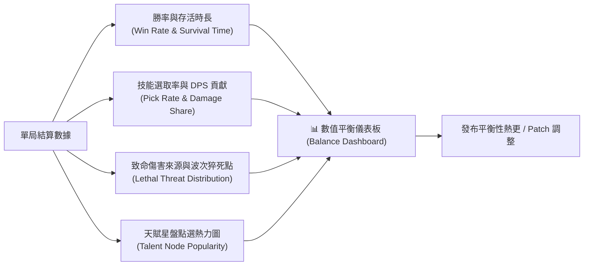

# 《Project: Phagocyte》臨床異常反饋、Bug 診斷與數值平衡遙測規格書 (Feedback, Diagnostics & Telemetry System)

---

## 1. 系統願景與設計使命

為了確保《Project: Phagocyte》在 Steam 搶先體驗（Early Access）及後續版本更新中具備極速排查故障、維持數值動態平衡的能力，遊戲設計了專屬的**【顯微鏡臨床異常診斷與反饋系統（Clinical Diagnostics & Incident Reporting Protocol）】**。

本系統兼負兩大核心使命：
1. **極速排查與確定性重現 (Zero-Friction Debugging)**：玩家在戰鬥中遭遇任何異常（如碰撞穿模、邏輯卡死、技能失效、崩潰），均可一鍵生成「戰鬥現場快照（包含隨機種子 RNG Seed、技能配裝、當前受力、記憶體與近期日誌）」，讓開發者能 100% 精確重現 Bug。
2. **客觀數據驅動平衡 (Data-Driven Balance Tuning)**：透過非侵入式匿名遙測，追蹤五大白血球勝率、技能選取率/DPS 貢獻比、死亡時間熱點與傷害來源 Top 5，為後續版本數值微調與超武重構提供堅實的統計依據。

```mermaid
flowchart TD
    subgraph Trigger [觸發途徑]
        F8["遊戲內快捷鍵 (F8 / 暫停選單)"]
        Crash["未捕獲異常 / 遊戲崩潰攔截"]
        RunEnd["單局戰鬥自然結算 (Victory / SIRS)"]
    end

    subgraph Collector [診斷快照採集器 (DiagnosticManager)]
        Seed["確定性 RNG 種子 + 戰鬥時長"]
        Build["當前裝備主被動技能 + 超武 + 等級"]
        World["器官地圖 + 活躍怪物數 + 玩家坐標/流體力學"]
        Sys["硬體規格 + FPS + 記憶體 + 環形錯誤日誌 (200行)"]
        Shot["顯微鏡畫面輕量截圖 (可選)"]
    end

    subgraph Pipeline [傳輸與導出管道]
        Online["線上 Webhook / REST API<br>(Discord 報警頻道 / GitHub Issues)"]
        Offline["本地離線導出 / 剪貼簿代碼<br>(user://reports/*.json)"]
        Telemetry["匿名數值遙測伺服器<br>(技能選取率 · 猝死熱點)"]
    end

    F8 --> Collector
    Crash --> Collector
    Collector --> Online & Offline
    RunEnd --> Telemetry
```

---

## 2. 玩家前台：一鍵反饋與異常上報介面 (Incident Report Dialog)

### 2.1 呼出途徑與體驗原則
- **呼出方式**：
  - 戰鬥中或選單中按下快捷鍵 **`F8`**。
  - 暫停選單（`Esc`）右上角顯著按鈕：`【臨床異常報告 (Report Incident)】`。
  - 發生未捕獲異常崩潰時，觸發安全沙盒視窗自動彈出。
- **體驗原則**：
  - **自動暫停戰鬥**：彈出反饋面板時遊戲底層自動暫停（`GetTree().Paused = true`），避免玩家因填寫回報而在戰鬥中死亡。
  - **3 秒即可提交**：無需強制填寫長篇大論，點擊分類標籤 ＋ 點擊「提交」即可完成。

### 2.2 反饋表單內容結構
介面包裝為一張具微觀科幻感的「臨床生化異常送檢單」：

| 欄位名稱 | 輸入形式 | 選項與用途說明 |
| :--- | :--- | :--- |
| **異常類型 (Category)** | 四選一按鈕 | 1. 🐞 **【機能異常 / Bug】**：穿模卡死、技能不造成傷害、邏輯崩潰、數值溢出。<br>2. ⚖️ **【數值平衡 / Balance】**：某技能過弱/超模、某波次猝死率反人類、器官流體過苛。<br>3. 💡 **【體驗建議 / Suggestion】**：UI 遮擋、螢光特效刺眼、音效打擊感、操作手感。<br>4. 🌐 **【文案勘誤 / Text】**：醫學術語不專業、翻譯超框、語法錯誤。 |
| **玩家描述 (Description)** | 多行文本框 (可選填) | 預設提示：「簡述發生了什麼（例如：在肺泡吸氣時使用偽足突刺穿出了邊界...）」。 |
| **聯絡方式 (Contact)** | 單行輸入 (可選填) | 供願意協助跟進測試的玩家留下 Discord ID、Steam ID 或 Email。 |
| **自動快照附件 (Attachments)** | 勾選框（預設全開） | - `[x]` **戰鬥即時快照**（種子碼、配裝、細胞狀態、環境參數）。<br>- `[x]` **當前顯微鏡畫面截圖**（壓縮為輕量 JPEG，自動遮蔽敏感帳號資訊）。<br>- `[x]` **近期診斷日誌**（最近 200 條系統警告與錯誤堆疊）。 |

---

## 3. 戰鬥快照數據模型 (Battlefield Context Snapshot Schema)

點擊提交或崩潰攔截時，`DiagnosticManager` 在毫秒級生成標準結構化 JSON 封包：

```json
{
  "report_id": "INCIDENT-20260918-7F3A",
  "category": "bug",
  "user_description": "在肺泡地圖 06:00 蜂擁潮被病毒包圍時，使用偽足突刺被卡在邊界外無法動彈。",
  "contact": "discord:researcher_zelin",
  "timestamp": 1789725600,

  "run_context": {
    "seed": 4829104817,
    "game_time_seconds": 362.4,
    "game_time_formatted": "06:02.4",
    "map_id": "alveolar_space",
    "difficulty": "hard",
    "cell_class": "macrophage",
    "level": 24,
    "current_hp": 85.0,
    "max_hp": 160.0,
    "current_atp": 142,
    "active_pathogen_count": 448,
    "screen_cap": 450,
    "kpm": 184.2,
    "player_position": { "x": 1280.5, "y": -42.0 },
    "player_velocity": { "x": 0.0, "y": 0.0 },
    "active_skills": [
      { "id": "pseudopod_lunge", "level": 5, "evolved": false, "total_damage": 34800, "dps": 96.1 },
      { "id": "phagocytic_vacuole", "level": 4, "evolved": false, "total_damage": 52100, "dps": 143.9 },
      { "id": "reactive_oxygen", "level": 6, "evolved": false, "total_damage": 78900, "dps": 217.9 }
    ],
    "passive_skills": [
      { "id": "atp_synthase", "level": 5 },
      { "id": "membrane_fluidity", "level": 3 }
    ],
    "recent_damage_taken_log": [
      { "time": 361.2, "source": "s_virus", "amount": 18.0, "type": "physical" },
      { "time": 361.8, "source": "s_virus", "amount": 18.0, "type": "physical" }
    ]
  },

  "engine_context": {
    "godot_version": "4.3.stable.mono",
    "os": "macOS 15.0",
    "gpu": "Apple M3 Max",
    "screen_resolution": "2560x1440",
    "display_mode": "fullscreen",
    "fps": 59.8,
    "process_time_ms": 16.7,
    "memory_static_mb": 148.2
  },

  "log_ring_buffer": [
    "[WARN] [PathogenSpawner] Active count near cap (448/450)",
    "[ERR] [Macrophage] Position out of bounds: (1280.5, -42.0), clamp triggered"
  ]
}
```

> [!IMPORTANT]
> **確定性種子重現（Deterministic Seed Reproduction）**：
> 開發者只要將此快照中的 `seed: 4829104817` 與 `map_id` 輸入開發者控制台，即可生成與玩家遭遇完全相同的地圖亂數、道具掉落與波次排列，極大縮減排查時間！

---

## 4. 數據傳輸管道與隱私架構 (Submission Pipelines & Privacy)

### 4.1 雙軌傳輸架構
1. **線上極速直連 (Online Webhook / REST)**：
   - 預設對接開發團隊的 **Discord 專用診斷頻道 Webhook** 或 **GitHub Issues API**。
   - 收到反饋時，開發頻道會即時收到美化 Embed 卡片，包含 Bug 標題、戰鬥時間、技能組合，並直接附帶截圖與快照 `.json`。
2. **本地離線導出與剪貼簿 (Offline Export & Clipboard Fallback)**：
   - 當無網路連線或 Webhook 失敗時，快照自動保存至本地：
     `user://reports/incident_YYYYMMDD_HHMMSS.json`
   - 介面提供按鈕：`【一鍵複製診斷代碼至剪貼簿】`，生成一段 Base64 壓縮字串，玩家可直接貼至 Steam 社群討論區、巴哈姆特或官方 QQ/Discord 反饋帖。

### 4.2 隱私合規與匿名安全 (Privacy & Anonymity)
- **零 PII 收集**：嚴格禁止採集任何玩家的真實姓名、IP 地址、本機檔案夾內容或硬體 MAC 地址。
- **路徑去敏感化**：錯誤日誌中若出現使用者路徑（例如 `/Users/your_name/...` 或 `C:\Users\Admin\...`），自動過濾替換為 `[REDACTED_USER_PATH]`。
- **隱私開關**：遊戲「設定（Settings）」中提供開關：`【允許傳送匿名遊戲診斷數據】`，玩家可隨時關閉線上遙測。

---

## 5. 數值平衡匿名遙測體系 (Game Telemetry for Live Balance)

在玩家每局戰鬥結束（無論是通關、SIRS 陣亡、或無盡模式終止）時，系統發送一條輕量級單局摘要（$<2\text{KB}$），用於長期版本數值調優：



### 5.1 關鍵平衡監控指標 (Core Balancing KPIs)
1. **技能與超武健康度 (Skill Matrix Health)**：
   - **選取率 (Pick Rate)**：技能出現在升級 3 選 1 中的次數 vs 被選中的次數。
     - *預警線*：某技能選取率 $< 5\%$（代表機制下水道，需加強）；某技能選取率 $> 85\%$（代表過於超模，需削弱或提升競品強度）。
   - **傷害貢獻率 (DPS Share)**：結算時各技能佔總傷害的百分比。
2. **白血球角色出場率與勝率 (Cell Class Balance)**：
   - 五大細胞（巨噬、CTL、嗜中性、B細胞、樹突）在各器官關卡的通關率矩陣。
   - 確保不會出現「某單一細胞無腦通關全地圖，其他細胞難以存活」的嚴重失衡。
3. **猝死熱點時間分布 (Mortality Time Distribution)**：
   - 繪製死亡時間曲線。若在 `06:00`（初次小蜂擁）或 `09:00`（次級領主）出現斷崖式死亡高峰（超過 40% 玩家在此時陣亡），說明波次難度曲線斷層，需平滑過渡數值。
4. **致命元兇排行 (Top Lethal Culprits)**：
   - 記錄造成玩家最後一擊破膜致死的病原體或環境傷害來源。
   - 避免某種怪物的隱形彈道或高傷機制成為玩家的挫敗感黑洞。

---

## 6. 開發者內建調試工具箱 (In-Engine Developer Console / GM Tools)

為了讓團隊在日常研發與 QA 測試中能極速驗證機制與數值，遊戲內置了顯微鏡調試控制台：

### 6.1 啟用與呼出
- 呼出按鍵：**`~` (波浪鍵)** 或 **`F1`**。
- 權限控制：僅在 `OS.IsDebugBuild()` 為真、或使用命令列參數 `--enable-debug-console` 啟動時可用。正式 Release 導出包中預設剝離或鎖死。

### 6.2 常用 GM 指令表
| 指令語法 | 參數說明 | 研發用途 |
| :--- | :--- | :--- |
| `god` | 無 | 切換無敵模式（生命值不扣除），用於長週期波次觀察。 |
| `time_scale <val>` | 浮點數（如 `0.2`、`2.0`、`5.0`） | 調整引擎時間縮放。極速快轉或慢動作排查碰撞判定。 |
| `wave_jump <mm:ss>` | 時間字串（如 `08:50`） | 直接將關卡時間軸跳轉至指定時間，極速測試 Boss 或蜂擁大潮。 |
| `spawn <id> [count]` | 病原體 ID、數量 | 在滑鼠游標處生成指定病原體（如 `spawn mrsa 1`）。 |
| `give_skill <id> [lv]` | 技能 ID、目標等級 | 強制獲得或升級指定技能，極速驗證超武合成。 |
| `give_tp <count>` | 整數天賦點 | 直接發放微管天賦點，快速點滿星盤測試極限屬性。 |
| `kill_all` | 無 | 瞬間清空全場活躍病原體，重置同屏上限回補循環。 |
| `dump_state` | 無 | 立即在終端與本地生成當前戰況 JSON 快照。 |

### 6.3 實時診斷 HUD 懸浮窗 (Debug Overlay)
開啟時在畫面左上角繪製半透明極簡監控數據：
- `FPS / FrameTime`: `60.0 fps (16.6ms)`
- `Active Monsters`: `284 / 300 (Deficit: 16)`
- `Player Phagocytic KPM`: `215.4`
- `Fluid Forces Vector`: `(X: +16.0, Y: +10.0)`
- `Current Seed`: `4829104817`
- `Memory Static / Peak`: `142 MB / 185 MB`

---

## 7. 程式碼與架構對接規劃 (Architecture Mapping)

後續進入程式碼實作階段時，本系統將由以下 4 個核心腳本構成（均置於非破壞性架構下）：

```
scripts/
├── core/
│   ├── DiagnosticManager.cs     # 負責生成快照 JSON、管理 200 行環形日誌緩存、捕獲崩潰異常
│   └── TelemetryService.cs      # 負責發送匿名結算摘要、統計 KPI 指標、Discord Webhook 通訊
└── ui/
    ├── IncidentReportDialog.cs  # F8 彈出的一鍵回報 UI 表單、截圖合成、剪貼簿代碼生成
    └── DebugConsole.cs          # ~ 鍵呼出的 GM 指令列與左上角診斷 HUD 懸浮窗
```
