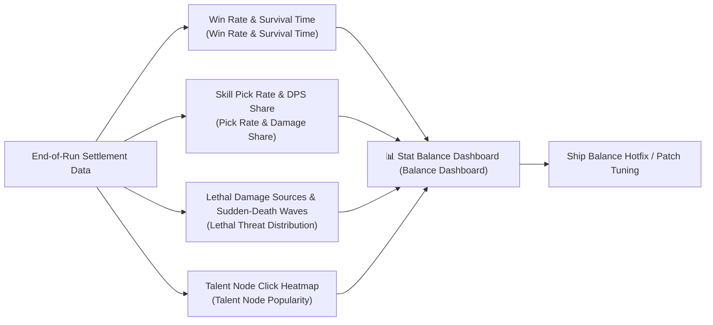

# Project: Phagocyte Clinical Incident Feedback, Bug Diagnostics & Stat Balance Telemetry Specification (Feedback, Diagnostics & Telemetry System)

---

## 1. System Vision and Design Mission

To guarantee fast fault triage and live stat balance throughout Steam Early Access and subsequent updates, the game includes a dedicated **[Microscopic Clinical Incident Diagnostics & Feedback System (Clinical Diagnostics & Incident Reporting Protocol)]**.

This system serves two core missions:
1. **Fast Triage and Deterministic Reproduction (Zero-Friction Debugging)**: whenever players hit any anomaly in combat (collision clipping, logic soft-locks, dead skills, crashes), they can generate a "battlefield snapshot (including the RNG seed, skill loadout, current forces, memory stats, and recent logs)" with one click, letting developers reproduce the bug with 100% precision.
2. **Objective Data-Driven Balance Tuning**: through non-invasive anonymous telemetry, track the win rates of the five white blood cells, skill pick rates / DPS contribution shares, death-time hotspots, and top-5 damage sources, providing a solid statistical basis for later stat tuning and super-weapon reworks.

```mermaid
flowchart TD
    subgraph Trigger [Trigger Paths]
        F8["In-Game Hotkey (F8 / Pause Menu)"]
        Crash["Uncaught Exception / Crash Intercept"]
        RunEnd["Natural End-of-Run Settlement (Victory / SIRS)"]
    end

    subgraph Collector [Diagnostic Snapshot Collector (DiagnosticManager)]
        Seed["Deterministic RNG Seed + Combat Duration"]
        Build["Current Active/Passive Skills + Super-Weapons + Level"]
        World["Organ Map + Active Monster Count + Player Position/Fluid Dynamics"]
        Sys["Hardware Specs + FPS + Memory + Ring Error Log (200 lines)"]
        Shot["Lightweight Microscope Screenshot (Optional)"]
    end

    subgraph Pipeline [Transport and Export Pipeline]
        Online["Online Webhook / REST API<br>(Discord Alert Channel / GitHub Issues)"]
        Offline["Local Offline Export / Clipboard Code<br>(user://reports/*.json)"]
        Telemetry["Anonymous Stat Telemetry Server<br>(skill pick rates · sudden-death hotspots)"]
    end

    F8 --> Collector
    Crash --> Collector
    Collector --> Online & Offline
    RunEnd --> Telemetry
```

---

## 2. Player-Facing One-Click Feedback and Incident Reporting UI (Incident Report Dialog)

### 2.1 Invocation Paths and Experience Principles
- **Invocation**:
  - Press the hotkey **`F8`** during combat or in menus.
  - Prominent button in the top-right of the pause menu (`Esc`): `[Report Incident]`.
  - When an uncaught exception crashes the game, a safe sandbox window pops up automatically.
- **Experience principles**:
  - **Auto-pause combat**: the underlying game pauses automatically (`GetTree().Paused = true`) while the feedback panel is open, so players never die mid-combat just for filing a report.
  - **Submit in 3 seconds**: no mandatory essays; one category tag plus one "Submit" click completes the report.

### 2.2 Feedback Form Structure
The UI is skinned as a micro-sci-fi "clinical biochemical anomaly submission form":

| Field Name | Input Type | Options and Usage Notes |
| :--- | :--- | :--- |
| **Incident Type (Category)** | Four-option buttons | 1. 🐞 **[Malfunction / Bug]**: clipping and soft-locks, skills dealing no damage, logic crashes, stat overflow.<br>2. ⚖️ **[Stat Balance / Balance]**: an underpowered/overpowered skill, inhuman sudden-death rates on some wave, overly punishing organ fluids.<br>3. 💡 **[Experience Suggestion / Suggestion]**: UI occlusion, glaring fluorescent effects, audio hit feedback, control feel.<br>4. 🌐 **[Text Correction / Text]**: unprofessional medical terminology, overflowing translations, grammar errors. |
| **Player Description (Description)** | Multi-line textbox (optional) | Default hint: "Briefly describe what happened (e.g. Pseudopod Lunge carried me out of bounds while inhaling on the alveolar map...)". |
| **Contact (Contact)** | Single-line input (optional) | For players willing to help follow-up testing: leave a Discord ID, Steam ID, or Email. |
| **Auto Snapshot Attachments (Attachments)** | Checkboxes (all on by default) | - `[x]` **Live combat snapshot** (seed code, loadout, cell state, environment parameters).<br>- `[x]` **Current microscope screenshot** (compressed to lightweight JPEG, automatically masking sensitive account info).<br>- `[x]` **Recent diagnostic logs** (latest 200 system warnings and error stacks). |

---

## 3. Battlefield Context Snapshot Data Model (Battlefield Context Snapshot Schema)

On submit or crash intercept, `DiagnosticManager` generates a standard structured JSON packet within milliseconds:

```json
{
  "report_id": "INCIDENT-20260918-7F3A",
  "category": "bug",
  "user_description": "During the 06:00 swarm tide on the alveolar map, I was surrounded by viruses and Pseudopod Lunge left me stuck outside the boundary, unable to move.",
  "contact": "discord:researcher_zelin",
  "timestamp": 1789725600,

  "run_context": {
    "seed": 4829104817,
    "game_time_seconds": 362.4,
    "game_time_formatted": "06:02.4",
    "stage_id": "alveolar_space",
    "difficulty": "hard",
    "cell_class": "macrophage",
    "level": 24,
    "current_hp": 85.0,
    "max_hp": 160.0,
    "current_atp": 142,
    "active_pathogen_count": 448,
    "screen_cap": 450,
    "kpm": 184.2,
    "player_position": { "x": 1280.5, "y": -42.0 },
    "player_velocity": { "x": 0.0, "y": 0.0 },
    "active_skills": [
      { "id": "pseudopod_lunge", "level": 5, "evolved": false, "total_damage": 34800, "dps": 96.1 },
      { "id": "phagocytic_vacuole", "level": 4, "evolved": false, "total_damage": 52100, "dps": 143.9 },
      { "id": "reactive_oxygen", "level": 6, "evolved": false, "total_damage": 78900, "dps": 217.9 }
    ],
    "passive_skills": [
      { "id": "atp_synthase", "level": 5 },
      { "id": "membrane_fluidity", "level": 3 }
    ],
    "recent_damage_taken_log": [
      { "time": 361.2, "source": "s_virus", "amount": 18.0, "type": "physical" },
      { "time": 361.8, "source": "s_virus", "amount": 18.0, "type": "physical" }
    ]
  },

  "engine_context": {
    "godot_version": "4.3.stable.mono",
    "os": "macOS 15.0",
    "gpu": "Apple M3 Max",
    "screen_resolution": "2560x1440",
    "display_mode": "fullscreen",
    "fps": 59.8,
    "process_time_ms": 16.7,
    "memory_static_mb": 148.2
  },

  "log_ring_buffer": [
    "[WARN] [PathogenSpawner] Active count near cap (448/450)",
    "[ERR] [Macrophage] Position out of bounds: (1280.5, -42.0), clamp triggered"
  ]
}
```

> [!IMPORTANT]
> **Deterministic Seed Reproduction**:
> Developers only need to feed this snapshot's `seed: 4829104817` and `map_id` into the developer console to regenerate the exact same map RNG, item drops, and wave layout the player hit, drastically cutting triage time!

---

## 4. Data Transport Pipelines and Privacy Architecture (Submission Pipelines & Privacy)

### 4.1 Dual-Track Transport Architecture
1. **Online Fast Direct Link (Online Webhook / REST)**:
   - Connects to the dev team's **dedicated Discord diagnostics channel webhook** or the **GitHub Issues API** by default.
   - On receipt, the dev channel instantly gets a beautified Embed card with the bug title, combat time, and skill loadout, plus the screenshot and snapshot `.json` attached.
2. **Local Offline Export & Clipboard (Offline Export & Clipboard Fallback)**:
   - With no network connection or when the webhook fails, the snapshot is saved locally automatically:
     `user://reports/incident_YYYYMMDD_HHMMSS.json`
   - The UI offers a button: `[Copy Diagnostic Code to Clipboard]`, producing a Base64-compressed string players can paste directly into the Steam community forums, Bahamut, or the official QQ/Discord feedback threads.

### 4.2 Privacy Compliance and Anonymous Safety (Privacy & Anonymity)
- **Zero PII collection**: strictly no collection of player real names, IP addresses, local folder contents, or hardware MAC addresses.
- **Path desensitization**: if error logs contain user paths (e.g. `/Users/your_name/...` or `C:\Users\Admin\...`), they are automatically filtered and replaced with `[REDACTED_USER_PATH]`.
- **Privacy switch**: the game "Settings" screen offers a toggle: `[Allow Sending Anonymous Game Diagnostics]`, which players may switch off at any time to disable online telemetry.

---

## 5. Anonymous Telemetry System for Stat Balance (Game Telemetry for Live Balance)

Whenever a run ends (clear, SIRS death, or Endless-mode termination), the system sends one lightweight end-of-run summary ($<2\text{KB}$) for long-term version tuning:


```mermaid
graph LR
    A["End-of-Run Settlement Data"] --> B["Win Rate & Survival Time<br>(Win Rate & Survival Time)"]
    A --> C["Skill Pick Rate & DPS Share<br>(Pick Rate & Damage Share)"]
    A --> D["Lethal Damage Sources & Sudden-Death Waves<br>(Lethal Threat Distribution)"]
    A --> E["Talent Node Click Heatmap<br>(Talent Node Popularity)"]
    B & C & D & E --> F["📊 Stat Balance Dashboard (Balance Dashboard)"]
    F --> G["Ship Balance Hotfix / Patch Tuning"]
```

### 5.1 Core Balance Monitoring KPIs (Core Balancing KPIs)
1. **Skill & Super-Weapon Health (Skill Matrix Health)**:
   - **Pick Rate**: times a skill appears among the level-up 3-choices vs. times it is picked.
     - *Warning lines*: a skill picked $< 5\%$ of the time (mechanically bottom-tier, needs a buff); a skill picked $> 85\%$ of the time (overpowered, needs a nerf or stronger competitors).
   - **Damage Share (DPS Share)**: each skill's percentage of total damage at settlement.
2. **White Blood Cell Pick Rate & Win Rate (Cell Class Balance)**:
   - Clear-rate matrix of the five cells (Macrophage, CTL, Neutrophil, B cell, dendritic cell) across each organ stage.
   - Ensures no severe imbalance where "one cell mindlessly clears every map while the others can barely survive."
3. **Sudden-Death Time Distribution (Mortality Time Distribution)**:
   - Plot the death-time curve. If cliff-like death spikes appear at `06:00` (first mini-swarm) or `09:00` (secondary boss) with over 40% of players dying there, the wave difficulty curve has a sharp gap and needs smoothing.
4. **Top Lethal Culprits (Top Lethal Culprits)**:
   - Record the pathogen or environmental damage source that dealt the final membrane-breaking blow.
   - Prevents any one monster's invisible projectiles or high-damage mechanic from becoming a frustration black hole.

---

## 6. Built-In Developer Debug Toolbox (In-Engine Developer Console / GM Tools)

For fast mechanism and stat verification during daily R&D and QA testing, the game ships a built-in microscope debug console:

### 6.1 Enabling and Invocation
- Invocation keys: **`~` (tilde)** or **`F1`**.
- Access control: only available when `OS.IsDebugBuild()` is true or when launched with the `--enable-debug-console` command-line flag. Stripped or locked out of official Release exports by default.

### 6.2 Common GM Command Table
| Command Syntax | Parameter Notes | R&D Usage |
| :--- | :--- | :--- |
| `god` | None | Toggle god mode (health never deducted), for observing long wave cycles. |
| `time_scale <val>` | Float (e.g. `0.2`, `2.0`, `5.0`) | Adjust engine time scale. Fast-forward or slow-motion to triage collision resolution. |
| `wave_jump <mm:ss>` | Time string (e.g. `08:50`) | Jump the stage timeline directly to a timestamp, for fast Boss or swarm-tide testing. |
| `spawn <id> [count]` | Pathogen ID, count | Spawn the given pathogen at the mouse cursor (e.g. `spawn mrsa 1`). |
| `give_skill <id> [lv]` | Skill ID, target level | Forcibly grant or level a skill, for fast super-weapon fusion verification. |
| `give_tp <count>` | Integer talent points | Grant microtubule talent points directly, for fast maxed-tree limit-attribute testing. |
| `kill_all` | None | Instantly clear all active pathogens, resetting the on-screen cap refill loop. |
| `dump_state` | None | Immediately emit the current battle-state JSON snapshot to the terminal and disk. |

### 6.3 Live Diagnostics HUD Overlay (Debug Overlay)
When enabled, it draws a translucent minimal monitor readout at the top-left of the screen:
- `FPS / FrameTime`: `60.0 fps (16.6ms)`
- `Active Monsters`: `284 / 300 (Deficit: 16)`
- `Player Phagocytic KPM`: `215.4`
- `Fluid Forces Vector`: `(X: +16.0, Y: +10.0)`
- `Current Seed`: `4829104817`
- `Memory Static / Peak`: `142 MB / 185 MB`

---

## 7. Code and Architecture Mapping (Architecture Mapping)

When this system moves into code implementation, it will consist of the following 4 core scripts (all under the non-breaking architecture):

```
scripts/
├── core/
│   ├── DiagnosticManager.cs     # Generates snapshot JSON, manages the 200-line ring log buffer, captures crash exceptions
│   └── TelemetryService.cs      # Sends anonymous settlement summaries, aggregates KPI metrics, Discord webhook communication
└── ui/
    ├── IncidentReportDialog.cs  # F8 one-click report UI form, screenshot compositing, clipboard code generation
    └── DebugConsole.cs          # ~-key GM command line and top-left diagnostics HUD overlay
```
