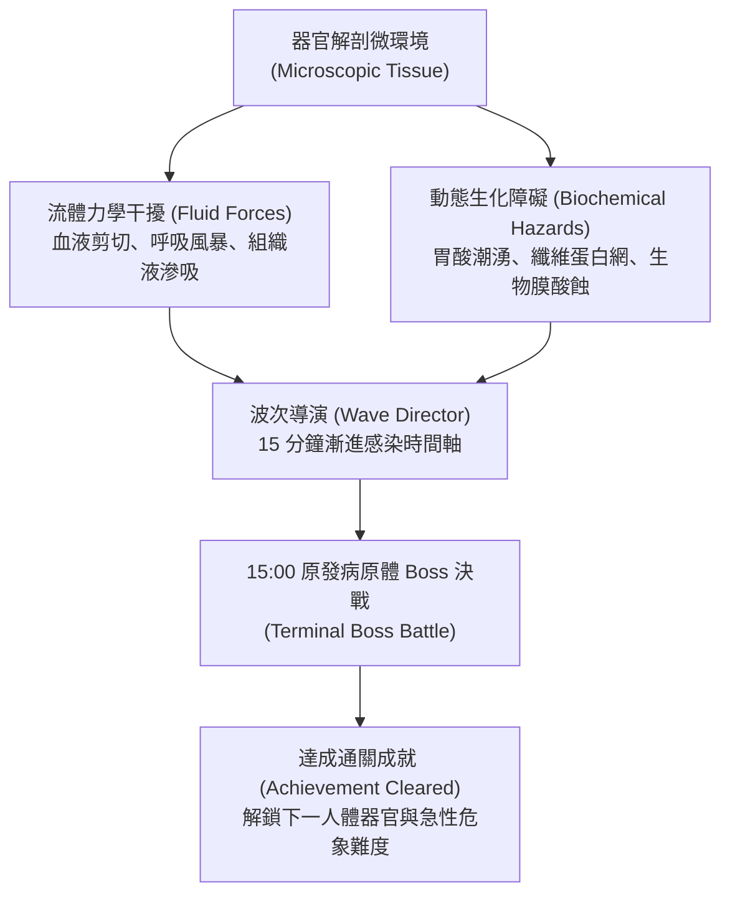

# 《Project: Phagocyte》關卡病理環境、流體力學與波次導演規格書 (Level Environments, Fluid Mechanics & Wave Director)

---

## 1. 關卡設計哲學：人體微觀組織切片

在《Phagocyte》中，關卡絕非靜止的背景貼圖，而是**真實人體器官的微觀病理組織切片**。每個關卡均具備獨特的**流體力學（Fluid Mechanics）**、微環境危害與生理學事件，玩家必須依據流體特徵調整游動軌跡與技能裝配。



---

## 2. 核心規則、難度分級與成就解鎖（雙軌制）

每張地圖均劃分為「常規感染（Normal）」與「急性危象（Hard）」兩種難度。**除初始地圖外，所有後續地圖與高階難度均需透過達成對應的成就里程碑解鎖**：

| 難度等級 | 解鎖條件 (成就系統驅動) | 存活時長 | 怪物數值修正 | 環境事件與流體修正 | 首通獎勵 |
| :--- | :--- | :--- | :--- | :--- | :--- |
| **常規感染<br>(Normal)** | 地圖 01 預設解鎖；<br>後續地圖需達成前置地圖通關成就（如 `ach_wound_clear` 等） | 15:00 決戰 | 基準血量 ($100\%$)、<br>基準跑速 ($100\%$) | 流體衝擊週期平緩，<br>環境障礙分佈稀疏。 | **1 點微管天賦點**<br>(Talent Point) |
| **急性危象<br>(Hard)** | 達成該地圖的 Normal 通關成就後解鎖 | 15:00 決戰 | 怪物血量 $+40\%$、<br>怪物移速 $+20\%$ | 環境危害頻率 $+50\%$、<br>流體推力加劇、毒素污染。 | **1 點微管天賦點**<br>(Talent Point) |

> [!NOTE]
> 通關每張地圖的 Normal 與 Hard 各可獲得 1 點天賦點，全 5 張地圖共可穩定提供 10 點天賦點，作為解鎖造血幹細胞星盤關鍵節點的重要推力。

---

## 3. 五大人體器官關卡詳細規格 (The 5 Organ Stages)

所有關卡定義於 `GameManager.MapData`，並在全息人體掃描儀中定位對應器官：

### 地圖 01：皮下表皮裂口 (`acute_wound`)
- **人體部位**：皮膚與皮下結締組織（全息掃描：`Vector2(0.26, 0.48)`）。
- **解鎖條件**：**預設初始解鎖**（無前置條件）。
- **真實醫學案例**：機械性擦傷導致微血管破裂，外源性化膿細菌伴隨血漿滲出液湧入創口。
- **專屬環境流體力學**：
  - **傷口滲出吸力 (Suction Drift)**：創口破裂處產生持續將實體向右上方拖拽的流體吸力（基準速度向量 `Vector2(16.0, 10.0)`）。
  - **纖維蛋白網阻力 (Fibrin Clots)**：地面生成半透明的血纖維蛋白凝塊。玩家穿過時移速 $-20\%$，但可藉此阻擋敵方遠程投射物。
- **難度分級差異**：
  - *Normal*：吸力平緩，纖維網分佈稀疏。
  - *Hard (膿毒性創口)*：解鎖成就：`ach_wound_clear`。吸力翻倍，纖維網被綠膿桿菌生物膜覆蓋，踏入時每秒受到酸蝕傷害。
- **波次節奏與關鍵威脅**：
  - `05:00` 精英突襲：**凝固酶葡萄球菌團**（自帶小型無敵纖維護盾，需活性氧破盾）。
  - `10:00` 蜂擁潮：**化膿性鏈球菌長鏈**（超長鏈狀高速蛇形穿梭包夾）。
  - `15:00` 決戰 Boss：**耐甲氧西林金葡菌母體 (MRSA Super-Colony)**。巨大耐藥性包囊，被擊破膜後向外分裂為 4 隻高攻暴怒子精英。

---

### 地圖 02：肺泡氣體微腔 (`alveolar_space`)
- **人體部位**：呼吸道終末肺泡氣體交換界面（全息掃描：`Vector2(0.50, 0.28)`）。
- **解鎖條件**：**達成成就【創口閉合：局部穩態】（`ach_wound_clear`）解鎖**。
- **真實醫學案例**：急性呼吸道病毒感染，表面活性物質受損，伴隨劇烈呼吸氣流衝擊。
- **專屬環境流體力學**：
  - **呼吸氣流剪切 (Respiratory Thrust)**：以正弦波週期觸發（基準週期 12 秒）。吸氣時產生持續 3 秒的強烈下推力（`Vector2(0, 35.0)`）；呼氣時產生向上反推力，考驗流體逆流微操。
  - **高氧激發力場 (Hyperoxic Pockets)**：場景漂浮青色高透氧氣泡，進入範圍內玩家線粒體超頻，CDR 暫時 $+25\%$。
- **難度分級差異**：
  - *Normal*：氣流週期規律，高氧氣泡刷新頻繁。
  - *Hard (急性呼吸窘迫 ARDS)*：解鎖成就：`ach_alveolar_clear`。呼吸頻率急促化（週期縮短為 6 秒），氣流推力 $+50\%$，高氧氣泡被炎性滲出液覆蓋失效。
- **波次節奏與關鍵威脅**：
  - `05:00` 精英突襲：**刺突偽裝冠狀病毒**（短距離瞬移突刺並施加減速）。
  - `10:00` 蜂擁潮：**流感病毒微粒暴風**（極高密度、微小碰撞體積，考驗 AOE 清屏能力）。
  - `15:00` 決戰 Boss：**融合性合胞體病毒複合體 (Syncytial Mega-Capsid)**。釋放全屏肺泡牽引纖毛限制走位，強制玩家在縮圈環境下高壓輸出。

---

### 地圖 03：肝血竇微循環 (`hepatic_sinusoid`)
- **人體部位**：肝小葉內皮毛細血管網（全息掃描：`Vector2(0.42, 0.38)`）。
- **解鎖條件**：**達成成就【呼吸暢通：氣血屏障】（`ach_alveolar_clear`）解鎖**。
- **真實醫學案例**：腸源性內毒素與血源性病原體入侵門靜脈，肝臟網狀內皮系統啟動解毒。
- **專屬環境流體力學**：
  - **膽汁酸水解流 (Bile Acid Drift)**：週期性自左向右席捲微量膽鹽水解流，弱化所有實體護甲（Armor 歸零 3 秒）。
  - **內皮窗孔篩選 (Endothelial Fenestrae)**：地面排列微型內皮篩孔，巨化細胞無法穿過，需利用「脫水穿梭」避險突圍。
- **難度分級差異**：
  - *Normal*：膽汁酸流間歇長，解毒代償充足。
  - *Hard (急性肝衰竭)*：解鎖成就：`ach_hepatic_clear`。膽汁酸腐蝕常態化，酸蝕環境每秒扣除最大生命 1%，怪物獲得狂暴吸血特質。
- **波次節奏與關鍵威脅**：
  - `05:00` 精英突襲：**內毒素革蘭氏陰性桿菌**（死亡時釋放廣域敗血性休克震波）。
  - `10:00` 蜂擁潮：**大腸桿菌群菌毯**（分裂增殖極快）。
  - `15:00` 決戰 Boss：**惡性瘧原蟲裂殖複合體 (Plasmodium Macro-Schizont)**。定時吞噬周遭紅血球回復生命，需在分裂前集火斬殺。

---

### 地圖 04：胃腔極酸黏膜 (`gastric_lumen`)
- **人體部位**：胃底腺與胃上皮黏液凝膠層（全息掃描：`Vector2(0.58, 0.40)`）。
- **解鎖條件**：**達成成就【門脈清道夫：解毒重鎮】（`ach_hepatic_clear`）解鎖**。
- **真實醫學案例**：胃黏膜屏障破損，胃酸（pH 1.5～2.0）直接暴露，耐酸性桿菌深層定植。
- **專屬環境流體力學**：
  - **胃酸潮湧 (Acid Surge)**：地面週期性湧起高腐蝕性胃酸潮波，未處於黏液保護區內的實體持續承受強酸 DoT。
  - **中和保護圈 (Neutralization Zones)**：幽門螺桿菌水解尿素生成的局部中和鹼性光環，玩家可借位避難。
- **難度分級差異**：
  - *Normal*：潮湧間隔長，黏液保護圈範圍充裕。
  - *Hard (急性胃穿孔)*：解鎖成就：`ach_gastric_clear`。全場 pH 值常態過酸，黏液保護圈被胃蛋白酶溶解破壞。
- **波次節奏與關鍵威脅**：
  - `05:00` 精英突襲：**鞭毛突刺幽門螺桿菌**（超高速螺旋鑽入胃上皮，附帶穿甲破防）。
  - `10:00` 蜂擁潮：**諾羅病毒顆粒潮**（體积极小、速度極快的大群自爆微粒）。
  - `15:00` 決戰 Boss：**幽門螺桿菌生物膜母核 (H. pylori Biofilm Core)**。釋放強效空泡毒素 VacA，地面留下大片永久強酸爛泥。

---

### 地圖 05：血腦屏障毛細血管 (`blood_brain_barrier`)
- **人體部位**：中樞神經系統微血管網（全息掃描：`Vector2(0.50, 0.11)`）。
- **解鎖條件**：**達成成就【抗酸壁壘：黏膜重構】（`ach_gastric_clear`）解鎖**。
- **真實醫學案例**：嗜神經性病原體或朊病毒突破緊密連接（Tight Junctions），引發急性中樞感染。
- **專屬環境流體力學**：
  - **高剪切流速 (High Shear Stress)**：極窄血管腔導致血流速度極高，玩家必須頻繁抵抗流體衝力，否則會被沖向外緣邊界。
  - **星形膠質腳突阻滯 (Astrocyte End-feet)**：場景中不規則伸出膠質突起，形成迷宮般的狹窄通道。
- **難度分級差異**：
  - *Normal*：管腔寬敞，血流脈衝規律。
  - *Hard (急性腦膜腦炎)*：解鎖成就：`ach_bbb_clear`。神經遞質狂暴紊亂，玩家移動方向隨機受到神經電脈衝干擾，精英怪物獲得隱形潛行能力。
- **波次節奏與關鍵威脅**：
  - `05:00` 精英突襲：**狂犬病毒逆行微粒**（沿神經突觸高速彈射瞬移）。
  - `10:00` 蜂擁潮：**水痘帶狀疱疹病毒簇**（潛伏於通道盲區，靠近時集體突發開火）。
  - `15:00` 決戰 Boss：**錯誤折疊朊病毒晶體 (PrPsc Amyloid Aggregate)**。無法被常規免疫武器消化，必須利用過載活性氧或巨噬破膜連續擊碎其結晶外殼。

---

## 4. 戰鬥波次導演系統 (Wave & Spawn Director)

所有關卡均遵循 **15 分鐘漸進式病理時間軸**，由 `PathogenSpawner.cs` 全自動調度：

```mermaid
timeline
    title 15 分鐘標準感染波次時間軸
    00:00 - 02:30 : 早期侵入期 (Phase 1) : 單體散兵 (葡萄球菌、諾羅、大腸桿菌)
    02:30 - 05:00 : 局部炎症期 (Phase 2) : 怪物密度 +50%，05:00 第一隻精英突襲
    05:00 - 07:30 : 組織擴散期 (Phase 2) : 出現中階病原體 (結核桿菌、假單胞菌、念珠菌)
    07:30 - 10:00 : 蜂擁潮爆發 (Phase 3) : 10:00 全屏蜂擁潮 (Swarm) 考驗 AOE 清屏
    10:00 - 12:30 : 全身性感染 (Phase 3) : 高危混合兵種 (炭疽芽孢、破傷風、流感漂移)
    12:30 - 15:00 : 終末危象期 (Phase 4) : 出現惡性癌細胞、朊病毒、致死毒素
    15:00 : 鎖屏決戰 : 原發病原體 Boss 登場，全屏鎖定，擊殺即達成通關成就
```