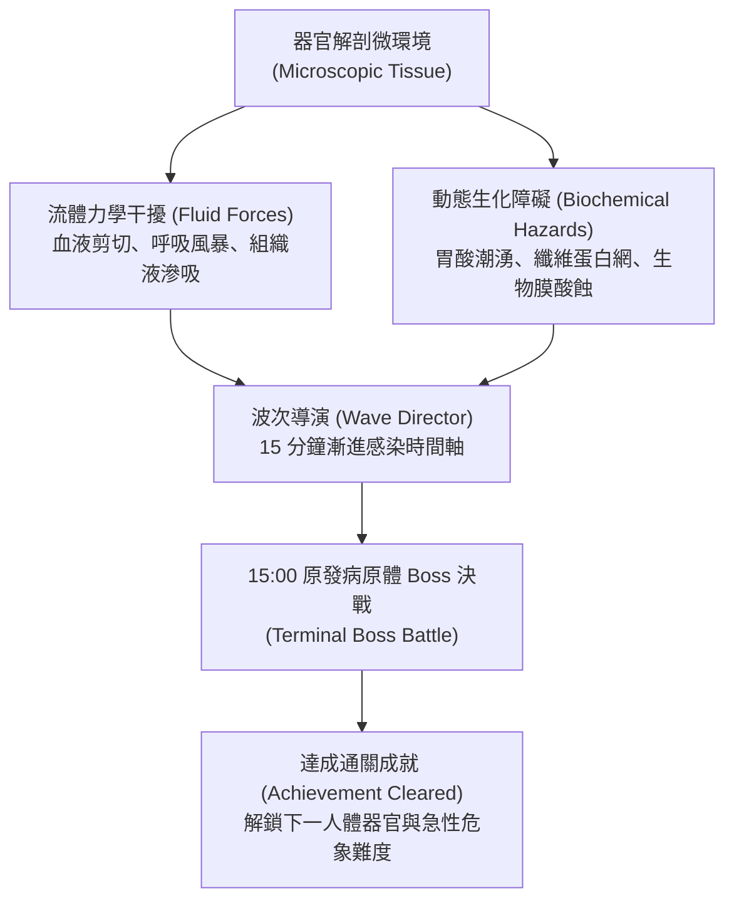
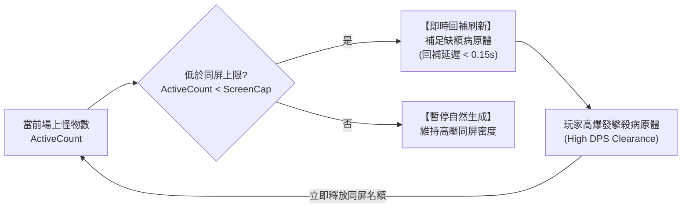

# 《Project: Phagocyte》關卡病理環境、流體力學與波次導演規格書 (Level Environments, Fluid Mechanics & Wave Director)

---

## 1. 關卡設計哲學：人體微觀組織切片

在《Phagocyte》中，關卡絕非靜止的背景貼圖，而是**真實人體器官的微觀病理組織切片**。每個關卡均具備獨特的**流體力學（Fluid Mechanics）**、微環境危害與生理學事件，玩家必須依據流體特徵調整游動軌跡與技能裝配。



---

## 2. 核心規則、難度分級與成就解鎖（雙軌制）

每張地圖均劃分為「常規感染（Normal）」與「急性危象（Hard）」兩種難度。**除初始地圖外，所有後續地圖與高階難度均需透過達成對應的成就里程碑解鎖**：

| 難度等級 | 解鎖條件 (成就系統驅動) | 存活時長 | 怪物數值修正 | 環境事件與流體修正 | 首通獎勵 |
| :--- | :--- | :--- | :--- | :--- | :--- |
| **常規感染<br>(Normal)** | 地圖 01 預設解鎖；<br>後續地圖需達成前置地圖通關成就（如 `wound_clear` 等） | 15:00 決戰 | 基準血量 ($100\%$)、<br>基準跑速 ($100\%$) | 流體衝擊週期平緩，<br>環境障礙分佈稀疏。 | **1 點微管天賦點**<br>(Talent Point) |
| **急性危象<br>(Hard)** | 達成該地圖的 Normal 通關成就後解鎖 | 15:00 決戰 | 怪物血量 $+40\%$、<br>怪物移速 $+20\%$ | 環境危害頻率 $+50\%$、<br>流體推力加劇、毒素污染。 | **1 點微管天賦點**<br>(Talent Point) |

> [!NOTE]
> 通關每張地圖的 Normal 與 Hard 各可獲得 1 點天賦點，全 5 張地圖共可穩定提供 10 點天賦點，作為解鎖造血幹細胞星盤關鍵節點的重要推力。

---

## 3. 五大人體器官關卡詳細規格 (The 5 Organ Stages)

所有關卡定義於 `GameManager.MapData`，並在全息人體掃描儀中定位對應器官：

### 地圖 01：皮下表皮裂口 (`acute_wound`)
- **人體部位**：皮膚與皮下結締組織（全息掃描：`Vector2(0.26, 0.48)`）。
- **解鎖條件**：**預設初始解鎖**（無前置條件）。
- **真實醫學案例**：機械性擦傷導致微血管破裂，外源性化膿細菌伴隨血漿滲出液湧入創口。
- **專屬環境流體力學**：
  - **傷口滲出吸力 (Suction Drift)**：創口破裂處產生持續將實體向右上方拖拽的流體吸力（基準速度向量 `Vector2(16.0, 10.0)`）。
  - **纖維蛋白網阻力 (Fibrin Clots)**：地面生成半透明的血纖維蛋白凝塊。玩家穿過時移速 $-20\%$，但可藉此阻擋敵方遠程投射物。
- **難度分級差異**：
  - *Normal*：吸力平緩，纖維網分佈稀疏。
  - *Hard (膿毒性創口)*：解鎖成就：`wound_clear`。吸力翻倍，纖維網被綠膿桿菌生物膜覆蓋，踏入時每秒受到酸蝕傷害。
- **波次節奏與關鍵威脅 (3 分鐘高頻循環)**：
  - `03:00` 精英突襲：**凝固酶葡萄球菌團**（自帶小型無敵纖維護盾，需活性氧破盾）。
  - `06:00` 首次蜂擁潮：**金葡菌密集簇** ＋ 雙葡萄球菌精英左右包夾。
  - `09:00` 次級領主：**化膿性鏈球菌巨噬長鏈 (Streptococcus Chain-Lord)**（超長蛇形游動穿刺，擊破必掉超武寶箱）。
  - `12:00` 極限蜂擁潮：**綠膿桿菌生物膜大軍**（全場高密度酸蝕減速）。
  - `15:00` 決戰 Boss：**耐甲氧西林金葡菌母體 (MRSA Super-Colony)**。巨大耐藥性包囊，被擊破膜後向外分裂為 4 隻高攻暴怒子精英。

---

### 地圖 02：肺泡氣體微腔 (`alveolar_space`)
- **人體部位**：呼吸道終末肺泡氣體交換界面（全息掃描：`Vector2(0.50, 0.28)`）。
- **解鎖條件**：**達成成就【創口閉合：局部穩態】（`wound_clear`）解鎖**。
- **真實醫學案例**：急性呼吸道病毒感染，表面活性物質受損，伴隨劇烈呼吸氣流衝擊。
- **專屬環境流體力學**：
  - **呼吸氣流剪切 (Respiratory Thrust)**：以正弦波週期觸發（基準週期 12 秒）。吸氣時產生持續 3 秒的強烈下推力（`Vector2(0, 35.0)`）；呼氣時產生向上反推力，考驗流體逆流微操。
  - **高氧激發力場 (Hyperoxic Pockets)**：場景漂浮青色高透氧氣泡，進入範圍內玩家線粒體超頻，CDR 暫時 $+25\%$。
- **難度分級差異**：
  - *Normal*：氣流週期規律，高氧氣泡刷新頻繁。
  - *Hard (急性呼吸窘迫 ARDS)*：解鎖成就：`alveolar_clear`。呼吸頻率急促化（週期縮短為 6 秒），氣流推力 $+50\%$，高氧氣泡被炎性滲出液覆蓋失效。
- **波次節奏與關鍵威脅 (3 分鐘高頻循環)**：
  - `03:00` 精英突襲：**刺突偽裝冠狀病毒**（短距離瞬移突刺並施加減速）。
  - `06:00` 首次蜂擁潮：**呼吸道合胞病毒微粒風暴** ＋ 雙刺突冠狀病毒突進。
  - `09:00` 次級領主：**甲型變異流感暴風核心 (Flu-Drift Cyclone)**（每 30 秒全屏抗原漂移，強制清除靶向暴擊標記）。
  - `12:00` 極限蜂擁潮：**超高密度流感微粒暴風**（考驗高頻 AOE 清屏輸出）。
  - `15:00` 決戰 Boss：**融合性合胞體病毒複合體 (Syncytial Mega-Capsid)**。釋放全屏肺泡牽引纖毛限制走位，強制玩家在縮圈環境下高壓輸出。

---

### 地圖 03：肝血竇微循環 (`hepatic_sinusoid`)
- **人體部位**：肝小葉內皮毛細血管網（全息掃描：`Vector2(0.42, 0.38)`）。
- **解鎖條件**：**達成成就【呼吸暢通：氣血屏障】（`alveolar_clear`）解鎖**。
- **真實醫學案例**：腸源性內毒素與血源性病原體入侵門靜脈，肝臟網狀內皮系統啟動解毒。
- **專屬環境流體力學**：
  - **膽汁酸水解流 (Bile Acid Drift)**：週期性自左向右席捲微量膽鹽水解流，弱化所有實體護甲（Armor 歸零 3 秒）。
  - **內皮窗孔篩選 (Endothelial Fenestrae)**：地面排列微型內皮篩孔，巨化細胞無法穿過（翻滾不穿牆）。
- **難度分級差異**：
  - *Normal*：膽汁酸流間歇長，解毒代償充足。
  - *Hard (急性肝衰竭)*：解鎖成就：`hepatic_clear`。膽汁酸腐蝕常態化，酸蝕環境每秒扣除最大生命 1%，怪物獲得狂暴吸血特質。
- **波次節奏與關鍵威脅 (3 分鐘高頻循環)**：
  - `03:00` 精英突襲：**內毒素革蘭氏陰性桿菌**（死亡時釋放廣域敗血性休克震波）。
  - `06:00` 首次蜂擁潮：**大腸桿菌群高速游動潮** ＋ 雙生內毒素精英。
  - `09:00` 次級領主：**結核肉芽腫巨核 (TB Granuloma Behemoth)**（外層覆蓋緻密蠟質厚壁，需持續破甲攻擊）。
  - `12:00` 極限蜂擁潮：**念珠菌假菌絲穿刺潮**（針狀菌絲密集推進）。
  - `15:00` 決戰 Boss：**惡性瘧原蟲裂殖複合體 (Plasmodium Macro-Schizont)**。定時吞噬周遭紅血球回復生命，破裂時向外爆發無數小裂殖子。

---

### 地圖 04：胃腔極酸黏膜 (`gastric_lumen`)
- **人體部位**：胃底腺與胃上皮黏液凝膠層（全息掃描：`Vector2(0.58, 0.40)`）。
- **解鎖條件**：**達成成就【門脈清道夫：解毒重鎮】（`hepatic_clear`）解鎖**。
- **真實醫學案例**：胃黏膜屏障破損，胃酸（pH 1.5～2.0）直接暴露，耐酸性桿菌深層定植。
- **專屬環境流體力學**：
  - **胃酸潮湧 (Acid Surge)**：地面週期性湧起高腐蝕性胃酸潮波，未處於黏液保護區內的實體持續承受強酸 DoT。
  - **中和保護圈 (Neutralization Zones)**：幽門螺桿菌水解尿素生成的局部中和鹼性光環，玩家可借位避難。
- **難度分級差異**：
  - *Normal*：潮湧間隔長，黏液保護圈範圍充裕。
  - *Hard (急性胃穿孔)*：解鎖成就：`gastric_clear`。全場 pH 值常態過酸，黏液保護圈被胃蛋白酶溶解破壞。
- **波次節奏與關鍵威脅 (3 分鐘高頻循環)**：
  - `03:00` 精英突襲：**鞭毛突刺幽門螺桿菌**（超高速螺旋鑽入胃上皮，附帶穿甲破防）。
  - `06:00` 首次蜂擁潮：**諾羅病毒微粒自爆潮** ＋ 雙幽門螺旋菌鑽頭。
  - `09:00` 次級領主：**空泡毒素 VacA 分泌原體**（在地面留下持續擴散的強酸黏液池）。
  - `12:00` 極限蜂擁潮：**高酸耐受性雜菌大潮** ＋ 胃酸潮湧週期縮短至 10 秒。
  - `15:00` 決戰 Boss：**幽門螺桿菌生物膜母核 (H. pylori Biofilm Core)**。釋放強效毒素與螺旋風暴，地面留下大片永久強酸爛泥。

---

### 地圖 05：血腦屏障毛細血管 (`blood_brain_barrier`)
- **人體部位**：中樞神經系統微血管網（全息掃描：`Vector2(0.50, 0.11)`）。
- **解鎖條件**：**達成成就【抗酸壁壘：黏膜重構】（`gastric_clear`）解鎖**。
- **真實醫學案例**：嗜神經性病原體或朊病毒突破緊密連接（Tight Junctions），引發急性中樞感染。
- **專屬環境流體力學**：
  - **高剪切流速 (High Shear Stress)**：極窄血管腔導致血流速度極高，玩家必須頻繁抵抗流體衝力，否則會被沖向外緣邊界。
  - **星形膠質腳突阻滯 (Astrocyte End-feet)**：場景中不規則伸出膠質突起，形成迷宮般的狹窄通道。
- **難度分級差異**：
  - *Normal*：管腔寬敞，血流脈衝規律。
  - *Hard (急性腦膜腦炎)*：解鎖成就：`bbb_clear`。神經遞質狂暴紊亂，玩家移動方向隨機受到神經電脈衝干擾，精英怪物獲得隱形潛行能力。
- **波次節奏與關鍵威脅 (3 分鐘高頻循環)**：
  - `03:00` 精英突襲：**狂犬病毒逆行微粒**（沿神經突觸高速彈射瞬移）。
  - `06:00` 首次蜂擁潮：**水痘帶狀疱疹病毒簇** ＋ 雙狂犬瞬移刺客。
  - `09:00` 次級領主：**弓形蟲巨型假包囊 (Toxoplasma Mega-Cyst)**（血量歸零時向四周八方彈射致命速殖子）。
  - `12:00` 極限蜂擁潮：**嗜神經病毒高壓風暴**（全場高頻神經電擊干擾操作）。
  - `15:00` 決戰 Boss：**錯誤折疊朊病毒晶體 (PrPsc Amyloid Aggregate)**。無法被常規免疫武器消化，必須利用過載活性氧或巨噬破膜連續擊碎其結晶外殼。

---

## 4. 戰鬥波次導演系統：3 分鐘高頻進化時間軸與動態回補機制

### 4.1 3 分鐘高頻波次進化時間軸 (3-Minute Escalation Timeline)

為徹底杜絕傳統 5 分鐘節奏的枯燥與拖沓，全關卡統一採用 **3 分鐘為一個階段的動態心流節奏（3-Minute Dynamic Loop）**：

```mermaid
timeline
    title 15 分鐘標準感染波次時間軸 (3 分鐘一循環)
    00:00 - 03:00 : 侵入定植期 (Phase 1) : 03:00 首波機制精英突襲 (單體考驗)
    03:00 - 06:00 : 局部炎症期 (Phase 2) : 06:00 初次小蜂擁潮 + 雙精英夾擊 (AOE 考驗)
    06:00 - 09:00 : 組織浸潤期 (Phase 3) : 09:00 中期次級領主決戰 (轉階段機制 / 必掉超武寶箱)
    09:00 - 12:00 : 全身播散期 (Phase 4) : 12:00 大蜂擁絕境潮 + 混合兵種 (超武成型檢驗)
    12:00 - 15:00 : 終末危象期 (Phase 5) : 惡性癌細胞與朊病毒密集混編 (極限生存)
    15:00 : 鎖屏決戰 : 原發病原體 Boss 登場 · 擊破通關或進入無盡模式
```

---

### 4.2 畫面怪物上限與「殺得越快、重生越快」動態回補機制 (Kill-Driven Dynamic Backfill)

傳統倖存者遊戲常因波次固定刷新、怪物總量鎖死，導致所有撐過 15 分鐘通關的玩家最終擊殺數與分數高度同質化。為了徹底打破這種乏味現象，《Phagocyte》引入了**【同屏活躍怪物上限 ＋ 殺戮驅動即時回補（Kill-Driven Dynamic Backfill）】**機制：



#### 1. 同屏怪物密度上限 (Screen Active Cap)
- **常態上限**：普通感染波次下，場景中最大同時存活病原體數量嚴格鎖定在 **300 隻**（`MAX_ACTIVE_NORMAL = 300`）。
- **蜂擁潮上限**：在 `06:00`、`12:00` 等極限蜂擁事件期間，上限動態擴張至 **450 隻**（`MAX_ACTIVE_SWARM = 450`）。
- 既保障了低階硬體與行動裝置的渲染幀率（60 FPS），又營造了密不透風的微觀病原體包圍壓迫感。

#### 2. 即時缺額回補算法 (Instant Deficit Backfill Loop)
- 生成器（`PathogenSpawner`）以每幀（或極高頻 $0.15$ 秒）輪詢當前活躍怪物總量：
  $$\text{Deficit} = \text{ScreenCap} - \text{ActiveCount}$$
- 一旦玩家擊殺病原體，導致 $\text{Deficit} > 0$，生成器**立即在相機視野邊界外 150～250px 處回補生成新怪物**，直到補滿上限為止。
- **殺得越快，怪物刷新得就越快**：
  - **極限輸出 Build（高 DPS / 超武成型）**：每秒清屏 30～50 隻，系統每秒便等量回補 30～50 隻。整場 15 分鐘總擊殺數可達 **5,000 ～ 8,000 隻**，獲得海量 ATP 經驗飆升至 60+ 級。
  - **純苟活防守 Build（低 DPS / 走位避戰）**：清怪緩慢，場上始終滿員卡在 300 隻上限，生成器持續休眠不回補。整場 15 分鐘可能僅擊殺 **800 ～ 1,200 隻**，等級停滯在 20 級左右。

#### 3. 避免分數同質化與 Build 深度體現
- **通關只是及格線，通量才是實力**：存活到 15:00 不再等於拿滿分。玩家通關時的最終分數由「總擊殺量（Total Kills）」與「每分鐘擊殺率（KPM）」拉開高達 **5～8 倍的巨大級距**！
- 徹底激勵玩家追求最極致的輸出 Build、追求超武的快速二合一進化、以及積極深入怪堆主動近戰清怪，而非消極繞圈拖時間。

---

## 5. 終局玩法：End Game 無盡細胞因子風暴模式

當玩家通關任意地圖的「急性危象（Hard）」難度後，解鎖終局無盡挑戰：
- 存活超過 15:00 後不強制結算，進入【全身細胞因子風暴無盡模式（Endless Mode）】。
- 詳細規格參見專題文檔：**[`docs/endgame.md`](file:///Users/zelin/project/Phagocyte/docs/endgame.md)**。