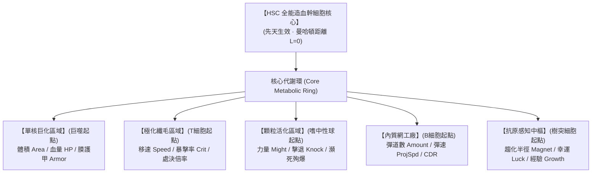

# 《Project: Phagocyte》造血幹細胞正交天賦星盤規格書 (Hematopoiesis Talent Matrix)

---

## 1. 核心設計概念與美學轉化

天賦系統將《黎明死線》（Dead by Daylight）血網（Bloodweb）的「中心放射、脈動纖維網絡、跨支探索」哲學，結合《流亡黯道》（Path of Exile）的單一天賦大星盤架構，無縫轉化為頂級的**共軛焦螢光微觀生化星盤（Confocal Fluorescence Microtubule Board）**：

| DBD 血網原型元素 | 《Phagocyte》生化微觀轉化 | 視覺呈現與技術細節 |
| :--- | :--- | :--- |
| **中心起點 (Center)** | **全能造血幹細胞 (HSC Core) 細胞核** | 星盤中央的巨大生化核心核仁，先天永久點亮、不耗點，所有譜系自染色質向外轉錄生長。 |
| **蛛網連接線 (Strands)** | **細胞骨架微管 (Cytoskeleton Microtubules)** | 沿 90 度正交網格鋪設的半透明微管光纖。點亮時，一道青藍色 ATP 生物電脈衝沿微管滑動充能。 |
| **外圍天賦節點 (Perks)** | **有機分泌囊泡 / 細胞器 / 受體複合體** | 依稀有度呈現圓形小囊泡、多邊形線粒體或懸浮受體圖騰，懸浮於網格交叉點。 |
| **分支自噬/退化機制 (Autophagy)** | **溶酶體自噬溶解 (Autophagic Digestion)** | 捨棄或未活化的深層支線被暗紅色溶酶體水解酸液融化切斷，或呈現微絲鈣化退化質感。 |

---

## 2. 正交微管網格棋盤拓撲 (90-Degree Orthogonal Micro-Tubule Grid)

為了徹底避免傳統天賦樹蜘蛛網交錯、斜線交叉重疊導致的視覺混亂，本專案嚴格採用 **90 度正交網格（Orthogonal Grid Board）**：

- **單格單節點原則**：每個節點精準落於單一整數網格點 $(col, row)$。
- **世界座標映射公式**：
  $$\text{Position} = \text{WorldCenter} + \begin{pmatrix} col \times \text{GridStep} \\ -row \times \text{GridStep} \end{pmatrix} \quad (\text{GridStep} = 150.0\,\text{px})$$
- **正交相鄰連線原則**：連線僅允許在曼哈頓相鄰格點（上下左右）之間建立微管，**絕不允許斜向連線，絕不發生微管交叉重疊**。
- **曼哈頓距離層級（Manhattan Ring Layer）**：
  $$\text{Ring Layer } L = |col| + |row|$$
  - $L = 0$：HSC 全能幹細胞核心。
  - $L = 1 \sim 2$：核心代謝環與初級微管節點。
  - $L = 3 \sim 4$：五大白血球譜系特化門戶（Legacy Start Portals）。
  - $L \ge 5$：外圍質變與傳奇表觀突變大節點（Keystones）。

---

## 3. 四階節點稀有度體系 (Node Rarity Tiers)

天賦節點分為 4 種稀有度，並在外觀幾何形狀與數值結構上鮮明區分：

| 稀有度等級 | 外觀圖元 | 數值加成結構與機制規範 | 生物代謝代價 (Trade-off) |
| :--- | :--- | :--- | :--- |
| **普通 (Normal)** | 半透明正圓形小囊泡 | 提供單一基礎通用屬性加成（如 `might +5%`、`max_health +10`）。 | 無代價。 |
| **魔法 (Magic)** | 發光菱形 / 橢圓囊泡 | 提供單一高額屬性加成，或兩個相輔相成的通用屬性（如 `area +8%` ＋ `armor +3`）。 | 無代價。 |
| **稀有 (Rare)** | 六角形生化複合體圖騰 | **雙屬性大幅強化 ＋ 一條機制負面代價**。遵循生物學能量分配守恆定律（如產熱代謝過載：`might +25%`，但細胞膜耐熱下降 `move_speed -10%`）。 | 存在生理代償負面效果，考驗玩家 Build 權衡。 |
| **獨特/傳奇 (Unique)** | 八角星芒 / 巨大核仁圖騰 | **顛覆性機制質變（Notable Keystone）**。徹底改變某項通用機制的運算方式（例如：將生命自癒轉化為週期性酸液噴射，或將護甲等比折算為暴擊傷害）。 | 極端特化流派的核心樞紐。 |

---

## 4. 五大特化分化區塊與背景色彩譜系

星盤依據造血幹細胞在骨髓中的真實分化路徑，劃分為五大特化扇區。各區塊在背景中以對應微觀螢光染色色調柔和區分：

### 4.1 單核巨化區域 (Macrophage Monocyte Sector)
- **色調**：暗紅褐與暖琥珀螢光。
- **位置**：星盤左上方。
- **特化導向**：`area`（體積）、`max_health`（血上限）、`armor`（膜剛性減傷）、`knockback`（撞擊質量）。
- **關鍵質變節點**：【吞噬過載】（吞噬病原體時瞬間按百分比恢復生命並暫時擴大體積）。

### 4.2 極化纖毛區域 (CTL Killer Sector)
- **色調**：冰藍色與銳利青綠螢光。
- **位置**：星盤右側。
- **特化導向**：`move_speed`（移速）、`crit_chance`（暴擊率）、`crit_damage`（處決倍率）、`pierce`（穿透）。
- **關鍵質變節點**：【特異性極化】（命中同一目標第 3 次時觸發 300% 膜破裂真實傷害）。

### 4.3 顆粒活化區域 (Neutrophil Granule Sector)
- **色調**：烈焰橙與酸性亮黃螢光。
- **位置**：星盤左側。
- **特化導向**：`might`（傷害）、`knockback`（衝量）、`health_regen`（自噬修復）、自爆殉爆傷害。
- **關鍵質變節點**：【NETosis 殉職誘捕】（生命耗盡時不立即陣亡，而是釋放全屏染色質黏網牽制全場，並延遲 3 秒自爆清屏）。

### 4.4 內質網工廠 (B-Cell Ribosome Factory)
- **色調**：深靛藍與電離紫螢光。
- **位置**：星盤右下方。
- **特化導向**：`amount`（彈道發射數）、`projectile_speed`（彈速）、`cooldown_reduction`（CDR）。
- **關鍵質變節點**：【高頻克隆分泌】（每連續發射 10 枚彈道，下一次發射額外附加 100% 數量齊射）。

### 4.5 抗原感知中樞 (Dendritic Hub Sector)
- **色調**：電離紫與微光金綠螢光。
- **位置**：星盤正上方。
- **特化導向**：`magnet`（拾取半徑）、`luck`（幸運度）、`growth`（經驗代謝效率）。
- **關鍵質變節點**：【廣域抗原呈遞】（每拾取 20 顆經驗光點，全場敵方抗原暴露，短暫承受 50% 易傷）。

---

## 5. 點亮與跨譜系構築機制 (Progression & Cross-Lineage Builds)

1. **點數消耗與單層堆疊**：
   - 每個節點僅能購買一次（`MaxStacks = 1`），每次購買一律消耗 **1 點微管天賦點**。
   - HSC 中央核心節點為先天生效、永久啟動，消耗 0 點。
2. **天賦點獲取途徑**：
   - **關卡首通獎勵**：通關 5 大器官地圖的 Normal 與 Hard 難度，各給予 1 點（共 10 點）。
   - **成就里程碑解鎖**：達成特定臨床科研成就獲得額外天賦點。
3. **跨界嵌合分化（Cross-Branch Differentiation）**：
   - 玩家可從初始細胞起點出發，沿正交微管一路點亮至中央核心環，再藉由核心代謝環分化進入其他細胞的特化領域。
   - 舉例：嗜中性球可以跨盤點入內質網工廠，構築「高頻殉爆抗體流」；殺手 T 細胞可跨入單核巨化區域，培育出「全肉裝衝鋒穿刺刺客」。
4. **持久化存儲架構**：
   - 星盤數據保存在本地 `user://passive_tree.json`，支援單鍵免費洗點（Reset All），激勵玩家隨意測試極致 Build。
