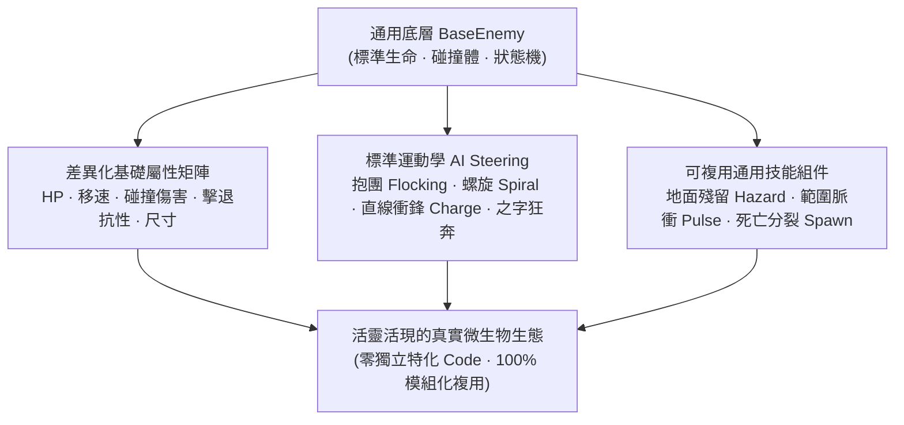

# 《Project: Phagocyte》病原體圖鑑、屬性矩陣與 AI 行為規格書 (Pathogen Codex, Stat Profiles & AI Behaviors)

---

## 1. 設計哲學：無硬編碼特殊克制，以純屬性與 AI 技能展現真實

為了保證程式架構的高度通用性、模組化與可維護性，《Phagocyte》的病原體系統貫徹以下核心原則：

> [!IMPORTANT]
> **無特殊免疫克制原則 (No Hardcoded Weaknesses or Immunity Counters)**：
> - **先不做特殊免疫對抗或克制弱點**（例如：「只能被某特定技能傷害」、「必須用特定細胞吞噬」、「免疫某種武器」等）。此類機制需要為每隻怪物編寫獨立特化代碼，破壞系統通用性。
> - 所有病原體嚴格繼承自統一的 `BaseEnemy` 基礎架構，遵循標準的受擊、護甲減傷、狀態異常（減速/眩暈）、擊退物理與死亡結算流程。

### 生物學真實性的兩大表現維度
病原體的真實性與多樣性，完全透過以下兩大通用維度展現：
1. **差異化基礎屬性分佈 (Differentiated Base Stat Profiles)**：
   - **生命耐久 (MaxHealth)**：極薄脆皮（諾羅病毒 $12$） vs 超厚血牛（結核桿菌 $120$）。
   - **移動游動速度 (FloatSpeed)**：緩慢逼近（結核桿菌 $25$） vs 狂暴疾馳（狂犬病毒 $80$）。
   - **碰撞傷害 (TouchDamage)**：微量觸碰刮傷 vs 致命撕咬。
   - **質量與擊退抗性 (Knockback Resistance)**：微小病毒極易被震飛，巨大肉芽腫菌團巋然不動。
   - **體積與碰撞半徑 (Collision Radius)**：微小顆粒（$8\,\text{px}$）到巨大病灶（$48\,\text{px}$）。
2. **專屬技能表現與 AI 行為模式 (Skill Manifestation & AI Steering Behaviors)**：
   - **移動運動學（Steering）**：群體抱團（Flocking）、螺旋漂移（Spiral）、蓄力直線衝刺（Dash/Charge）、之字形突進（Zig-zag Rush）。
   - **通用技能組件（Modular Skills）**：地面殘留危險區域（Hazard Area）、週期性範圍脈衝（Aura Pulse）、死亡分裂孵化（Death Spawn）、定時增殖分裂（Replication）。



---

## 2. 病原體六大門類圖鑑與行為矩陣 (The 6 Pathogen Taxa)

### 2.1 細菌門類 (Bacteria)

| 病原體名稱 | 代碼識別 | 尺寸與顯微特徵 | 基礎屬性特徵 (數值表現) | 專屬技能表現與 AI 行為模式 | 生物學真實原型 |
| :--- | :--- | :--- | :--- | :--- | :--- |
| **金黃色葡萄球菌<br>(Staph)** | `staph` | 亮黃色葡萄串狀球菌集群 ($18\,\text{px}$)。 | 中血量 ($35$)、中速 ($35$)、高擊退抗性。 | **抱團蜂擁群聚 (Flocking AI)**：天生傾向 3～6 隻抱團靠攏推進，形成密集球菌盾牆阻擋玩家前進。 | 凝固酶促成纖維蛋白凝塊抱團生長。 |
| **綠膿桿菌<br>(Pseudomonas)** | `pseudomonas` | 散發螢光綠色素的短桿菌 ($16\,\text{px}$)。 | 中低血量 ($26$)、中速 ($38$)。 | **藻酸鹽黏泥殘留 (Biofilm Trail)**：游動時週期性在地面生成持續 6 秒的酸性生物膜區域，踏入的玩家移速 $-25\%$ 並承受每秒 DoT。 | 分泌胞外多醣生物膜，在組織表面形成持久污染。 |
| **大腸桿菌<br>(E. Coli)** | `e_coli` | 周生鞭毛短桿菌 ($15\,\text{px}$)。 | 低血量 ($28$)、常態慢速 ($25$) / 衝鋒極速 ($120$)。 | **周生鞭毛蓄力突刺 (Charge Dash)**：平時緩慢游動；進入追擊半徑後短暫蓄力（前搖 $0.6\text{s}$），隨後朝玩家方位發動直線高速衝鋒。 | 鞭毛反轉滾動與定向平飛（Run & Tumble）游動。 |
| **幽門螺桿菌<br>(H. Pylori)** | `h_pylori` | 單極多鞭毛螺旋桿菌 ($20\,\text{px}$)。 | 中高血量 ($45$)、中高移速 ($42$)。 | **螺旋鑽進游動 (Spiral Kinematics)**：行進軌跡呈現正弦螺旋波紋，移動路線難以直線預判，持續逼近宿主細胞膜。 | 螺旋鑽透黏液凝膠層的微觀運動學特徵。 |
| **結核分枝桿菌<br>(TB)** | `tb` | 細長抗酸性桿菌 ($22\,\text{px}$)。 | **極高血量 ($120$)**、極低移速 ($20$)、**超高擊退抗性 ($90\%$)**。 | **厚重前線推進 (Heavy Behemoth)**：緩慢堅定地向玩家逼近，充當天然肉盾吸收彈道；死亡時形成乾酪樣阻礙障礙物。 | 緻密分枝菌酸蠟質外壁賦予的極強機械防禦。 |
| **炭疽芽孢與桿菌<br>(Anthrax)** | `anthrax_spore` | 折光性厚壁休眠卵形芽孢 ($14\,\text{px}$)。 | 休眠形態高防低傷 ($40$)；復甦桿菌高攻高速。 | **二階段復甦機制 (Spore Awakening)**：平時以低速休眠芽孢游蕩；受到累積傷害達到 50% 時破殼活化，轉化為狂暴炭疽桿菌（移速 $+80\%$，攻擊力 $+50\%$）。 | 惡劣環境休眠芽孢在受刺激後迅速發芽復甦。 |
| **破傷風梭菌<br>(Tetanus)** | `tetanus` | 鼓槌狀帶端生芽孢桿菌 ($18\,\text{px}$)。 | 中等血量 ($32$)、慢速 ($28$)。 | **神經痙攣脈衝 (Tetanus Pulse)**：每間隔 4 秒以自身為中心向外擴散一圈青紫色毒素震波，造成中範圍 AOE 傷害並擊退玩家。 | 破傷風痙攣毒素阻斷抑制性神經遞質釋放。 |

---

### 2.2 病毒門類 (Viruses)

| 病原體名稱 | 代碼識別 | 尺寸與顯微特徵 | 基礎屬性特徵 (數值表現) | 專屬技能表現與 AI 行為模式 | 生物學真實原型 |
| :--- | :--- | :--- | :--- | :--- | :--- |
| **冠狀病毒<br>(S-Virus)** | `s_virus` | 密布棒狀刺突蛋白球體 ($16\,\text{px}$)。 | 中低血量 ($22$)、中速 ($45$)。 | **刺突黏滯附著 (Spike Adhesion)**：碰撞玩家時施加強烈黏著減速效果（移速 $-40\%$，持續 $1.5\text{s}$），容易被後續怪堆跟上包圍。 | S 刺突蛋白與 ACE2 受體高親和力結合。 |
| **變異流感病毒<br>(Flu-Drift)** | `flu_drift` | 多形性多刺微粒 ($14\,\text{px}$)。 | 低血量 ($18$)、高移速 ($55$)。 | **高頻抗原漂移 (Antigenic Drift Shift)**：每 15 秒全身螢光染色發生一次突變閃爍，瞬時獲得短暫 $1\text{s}$ 加速推進與隨機轉向。 | 血凝素 (HA) 與神經氨酸酶 (NA) 基因高頻突變。 |
| **諾羅病毒<br>(Norovirus)** | `norovirus` | 極微小二十面體顆粒 ($10\,\text{px}$)。 | **極低血量 ($12$)**、中高移速 ($50$)、零擊退抗性。 | **超密集微型蜂擁 (Micro-Swarm)**：永遠以 $15\sim 30$ 隻超密集集群形式刷新，靠群體體積壓迫受擊邊界。 | 極低感染劑量與高密度爆發式微粒排放。 |
| **狂犬病毒<br>(Rabies)** | `rabies` | 子彈狀包膜微粒 ($15\,\text{px}$)。 | 中等血量 ($25$)、**極高移速 ($80$)**。 | **嗜神經之字衝撞 (Zig-zag Assault)**：以極高速度採取高頻之字形（Zig-zag）軌跡向玩家發動撲擊，考驗玩家走位微操。 | 沿軸突逆行極速向中樞 thần kinh 突進。 |
| **人類免疫缺陷病毒<br>(HIV)** | `hiv` | 圓球狀顆粒，帶 gp120 突刺 ($16\,\text{px}$)。 | 中等血量 ($30$)、慢速 ($30$)。 | **衰竭干擾光環 (Exhaustion Aura)**：在周圍 $180\text{px}$ 範圍內形成持續衰竭力場，處於光環內的玩家技能冷卻恢復速度降低 $20\%$。 | 破壞免疫核心指揮官，造成免疫系統整體遲滯。 |
| **伊波拉病毒<br>(Ebola)** | `ebola` | 「6」字形或長條絲狀 ($24\,\text{px}$)。 | 中高血量 ($48$)、中速 ($36$)。 | **長鞭擺動橫掃 (Filament Sweep)**：身軀細長，隨游動方向呈鞭狀大幅擺動，碰撞受擊判定範圍隨身體波動動態擴展。 | 絲狀病毒科典型的長條形捲曲結構。 |
| **水痘帶狀疱疹病毒<br>(Varicella-Zoster)** | `varicella_zoster` | 二十面體雙鏈顆粒 ($15\,\text{px}$)。 | 低血量 ($20$)、中速 ($40$)。 | **神經突觸定點短瞬移 (Synaptic Blink)**：每游動 3 秒發動一次短距離向玩家方位的無前搖折躍（距離 $120\text{px}$）。 | 沿背根神經節軸突的跳躍式軸漿運輸。 |

---

### 2.3 真菌門類 (Fungi)

| 病原體名稱 | 代碼識別 | 尺寸與顯微特徵 | 基礎屬性特徵 (數值表現) | 專屬技能表現與 AI 行為模式 | 生物學真實原型 |
| :--- | :--- | :--- | :--- | :--- | :--- |
| **白色念珠菌<br>(Candida)** | `candida` | 卵圓酵母相與長菌絲複合體 ($20\,\text{px}$)。 | 中血量 ($36$)、慢速 ($28$)。 | **假菌絲長程伸展 (Hyphal Extension)**：接近玩家到 $200\text{px}$ 時，本體定格並向前伸出一條長達 $150\text{px}$ 的刺狀假菌絲進行遠距穿刺。 | 酵母相向尖銳菌絲相的二型性轉化與穿刺侵襲。 |
| **煙麴黴<br>(Aspergillus)** | `aspergillus` | 頂囊分生孢子放射頭 ($25\,\text{px}$)。 | 高血量 ($60$)、極低移速 ($15$)。 | **分生孢子煙幕 (Spore Dispersion)**：每隔 5 秒向周圍彈射一圈微型孢子氣溶膠，在場上形成持續 4 秒的小範圍毒霧。 | 麴黴頂囊向空氣中大量揚起微小分生孢子。 |

---

### 2.4 原蟲與寄生蟲 (Parasites)

| 病原體名稱 | 代碼識別 | 尺寸與顯微特徵 | 基礎屬性特徵 (數值表現) | 專屬技能表現與 AI 行為模式 | 生物學真實原型 |
| :--- | :--- | :--- | :--- | :--- | :--- |
| **惡性瘧原蟲帶蟲體<br>(Plasmodium Carrier)** | `plasmodium` | 寄生於紅血球內的環狀/裂殖體 ($24\,\text{px}$)。 | 高血量 ($50$)、慢速 ($24$)。 | **裂殖子陣亡爆發 (Merozoite Burst)**：死亡破裂時，瞬間在原地生成 $4\sim 6$ 隻極速游動的小裂殖子（`merozoite`，高移速、低血量）向四周散開。 | 裂殖體成熟後脹破紅血球釋放裂殖子。 |
| **剛地弓形蟲<br>(Toxoplasma)** | `toxoplasma` | 新月形速殖子假包囊 ($22\,\text{px}$)。 | 中高血量 ($42$)、中速 ($35$)。 | **假包囊破裂四向彈射 (Radial Ejection)**：血量降至零時，向上下左右四個正交方向彈射高初速速殖子飛行物。 | 組織內假包囊破裂導致急性速殖子擴散。 |

---

### 2.5 朊病毒 (Prions)

| 病原體名稱 | 代碼識別 | 尺寸與顯微特徵 | 基礎屬性特徵 (數值表現) | 專屬技能表現與 AI 行為模式 | 生物學真實原型 |
| :--- | :--- | :--- | :--- | :--- | :--- |
| **錯誤折疊朊病毒<br>(Prion / PrPsc)** | `prion` | $\beta$-摺疊澱粉樣纖維晶體 ($16\,\text{px}$)。 | 中高血量 ($55$)、極高護甲減傷、中移速 ($38$)。 | **接觸同化增生 (Contact Accretion)**：碰撞其他病原體時使其微量回血；每次受到命中時向外崩解微型結晶碎片。 | 催化正常 PrPc 蛋白轉化為異常空間構象。 |

---

### 2.6 異變與惡性細胞 (Malignant Cells)

| 病原體名稱 | 代碼識別 | 尺寸與顯微特徵 | 基礎屬性特徵 (數值表現) | 專屬技能表現與 AI 行為模式 | 生物學真實原型 |
| :--- | :--- | :--- | :--- | :--- | :--- |
| **異變癌細胞<br>(Malignant Cell)** | `malignant_cell` | 巨大畸形多核細胞 ($36\,\text{px}$)。 | **極高血量 ($180$)**、慢移速 ($22$)、高碰撞傷害。 | **自主週期複製 (Autonomous Mitosis)**：存活時間每超過 20 秒，若周圍無過多同類，則原地分裂出一隻半血量的子癌細胞。 | 失去接觸抑制與凋亡機制的無限自主增殖。 |

---

## 3. 程式碼模組化落實規範 (Implementation Guidelines)

所有敵人在 C# 中統一採用標準元件化設計：

```csharp
// scripts/enemies/BaseEnemy.cs
public abstract partial class BaseEnemy : Node2D
{
    [Export] public float MaxHealth { get; set; } = 30.0f;
    [Export] public float FloatSpeed { get; set; } = 35.0f;
    [Export] public float TouchDamage { get; set; } = 10.0f;
    [Export] public float KnockbackResistance { get; set; } = 0.0f;
    [Export] public float AtpValue { get; set; } = 10.0f;

    // 通用狀態機控制 (Drifting, Windup, Charging, SkillCooldown)
    // 完全依賴通用物理與運動學，不對任何玩家技能作硬編碼特判！
}
```

- **高內聚低耦合**：武器與技能只負責向周圍 Area2D 判定點分發 `Damage`、`Knockback` 與通用狀態效果（減速/眩暈）。
- **零特定條件判斷**：代碼中絕不出現 `if (enemy is Prion && weapon is Laser)` 這樣的硬編碼，所有效果均由通用的傷害防禦數值計算完成！

