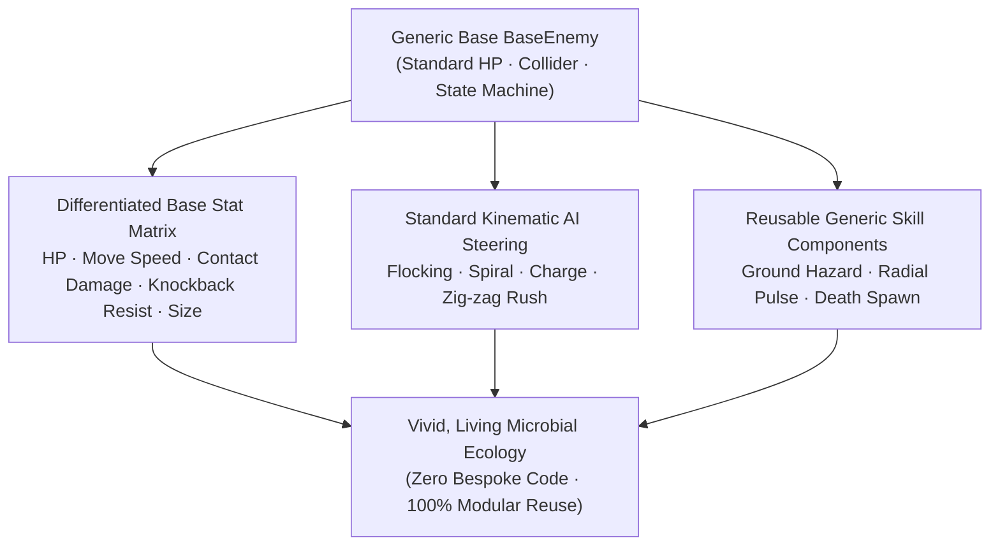

# Project: Phagocyte — Pathogen Codex, Stat Profiles & AI Behaviors

---

## 1. Design Philosophy: No Hardcoded Counters, Realism Through Pure Stats and AI Skills

To guarantee a highly generic, modular, and maintainable code architecture, the pathogen system in *Phagocyte* follows these core principles:

> [!IMPORTANT]
> **No Special Immunity/Counters Principle (No Hardcoded Weaknesses or Immunity Counters)**:
> - **No special immunity matchups or hard counters** (e.g., "can only be damaged by a specific skill", "must be engulfed by a specific cell", "immune to a certain weapon"). Such mechanics require bespoke per-monster code and destroy system generality.
> - All pathogens strictly inherit from the unified `BaseEnemy` foundation and follow the standard hit, armor mitigation, status (slow/stun), knockback physics, and death-settlement pipeline.

### Two Dimensions of Biological Authenticity
Pathogen authenticity and diversity are expressed entirely through the following two generic dimensions:
1. **Differentiated Base Stat Profiles**:
   - **Max Health (MaxHealth)**: paper-thin (Norovirus $12$) vs. ultra-tanky (M. tuberculosis $120$).
   - **Swim Speed (FloatSpeed)**: slow approach (M. tuberculosis $25$) vs. frenzied dash (Rabies virus $80$).
   - **Contact Damage (TouchDamage)**: light touch scratches vs. lethal bites.
   - **Mass & Knockback Resistance**: tiny viruses are easily knocked flying, while massive granuloma clusters stand unmoved.
   - **Body Size & Collision Radius**: from tiny particles ($8\,\text{px}$) to massive lesions ($48\,\text{px}$).
2. **Signature Skills & AI Steering Behaviors**:
   - **Locomotion kinematics (Steering)**: clustering (Flocking), spiral drift (Spiral), charged linear dash (Dash/Charge), zig-zag rush (Zig-zag Rush).
   - **Modular skill components**: lingering ground hazard zones (Hazard Area), periodic radial pulses (Aura Pulse), death-split spawning (Death Spawn), timed proliferative division (Replication).


```mermaid
flowchart TD
    A["Generic Base BaseEnemy<br>(Standard HP · Collider · State Machine)"] --> B["Differentiated Base Stat Matrix<br>HP · Move Speed · Contact Damage · Knockback Resist · Size"]
    A --> C["Standard Kinematic AI Steering<br>Flocking · Spiral · Charge · Zig-zag Rush"]
    A --> D["Reusable Generic Skill Components<br>Ground Hazard · Radial Pulse · Death Spawn"]
    B & C & D --> E["Vivid, Living Microbial Ecology<br>(Zero Bespoke Code · 100% Modular Reuse)"]
```

---

## 2. Codex and Behavior Matrix of the Six Pathogen Taxa (The 6 Pathogen Taxa)

### 2.1 Bacteria

| Pathogen Name | Code ID | Size & Microscopic Features | Base Stat Profile (Values) | Signature Skills & AI Behavior | Real-World Biological Prototype |
| :--- | :--- | :--- | :--- | :--- | :--- |
| **Staphylococcus aureus<br>(Staph)** | `staph` | Bright-yellow grape-like cocci clusters ($18\,\text{px}$). | Medium HP ($35$), medium speed ($35$), high knockback resistance. | **Clustering swarm (Flocking AI)**: naturally tends to clump in groups of 3-6 and push forward together, forming a dense cocci shield wall that blocks player movement. | Coagulase-driven fibrin clots that grow in clustered masses. |
| **Pseudomonas aeruginosa<br>(Pseudomonas)** | `pseudomonas` | Short rods exuding fluorescent green pigment ($16\,\text{px}$). | Low-medium HP ($26$), medium speed ($38$). | **Alginate slime trail (Biofilm Trail)**: periodically deposits acidic biofilm zones lasting 6 seconds while swimming; players stepping inside suffer $-25\%$ move speed plus per-second DoT. | Secretes exopolysaccharide biofilm that persistently contaminates tissue surfaces. |
| **Escherichia coli<br>(E. Coli)** | `e_coli` | Peritrichous short rods ($15\,\text{px}$). | Low HP ($28$), slow cruise ($25$) / extreme charge speed ($120$). | **Peritrichous charged thrust (Charge Dash)**: swims slowly by default; after entering pursuit radius, winds up briefly (telegraph $0.6\text{s}$), then launches a high-speed linear charge at the player. | Flagellar reversal-driven run-and-tumble swimming. |
| **Helicobacter pylori<br>(H. Pylori)** | `h_pylori` | Spiral rods with a single polar tuft of flagella ($20\,\text{px}$). | Medium-high HP ($45$), medium-high move speed ($42$). | **Spiral boring locomotion (Spiral Kinematics)**: travels along sinusoidal spiral-wave tracks that are hard to predict linearly, closing in on host membranes relentlessly. | Microscopic kinematics of spirals drilling through mucus gel layers. |
| **Mycobacterium tuberculosis<br>(TB)** | `tb` | Slender acid-fast rods ($22\,\text{px}$). | **Very high HP ($120$)**, very low move speed ($20$), **extreme knockback resistance ($90\%$)**. | **Heavy frontline advance (Heavy Behemoth)**: slowly and inexorably closes in on the player, acting as a living shield that soaks projectiles; forms a caseous blocking obstacle on death. | Extremely tough mechanical defense granted by a dense mycolic-acid waxy cell wall. |
| **Anthrax spores and bacilli<br>(Anthrax)** | `anthrax_spore` | Refractile thick-walled dormant ovoid spores ($14\,\text{px}$). | Dormant form: high defense, low damage ($40$); awakened bacilli: high attack, high speed. | **Two-stage awakening (Spore Awakening)**: drifts as a slow dormant spore by default; once cumulative damage reaches 50%, it hatches into a frenzied anthrax bacillus (move speed $+80\%$, attack $+50\%$). | Dormant spores in harsh environments germinating rapidly once stimulated. |
| **Clostridium tetani<br>(Tetanus)** | `tetanus` | Drumstick-shaped rods with terminal spores ($18\,\text{px}$). | Medium HP ($32$), slow speed ($28$). | **Spasmic pulse (Tetanus Pulse)**: every 4 seconds emits a violet toxin shockwave centered on itself, dealing medium-range AOE damage and knocking the player back. | Tetanospasmin blocking inhibitory neurotransmitter release. |

---

### 2.2 Viruses

| Pathogen Name | Code ID | Size & Microscopic Features | Base Stat Profile (Values) | Signature Skills & AI Behavior | Real-World Biological Prototype |
| :--- | :--- | :--- | :--- | :--- | :--- |
| **Coronavirus<br>(S-Virus)** | `s_virus` | Sphere densely studded with club-shaped spike proteins ($16\,\text{px}$). | Low-medium HP ($22$), medium speed ($45$). | **Spike adhesion (Spike Adhesion)**: on contact, applies a strong sticky slow to the player (move speed $-40\%$ for $1.5\text{s}$), letting trailing monsters catch up and surround the victim. | High-affinity binding of S spike protein to ACE2 receptors. |
| **Variant influenza virus<br>(Flu-Drift)** | `flu_drift` | Pleomorphic multi-spiked particles ($14\,\text{px}$). | Low HP ($18$), high move speed ($55$). | **High-frequency antigenic drift (Antigenic Drift Shift)**: every 15 seconds its fluorescence flashes through a mutation, instantly gaining a brief $1\text{s}$ speed burst with a random turn. | High-frequency mutations in hemagglutinin (HA) and neuraminidase (NA) genes. |
| **Norovirus<br>(Norovirus)** | `norovirus` | Extremely tiny icosahedral particles ($10\,\text{px}$). | **Extremely low HP ($12$)**, medium-high move speed ($50$), zero knockback resistance. | **Ultra-dense micro-swarm (Micro-Swarm)**: always spawns as an ultra-dense cluster of $15\sim 30$ individuals that overwhelms hit boundaries with sheer numbers. | Extremely low infectious dose with high-density burst particle shedding. |
| **Rabies virus<br>(Rabies)** | `rabies` | Bullet-shaped enveloped particles ($15\,\text{px}$). | Medium HP ($25$), **extremely high move speed ($80$)**. | **Neurotropic zig-zag strike (Zig-zag Assault)**: lunges at the player at extreme speed along high-frequency zig-zag (Zig-zag) tracks, testing positioning micro-skills. | Retrograde sprint along axons toward the central nervous system at extreme speed. |
| **Human immunodeficiency virus<br>(HIV)** | `hiv` | Spherical particles studded with gp120 spikes ($16\,\text{px}$). | Medium HP ($30$), slow speed ($30$). | **Exhaustion aura (Exhaustion Aura)**: projects a persistent exhaustion field within $180\text{px}$; players inside regenerate skill cooldowns $20\%$ more slowly. | Destroys the core commanders of immunity, slowing the whole immune system. |
| **Ebola virus<br>(Ebola)** | `ebola` | Figure-"6" or long filamentous threads ($24\,\text{px}$). | Medium-high HP ($48$), medium speed ($36$). | **Filament lash sweep (Filament Sweep)**: its slender body whips widely with swimming direction, dynamically extending its contact-hit range as the body undulates. | Typical long, coiled filamentous structure of the filovirus family. |
| **Varicella-zoster virus<br>(Varicella-Zoster)** | `varicella_zoster` | Icosahedral double-stranded particles ($15\,\text{px}$). | Low HP ($20$), medium speed ($40$). | **Synaptic blink (Synaptic Blink)**: every 3 seconds of swimming, instantly blinks a short distance toward the player with no telegraph (range $120\text{px}$). | Saltatory axoplasmic transport along dorsal-root-ganglion axons. |

---

### 2.3 Fungi

| Pathogen Name | Code ID | Size & Microscopic Features | Base Stat Profile (Values) | Signature Skills & AI Behavior | Real-World Biological Prototype |
| :--- | :--- | :--- | :--- | :--- | :--- |
| **Candida albicans<br>(Candida)** | `candida` | Ovoid yeast forms combined with long hyphae ($20\,\text{px}$). | Medium HP ($36$), slow speed ($28$). | **Hyphal extension (Hyphal Extension)**: when within $200\text{px}$ of the player, roots itself and extends a $150\text{px}$-long spiked pseudohypha forward for a long-range stab. | Dimorphic yeast-to-sharp-hypha transition with piercing invasion. |
| **Aspergillus fumigatus<br>(Aspergillus)** | `aspergillus` | Radiate conidial heads on apical vesicles ($25\,\text{px}$). | High HP ($60$), extremely low move speed ($15$). | **Conidial smokescreen (Spore Dispersion)**: every 5 seconds ejects a ring of micro-conidia aerosol that forms small toxic clouds lasting 4 seconds. | Aspergillus vesicles lofting large numbers of tiny conidia into the air. |

---

### 2.4 Protozoa and Parasites (Parasites)

| Pathogen Name | Code ID | Size & Microscopic Features | Base Stat Profile (Values) | Signature Skills & AI Behavior | Real-World Biological Prototype |
| :--- | :--- | :--- | :--- | :--- | :--- |
| **Plasmodium carrier<br>(Plasmodium Carrier)** | `plasmodium` | Ring/schizont stages parasitizing red blood cells ($24\,\text{px}$). | High HP ($50$), slow speed ($24$). | **Merozoite burst on death (Merozoite Burst)**: on death it ruptures, instantly releasing $4\sim 6$ extremely fast micro-merozoites (`merozoite`, high speed, low HP) that scatter in all directions. | Mature schizonts bursting red blood cells to release merozoites. |
| **Toxoplasma gondii<br>(Toxoplasma)** | `toxoplasma` | Crescent-shaped tachyzoite pseudocysts ($22\,\text{px}$). | Medium-high HP ($42$), medium speed ($35$). | **Pseudocyst radial ejection (Radial Ejection)**: when HP reaches zero, fires high-velocity tachyzoite projectiles along the four cardinal directions. | Tissue pseudocyst rupture driving acute tachyzoite spread. |

---

### 2.5 Prions (Prions)

| Pathogen Name | Code ID | Size & Microscopic Features | Base Stat Profile (Values) | Signature Skills & AI Behavior | Real-World Biological Prototype |
| :--- | :--- | :--- | :--- | :--- | :--- |
| **Misfolded prion<br>(Prion / PrPsc)** | `prion` | $\beta$-sheet amyloid fibril crystals ($16\,\text{px}$). | Medium-high HP ($55$), extremely high armor mitigation, medium move speed ($38$). | **Contact assimilation (Contact Accretion)**: heals other pathogens slightly on contact; sheds micro-crystal fragments outward on every hit taken. | Catalyzes normal PrPc proteins into abnormal conformations. |

---

### 2.6 Mutant and Malignant Cells (Malignant Cells)

| Pathogen Name | Code ID | Size & Microscopic Features | Base Stat Profile (Values) | Signature Skills & AI Behavior | Real-World Biological Prototype |
| :--- | :--- | :--- | :--- | :--- | :--- |
| **Mutant cancer cell<br>(Malignant Cell)** | `malignant_cell` | Giant deformed multinucleated cells ($36\,\text{px}$). | **Extremely high HP ($180$)**, slow speed ($22$), high contact damage. | **Autonomous periodic replication (Autonomous Mitosis)**: every 20 seconds of survival, if few siblings are nearby, divides in place to spawn a half-HP daughter cancer cell. | Infinite autonomous proliferation after losing contact inhibition and apoptosis. |

---

## 3. Code-Side Modularization Rules (Implementation Guidelines)

All enemies in C# share a unified component-based design:

```csharp
// scripts/enemies/BaseEnemy.cs
public abstract partial class BaseEnemy : Node2D
{
    [Export] public float MaxHealth { get; set; } = 30.0f;
    [Export] public float FloatSpeed { get; set; } = 35.0f;
    [Export] public float TouchDamage { get; set; } = 10.0f;
    [Export] public float KnockbackResistance { get; set; } = 0.0f;
    [Export] public float AtpValue { get; set; } = 10.0f;

    // Generic state-machine control (Drifting, Windup, Charging, SkillCooldown)
    // Fully driven by generic physics and kinematics, with no hardcoded branches for any player skill!
}
```

- **High cohesion, low coupling**: weapons and skills only dispatch `Damage`, `Knockback`, and generic status effects (slow/stun) to surrounding Area2D query points.
- **Zero special-case branching**: code never contains hardcoded checks like `if (enemy is Prion && weapon is Laser)` — every effect resolves through generic damage-versus-defense math!
