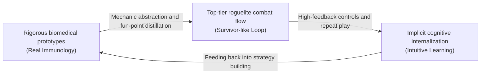

# Project: Phagocyte — Biological Fidelity & Gamification Design Philosophy (Realism & Edutainment Philosophy)

---

## 1. Core Positioning and Design Vision

The core idea of *Project: Phagocyte* is **"playing the game is learning immunology"**. We are building a hardcore biochemical game with both top-tier action-roguelite (Survivor-like) flow and deeply faithful recreations of real human microscopic immune combat.

This project rejects both "monster-bashing reskins wearing a biology costume" and "dry lecture-style teaching software". Our goal: **make real physiology itself the most fun game mechanic**.

---

## 2. Three Core Design Pillars (The Three Core Pillars)

### Pillar 1: Learn While Playing (Implicit popularization, no rote memorization)
- **Mechanics are the tutorial**: players never need to read a heavy immunology textbook before starting. Teaching lives inside the core loop — for example:
  - Piloting a Macrophage to extend dynamic pseudopod chains and strike bacteria teaches **"pseudopod extension"** and **"contact killing"** combat intuition firsthand.
  - Pairing an antibody salvo with an opsonin passive naturally teaches how **"opsonization"** tags pathogens and massively boosts kill efficiency.
- **Positive knowledge feedback**: every in-run level-up, super-weapon fusion, or talent lighting reveals genuine cell-biology ingenuity in visuals and mechanics (e.g., TCA-cycle overclocking, directed microtubule polymerization).

### Pillar 2: Knowledge Intuition (Experts predict by instinct, newcomers pick up by instinct)
- **Medical intuition**: players with life-science or medical backgrounds can predict tactics and loadout counters purely from common sense:
  - Facing Staphylococcus aureus wrapped in a thick fibrin coat, instinctively break the shield with reactive oxygen species (ROS) or hydrolases.
  - Watching variant influenza drift its antigens on a timer, instinctively grasp why targeted crits fail and switch to broad-spectrum membrane-breaking attacks.
  - Watching blood squeeze through narrow alveolar capillaries, instinctively anchor pseudopods to epithelial cells against shear flow.
- **Newcomer intuition building**: even players with zero biology background quickly build mental models through vivid visual feedback (colors, shapes, fluid responses), and after a few hours delightedly discover they have absorbed most of innate and adaptive human immunity.

### Pillar 3: Anti-Boredom Flow (Seamless resonance of extreme mowing pace and hardcore science)
- **No classroom vibes**: never pop up long passages of forced-memorization text; all popular-science knowledge is packaged inside:
  - Snappy real-time physics collisions and deformation feedback.
  - Post-run "case reports" and the "Microscopy Archive (Immunology Codex)" cryo-EM dossiers, for players who want to dig deeper.
- **Biochemical edge plus strategic builds**: packaging "hematopoietic stem-cell differentiation" and "epigenetic mutation" as a PoE-style talent tree plus super-weapon fusion gives players the accomplishment of cultivating ultimate biochemical chimeras like the "Amoeboid Primordial Maw" and the "Peroxide Leviathan".

---

## 3. Physiology-to-Gameplay Reference Matrix (Biological Mechanism to Gameplay Matrix)

This project rigorously converts real human microscopic defense mechanisms into generic gameplay:

| Real Immune Physiology | Classic Medical Description | *Phagocyte* Gameplay Conversion | Player Flow Payoff |
| :--- | :--- | :--- | :--- |
| **Dynamic pseudopod deformation (Pseudopods)** | Actin filaments polymerize directionally, pushing the membrane forward. | Organic physical deformation driven by vertex noise, with polygon boundaries synced live into contact colliders. | The cathartic joy of chain-grabbing and contact-bursting. |
| **Antigen opsonization (Opsonization)** | Antibodies or complement fragments tag pathogen surfaces, boosting phagocytic-receptor recognition. | Passive trait [Opsonin Affinity], granting global `crit_chance` and `crit_damage` bonuses. | Enemies glow with highlight fluorescent tags while every weapon sprays full-screen yellow crit numbers. |
| **Perforin pore formation (Perforin Pore-forming)** | Killer T cells secrete perforin, punching holes in target membranes until they lyse. | Active weapon [Perforin Lance], a high-velocity spiral beam piercing enemy packs with membrane-breaking effects. | Ultra-long single-line penetration for sniping high-threat elite pathogens. |
| **Respiratory burst (Respiratory Burst)** | Phagocytes activate NADPH oxidase, dumping reactive oxygen radicals ($\text{H}_2\text{O}_2$). | Active weapon [ROS Jet], spraying a high-pressure cone of acid mist along the swim direction, dealing armor-melting corrosive DoT. | Hose down clustered bacteria at close range with dissolving acid fog. |
| **Neutrophil extracellular traps (NETosis)** | Neutrophils die to cast chromatin-fiber webs that trap and kill pathogens. | Neutrophil-exclusive talents plus a death-martyrdom loop: near-death bursts of field-wide snaring webs plus violent martyrdom blasts. | Clutch comebacks — the screen-clearing shock of a sacrificial martyrdom. |
| **Hematopoietic stem-cell differentiation (Hematopoiesis)** | HSCs in bone marrow differentiate into myeloid and lymphoid progenitors. | PoE-style single unified talent tree shared by all five cells, each with its own specialized starting gate. | Free cross-lineage building (e.g., teaching a B cell the Macrophage's giant pseudopod slam). |

---

## 4. Microscopic Aesthetics and Sensory Fidelity Principles

To immerse players in the real human microscopic world, the game's audiovisuals follow these principles:

1. **Confocal fluorescence microscope language (Confocal Fluorescence)**:
   - UI and skill effects use microscopic fluorescence-staining styles (cyan-green GFP, deep-red RFP, bright-blue DAPI nucleic-acid stains).
   - Deep dark backgrounds (simulating dark-field microscopy) with Brownian-motion micron-scale colloidal particles and refractive light spots drifting through scenes.
2. **Organic protoplasmic fluid physics**:
   - Cell boundaries are never stiff sprites — they creep and churn like amoebae, dynamic fluids with viscosity and tension.
   - Nuclei float inside the cytoplasm and lag with subtle spring-damper physics (Spring Physics) as the cell sprints and turns.
3. **Organ micro-environment immersion**:
   - Every stage is a microscopic slice of a real organ — alveolar breathing storms, wound-exudate currents, gastric-wall acid surges, and blood-brain-barrier high-pressure shear — environments that are dynamic fluid-mechanical battlefields to interact with, never static dead textures.
