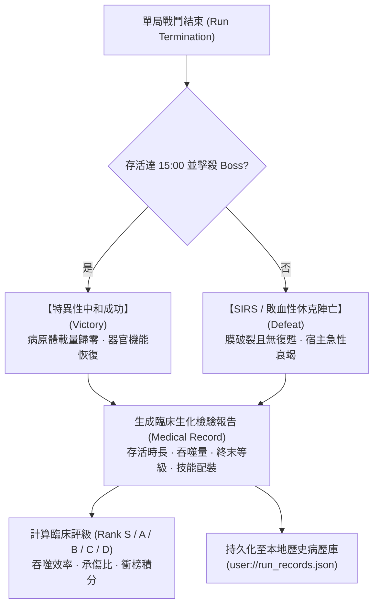

# 《Project: Phagocyte》臨床病歷單結算、歷史記錄與衝榜規格書 (Medical Records & Settlement System)

---

## 1. 系統設計概念：臨床病理報告單 (Clinical Pathology Report)

Survivor-like 的常規結算介面通常只是簡單的「Game Over」與一串枯燥的數字。在《Phagocyte》中，我們將每局結算包裝為一份嚴肅又充滿黑色幽默的**「宿主微觀臨床病理報告單（Clinical Pathology Chart）」**：



---

## 2. 結算判準與生化結局包裝

每局戰鬥的終止條件均對應精確的臨床病理學狀態：

### 2.1 勝利結算：特異性中和成功 (Antigenic Neutralization / Clearance)
- **觸發條件**：在地圖中存活達 15:00，並成功擊潰原發病原體 Boss。
- **臨床診斷**：`【抗原特異性免疫完全建立】`。
- **病歷評價**：宿主體內病原體載量下降 99.9%，組織液滲出停止，血管內皮屏障完全修復。
- **獎勵結算**：發放對應地圖難度首通微管天賦點，解鎖後續器官地圖。

### 2.2 失敗結算：全身性炎症反應綜合徵 (SIRS / Septic Shock)
- **觸發條件**：玩家細胞生命值歸零，且剩餘裂變復甦次數 `revival == 0`。
- **臨床診斷**：`【急性呼吸窘迫 / 敗血性休克 / 多器官功能障礙綜合徵 (MODS)】`。
- **病歷評價**：白血球胞膜解體，炎症因子風暴失控，宿主局部組織大面積壞死。
- **挫敗感緩衝**：雖然單局中止，但本次戰鬥吞噬積累的經驗仍會計入成就進度條，轉化為後續局外解鎖的推力。

---

## 3. 病歷單數據結構與持久化 (`RunRecordManager.cs`)

每局結束時，系統自動封裝一條完整的病歷數據，並推入歷史病歷陣列的最前端：

```csharp
// 病歷字典結構
var record = new Godot.Collections.Dictionary
{
    { "result", result },              // "victory" 或 "defeat"
    { "class_id", classId },          // 出戰細胞 ("macrophage", "ctl", 等)
    { "map_id", mapId },              // 戰鬥器官 ("acute_wound", 等)
    { "survival_time", survivalTime },// 存活時間 (秒)
    { "level", level },                // 終末代謝等級
    { "digested", digested },          // 吞噬並消化的病原體總數
    { "points_spent", pointsSpent },  // 戰鬥時已投入的天賦點總數
    { "active_skills", skills },      // 終末裝備的主動生化技能清單
    { "timestamp", timestamp }         // 結算時間戳 (Unix Time)
};
```

- **歷史病歷上限**：本地最多持久化保存最新 **50 筆病歷**（`MaxRecords = 50`）。超過上限時自動移除最舊記錄。
- **存儲路徑**：優先保存在 `user://run_records.json`，在測試或沙盒環境自動回退至 `res://.user_data/run_records.json`。

---

## 4. 臨床生化評級與衝榜機制 (Leaderboard & Scoring)

為了激勵硬核肉鴿玩家挑戰極限吞噬效率與衝榜，遊戲引入了**臨床生化評級模型（Clinical Performance Grade）**：

### 4.1 綜合評分公式 (Pathological Score)
$$\text{Score} = (\text{Survival Seconds} \times 10) + (\text{Digested Count} \times 25) + (\text{Level} \times 100) \times \text{Difficulty Multiplier}$$
- *難度倍率*：Normal 難度 $\times 1.0$，Hard 急性危象 $\times 1.5$。
- *通關加成*：若達成「特異性中和成功」，額外獲得 $+5,000$ 點臨床治癒獎勵分。

### 4.2 臨床評級劃分標準
| 評級 (Grade) | 稱號名稱 | 達成標準 |
| :--- | :--- | :--- |
| **Rank S** | **【微觀主宰 · 免疫神話】** | Hard 難度通關，吞噬量 $> 800$，無陣亡。 |
| **Rank A** | **【高效清道夫 · 卓越代償】** | Normal 通關或 Hard 存活 $> 12:00$，吞噬量 $> 500$。 |
| **Rank B** | **【局部防線 · 穩定受控】** | 存活 $> 08:00$，吞噬量 $> 300$。 |
| **Rank C** | **【應激代償 · 急性相】** | 存活 $> 04:00$，吞噬量 $> 100$。 |
| **Rank D** | **【膜溶解 · 早期潰敗】** | 存活 $< 04:00$，早期被病原體衝垮破膜。 |

---

## 5. 歷史病歷檢視介面功能 (Medical History Archive)

在主選單與微觀檔案館中，玩家可隨時調閱往期歷史病歷：
- **雙標籤分類**：一鍵切換查看【治癒中和病歷 (Victories)】與【潰敗陣亡病歷 (Defeats)】。
- **戰術覆盤**：點擊任一歷史病歷，可查看該場次使用的細胞形態、出戰器官、最終主動/超武配裝組合與各項生化指標。
- **衝榜激勵**：以最高分病歷置頂展示，激勵玩家挑戰極致配裝與更快清場速度。