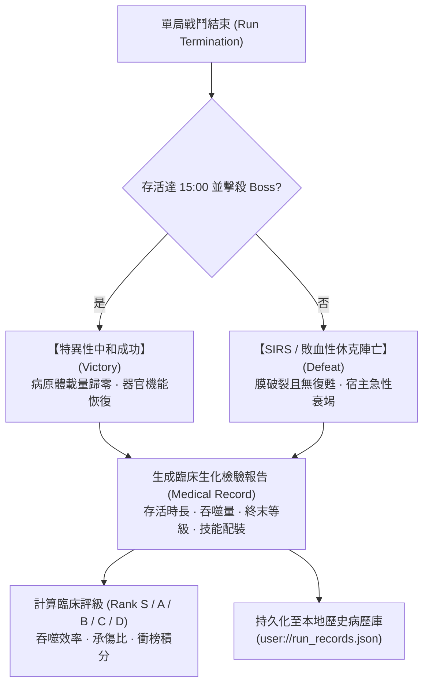

# 《Project: Phagocyte》臨床病歷單結算、歷史記錄與衝榜規格書 (Medical Records & Settlement System)

---

## 1. 系統設計概念：臨床病理報告單 (Clinical Pathology Report)

Survivor-like 的常規結算介面通常只是簡單的「Game Over」與一串枯燥的數字。在《Phagocyte》中，我們將每局結算包裝為一份嚴肅又充滿黑色幽默的**「宿主微觀臨床病理報告單（Clinical Pathology Chart）」**：



---

## 2. 結算判準與生化結局包裝

每局戰鬥的終止條件均對應精確的臨床病理學狀態：

### 2.1 勝利結算：特異性中和成功 (Antigenic Neutralization / Clearance)
- **觸發條件**：在地圖中存活達 15:00，並成功擊潰原發病原體 Boss。
- **臨床診斷**：`【抗原特異性免疫完全建立】`。
- **病歷評價**：宿主體內病原體載量下降 99.9%，組織液滲出停止，血管內皮屏障完全修復。
- **獎勵結算**：發放對應地圖難度首通微管天賦點，解鎖後續器官地圖。

### 2.2 失敗結算：全身性炎症反應綜合徵 (SIRS / Septic Shock)
- **觸發條件**：玩家細胞生命值歸零，且剩餘裂變復甦次數 `revival == 0`。
- **臨床診斷**：`【急性呼吸窘迫 / 敗血性休克 / 多器官功能障礙綜合徵 (MODS)】`。
- **病歷評價**：白血球胞膜解體，炎症因子風暴失控，宿主局部組織大面積壞死。
- **挫敗感緩衝**：雖然單局中止，但本次戰鬥吞噬積累的經驗仍會計入成就進度條，轉化為後續局外解鎖的推力。

### 2.3 終局結算：無盡細胞因子風暴過載 (Endless Overdrive Termination)
- **觸發條件**：在【無盡模式】下存活超過 15:00 直至生命膜破裂。
- **臨床診斷**：`【慢性重症感染 · 全身細胞因子風暴終末代償】`。
- **病歷評價**：宿主進入不可逆多器官過熱狀態，白血球抵禦至最後一刻，評級開放 **Rank SSS（超載神話）** 與 **Rank EX（破格存在）**。
- **紀錄擴充**：額外記錄所加裝的【病理過載詞綴清單（Afflictions）】與詞綴加成總分。

---

## 3. 病歷單數據結構與持久化 (`RunRecordManager.cs`)

每局結束時，系統自動封裝一條完整的病歷數據，並推入歷史病歷陣列的最前端：

```csharp
// 病歷字典結構
var record = new Godot.Collections.Dictionary
{
    { "result", result },              // "victory" 或 "defeat"
    { "class_id", classId },          // 出戰細胞 ("macrophage", "ctl", 等)
    { "map_id", mapId },              // 戰鬥器官 ("acute_wound", 等)
    { "survival_time", survivalTime },// 存活時間 (秒)
    { "level", level },                // 終末代謝等級
    { "kills", kills },                // 總擊殺數 (Total Kills: 包含遠程技能擊殺 + 肉身吞噬)
    { "engulfed", engulfed },          // 肉身吞噬數 (Direct Engulfed: 僅統計偽足/細胞膜直接生吞)
    { "kpm", kpm },                    // 擊殺通量 (Kills Per Minute = kills / (survivalTime / 60))
    { "points_spent", pointsSpent },  // 戰鬥時已投入的天賦點總數
    { "active_skills", skills },      // 終末裝備的主動生化技能清單
    { "timestamp", timestamp }         // 結算時間戳 (Unix Time)
};
```

- **歷史病歷上限**：本地最多持久化保存最新 **50 筆病歷**（`MaxRecords = 50`）。超過上限時自動移除最舊記錄。
- **存儲路徑**：優先保存在 `user://run_records.json`，在測試或沙盒環境自動回退至 `res://.user_data/run_records.json`。

---

## 4. 臨床生化評級與衝榜機制 (Leaderboard & Scoring)

### 4.1 核心計分原則：直接以擊殺計分，每隻怪具備固定 Base 分數

為了使結算評分直觀、公平且易於理解，遊戲在評分系統上貫徹以下兩項準則：

1. **直接以擊殺（Kills）為評分依據**：
   - **吞噬在計分上視同擊殺**：無論玩家是使用遠程技能（抗體、穿孔長矛、酸液噴流等）擊殺病原體，還是利用細胞膜/偽足直接肉身吞噬，**在分數結算上一視同仁，均獲得該病原體對應的固定 Base 分數**！
   - 避免了複雜的額外加分判定，病歷單上的「肉身吞噬數（`engulfed`）」作為玩家戰術風格與榮譽數據單獨展示，但不產生雙重計分偏頗。
2. **每種病原體擁有固定的基礎分（Fixed Base Score）**：
   - 病原體依照其威脅度與生理強度設定固定的 Base 分數：
     - **微型蜂擁群（Micro Swarm）**：如諾羅病毒、瘧疾裂殖子，每隻 **5 分**。
     - **標準病原體（Standard）**：如大腸桿菌、冠狀病毒、葡萄球菌，每隻 **15 分**。
     - **高危 / 敏捷病原體（Dangerous）**：如幽門螺桿菌、狂犬病毒、綠膿桿菌，每隻 **35 分**。
     - **重裝精英 / 巨型病灶（Elite Tank）**：如結核桿菌、炭疽桿菌、異變癌細胞，每隻 **100 分**。
     - **次級領主（09:00 Sub-Boss）**：固定 **600 分**。
     - **終末原發 Boss（15:00 Terminal Boss）**：固定 **3,000 分**。

---

### 4.2 綜合評分公式 (Pathological Score)

總擊殺得分即為全場消滅所有病原體的 Base 分數累加：

$$\text{Kill Score} = \sum_{\text{Kills}} \text{BaseScore}(\text{pathogen})$$

$$\text{Final Score} = \left[ (\text{Survival Seconds} \times 10) + \text{Kill Score} + (\text{Level} \times 100) \right] \times \text{Difficulty Multiplier} + \text{Clear Bonus}$$

- **殺得越快，分數越高**：因為有「同屏 300 隻上限 ＋ 殺越快重生越快」機制，高爆發 Build 能在 15 分鐘內擊殺 5,000～8,000 隻怪物，獲取的 $\text{Kill Score}$ 是消極苟活玩家（僅殺 800 隻）的數倍之多！
- **難度倍率（Difficulty Multiplier）**：Normal 難度 $\times 1.0$；Hard 急性危象 $\times 1.5$；無盡模式詞綴疊加最高 $\times 2.75$。
- **通關中和加成（Clear Bonus）**：擊殺 15:00 終末 Boss 達成特異性中和成功，額外獲得 $+10,000$ 分。

#### 📊 通關實例分數對比表（同為 15:00 Hard 通關）
| 戰術風格 | 總擊殺量 (Kills) | 擊殺累積 Base 分數 | 代謝等級 | 擊殺通量 (KPM) | 最終結算積分 | 臨床評級 |
| :--- | :--- | :--- | :--- | :--- | :--- | :--- |
| **消極走位苟活型** | 950 隻 (雜菌為主) | 16,500 分 | Lv.22 | 63.3 | **41,550 分** | **Rank B** |
| **平衡標準發育型** | 2,800 隻 (含精英) | 58,000 分 | Lv.42 | 186.7 | **106,800 分** | **Rank A** |
| **極限超武割草型** | 6,500 隻 (全屏秒殺) | 145,000 分 | Lv.68 | 433.3 | **251,200 分** | **Rank S** |

---

### 4.3 臨床評級劃分標準

臨床評級直接依據**總擊殺量（Total Kills）**與**存活表現**劃分：

| 評級 (Grade) | 稱號名稱 | 達成標準 |
| :--- | :--- | :--- |
| **Rank S** | **【微觀主宰 · 免疫神話】** | Hard 通關，總擊殺量 $\ge 3,500$ 隻（$\text{KPM} \ge 230$），無陣亡。 |
| **Rank A** | **【高效清道夫 · 卓越代償】** | Normal 通關或 Hard 存活 $> 12:00$，總擊殺量 $\ge 2,000$ 隻（$\text{KPM} \ge 130$）。 |
| **Rank B** | **【局部防線 · 穩定受控】** | 存活 $> 08:00$，總擊殺量 $\ge 800$ 隻。 |
| **Rank C** | **【應激代償 · 急性相】** | 存活 $> 04:00$，總擊殺量 $\ge 300$ 隻。 |
| **Rank D** | **【膜溶解 · 早期潰敗】** | 存活 $< 04:00$，早期被病原體衝垮破膜。 |

---

## 5. 歷史病歷檢視介面功能 (Medical History Archive)

在主選單與微觀檔案館中，玩家可隨時調閱往期歷史病歷：
- **雙標籤分類**：一鍵切換查看【治癒中和病歷 (Victories)】與【潰敗陣亡病歷 (Defeats)】。
- **戰術覆盤**：點擊任一歷史病歷，可查看該場次使用的細胞形態、出戰器官、最終主動/超武配裝組合與各項生化指標。
- **衝榜激勵**：以最高分病歷置頂展示，激勵玩家挑戰極致配裝與更快清場速度。