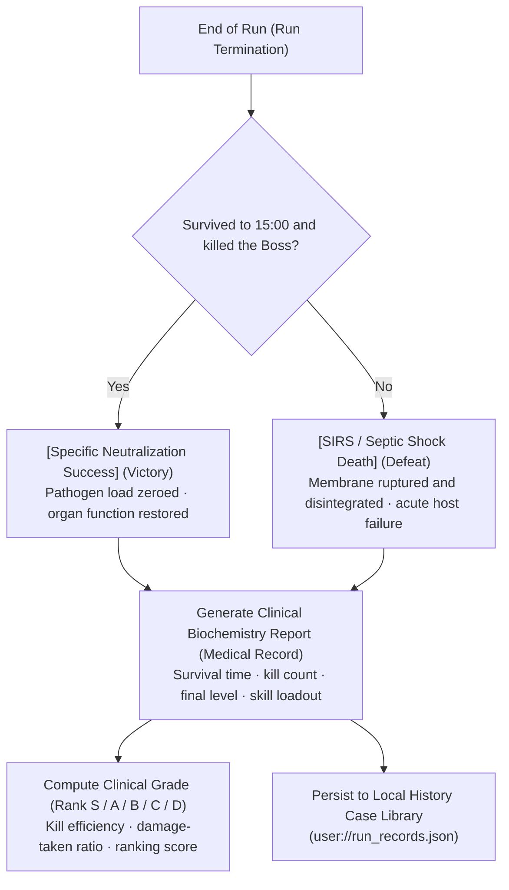

# Project: Phagocyte Clinical Case-Report Settlement, History Records & Ranking Specification (Medical Records & Settlement System)

---

## 1. System Design Concept: Clinical Pathology Report (Clinical Pathology Report)

Survivor-like end-of-run screens are usually just a plain "Game Over" plus a dry string of numbers. In Phagocyte, every run settlement is skinned as a solemn yet darkly humorous **[Host Microscopic Clinical Pathology Report (Clinical Pathology Chart)]**:


```mermaid
flowchart TD
    RunEnd["End of Run (Run Termination)"] --> CheckResult{Survived to 15:00 and killed the Boss?}
    CheckResult -- Yes --> Vic["[Specific Neutralization Success] (Victory)<br>Pathogen load zeroed · organ function restored"]
    CheckResult -- No --> Def["[SIRS / Septic Shock Death] (Defeat)<br>Membrane ruptured and disintegrated · acute host failure"]
    Vic & Def --> Gen["Generate Clinical Biochemistry Report (Medical Record)<br>Survival time · kill count · final level · skill loadout"]
    Gen --> Rank["Compute Clinical Grade (Rank S / A / B / C / D)<br>Kill efficiency · damage-taken ratio · ranking score"]
    Gen --> Persist["Persist to Local History Case Library<br>(user://run_records.json)"]
```

---

## 2. Settlement Criteria and Biochemical Ending Skins

Every run termination condition maps to a precise clinicopathological state:

### 2.1 Victory Settlement: Specific Neutralization Success (Antigenic Neutralization / Clearance)
- **Trigger**: survive to 15:00 on the map and defeat the primary-pathogen Boss.
- **Clinical diagnosis**: `[Complete Antigen-Specific Immunity Established]`.
- **Case assessment**: host pathogen load down 99.9%, tissue fluid exudation halted, vascular endothelial barrier fully repaired.
- **Reward settlement**: award microtubule talent points for the map-difficulty first clear, unlocking subsequent organ maps.

### 2.2 Defeat Settlement: Systemic Inflammatory Response Syndrome (SIRS / Septic Shock)
- **Trigger**: player cell health reaches zero (membrane fully ruptured and disintegrated).
- **Clinical diagnosis**: `[Acute Respiratory Distress / Septic Shock / Multiple Organ Dysfunction Syndrome (MODS)]`.
- **Case assessment**: white blood cell membrane disintegrated, inflammatory cytokine storm out of control, widespread necrosis of local host tissue.
- **Frustration cushion**: although the run ends, kills banked in this fight still feed the achievement progress bar, converting into momentum for future out-of-run unlocks.

### 2.3 Final-End Settlement: Endless Cytokine Storm Overdrive (Endless Overdrive Termination)
- **Trigger**: in [Endless Mode], survive past 15:00 until membrane rupture.
- **Clinical diagnosis**: `[Chronic Severe Infection · Systemic Cytokine Storm Terminal Compensation]`.
- **Case assessment**: host enters an irreversible multi-organ overheating state; the white blood cell holds out to the last moment, unlocking grades **Rank SSS (Overload Mythic)** and **Rank EX (Anomalous Existence)**.
- **Record extension**: additionally records the equipped [Pathological Overload Affix List (Afflictions)] and total affix bonus score.

---

## 3. Case-Report Data Structure and Persistence (`RunRecordManager.cs`)

At the end of each run, the system automatically seals a complete case-report record and pushes it to the front of the history array:

```csharp
// Medical record dictionary structure
var record = new Godot.Collections.Dictionary
{
    { "result", result },              // "victory" or "defeat"
    { "class_id", classId },          // Deployed cell ("macrophage", "ctl", etc.)
    { "stage_id", stageId },           // Combat organ ("acute_wound", etc.)
    { "survival_time", survivalTime },// Survival time (seconds)
    { "level", level },                // Final cell level (Cell Level)
    { "kills", kills },                // Total kills (Total Kills: kills from all damage sources)
    { "kpm", kpm },                    // Kill throughput (Kills Per Minute = kills / (survivalTime / 60))
    { "points_spent", pointsSpent },  // Total talent points invested during the fight
    { "active_skills", skills },      // Final equipped active biochemical skill list
    { "timestamp", timestamp }         // Settlement timestamp (Unix Time)
};
```

- **History cap**: at most the latest **50 case reports** are persisted locally (`MaxRecords = 50`). On overflow, the oldest **unlocked** record is removed FIFO-style; archived locked reports are immune to auto-cleanup (overflow while fully locked is retained).
- **Archive Lock**: each row ends with a `🔒` archive button (dark gray when unlocked, gold when locked); clicking pins/unpins it and persists; locked legendary runs are kept forever. Manual clearing has been removed: the archive only grows, managed purely by FIFO plus locks.
- **Storage path**: prefers `user://run_records.json`, automatically falling back to `res://.user_data/run_records.json` in test or sandbox environments.

---

## 4. Clinical Biochemical Grading and Ranking (Leaderboard & Scoring)

### 4.1 Core Scoring Principle: Score Directly by Kills; Every Monster Has a Fixed Base Score

To keep settlement scoring intuitive, fair, and easy to understand, the game enforces the following two rules in its scoring system:

1. **Score directly by kills (Kills)**:
   - **All kills are equal**: whether the player kills a pathogen with a ranged skill (antibodies, perforin lances, acid streams, etc.) or with melee pseudopod strikes, **every kill counts the same for scoring, awarding that pathogen's fixed Base score**!
   - This avoids complex bonus rule checks; total kills (`kills`) double as the showcase of player tactics and honors without double-counting bias.
2. **Every pathogen has a fixed Base score (Fixed Base Score)**:
   - Pathogens are assigned fixed Base scores by threat level and physiological strength:
     - **Micro Swarm**: e.g. norovirus, malaria merozoites, **5 points** each.
     - **Standard Pathogens (Standard)**: e.g. E. coli, coronavirus, staphylococcus, **15 points** each.
     - **Dangerous / Agile Pathogens (Dangerous)**: e.g. H. pylori, rabies virus, Pseudomonas aeruginosa, **35 points** each.
     - **Armored Elites / Giant Lesions (Elite Tank)**: e.g. M. tuberculosis, Bacillus anthracis, mutated cancer cells, **100 points** each.
     - **Secondary Boss (09:00 Sub-Boss)**: flat **600 points**.
     - **Terminal Primary Boss (15:00 Terminal Boss)**: flat **3,000 points**.

---

### 4.2 Composite Score Formula (Pathological Score)

Total kill score is the accumulated Base scores of every pathogen eliminated that run:

$$\text{Kill Score} = \sum_{\text{Kills}} \text{BaseScore}(\text{pathogen})$$

$$\text{Final Score} = \left[ (\text{Survival Seconds} \times 10) + \text{Kill Score} + (\text{Level} \times 100) \right] \times \text{Difficulty Multiplier} + \text{Clear Bonus}$$

- **Kill faster, score higher**: thanks to the "300 on-screen cap + faster kills respawn faster" mechanism, a high-burst build can kill 5,000–8,000 monsters in 15 minutes, earning several times the $\text{Kill Score}$ of a passive survival player (only ~800 kills)!
- **Difficulty Multiplier**: Normal $\times 1.0$; Hard acute-crisis $\times 1.5$; Endless-mode affix stacking up to $\times 2.75$.
- **Clear Bonus**: killing the 15:00 terminal Boss for a specific-neutralization success awards a bonus $+10,000$ points.

#### 📊 Clear-Example Score Comparison (all 15:00 Hard clears)
| Tactical Style | Total Kills (Kills) | Accumulated Kill Base Score | Cell Level | Kill Throughput (KPM) | Final Settlement Score | Clinical Grade |
| :--- | :--- | :--- | :--- | :--- | :--- | :--- |
| **Passive Dodge-and-Survive** | 950 (mostly weak strays) | 16,500 pts | Lv.22 | 63.3 | **41,550 pts** | **Rank B** |
| **Balanced Standard Growth** | 2,800 (incl. elites) | 58,000 pts | Lv.42 | 186.7 | **106,800 pts** | **Rank A** |
| **Extreme Super-Weapon Mower** | 6,500 (full-screen insta-kill) | 145,000 pts | Lv.68 | 433.3 | **251,200 pts** | **Rank S** |

---

### 4.3 Clinical Grade Thresholds

Clinical grades are assigned directly from **total kills (Total Kills)** and **survival performance**:

| Grade (Grade) | Title | Criteria |
| :--- | :--- | :--- |
| **Rank S** | **[Microscopic Sovereign · Immune Myth]** | Hard clear with total kills $\ge 3,500$ ($\text{KPM} \ge 230$), deathless. |
| **Rank A** | **[Efficient Scavenger · Excellent Compensation]** | Normal clear or Hard survival $> 12:00$ with total kills $\ge 2,000$ ($\text{KPM} \ge 130$). |
| **Rank B** | **[Local Defense Line · Stably Controlled]** | Survival $> 08:00$ with total kills $\ge 800$. |
| **Rank C** | **[Stress Compensation · Acute Phase]** | Survival $> 04:00$ with total kills $\ge 300$. |
| **Rank D** | **[Membrane Lysis · Early Collapse]** | Survival $< 04:00$, membrane overrun by pathogens early. |

---

## 5. Historical Case-Report Browser (Medical History Archive)

In the main menu and microscopy archive, players may review past case reports at any time:
- **Dual-tab categories**: one-click toggle between [Cured Neutralization Cases (Victories)] and [Collapsed Death Cases (Defeats)].
- **Archive Lock**: the row-end `🔒` pins a major case with one click, immunizing it from FIFO auto-cleanup and preserving highlight moments forever.
- **Tactical review**: clicking any history entry shows the cell morphology used, the deployed organ, the final active / super-weapon loadout, and all biochemical metrics.
- **Ranking incentive**: the highest-scoring case is pinned at top, pushing players to chase extreme loadouts and faster clears.
