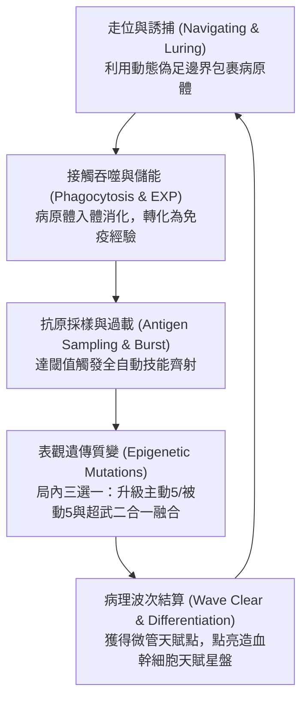

# 《Project: Phagocyte（吞噬體）》產品設計需求書（GDD / PRD）

---

## 1. 產品概述與核心定位

- **遊戲類型**：2D 俯視角微觀動作肉鴿（Top-Down Microscopic Survivor-like）。
- **平台目標**：PC（Steam），支援手把與鍵鼠操作。
- **引擎選型**：Godot 4.x（基於 2D 物理與 RenderingServer 高併發優勢）。
- **核心價值主張（USP）**：
  - **所見即所得的有機物理變形**：白血球外形動態隨機伸展，多邊形邊界與碰撞箱完全即時同步。
  - **硬核生理學機制遊戲化**：將抗原呈遞、調理作用、過載消化、NETosis 轉化為核心爽點，實現「遊玩即理解免疫學」。
  - **「底盤 ＋ 形態模組 ＋ 外掛細胞器」解耦架構**：所有白血球共享相同微絲微管底盤，形態與行為完全技能化與參數化，支持自由裝配與異變。
  - **純通用全域 Stat 數值矩陣**：嚴格依循 Survivor-like 哲學，所有屬性 100% 通用化，絕無單一技能特化私有屬性。
  - **經典「主動 5 ＋ 被動 5」欄位與 1:1 終極超武閉環**：5 大自動發射主動生化技能，5 大通用 Stat 被動特質，滿級二合一合成 5 大終極表觀遺傳超武。
  - **PoE 式單一聯合造血幹細胞天賦大星盤**：基於骨髓系與淋巴系真實分化路徑，所有細胞共享星盤但具備不同起始特化門戶，支持跨界生化流派構築（Build）。

---

## 2. 核心玩法與變形解耦架構

### 核心戰鬥迴圈（Core Loop）



### 「底盤 ＋ 形態參數模組 ＋ 外掛細胞器」解耦架構

為解決「細胞形態與專有動畫綁定導致技能無法複用」的架構難題，本專案將細胞解構為三層生物學模型：

1. **統一底盤（Unified Chassis）**：
   - 所有白血球在物理底層均具備相同的微絲微管系統。
   - **初始半徑標準化**：統一設定為 `base_radius = 24.0`，確保所有細胞在 1 級時擁有公平平等的受擊面積與基礎機動性，消弭前期數值失衡。
2. **頂點噪聲參數模組（Morphology Modifiers）**：
   - 不使用骨骼動畫，而是透過 `FastNoiseLite` 驅動 `Polygon2D` 頂點動態位移。
   - 提煉三大底層噪聲參數池，供技能與天賦系統隨時動態修改：
     - **Amplitude（偽足伸展振幅）**：控制偽足伸出的長度。受全域通用屬性 `area` 動態加成。
     - **Frequency（突觸/刺突密度）**：控制邊緣起伏的頻率。數值越高，毛刺與突起越密集（如樹突細胞）；數值越低，輪廓越圓滑平整（如未活化 T/B 細胞）。
     - **Smoothness（黏滯流體度）**：決定邊界如阿米巴流體般蠕動，或是像堅硬細胞壁般緊湊微顫。
3. **外掛式細胞器（Modular Organelles）**：
   - 超出本體網格拓撲範圍的特殊攻擊，做成獨立子節點掛載（PackedScene）：
     - **偽足捕捉爪（`PseudopodLimb.tscn`）**：基於 2D 骨骼逆向運動學（IK Chain）或平滑貝茲曲線，平時縮於質內，攻擊時彈射向外抓怪拖回。
     - **受體棘刺陣列（`ReceptorSpikes.tscn`）**：圍繞細胞邊緣排列的環狀懸浮受體，提供旋轉射擊、接觸反傷或化學感應。
4. **生物學合理化包裝（表觀遺傳與異變嵌合體）**：
   - **世界觀設定**：「所有白血球體內皆沉睡著造血幹細胞的完整基因庫。」
   - 當 B 細胞裝備巨噬專屬的「偽足猛擊」時，UI 提示：【解鎖沉睡基因：清道夫受體 CD36】；視覺上 B 細胞浮現溶酶體並突發長出巨型肉質偽足。
   - 跨界組合被包裝為【異變嵌合體（Chimera Mutation）】，賦予玩家培育出生化怪物極致 build 的中二感與策略樂趣。

---

## 3. 角色矩陣與細胞形態學（Cell Morphology & Visual Matrix）

### 初始底盤與顯微特徵對照表

所有角色初始碰撞判定面積統一（`base_radius = 24.0`），但依據真實顯微鏡觀察，在多邊形噪聲參數、細胞核幾何圖元與細胞器細節上建立鮮明辨識度：

| 細胞種類 | 體型大小（真實 μm） | 遊戲外觀形態與邊界特徵 | 細胞核形狀（顯微鏡辨識關鍵） | 初始天賦起點定位 |
| :--- | :--- | :--- | :--- | :--- |
| **巨噬細胞<br>(Macrophage)** | 極大<br>($20 \sim 40\,\mu\text{m}$) | **流體阿米巴狀**。邊界劇烈起伏，表面皺褶多、粗大偽足持續伸張，體內可見深色溶酶體吞噬泡。 | **巨大腎形 / 馬蹄形單核**（偏心排列）。 | 【單核巨化區域】<br>近戰重裝、吞噬成長、全傷減免 |
| **殺手 T 細胞<br>(CTL / CD8+)** | 偏小<br>($7 \sim 10\,\mu\text{m}$) | **緊湊微絨毛球體**。表面平滑圓整，高頻微幅顫動；衝刺活化時前端形成極化扁平「免疫突觸」。 | **超大正圓形核**（佔據體內 $\sim 80\%$ 空間，邊緣僅留薄圈胞質）。 | 【極化纖毛區域】<br>高速刺客、穿刺破膜、單體處決 |
| **嗜中性球<br>(Neutrophil)** | 中等<br>($10 \sim 15\,\mu\text{m}$) | **高頻焦躁顫膜**。邊界極不穩定，易破碎呈顆粒狀；胞質內密布細小微白殺菌顆粒。 | **分節多葉核（3～5 葉）**（如串聯香腸或念珠狀）。 | 【顆粒活化區域】<br>陣地自爆、高頻拋射、酸液濺射 |
| **B 淋巴細胞<br>(B-Cell)** | 中偏小<br>($8 \sim 12\,\mu\text{m}$) | **受體密布圓球**。靜息時緊湊圓潤，外圍環繞一圈 Y 型受體光點；活化轉為漿細胞時體積膨脹，內質網如工廠排布。 | **車輪狀 / 鐘面狀核**（染色質呈放射狀輪輻排列）。 | 【內質網工廠】<br>遠端制導、高頻抗體射擊、自動追蹤 |
| **樹突狀細胞<br>(Dendritic Cell)** | 大型伸展<br>($15 \sim 30\,\mu\text{m}$) | **星芒樹突海葵狀**。本體緊湊，但向 360 度四面八方伸展出密密麻麻的樹枝狀長分支，感知半徑極大。 | **中心不規則卵形核**。 | 【抗原感知中樞】<br>廣域採樣、信號傳導、巡邏軍召喚 |

---

### 動態體積與範圍縮放機制（Volume & Area Scaling）

在「接觸吞噬」為核心的機制下，體積大小嚴格遵循直覺且純粹的 **Area 範圍等比縮放機制**（類似《流亡黯道 PoE》的 AoE 縮放），不引入繁複的慣性與額外發射點運算，保持戰鬥手感輕快純粹：

#### 體積動態聯動公式

定義全域即時體積縮放係數 $\alpha$：
$$\alpha = \frac{R_{\text{current}}}{R_{\text{base}}} = \text{stats.area}$$

- **「受擊箱越大，嘴巴也越大」（碰撞區域等比縮放）**：細胞多邊形碰撞箱隨 $\alpha$ 等比放大。吞噬判定面更廣，一口能吞入更多雜兵，但受擊截面亦同步放大。
- **技能判定與投射物等比放大（PoE 式 AoE 縮放）**：所有主動生化技能的判定範圍、投射物尺寸與爆炸半徑，均直接乘以 $\alpha$。
- **純粹性原則（拒絕隱性複雜機制）**：
  - **不加入質量慣性與衝撞延遲**：轉向與急停手感始終敏捷一致，無操作延遲。
  - **發射彈道數量不受體積影響**：額外彈道數 100% 僅由通用屬性 `amount` 控制，屬性邊界清晰。

---

## 4. 全域通用 Stat 屬性矩陣（Universal Character Stats）

為貫徹模組化與高可複用性，本遊戲的數值系統**徹底剔除任何「單一技能特化屬性」**。所有角色、被動特質、天賦節點與局內升級均僅操作以下純通用屬性池：

```
                    ┌─────────────────────────┐
                    │ 全域通用 Stat 字典 (Pool) │
                    └────────────┬────────────┘
         ┌───────────────────────┼───────────────────────┐
         ▼                       ▼                       ▼
【通用戰鬥屬性 (Combat)】     【通用生存屬性 (Defense)】   【通用輔助與機制 (Utility)】
· Might (力量/傷害倍率)       · Max Health (最大生命)    · Magnet (拾取半徑)
· Area (範圍/體積)           · Health Regen (生命自癒)  · Growth (經驗/ATP加成)
· Cooldown Reduction (CDR)  · Armor (減傷/護甲)       · Luck (抗原幸運度)
· Projectile Speed (彈道速度)· Move Speed (移動速度)    · Curse (環境感染難度)
· Duration (持續時間)        · Revival (復甦次數)
· Amount (額外數量)
· Pierce (穿透次數)
· Knockback (擊退力道)
· Crit Chance (暴擊機率)
· Crit Damage (暴擊倍率)
```

### 通用 Stat 詳細字典

#### 1. 通用戰鬥屬性（Combat Stats）—— 所有 5 大主動技能共通消費
| 屬性代碼 | 顯示名稱 | 預設基準值 | 通用運算規則 |
| :--- | :--- | :--- | :--- |
| `might` | **力量 / 傷害倍率** | `1.0` (100%) | 全域傷害百分比乘數。無論是直擊、DoT 腐蝕、吞噬包裹或地雷爆破，通通乘以此係數。 |
| `area` | **範圍 / 體積** | `1.0` (100%) | 全域尺寸乘數。等比放大投射物尺寸、AoE 爆炸半徑、噴霧角度以及**細胞本體偽足吞噬判定面**。 |
| `cooldown_reduction` | **冷卻縮減 (CDR)** | `0.0` (0%) | 百分比縮短所有主動技能的循環冷卻時間（上限設為 `0.75` 即 75%）。 |
| `projectile_speed` | **彈道速度** | `1.0` (100%) | 所有投射物（抗體、射線、酸液水滴、彈出的偽足抓手）的飛行速度乘數。 |
| `duration` | **持續時間** | `1.0` (100%) | 所有場上留存實體（酸霧 DoT 殘留、補體陣列地雷、黏網陷阱）的存活時間乘數。 |
| `amount` | **額外數量** | `0` (發) | **固定增加所有技能的單次發射/生成個數**（如抗體 $+1$ 枚、穿孔素連發 $+1$ 束、偽足多出 $+1$ 爪）。 |
| `pierce` | **穿透次數** | `0` (次) | 投射物貫穿敵人的額外次數（穿透後繼續向前飛行）。 |
| `knockback` | **擊退力道** | `1.0` (100%) | 任何技能或碰撞命中敵人時施加的物理推擠衝量倍率。 |
| `crit_chance` | **暴擊機率** | `0.05` (5%) | 任何傷害來源命中敵人弱點時觸發致命特異性暴擊的機率。 |
| `crit_damage` | **暴擊倍率** | `2.0` (200%) | 觸發暴擊時的結算傷害倍率。 |

#### 2. 通用生存與防禦屬性（Defense & Survival）
| 屬性代碼 | 顯示名稱 | 預設基準值 | 通用運算規則 |
| :--- | :--- | :--- | :--- |
| `max_health` | **最大生命值** | `100.0` | 細胞膜破裂前可承受的最大總耐久。 |
| `health_regen` | **生命自癒率** | `0.0` (HP/s) | 胞膜每秒自動修復的固定生命值。 |
| `armor` | **膜剛性 / 護甲** | `0.0` (點) | 通用護甲公式：$\text{減傷率} = \frac{\text{Armor}}{\text{Armor} + 50}$，提供平滑邊際減傷。 |
| `move_speed` | **移動速度** | `230.0` (px/s) | 玩家細胞在常態巡航下的基礎遊動速度。 |
| `revival` | **復甦次數** | `0` (次) | 生命歸零時的原地裂變重生次數（回復 $50\%$ 生命並附帶 1 秒清屏無敵震波）。 |

#### 3. 通用輔助與機制屬性（Utility & Economy）
| 屬性代碼 | 顯示名稱 | 預設基準值 | 通用運算規則 |
| :--- | :--- | :--- | :--- |
| `magnet` | **趨化引力 (拾取)** | `150.0` (px) | 自動吸附周遭經驗光點（ATP）與抗原碎片的有效半徑。 |
| `growth` | **代謝產能 (經驗)** | `1.0` (100%) | 獲取 ATP 免疫經驗值時的百分比增益乘數。 |
| `luck` | **抗原幸運度** | `1.0` (100%) | 提升精英怪物掉落率、局內升級三選一出現高階質變卡與超武的權重。 |
| `curse` | **感染烈度 (難度)** | `1.0` (100%) | 增加敵人刷新密度、跑速與血量，同時等比提升通關結算獎勵。 |

---

## 5. 技能欄位「主動 5 ＋ 被動 5」與終極超武體系

玩家在單局內最多持有 **5 個主動生化技能** 與 **5 個被動代謝特質**，滿級時 1:1 合成 5 大終極超武：

```
┌────────────────────────────────────────────────────────┐
│ 主動技能槽位 (Active Cytokines x5) - 全自動獨立循環開火    │
│ [1: 穿孔素長矛] [2: 補體瀑布] [3: 抗體齊射] [4: 活性氧射流] [5: 偽足猛擊] │
├────────────────────────────────────────────────────────┤
│ 被動特質槽位 (Passive Organelles x5) - 提供純通用 Stat 加成│
│ [1: 溶酶體酵素] [2: 肌動蛋白] [3: 調理素]   [4: 線粒體]   [5: 趨化受體] │
│   (Might+Regen)  (Area+Speed)  (Crit+Dmg)     (CDR+Dur)   (Magnet+Luck) │
└────────────────────────────────────────────────────────┘
```

### 5 大主動生化技能（Active Cytokines）—— 自動循環發射
所有主動技能依循冷卻時間（Cooldown）獨立循環觸發，自動調用通用 Stat 計算：

| 主動技能名稱 | 醫學機制 | 消耗的通用 Stat | 戰鬥表現與機制 |
| :--- | :--- | :--- | :--- |
| **1. 穿孔素長矛<br>(Perforin Lance)** | 膜上穿孔素成孔 | `might`, `projectile_speed`, `amount`, `pierce`, `crit_chance` | 朝最近精英射出高初速螺旋光束。`amount` 增加連發數，`pierce` 增加貫穿人數。 |
| **2. 補體瀑布<br>(Complement Cascade)** | 補體連鎖裂解反應 | `might`, `area`, `cooldown_reduction`, `duration`, `knockback` | 在隨機周遭地面生成生化光環，`area` 擴大地雷半徑，延遲 2 秒引發強烈擊退爆破。 |
| **3. Y 型抗體齊射<br>(Antibody Salvo)** | 游離特異性抗體分泌 | `might`, `amount`, `cooldown_reduction`, `projectile_speed`, `duration` | 週期性向 360 度噴發尋航 Y 型飛彈，`amount` 直接增加飛彈發射數量。 |
| **4. 活性氧射流<br>(ROS Spray)** | NADPH 氧化酶釋放 $\text{H}_2\text{O}_2$ | `might`, `area`, `duration`, `cooldown_reduction` | 朝游動方向噴射高壓錐形酸霧，`area` 擴大噴射錐形面積，造成 DoT 溶解破甲。 |
| **5. 偽足猛擊<br>(Pseudopod Lunge)** | 微絲聚合瞬間彈射 | `might`, `area`, `amount`, `knockback`, `cooldown_reduction` | 向外猛烈彈射阿米巴抓手，`area` 增加抓手伸長距離，`amount` 增加多向抓手數量。 |

---

### 5 大被動代謝特質（Passive Organelles）—— 提供純通用 Stat
被動技能不包含任何特定技能邏輯，純粹為宿主提供通用 Stat 加成：

| 被動特質名稱 | 生物學包裝 | 提供的純通用 Stat 加成（每級遞增） |
| :--- | :--- | :--- |
| **1. 溶酶體酵素 (Lysosome Priming)** | 胞內水解酶活化 | `might +10%` / `health_regen +0.6 HP/s`（全傷害強化與自噬修復） |
| **2. 肌動蛋白微絲 (Actin Polymerization)** | 骨架微絲定向聚合 | `area +12%` / `move_speed +6%`（全技能範圍放大與走位加速） |
| **3. 調理素親和 (Opsonin Affinity)** | 特異性識別受體增生 | `crit_chance +5%` / `crit_damage +25%`（全傷害暴擊率與暴擊倍率飆升） |
| **4. 線粒體超頻 (Mitochondrial Overclock)**| 三羧酸循環產能倍增 | `cooldown_reduction +8%` / `duration +10%`（全技能開火加速與留場延長） |
| **5. 趨化因子受體 (Chemokine Receptors)** | 表面化學天線陣列 | `magnet +15%` / `luck +10%`（自動吸附範圍擴大與稀有掉落提升） |

---

### 5 大終極表觀遺傳超武（Epigenetic Evolutions / 1:1 滿級合成）

當主動技能達 Lv.5（Max）且持有對應被動特質時，於精英寶箱解鎖質變形態：

```mermaid
graph LR
    subgraph 5組超武二合一矩陣
        A1["穿孔素長矛 (Max)"] + B1["溶酶體酵素"] --> EVO1["【顆粒酶死刑】<br>(Granzyme Apoptosis)"]
        A2["補體瀑布 (Max)"] + B2["肌動蛋白微絲"] --> EVO2["【膜攻擊終結陣列】<br>(MAC Hyper-Array)"]
        A3["Y型抗體齊射 (Max)"] + B3["調理素親和"] --> EVO3["【中和高壓風暴】<br>(Neutralizing Tempest)"]
        A4["活性氧射流 (Max)"] + B4["線粒體超頻"] --> EVO4["【過氧化利維坦】<br>(Superoxide Leviathan)"]
        A5["偽足猛擊 (Max)"] + B5["趨化因子受體"] --> EVO5["【阿米巴原生巨口】<br>(Amoebic Maelstrom)"]
    end
```

1. **【顆粒酶死刑】(Granzyme Apoptosis)**（穿孔素長矛 ＋ 溶酶體酵素）：
   - 注入顆粒酶引發程序性凋亡。目標 1 秒後炸裂自毀，並向四周噴射 6 枚連鎖穿孔射線，引發骨牌式清屏。
2. **【膜攻擊終結陣列】(MAC Hyper-Array)**（補體瀑布 ＋ 肌動蛋白微絲）：
   - 補體地雷直接附著在玩家偽足末端，走位即在戰場留下移動化學渦流，接觸病毒直接裂解為 ATP 經驗滴。
3. **【中和高壓風暴】(Neutralizing Tempest)**（Y 型抗體齊射 ＋ 調理素親和）：
   - 發射 32 枚高頻抗體。抗體命中不同目標時在其間拉出「高壓免疫網線」，對切割過的所有雜兵造成最大生命值百分比真傷。
4. **【過氧化利維坦】(Superoxide Leviathan)**（活性氧射流 ＋ 線粒體超頻）：
   - 取消前方噴射。全細胞邊界包裹青藍色超氧離子等離子光膜，化為接觸即融化一切非 Boss 病原體的旋轉粉碎機。
5. **【阿米巴原生巨口】(Amoebic Maelstrom)**（偽足猛擊 ＋ 趨化因子受體）：
   - 偽足彈射分裂為 4 根全向巨型阿米巴抓手，形成超大吸力生化風暴，將全屏病毒與經驗光點一口氣強力拖入腹中吞噬！

---

### 6. 造血幹細胞天賦星盤（Hematopoiesis Talent Matrix）

天賦星盤採用 **方格電路板（Grid Board）× 共軛焦螢光顯微（Confocal Fluorescence）** 的正交網格設計：五大白血球具備各自獨立的**五大起點中心（5 Distinct Starting Hubs）**，每個節點佔據單一整數網格點，連線嚴格限制在上下左右相鄰節點之間（90 度正交），微管永不重疊、永不交叉。

```
              巨噬起點中心 (左上)        樹突狀起點中心 (正上)
                     ┌───────────────────────┐
       嗜中性球起點   │  中央微管互通交叉網絡  │   殺手 T 起點中心 (右)
                     └───────────────────────┘
                            B 細胞起點中心 (右下)
```

- **五大獨立起點中心**：
  - 巨噬起點中心（左上）：側重 `area`（體積/範圍）、`max_health`（血上限）、`armor`（膜剛性減傷）。
  - 殺手 T 起點中心（右側）：側重 `move_speed`（移速）、`crit_chance`（暴擊率）、`pierce`（穿透）。
  - 嗜中性球起點中心（左側）：側重 `might`（傷害強度）、`knockback`（擊退）、`health_regen`（生命自癒）。
  - B 細胞起點中心（右下）：側重 `amount`（彈道數）、`projectile_speed`（彈速）、`cooldown_reduction`（CDR）。
  - 樹突狀起點中心（正上）：側重 `magnet`（拾取半徑）、`luck`（幸運度）、`growth`（經驗代謝效率）。
- **細胞專屬曼哈頓環層**：以出戰細胞之起點中心為原點，$L_{\text{cell}} = |col - col_{\text{start}}| + |row - row_{\text{start}}|$。
  - $L = 0$：該細胞之專屬起點中心（先天生效、消耗 0 點）。
  - $L = 1 \sim 2$：專屬核心代謝環與初階通用屬性。
  - $L = 3 \sim 4$：進階特化微管與通向中央樞紐的幹道。
  - $L \ge 5$：中央互通樞紐與跨入其他細胞之特化領域（跨界嵌合分化）。

### 節點購買規則與「零複雜 Scaling」數值原則

- **購買規則**：每個節點僅能購買一次（單層堆疊），每次消耗 1 點被動天賦點；出戰細胞之起點中心為先天生效、消耗 0 點。
- **純粹基礎屬性（No Scaling 原則）**：
  - 目前版本**嚴禁任何複雜屬性聯動或二次縮放**（如「每 X 點血量加 Y 點傷害」或「護甲折算暴擊」）。
  - 所有節點僅提供透明直觀的純固定值（Flat）或純百分比（Percent）：
    $$\text{FinalStat} = (\text{Base} + \text{FlatBonus}) \times (1.0 + \text{PercentBonus})$$
- **稀有度分級狀態**：
  - **普通 (Normal)**：單項小額基礎屬性（如 `might +5%`、`max_health +10`）。
  - **魔法 (Magic)**：較高額屬性或雙項互補屬性（如 `area +8%` ＋ `armor +2`）。
  - **稀有 (Rare)**：高額純屬性加成（如 `might +15%`、`move_speed +10%`）。
  - **獨特/傳奇 (Unique / Keystones)**：**[TODO in the future / 未來擴展]** 當前版本暫不實裝機制顛覆型 Keystone，優先保障早期版本數值穩定與調試簡潔性。

### 渲染語言（Confocal Fluorescence）

- 背景深青黑 `#050B14`，中央棋盤格與徑向冷青螢光，外圈搭配布朗運動塵埃。
- 連線為垂直／水平正交微管；已點亮路徑沿線流動 ATP 生物電脈衝；所有連線僅連接相鄰格點，保證無重疊、無交叉。
- 節點為有機囊泡：依稀有度呈現圓形／菱形／六角／星形，每個節點固定於單一格點。
- 每個節點僅能購買一次（單層堆疊），效果不隨堆疊成長。

---

## 7. 關卡病理機制與敵人圖鑑 (詳細參見 docs/map.md 與 docs/pathogen.md)

### 難度雙軌制與成就解鎖鏈 (Achievement Map Unlocks)
- **解鎖哲學**：除初始地圖「皮下創口」外，後續所有人體器官微觀地圖與「急性危象（Hard）」難度均需透過達成對應的臨床通關成就解鎖。
- **解鎖鏈條**：
  1. 通關【皮下創口 (`acute_wound`)】Normal（成就：`ach_wound_clear`）$\to$ 解鎖【肺泡氣體微腔 (`alveolar_space`)】Normal 及創口 Hard 難度。
  2. 通關【肺泡微腔 (`alveolar_space`)】Normal（成就：`ach_alveolar_clear`）$\to$ 解鎖【肝血竇微循環 (`hepatic_sinusoid`)】Normal 及肺泡 Hard 難度。
  3. 通關【肝血竇微循環 (`hepatic_sinusoid`)】Normal（成就：`ach_hepatic_clear`）$\to$ 解鎖【胃腔極酸黏膜 (`gastric_lumen`)】Normal 及肝血竇 Hard 難度。
  4. 通關【胃腔極酸黏膜 (`gastric_lumen`)】Normal（成就：`ach_gastric_clear`）$\to$ 解鎖【血腦屏障毛細血管 (`blood_brain_barrier`)】Normal 及胃黏膜 Hard 難度。
  5. 通關【血腦屏障 (`blood_brain_barrier`)】Normal（成就：`ach_bbb_clear`）$\to$ 解鎖血腦屏障 Hard 難度與通關紀念獎勵。

### 5 大動態病理器官關卡與流體力學
- **01. 表皮裂口 (Acute Wound)**：微血管破裂，週期性產生指向傷口外緣的強大組織液吸力；地面覆蓋血纖維蛋白網，阻礙常規移動。
- **02. 肺泡微腔 (Alveolar Space)**：週期性呼吸氣流剪切帶來大範圍下推/上推流體推力；需利用偽足錨定防失控；場景漂浮高氧激發氣泡（CDR +25%）。
- **03. 肝血竇微循環 (Hepatic Sinusoid)**：週期性席捲微量膽汁酸水解流弱化護甲；內皮微型窗孔篩選阻隔巨化細胞，考驗脫水穿梭。
- **04. 胃腔極酸黏膜 (Gastric Lumen)**：地面週期性湧起強腐蝕性胃酸潮波；幽門螺桿菌尿素酶中和圈提供局部避難庇護。
- **05. 血腦屏障毛細血管 (Blood-Brain Barrier)**：極窄微血管高剪切血流；星形膠質腳突通道迷宮；神經電脈衝干擾走位。
- **終局模式：無盡細胞因子風暴 (Endless Cytokine Storm - 詳見 docs/endgame.md)**：通關 Hard 難度後開放，突破 15:00 時間上限，每 3 分鐘數值指數過載、雙生/三聯 Boss 連環突襲，支援自選病理過載詞綴（Afflictions）。

### 3 分鐘高頻波次進階節奏 (3-Minute Escalation Loop)
為避免傳統 5 分鐘節奏的枯燥，關卡嚴格採用 3 分鐘為一週期的動態心流：
`03:00` 首波機制精英 $\to$ `06:00` 初次蜂擁潮 ＋ 雙精英 $\to$ `09:00` 次級領主決戰 (必掉超武寶箱) $\to$ `12:00` 極限大蜂擁潮 $\to$ `15:00` 原發 Boss 鎖屏決戰。

### 畫面同屏上限與「殺得越快、重生越快」動態回補 (Kill-Driven Dynamic Backfill)
- **同屏怪物上限**：普通波次鎖定 **300 隻**，極限蜂擁潮動態擴張至 **450 隻**，兼顧低階硬體 60 FPS 幀率與微觀包圍壓迫感。
- **即時回補機制**：當前怪物數低於上限時，生成器即刻（延遲 $<0.15\text{s}$）在視野邊界外回補缺額。
- **打破通關同質化**：秒怪極速的超武高輸出 Build 殺怪越快、回補刷新越快，15 分鐘通關可吞噬 **5,000～8,000+ 隻**；消極苟活防守 Build 因場上滿額不回補，僅能擊殺 **800～1,200 隻**。兩者結算積分可拉開 **5～8 倍級距**，徹底區分玩家實力與 Build 吞噬通量（KPM）（詳見 `docs/map.md` 與 `docs/record.md`）。

### 病原體行為矩陣 (20+ 種微生物，詳見 docs/pathogen.md)
- **冠狀病毒 (S-Virus)**：表面刺突蛋白，碰撞施加減速黏著效果。
- **金黃色葡萄球菌 (Staph)**：葡萄串抱團移動 AI，形成密集菌團盾牆。
- **大腸桿菌 (E. Coli)**：周生鞭毛直線蓄力衝刺（Charge Dash）。
- **變異流感病毒 (Flu-Drift)**：高移速多刺微粒，週期性突發漂移加速。
- **異變癌細胞 (Malignant Cell)**：超高耐久血牛，存活超時自主複製分裂出子細胞。

---

## 8. 技術管線與 Godot 4 程式架構

### 通用屬性類實作規範（`Stat.gd` & `CellStats.gd`）

```gdscript
# scripts/core/stat.gd
class_name Stat
extends RefCounted

var base_value: float = 0.0
var flat_bonus: float = 0.0
var percent_bonus: float = 0.0

func _init(p_base: float = 0.0) -> void:
	base_value = p_base

func get_value() -> float:
	return (base_value + flat_bonus) * (1.0 + percent_bonus)

func add_modifier(flat: float, pct: float) -> void:
	flat_bonus += flat
	percent_bonus += pct
```

`CellStats.gd` 統一管理宿主的全域 Stat 實例：

```gdscript
# scripts/core/cell_stats.gd
class_name CellStats
extends Node

var might: Stat = Stat.new(1.0)
var area: Stat = Stat.new(1.0)
var cooldown_reduction: Stat = Stat.new(0.0)
var projectile_speed: Stat = Stat.new(1.0)
var duration: Stat = Stat.new(1.0)
var amount: Stat = Stat.new(0.0)
var pierce: Stat = Stat.new(0.0)
var knockback: Stat = Stat.new(1.0)
var crit_chance: Stat = Stat.new(0.05)
var crit_damage: Stat = Stat.new(2.0)

var max_health: Stat = Stat.new(100.0)
var health_regen: Stat = Stat.new(0.0)
var armor: Stat = Stat.new(0.0)
var move_speed: Stat = Stat.new(230.0)
var revival: Stat = Stat.new(0.0)

var magnet: Stat = Stat.new(150.0)
var growth: Stat = Stat.new(1.0)
var luck: Stat = Stat.new(1.0)
var curse: Stat = Stat.new(1.0)
```

### 主動技能調用通用 Stat 規範

```gdscript
# 所有 ActiveSkill 在計算彈道或傷害時的統一寫法
func get_calculated_damage() -> float:
	var base = base_damage * stats.might.get_value()
	if randf() < stats.crit_chance.get_value():
		return base * stats.crit_damage.get_value()
	return base

func get_calculated_cooldown() -> float:
	var cdr = clampf(stats.cooldown_reduction.get_value(), 0.0, 0.75)
	return base_cooldown * (1.0 - cdr)

func get_projectile_count() -> int:
	return base_amount + int(stats.amount.get_value())
```

### 技能管理器（`SkillManager.gd`）「主動 5 ＋ 被動 5」架構

```gdscript
# scripts/skills/skill_manager.gd
const MAX_ACTIVE_SLOTS: int = 5
const MAX_PASSIVE_SLOTS: int = 5

var active_slots: Array[BaseSkill] = []
var passive_slots: Array[BaseSkill] = []

func update_all_skills(delta: float) -> void:
	# 僅主動技能執行每幀循環計時與發射
	for skill in active_slots:
		if skill:
			skill.update_skill(delta)
```

---

## 9. 研發實施任務清單（Implementation TODO Checklist）

### Phase 1: 核心通用 Stat 與技能架構 (Core Stats & 5+5 Architecture)
- [x] 實作 `Stat.cs` 數值計算類（支援 base / flat / percent 複合運算）
- [x] 實作 `CellStats.cs` 全域屬性管理器，封裝通用屬性池
- [x] 重構 `SkillManager.cs` 為「主動 5 ＋ 被動 5」獨立槽位架構
- [x] 搭建通用白血球底盤節點 (`BaseCell`)，物理半徑標準化 `BaseRadius = 48.0`
- [x] 實現 `FastNoiseLite` 動態頂點變形並同步至 `CollisionPolygon2D`（於 `BaseCell` 內）

### Phase 2: 吞噬循環與戰鬥手感 (Combat & Phagocytosis Loop)
- [x] 實現吞噬病原體入體轉化為免疫經驗（EXP）計量
- [ ] 實現按住空白鍵「脫水穿梭（Squeeze Mode）」避險機制（體積壓縮 40%，關閉吞噬，移速提升）
- [x] 實現局內三選一升級抽取介面（主動 / 被動 / 質變突變卡）

### Phase 3: 五大白血球形態與細胞核 (Immune Cell Morphology)
- [x] 實作 `GameManager.ClassData` 數值與外觀映射
- [x] **巨噬細胞**：流體阿米巴邊界、偏心腎形/馬蹄形核、大偽足
- [x] **殺手 T 細胞**：緊湊正圓球體、80% 佔比大圓核、極化突觸
- [x] **嗜中性球**：高頻焦躁顫膜、3～5 葉分節核、殺菌顆粒
- [x] **B 淋巴細胞**：圓球外觀、車輪狀核、外圍受體光點
- [x] **樹突狀細胞**：星芒樹突海葵狀、中心卵形核、廣域感知觸角

### Phase 4: 5 主動 ＋ 5 被動 ＋ 5 終極超武實作 (Skills & Evolutions)
- [x] 實作 5 大主動生化技能：穿孔素長矛、補體瀑布、Y 型抗體齊射、活性氧射流、偽足猛擊
- [ ] 實作外掛細胞器：`PseudopodLimb.tscn` (IK 抓爪)、`ReceptorSpikes.tscn` (受體棘刺)
- [x] 實作被動特質（純通用 Stat 增幅，共 13 種）：溶酶體酵素、肌動蛋白微絲、調理素親和、線粒體超頻、趨化因子受體等
- [ ] 實作終極表觀遺傳超武合成邏輯（主動 ＋ 被動 質變合成尚未實作）

### Phase 5: 造血幹細胞天賦星盤實作 (Hematopoiesis Talent Matrix)
- [x] 搭建全域相連天賦星盤 UI 與數據儲存架構
- [x] 實作正交網格棋盤佈局（五大譜系橫向帶 + 中央 HSC 核心，單格單節點）
- [x] 實現中央幹細胞向五大起點門戶分化邏輯（核 → 核心代謝環 → 各譜系門戶）
- [x] 實現出門小節點通用 `StatModifier` 累加計算（單次購買、單一效果）
- [x] 實現五大特化核心關鍵節點
- [x] 實作共軛焦螢光渲染：正交微管脈衝、囊泡節點、棋盤格背景（保證無重疊、無交叉）
- [x] 驗證跨盤點法（跨譜系門戶經核心環開啟，測試套件涵蓋）

### Phase 6: 敵人體系與高併發效能優化 (Enemies & Performance Pipeline)
- [ ] 實現 2D `QuadTree` 空間分割管理
- [ ] 使用 `MultiMeshInstance2D` 實現同屏海量病原體 GPU 批次渲染
- [x] 為大量病原體配置輕量級 `CircleShape2D` 碰撞
- [x] **冠狀病毒 (S-Virus)**：刺突減速黏著、紅血球入侵複製 AI
- [x] **金黃色葡萄球菌 (Staph)**：葡萄串抱團移動 AI、纖維蛋白護盾判定
- [x] **變異流感病毒 (Flu-Drift)**：抗原漂移重置靶向暴擊加成機制
- [x] **異變癌細胞 (Malignant Cell)**：MHC-I 隱匿、巨噬破膜 / NK 模組判定

### Phase 7: 動態關卡病理環境 (Pathological Level Stages)
- [x] **急性表皮裂口 (Acute Wound)**：組織液向外吸力場、血纖維蛋白網移動減速黏網
- [x] **肺泡腔室 (Alveolar Space)**：呼吸氣流推力場、偽足錨定上皮細胞機制
- [ ] **全域危機：細胞因子風暴 (Cytokine Storm)**：促炎超標過熱狀態、雙刃劍數值加成與宿主倒數計時

### Phase 8: 微觀美學、Shader 渲染與科普檔案 (Microscopic Visuals & Edutainment)
- [x] 2D CanvasItem Shader：菲涅爾邊緣螢光（Fresnel Glow）
- [ ] $1024 \times 1024$ 無縫半透明原生質、凝膠流體貼圖 (Normal / Roughness)
- [x] 細胞核懸浮微幅延遲彈簧物理（Spring Physics）
- [x] 多層次視差滾動與景深模擬 (DoF)
- [x] 微觀檔案館（Immunology Codex）圖鑑系統與冷凍電鏡資料
- [x] 病歷單結算系統（存活達 05:00 觸發抗體中和通關；HP 歸零且無 Revival 觸發 SIRS 陣亡；結算面板含該場數據、通關/陣亡分類與可持久化的歷史病歷）