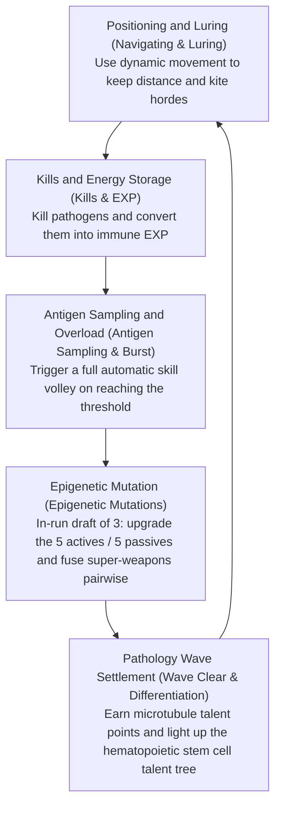

# Project: Phagocyte Product Design Document (GDD / PRD)

---

## 1. Product Overview and Core Positioning

- **Genre**: 2D top-down microscopic action roguelite (Top-Down Microscopic Survivor-like).
- **Target platforms**: PC (Steam), with gamepad and keyboard/mouse support.
- **Engine**: Godot 4.x (chosen for its 2D physics and RenderingServer high-concurrency advantages).
- **Core value proposition (USP)**:
  - **WYSIWYG organic physical morphing**: White blood cell bodies stretch dynamically and randomly, with polygon boundaries and collision shapes fully synchronized in real time.
  - **Hardcore physiology gamified**: Antigen presentation, opsonization, overload digestion, and NETosis are turned into core power fantasies, delivering "playing is understanding immunology".
  - **Decoupled "chassis + morphology modules + plug-in organelles" architecture**: All white blood cells share the same microfilament/microtubule chassis; morphology and behavior are fully skill-driven and parameterized, supporting free loadouts and mutations.
  - **Purely generic global Stat matrix**: Strictly following Survivor-like philosophy, all attributes are 100% generic, with absolutely no single-skill-specific private attributes.
  - **Classic "5 actives + 5 passives" slots with a 1:1 ultimate super-weapon loop**: 5 auto-firing active biochemical skills, 5 generic-Stat passive traits, max-level pairwise fusion into 5 ultimate epigenetic super-weapons.
  - **PoE-style single unified hematopoietic stem cell (HSC) talent tree**: Based on the real myeloid and lymphoid differentiation pathways, all cells share one tree but start from different specialized portals, supporting cross-lineage biochemical build crafting.

---

## 2. Core Gameplay and Morphology-Decoupled Architecture

### Core Combat Loop


```mermaid
graph TD
    A["Positioning and Luring (Navigating & Luring)<br>Use dynamic movement to keep distance and kite hordes"] --> B["Kills and Energy Storage (Kills & EXP)<br>Kill pathogens and convert them into immune EXP"]
    B --> C["Antigen Sampling and Overload (Antigen Sampling & Burst)<br>Trigger a full automatic skill volley on reaching the threshold"]
    C --> D["Epigenetic Mutation (Epigenetic Mutations)<br>In-run draft of 3: upgrade the 5 actives / 5 passives and fuse super-weapons pairwise"]
    D --> E["Pathology Wave Settlement (Wave Clear & Differentiation)<br>Earn microtubule talent points and light up the hematopoietic stem cell talent tree"]
    E --> A
```

### "Chassis + Morphology Parameter Modules + Plug-in Organelles" Decoupled Architecture

To solve the architectural problem of "cell morphology bound to bespoke animations makes skills impossible to reuse", this project decomposes cells into a three-layer biological model:

1. **Unified Chassis**:
   - All white blood cells share the same microfilament/microtubule system at the physics level.
   - **Standardized initial radius**: uniformly set to `base_radius = 24.0`, so every cell has a fair and equal hit area and baseline mobility at level 1, eliminating early-game balance skew.
2. **Vertex Noise Parameter Modules (Morphology Modifiers)**:
   - No skeletal animation; instead `FastNoiseLite` drives dynamic `Polygon2D` vertex displacement.
   - Three low-level noise parameter pools are distilled for the skill and talent systems to modify dynamically at any time:
     - **Amplitude (pseudopod extension amplitude)**: controls how far pseudopods extend. Scales dynamically with the global generic attribute `area`.
     - **Frequency (synapse/spike density)**: controls the frequency of edge undulation. Higher values mean denser bristles and protrusions (e.g. dendritic cell); lower values mean smoother, rounder outlines (e.g. resting T/B cells).
     - **Smoothness (viscous fluidity)**: determines whether the boundary creeps like amoebic fluid or trembles tightly like a rigid cell wall.
3. **Modular Organelles**:
   - Special attacks that exceed the body mesh topology are built as independent mounted child nodes (PackedScene):
     - **Phagocytic pseudopod chain strike (`PseudopodChainVisual`)**: transient chained pseudopods fired by engulfing pseudopods, dealing two-stage chain-extend-then-burst-on-hit damage; the old pseudopod grapple-claw IK organ has been merged into this mechanic and removed.
     - **Receptor spike array (`ReceptorSpikes.tscn`)**: a ring of hovering receptors arranged around the cell edge, providing rotating fire, contact retaliation, or chemosensing.
4. **Biological Rationalization (Epigenetics and Chimera Mutation)**:
   - **Setting**: "Every white blood cell carries the complete gene library of the hematopoietic stem cell, lying dormant inside."
   - When a B cell equips the Macrophage-exclusive "Pseudopod Slam", the UI prompts: [Dormant gene unlocked: scavenger receptor CD36]; visually, lysosomes surface on the B cell as it suddenly sprouts giant fleshy pseudopods.
   - Cross-lineage combinations are framed as [Chimera Mutation], giving players the chuuni thrill and strategic joy of cultivating biochemical monster builds.

---

## 3. Character Matrix and Cell Morphology (Cell Morphology & Visual Matrix)

### Starting Chassis and Microscopy Feature Reference

All characters share the same starting collision area (`base_radius = 24.0`), but are given strong visual identity based on real microscope observations, through polygon noise parameters, nuclear geometric primitives, and organelle details:

| Cell Type | Body Size (Real μm) | In-Game Appearance and Boundary Features | Nucleus Shape (Key Microscopy Identifier) | Starting Talent Portal |
| :--- | :--- | :--- | :--- | :--- |
| **Macrophage<br>(Macrophage)** | Very large<br>($20 \sim 40\,\mu\text{m}$) | **Fluid amoeboid form**. Violently undulating boundary with many surface wrinkles and continuously extending thick pseudopods; dark lysosome granules visible inside the body. | **Giant kidney-shaped / horseshoe single nucleus** (eccentrically placed). | [Mononuclear Giant Region]<br>Melee tank, pseudopod strikes, all-damage reduction |
| **Killer T cell<br>(CTL / CD8+)** | Fairly small<br>($7 \sim 10\,\mu\text{m}$) | **Compact microvilli-covered sphere**. Smooth round surface with high-frequency low-amplitude shimmer; on dash activation the front polarizes into a flat "immune synapse". | **Oversized perfectly round nucleus** (occupying $\sim 80\%$ of the body, leaving only a thin rim of cytoplasm at the edge). | [Polarized Cilia Region]<br>High-speed assassin, piercing membrane rupture, single-target execution |
| **Neutrophil<br>(Neutrophil)** | Medium<br>($10 \sim 15\,\mu\text{m}$) | **High-frequency jittery membrane**. Extremely unstable boundary that fragments easily into granules; cytoplasm packed with tiny pale bactericidal granules. | **Segmented multi-lobed nucleus (3-5 lobes)** (like linked sausages or beads). | [Granule Activation Region]<br>Entrenched self-detonation, high-frequency lobbing, acid splash |
| **B cell<br>(B-Cell)** | Small-to-medium<br>($8 \sim 12\,\mu\text{m}$) | **Receptor-dotted sphere**. Compact and round at rest, ringed by Y-shaped receptor light spots; swells when activated into a plasma cell, with endoplasmic reticulum arranged like factory lines. | **Cartwheel / clock-face nucleus** (chromatin arranged in radial spokes). | [Endoplasmic Reticulum Factory]<br>Ranged guidance, rapid antibody fire, auto-homing |
| **Dendritic cell<br>(Dendritic Cell)** | Large and spreading<br>($15 \sim 30\,\mu\text{m}$) | **Star-shaped dendritic anemone**. Compact body extending dense branching dendrites in all 360 degrees, with an enormous sensing radius. | **Central irregular oval nucleus**. | [Antigen Sensing Hub]<br>Wide-area sampling, signal transduction, patrol-army summoning |

---

### Dynamic Volume and Area Scaling (Volume & Area Scaling)

Under the core "collision damage + kill EXP" mechanic, body size strictly follows an intuitive and pure **Area-proportional scaling rule** (like Path of Exile AoE scaling), with no added inertia or extra-emitter math, keeping combat feeling fast and pure:

#### Dynamic Volume Linkage Formula

Define the global real-time volume scaling factor $\alpha$:
$$\alpha = \frac{R_{\text{current}}}{R_{\text{base}}} = \text{stats.area}$$

- **"Bigger hitbox, bigger contact surface" (proportional collision-area scaling)**: the cell polygon hitbox scales proportionally with $\alpha$. A wider contact surface hits more trash mobs at once, but the vulnerable cross-section grows in sync.
- **Proportional skill-hitbox and projectile scaling (PoE-style AoE scaling)**: the hit range, projectile size, and blast radius of all active biochemical skills are multiplied directly by $\alpha$.
- **Purity principle (no hidden complex mechanics)**:
  - **No mass inertia or charge delay**: steering and emergency stops always feel equally agile, with no input lag.
  - **Projectile count is unaffected by body size**: bonus projectile count is 100% controlled by the generic attribute `amount`, keeping attribute boundaries crisp.

---

## 4. Global Generic Stat Matrix (Universal Character Stats)

For modularity and high reusability, this game's numeric system **completely eliminates any "single-skill-specific attribute"**. All characters, passive traits, talent nodes, and in-run upgrades operate only on the following purely generic attribute pool:

```
                     ┌─────────────────────────┐
                     │ Universal Stat Dictionary (Pool) │
                     └────────────┬────────────┘
          ┌───────────────────────┼───────────────────────┐
          ▼                       ▼                       ▼
 [Universal Combat Stats (Combat - 23 items)] [Universal Survival Stats (Defense - 11 items)] [Universal Utility Stats (Utility - 1 item)]
 · Damage (Damage Multiplier)             · Max Health (Max Health)        · Magnet (Pickup Radius)
 · Area (Area/Volume)              · Health Regen (Health Regen)
 · Cooldown Reduction (CDR)     · Armor (Mitigation/Armor)
 · Projectile Speed (Projectile Speed)   · Move Speed (Move Speed)
 · Duration (Duration)           · Evasion (Fluid Evasion Rate)
 · Amount (Bonus Count)             · Block (Glycocalyx Block Rate)
 · Pierce (Pierce Count)             · Life Steal (Receptor Drain/Life Steal)
 · Crit Chance (Crit Chance)        · Stagger (Deflect/Delayed Damage)
 · Crit Damage (Crit Multiplier)        · Recoup (Recovery/Delayed Heal)
 · Armor Penetration (Armor Penetration)  · Ailment Threshold (Ailment Threshold)
 · Ailment Chance (Ailment Proc Rate)
 · Dot Damage (Damage-over-Time Multiplier)
 · Physical/Fire/Cold/Lightning/Chaos Damage (Five Damage Types)
 · Melee/Spell/AoE/Projectile/Minion Damage (Tag-Conditional Damage)
 · Ailment Effect (Ailment Effect)
```

### Generic Stat Dictionary in Detail

#### 1. Generic Combat Stats - consumed by all 5 active skills
| Stat Code | Display Name | Default Baseline | Generic Resolution Rule |
| :--- | :--- | :--- | :--- |
| `damage` | **Damage Multiplier** | `1.0` (100%) | Global base damage percentage pool. Applies to every resolution, whether direct hits, DoT corrosion, or mine detonations. Merges with elemental/tag damage PoE-style as an additive Increased pool: `inc = (damage - 1) + (type - 1) + sum(tag - 1)`, total multiplier is `max(0, 1 + inc)`. |
| `area` | **Area / Volume** | `1.0` (100%) | Global size multiplier. Scales projectile size, AoE blast radius, spray cone angle, and the **cell body contact surface** proportionally. |
| `cooldown_reduction` | **Cooldown Reduction (CDR)** | `0.0` (0%) | Shortens the cycle cooldown of all active skills by a percentage (capped at `0.75`, i.e. 75%). |
| `projectile_speed` | **Projectile Speed** | `1.0` (100%) | Flight-speed multiplier for all projectiles (antibodies, beams, acid droplets, ejected pseudopod grapples). |
| `duration` | **Duration** | `1.0` (100%) | Lifetime multiplier for all persistent field entities (acid-mist DoT residue, complement array mines, mucus snare traps). |
| `amount` | **Bonus Count** | `0` (shots) | **Flat bonus to the per-cast spawn count of every skill** (e.g. antibodies $+1$ missile, perforin volley $+1$ beam, pseudopod $+1$ extra claw). |
| `pierce` | **Pierce Count** | `0` (times) | Extra times a projectile passes through enemies (keeps flying forward after piercing). |
| `crit_chance` | **Crit Chance** | `0.05` (5%) | Chance for any damage source to critically strike an enemy weak point for lethal specific damage. |
| `crit_damage` | **Crit Multiplier** | `2.0` (200%) | Resolved damage multiplier when a crit triggers. |
| `armor_penetration` | **Armor Penetration** | `0.0` (0%) | Armor penetration fraction frozen at fire time (hard cap `1.0`). |
| `ailment_chance` | **Ailment Proc Rate** | `1.0` (100%) | Chance to apply an `on_hit` ailment on hit; crits always apply. |
| `dot_damage` | **Damage-over-Time Multiplier** | `1.0` (100%) | Global DoT damage multiplier, resolved together with `damage`. Read live from the applier on hit: $\text{dps} = \text{mag} \times \text{scale} \times \text{dot\_damage}$ (non-player appliers count as `1.0`). |
| `physical_damage` | **Physical Damage** | `1.0` (100%) | Physical damage bonus, accumulated additively (`increased`) with `damage` and other tag damage in the generic bonus pool. |
| `fire_damage` | **Fire Damage** | `1.0` (100%) | Fire damage bonus, accumulated additively (`increased`) with `damage` and other tag damage in the generic bonus pool. |
| `cold_damage` | **Cold Damage** | `1.0` (100%) | Cold damage bonus, accumulated additively (`increased`) with `damage` and other tag damage in the generic bonus pool. |
| `lightning_damage` | **Lightning Damage** | `1.0` (100%) | Lightning damage bonus, accumulated additively (`increased`) with `damage` and other tag damage in the generic bonus pool. |
| `chaos_damage` | **Chaos Damage** | `1.0` (100%) | Chaos damage bonus, accumulated additively (`increased`) with `damage` and other tag damage in the generic bonus pool. |
| `melee_damage` | **Melee Damage** | `1.0` (100%) | Applies only to `Melee`-tagged skills, accumulated additively (`increased`) with `damage` in the generic bonus pool. |
| `spell_damage` | **Spell Damage** | `1.0` (100%) | Applies only to `Spell`-tagged skills, accumulated additively (`increased`) with `damage` in the generic bonus pool. |
| `aoe_damage` | **Area Damage** | `1.0` (100%) | Applies only to `AOE`-tagged skills, accumulated additively (`increased`) with `damage` in the generic bonus pool. |
| `projectile_damage` | **Projectile Damage** | `1.0` (100%) | Applies only to `Projectile`-tagged skills, accumulated additively (`increased`) with `damage` in the generic bonus pool. |
| `minion_damage` | **Minion Damage** | `1.0` (100%) | Applies only to `Minion`-tagged skills (none yet, reserved for summon skills), accumulated additively (`increased`) with `damage` in the generic bonus pool. |
| `ailment_effect` | **Ailment Effect** | `1.0` (100%) | Ailment strength multiplier (DoT damage excluded, handled by `dot_damage`). Read live from the applier on hit; non-DoT channel magnitudes are multiplied by it, duration unchanged. |

#### 2. Generic Survival and Defense Stats (Defense & Survival)
| Stat Code | Display Name | Default Baseline | Generic Resolution Rule |
| :--- | :--- | :--- | :--- |
| `max_health` | **Max Health** | `100.0` | Maximum total durability before the cell membrane ruptures. |
| `health_regen` | **Health Regen Rate** | `0.0` (HP/s) | Flat health the membrane auto-repairs per second. |
| `armor` | **Membrane Rigidity / Armor** | `0.0` (points) | POE armor formula: $\text{mitigation} = \frac{\text{Armor}}{\text{Armor} + 5.0 \times \text{Damage}}$; big hits penetrate deeper. DoTs use per-second dps through the same-shaped curve (`DotArmorFactor` tunable), and also respect armor penetration. |
| `damage_taken` | **Damage Taken** | `1.0` (100%) | Damage-taken multiplier (independent of the armor curve). Player defense is the mutation multiplier times this attribute; direct hits and DoT entries each multiply once, while stagger-pool drains are not double-counted. |
| `move_speed` | **Move Speed** | `230.0` (px/s) | Baseline cruising swim speed of the player cell. |
| `evasion` | **Fluid Evasion Rate** | `0.0` (0%) | Chance for amoebic membrane fluid deformation to fully avoid damage (hard cap `0.60`, i.e. 60%). First check on being hit. |
| `block` | **Glycocalyx Block Rate** | `0.0` (0%) | Chance for the dense surface glycocalyx barrier to deflect and negate damage (hard cap `0.75`, i.e. 75%). Second check on being hit. |
| `life_steal` | **Receptor Drain / Life on Hit** | `0.0` (0%) | Chance for any damage source to trigger self-repair on hitting an enemy (restores a flat 1 HP on proc, hard cap `0.20`, i.e. 20%). |
| `stagger` | **Deflect / Delayed Damage** | `0.0` (0%) | Fraction of hit damage diverted into a stagger pool (decays exponentially over 4 seconds as armor-ignoring DoT), players only, direct hits only (hard cap `0.60`, i.e. 60%). |
| `recoup` | **Recovery / Delayed Heal** | `0.0` (0%) | Fraction of a direct hit recovered in installments over 4 seconds (ignores heal suppression), players only (hard cap `0.30`, i.e. 30%). |
| `ailment_threshold` | **Ailment Threshold** | `1.0` (100%) | Self ailment-threshold multiplier (floor `0.0` only, no cap). |

#### 3. Generic Utility and Economy Stats (Utility & Economy)
| Stat Code | Display Name | Default Baseline | Generic Resolution Rule |
| :--- | :--- | :--- | :--- |
| `magnet` | **Chemotactic Pull (Pickup)** | `150.0` (px) | Effective radius for auto-collecting nearby EXP motes (ATP) and antigen fragments. |

---

## 5. Skill Slots: "5 Actives + 5 Passives + 4 Organelle Chambers" and the Ultimate Super-Weapon System

In a single run the player holds at most **5 active biochemical skills**, **5 passive metabolic traits**, and **4 organelle chamber pieces**. At max level, actives plus passives fuse 1:1 into 5 ultimate super-weapons:

```
┌────────────────────────────────────────────────────────┐
│ Active Skill Slots (Active Cytokines x5) - Fully automatic independent firing cycles │
│ [1: Perforin Lance] [2: Complement Cascade] [3: Antibody Salvo] [4: ROS Spray] [5: Pseudopod Lunge] │
├────────────────────────────────────────────────────────┤
│ Passive Trait Slots (Passive Organelles x5) - Provide pure generic Stat bonuses │
│ [1: Lysosome Enzymes] [2: Actin] [3: Opsonin]   [4: Mitochondria]   [5: Chemokine Receptor] │
│   (Damage+Regen) (Area+Speed)  (Crit+Dmg)     (CDR+Dur)   (Magnet+Speed)│
├────────────────────────────────────────────────────────┤
│ Organelle Chamber (Organelle Chamber 2x2) - High-cost extremes + generator puzzle    │
│ [Slot 1] [Slot 2]                                            │
│ [Slot 3] [Slot 4]   Used/Cap = sum of positive costs / (6 + generator count)    │
└────────────────────────────────────────────────────────┘
```

The organelle chamber is an independent third system: base energy 6, `energy_cost ∈ [-1, 4]` (`-1` = `+1` generation with a mandatory heavy downside), used = sum of positive costs, cap = 6 + total generation, legal iff used <= cap and piece count <= 4. All effects run 100% through generic Stats (see `docs/skill.md` section 4 and the energy notes in `docs/stat.md`).

### 5 Active Biochemical Skills (Active Cytokines) - Automatic Cyclic Fire
All active skills trigger independently on cooldown (Cooldown) cycles and resolve automatically with generic Stats:

| Active Skill Name | Medical Mechanism | Consumed Generic Stats | Combat Behavior and Mechanics |
| :--- | :--- | :--- | :--- |
| **1. Perforin Lance<br>(Perforin Lance)** | Perforin pore formation on membranes | `damage`, `projectile_speed`, `amount`, `pierce`, `crit_chance` | Fires a high-velocity spiral beam at the nearest elite. `amount` adds volley count, `pierce` adds enemies pierced. |
| **2. Complement Cascade<br>(Complement Cascade)** | Complement chain cleavage cascade | `damage`, `area`, `cooldown_reduction`, `duration` | Spawns biochemical halos on random nearby ground; `area` enlarges mine radius, detonating after a 2-second delay with a violent knockback blast. |
| **3. Y-Shaped Antibody Salvo<br>(Antibody Salvo)** | Free specific antibody secretion | `damage`, `amount`, `cooldown_reduction`, `projectile_speed`, `duration` | Periodically erupts homing Y-shaped missiles in 360 degrees; `amount` directly increases missiles per volley. |
| **4. Reactive Oxygen Species Spray<br>(ROS Spray)** | NADPH oxidase releasing $\text{H}_2\text{O}_2$ | `damage`, `area`, `duration`, `cooldown_reduction` | Sprays a high-pressure cone of acid mist in the swim direction; `area` widens the spray cone, dealing armor-stripping DoT corrosion. |
| **5. Pseudopod Lunge<br>(Pseudopod Lunge)** | Instant microfilament-polymerization snap | `damage`, `area`, `amount`, `cooldown_reduction` | Violently ejects amoebic grapples outward; `area` extends grapple reach, `amount` adds grapples in more directions. |

---

### 5 Passive Metabolic Traits (Passive Organelles) - Provide Pure Generic Stats
Passive skills contain no skill-specific logic and purely grant the host generic Stat bonuses:

| Passive Trait Name | Biological Flavor | Pure Generic Stat Bonus Granted (per level) |
| :--- | :--- | :--- |
| **1. Lysosome Enzymes (Lysosome Priming)** | Intracellular hydrolase activation | `damage +10%` / `health_regen +0.6 HP/s` (all-damage boost and autophagic repair) |
| **2. Actin Microfilaments (Actin Polymerization)** | Directed cytoskeletal microfilament polymerization | `area +12%` / `move_speed +6%` (all-skill area growth and repositioning speed) |
| **3. Opsonin Affinity (Opsonin Affinity)** | Specific recognition receptor proliferation | `crit_chance +5%` / `crit_damage +25%` (all-damage crit rate and crit multiplier surge) |
| **4. Mitochondrial Overclock (Mitochondrial Overclock)** | TCA-cycle energy output multiplication | `cooldown_reduction +8%` / `duration +10%` (all-skill fire-rate acceleration and field persistence) |
| **5. Chemokine Receptors (Chemokine Receptors)** | Surface chemical antenna array | `magnet +25%` / `move_speed +6%` (auto-pickup radius growth and chemotactic swim speed) |

---

### 5 Ultimate Epigenetic Super-Weapons (Epigenetic Evolutions / 1:1 Max-Level Fusion)

When an active skill reaches Lv.5 (Max) and its matching passive trait is held, its mutated form unlocks from an elite chest:

```mermaid
graph LR
    subgraph Five Two-in-One Super-Weapon Matrix
        A1["Perforin Lance (Max)"] + B1["Lysosome Enzymes"] --> EVO1["[Granzyme Execution]<br>(Granzyme Apoptosis)"]
        A2["Complement Cascade (Max)"] + B2["Actin Microfilaments"] --> EVO2["[Membrane Attack Termination Array]<br>(MAC Hyper-Array)"]
        A3["Y-Shaped Antibody Salvo (Max)"] + B3["Opsonin Affinity"] --> EVO3["[Neutralizing High-Pressure Tempest]<br>(Neutralizing Tempest)"]
        A4["ROS Spray (Max)"] + B4["Mitochondrial Overclock"] --> EVO4["[Peroxide Leviathan]<br>(Superoxide Leviathan)"]
        A5["Pseudopod Lunge (Max)"] + B5["Chemokine Receptors"] --> EVO5["[Amoebic Primordial Maw]<br>(Amoebic Maelstrom)"]
    end
```

1. **[Granzyme Execution] (Granzyme Apoptosis)** (Perforin Lance + Lysosome Enzymes):
   - Injects granzyme to trigger programmed apoptosis. The target detonates and self-destructs after 1 second, spraying 6 chained perforin beams in all directions and setting off a domino screen clear.
2. **[Membrane Attack Termination Array] (MAC Hyper-Array)** (Complement Cascade + Actin Microfilaments):
   - Complement mines attach directly to the player's pseudopod tips, so movement paints roaming chemical vortices across the battlefield; viruses that touch them lyse directly into ATP EXP drops.
3. **[Neutralizing High-Pressure Tempest] (Neutralizing Tempest)** (Y-Shaped Antibody Salvo + Opsonin Affinity):
   - Fires 32 high-frequency antibodies. Antibodies hitting different targets string "high-pressure immune filaments" between them, dealing max-HP-percentage true damage to every mob the filaments cut across.
4. **[Peroxide Leviathan] (Superoxide Leviathan)** (ROS Spray + Mitochondrial Overclock):
   - Cancels the forward spray. The whole cell boundary is wrapped in a blue-green superoxide plasma membrane, becoming a spinning shredder that melts any non-Boss pathogen on contact.
5. **[Amoebic Primordial Maw] (Amoebic Maelstrom)** (Pseudopod Lunge + Chemokine Receptors):
   - Pseudopod shots split into 4 omnidirectional giant amoebic grapples, forming a super suction biochemical storm that drags the whole screen of viruses and EXP motes into a strangling force field and shreds them!

---

### 6. Hematopoietic Stem Cell Talent Tree (Hematopoiesis Talent Matrix)

The talent tree uses an **orthogonal grid board x confocal fluorescence microscopy** design: the five white blood cells have their own **5 distinct starting hubs**, each node occupying a single integer grid point, with edges strictly limited to orthogonally adjacent nodes (90-degree connections) so microtubules never overlap and never cross.

```
               Macrophage starting hub (top-left)        Dendritic starting hub (top-center)
                      ┌───────────────────────┐
        Neutrophil start   │  Central microtubule interconnect network  │   Killer T starting hub (right)
                      └───────────────────────┘
                             B cell starting hub (bottom-right)
```

- **Five independent starting hubs**:
  - Macrophage starting hub (top-left): focuses `area` (bulk/area), `max_health` (max HP), `armor` (membrane rigidity mitigation), `block` (glycocalyx block rate).
  - Killer T starting hub (right): focuses `move_speed` (move speed), `crit_chance` (crit rate), `pierce` (pierce), `evasion` (fluid evasion rate).
  - Neutrophil starting hub (left): focuses `damage` (damage strength), `health_regen` (health regen).
  - B cell starting hub (bottom-right): focuses `amount` (projectile count), `projectile_speed` (projectile velocity), `cooldown_reduction` (CDR), `life_steal` (receptor drain/life steal).
  - Dendritic starting hub (top-center): focuses `magnet` (pickup radius), `duration` (status and aura duration), `cooldown_reduction` (cooldown reduction), `area` (sensing and effect area).
- **Cell-specific Manhattan ring layers**: with the deployed cell's starting hub as the origin, $L_{\text{cell}} = |col - col_{\text{start}}| + |row - row_{\text{start}}|$.
  - $L = 0$: that cell's exclusive starting hub (innate, costs 0 points).
  - $L = 1 \sim 2$: exclusive core metabolism ring and entry-level generic attributes.
  - $L = 3 \sim 4$: advanced specialization microtubules and trunk routes to the central nexus.
  - $L \ge 5$: central interconnect nexus and cross-entry into other cells' specialization domains (cross-lineage chimeric differentiation).

### Node Purchase Rules and "Zero-Complexity Scaling" Numeric Principles

- **Purchase rules**: each node can be bought once (single stack), costing 1 passive talent point per purchase; the deployed cell's starting hub is innate and costs 0 points.
- **Pure base attributes only (No Scaling principle)**:
  - The current version **forbids any complex attribute linkage or derived scaling** (e.g. "gain Y damage per X HP" or "convert armor into crit").
  - All nodes grant only transparent flat or percent values:
    $$\text{FinalStat} = (\text{Base} + \text{FlatBonus}) \times (1.0 + \text{PercentBonus})$$
- **Rarity tiers**:
  - **Normal**: single small base attribute (e.g. `damage +5%`, `max_health +10`).
  - **Magic**: larger or dual complementary attributes (e.g. `area +8%` + `armor +2`).
  - **Rare**: large pure-attribute bonuses (e.g. `damage +15%`, `move_speed +10%`).
  - **Unique / Keystones**: **[TODO in the future]** Not implemented in the current version; mechanic-subverting Keystones are deferred to keep early-version numbers stable and debugging simple.

### Rendering Language (Confocal Fluorescence)

- Deep blue-black background `#050B14`, central checkerboard with radial cold-cyan fluorescence, plus Brownian-motion dust in the outer ring.
- Edges are vertical/horizontal orthogonal microtubules; lit paths flow with ATP bioelectric pulses along the lines; all edges connect only adjacent grid points, guaranteeing no overlaps and no crossings.
- Nodes are organic vesicles: circles / diamonds / hexagons / stars by rarity, each pinned to a single grid point.
- Each node can be bought once (single stack), and effects do not grow with stacking.

---

## 7. Stage Pathology Mechanics and Enemy Bestiary (see docs/stages.md and docs/pathogen.md for details)

### Dual Difficulty Tracks and Achievement Unlock Chain (Achievement Map Unlocks)
- **Unlock philosophy**: except for the starting map "Acute Wound", all later human-organ micro maps and the "Hard" acute-crisis difficulty unlock by earning the corresponding clinical-clearance achievements.
- **Unlock chain**:
  1. Clear [Acute Wound (`acute_wound`)] Normal (achievement: `wound_clear`) $\to$ unlock [Alveolar Space (`alveolar_space`)] Normal and Acute Wound Hard.
  2. Clear [Alveolar Space (`alveolar_space`)] Normal (achievement: `alveolar_clear`) $\to$ unlock [Hepatic Sinusoid (`hepatic_sinusoid`)] Normal and Alveolar Space Hard.
  3. Clear [Hepatic Sinusoid (`hepatic_sinusoid`)] Normal (achievement: `hepatic_clear`) $\to$ unlock [Gastric Lumen (`gastric_lumen`)] Normal and Hepatic Sinusoid Hard.
  4. Clear [Gastric Lumen (`gastric_lumen`)] Normal (achievement: `gastric_clear`) $\to$ unlock [Blood-Brain Barrier (`blood_brain_barrier`)] Normal and Gastric Mucosa Hard.
  5. Clear [Blood-Brain Barrier (`blood_brain_barrier`)] Normal (achievement: `bbb_clear`) $\to$ unlock Blood-Brain Barrier Hard plus a completion memorial reward.

### 5 Dynamic Pathology Organ Stages and Fluid Mechanics
- **01. Acute Wound (Acute Wound)**: ruptured microvessels periodically generate strong tissue-fluid suction pointing toward the outer wound edge; fibrin mesh covers the ground and hampers normal movement.
- **02. Alveolar Space (Alveolar Space)**: periodic breathing airflow shear brings wide-area downward/upward fluid thrust; anchor with pseudopods to avoid losing control; the scene floats high-oxygen stimulation bubbles (CDR +25%).
- **03. Hepatic Sinusoid (Hepatic Sinusoid)**: periodic sweeping micro bile-acid hydrolysis currents weaken armor; endothelial micro-fenestrae filter and block hypertrophic cells (dash does not pass through walls).
- **04. Gastric Lumen (Gastric Lumen)**: the ground periodically surges with strongly corrosive gastric-acid tidal waves; Helicobacter pylori urease neutralization rings provide local shelter.
- **05. Blood-Brain Barrier Capillaries (Blood-Brain Barrier)**: extremely narrow microvessels with high-shear blood flow; astrocyte end-foot channel maze; neural electric pulses disrupt positioning.
- **Endgame mode: Endless Cytokine Storm (Endless Cytokine Storm - see docs/endgame.md for details)**: unlocked after clearing Hard, breaks the 15:00 time cap, with exponential stat overload every 3 minutes, twin/triple Boss ambushes, and opt-in pathology overload affixes (Afflictions).

### 3-Minute High-Frequency Wave Escalation (3-Minute Escalation Loop)
To avoid the dullness of the traditional 5-minute pacing, stages strictly use a 3-minute dynamic flow cycle:
`03:00` first mechanic elite $\to$ `06:00` first horde swarm + double elites $\to$ `09:00` mid lesser-lord showdown (guaranteed super-weapon chest) $\to$ `12:00` extreme mega-horde $\to$ `15:00` primary Boss lock-in showdown.

### On-Screen Cap and "Faster Kills, Faster Respawns" Dynamic Backfill (Kill-Driven Dynamic Backfill)
- **Concurrent monster cap**: normal waves are locked at **300**, extreme hordes dynamically expand to **450**, balancing 60 FPS on low-end hardware with microscopic encirclement pressure.
- **Instant backfill**: when the live monster count drops below the cap, the spawner immediately (delay $<0.15\text{s}$) backfills the deficit just outside the view boundary.
- **Breaking clear homogeneity**: extreme-output super-weapon builds that vaporize mobs refill faster, killing **5,000-8,000+** in a 15-minute clear; passive turtling defense builds that keep the field full and never backfill only kill **800-1,200**. Final scores can differ by **5-8x**, cleanly separating player skill and build kill-throughput (KPM) (see `docs/stages.md` and `docs/record.md`).

### Pathogen Behavior Matrix (20+ microbes, see docs/pathogen.md)
- **Coronavirus (S-Virus)**: surface spike proteins that apply slowing adhesion on collision.
- **Staphylococcus aureus (Staph)**: grape-cluster huddling movement AI that forms dense colony shield walls.
- **Escherichia coli (E. Coli)**: peritrichous-flagella straight-line charge dash (Charge Dash).
- **Mutant influenza virus (Flu-Drift)**: fast multi-spiked particles with periodic burst drift acceleration.
- **Mutant cancer cell (Malignant Cell)**: ultra-durable bullet sponge that self-replicates into daughter cells if it survives too long.

---

## 8. Tech Pipeline and Godot 4 Code Architecture

### Generic Attribute Class Implementation Spec (`Stat.gd` & `CellStats.gd`)

```gdscript
# scripts/core/stat.gd
class_name Stat
extends RefCounted

var base_value: float = 0.0
var flat_bonus: float = 0.0
var percent_bonus: float = 0.0

func _init(p_base: float = 0.0) -> void:
	base_value = p_base

func get_value() -> float:
	return (base_value + flat_bonus) * (1.0 + percent_bonus)

func add_modifier(flat: float, pct: float) -> void:
	flat_bonus += flat
	percent_bonus += pct
```

`CellStats.gd` manages all global Stat instances of the host uniformly:

```gdscript
# scripts/core/cell_stats.gd
class_name CellStats
extends Node

var damage: Stat = Stat.new(1.0)
var area: Stat = Stat.new(1.0)
var cooldown_reduction: Stat = Stat.new(0.0)
var projectile_speed: Stat = Stat.new(1.0)
var duration: Stat = Stat.new(1.0)
var amount: Stat = Stat.new(0.0)
var pierce: Stat = Stat.new(0.0)
var crit_chance: Stat = Stat.new(0.05)
var crit_damage: Stat = Stat.new(2.0)

var max_health: Stat = Stat.new(100.0)
var health_regen: Stat = Stat.new(0.0)
var armor: Stat = Stat.new(0.0)
var move_speed: Stat = Stat.new(230.0)
var evasion: Stat = Stat.new(0.0)
var block: Stat = Stat.new(0.0)
var life_steal: Stat = Stat.new(0.0)
var stagger: Stat = Stat.new(0.0)
var recoup: Stat = Stat.new(0.0)

var magnet: Stat = Stat.new(150.0)
```

### Active Skill Generic Stat Usage Spec

```gdscript
# Unified pattern for all ActiveSkills when computing projectiles or damage
func get_calculated_damage() -> float:
	var base = base_damage * stats.damage.get_value()
	if randf() < stats.crit_chance.get_value():
		return base * stats.crit_damage.get_value()
	return base

func get_calculated_cooldown() -> float:
	var cdr = clampf(stats.cooldown_reduction.get_value(), 0.0, 0.75)
	return base_cooldown * (1.0 - cdr)

func get_projectile_count() -> int:
	return base_amount + int(stats.amount.get_value())
```

### Skill Manager (`SkillManager.gd`) "5 Actives + 5 Passives" Architecture

```gdscript
# scripts/skills/skill_manager.gd
const MAX_ACTIVE_SLOTS: int = 5
const MAX_PASSIVE_SLOTS: int = 5

var active_slots: Array[BaseSkill] = []
var passive_slots: Array[BaseSkill] = []

func update_all_skills(delta: float) -> void:
	# Only active skills run per-frame cycle timing and firing
	for skill in active_slots:
		if skill:
			skill.update_skill(delta)
```

---

## 9. Implementation TODO Checklist

### Phase 1: Core Generic Stats and Skill Architecture (Core Stats & 5+5 Architecture)
- [x] Implement the `Stat.cs` numeric class (supports base / flat / percent composite math)
- [x] Implement the `CellStats.cs` global attribute manager encapsulating the generic attribute pool
- [x] Refactor `SkillManager.cs` into the "5 actives + 5 passives" independent slot architecture
- [x] Build the generic white blood cell chassis node (`BaseCell`) with standardized physics radius `BaseRadius = 48.0`
- [x] Implement `FastNoiseLite` dynamic vertex morphing synced to `CollisionPolygon2D` (inside `BaseCell`)

### Phase 2: Kill Loop and Combat Feel (Combat & Kill Loop)
- [x] Implement kill-to-immune-EXP (EXP) conversion for pathogens
- [ ] Implement tap-Space "Dodge Roll" micro-mechanic (1 charge, 2.5s recharge, dash i-frames)
- [x] Implement the in-run draft-of-3 upgrade UI (active / passive / mutation cards)

### Phase 3: Five White Blood Cell Morphologies and Nuclei (Immune Cell Morphology)
- [x] Implement `GameManager.ClassData` numeric and appearance mapping
- [x] **Macrophage**: fluid amoebic boundary, eccentric kidney/horseshoe nucleus, large pseudopods
- [x] **Killer T cell**: compact perfect-sphere body, 80%-occupancy giant round nucleus, polarized synapse
- [x] **Neutrophil**: high-frequency jittery membrane, 3-5-lobe segmented nucleus, bactericidal granules
- [x] **B cell**: spherical appearance, cartwheel nucleus, peripheral receptor light spots
- [x] **Dendritic cell**: star-shaped dendritic anemone form, central oval nucleus, wide-area sensing antennae

### Phase 4: 5 Actives + 5 Passives + 5 Ultimate Super-Weapons (Skills & Evolutions)
- [x] Implement the 5 active biochemical skills: Perforin Lance, Complement Cascade, Y-Shaped Antibody Salvo, ROS Spray, Pseudopod Lunge
- [x] Implement plug-in organelles: `ReceptorSpikes.tscn` (receptor spikes); `PseudopodLimb.tscn` (IK grapple claw) merged into the phagocytic pseudopod chain strike and removed
- [x] Implement passive traits (pure generic Stat boosts, 13 total): Lysosome Enzymes, Actin Microfilaments, Opsonin Affinity, Mitochondrial Overclock, Chemokine Receptors, etc.
- [ ] Implement ultimate epigenetic super-weapon fusion logic (active + passive mutation fusion not yet implemented)

### Phase 5: Hematopoietic Stem Cell Talent Tree (Hematopoiesis Talent Matrix)
- [x] Build the globally connected talent tree UI and data persistence architecture
- [x] Implement the orthogonal grid board layout (five lineage bands + central HSC core, one node per cell)
- [x] Implement differentiation logic from the central stem cell to the five starting portals (nucleus -> core metabolism ring -> lineage portals)
- [x] Implement entry-node generic `StatModifier` accumulation (single purchase, single effect)
- [x] Implement the five specialization core keystones
- [x] Implement confocal fluorescence rendering: orthogonal microtubule pulses, vesicle nodes, checkerboard background (guaranteed no overlaps, no crossings)
- [x] Verify cross-board allocation (cross-lineage portals open through the core ring, covered by test suites)

### Phase 6: Enemy System and High-Concurrency Optimization (Enemies & Performance Pipeline)
- [ ] Implement 2D `QuadTree` spatial partitioning
- [ ] Use `MultiMeshInstance2D` for GPU-batched rendering of massive on-screen pathogen counts
- [x] Fit massive pathogen counts with lightweight `CircleShape2D` collisions
- [x] **Coronavirus (S-Virus)**: spike slow-adhesion, red blood cell invasion/replication AI
- [x] **Staphylococcus aureus (Staph)**: grape-cluster huddling movement AI, fibrin shield resolution
- [x] **Mutant influenza virus (Flu-Drift)**: antigenic drift resetting targeted-crit bonus mechanic
- [x] **Mutant cancer cell (Malignant Cell)**: MHC-I concealment, macrophage-rupture / NK-module resolution

### Phase 7: Dynamic Stage Pathology Environments (Pathological Level Stages)
- [x] **Acute Epidermal Fissure (Acute Wound)**: outward tissue-fluid suction field, fibrin-mesh movement-snare webs
- [x] **Alveolar Chamber (Alveolar Space)**: breathing airflow thrust field, pseudopod-anchored epithelial cell mechanic
- [ ] **Global crisis: Cytokine Storm (Cytokine Storm)**: pro-inflammatory overdrive overheat state, double-edged numeric bonuses with a host countdown timer

### Phase 8: Microscopic Aesthetics, Shader Rendering, and Science Codex (Microscopic Visuals & Edutainment)
- [x] 2D CanvasItem Shader: Fresnel edge glow (Fresnel Glow)
- [ ] $1024 \times 1024$ seamless translucent cytoplasm gel fluid texture (Normal / Roughness)
- [x] Floating nucleus with slight delayed spring physics (Spring Physics)
- [x] Multi-layer parallax scrolling and depth-of-field simulation (DoF)
- [x] Immunology Codex collection system with cryo-EM data
- [x] Case report settlement system (surviving to 05:00 triggers antibody-neutralization victory; HP hitting zero triggers SIRS membrane-rupture death; the settlement panel shows run data, victory/death classification, and persistable historical case reports)
