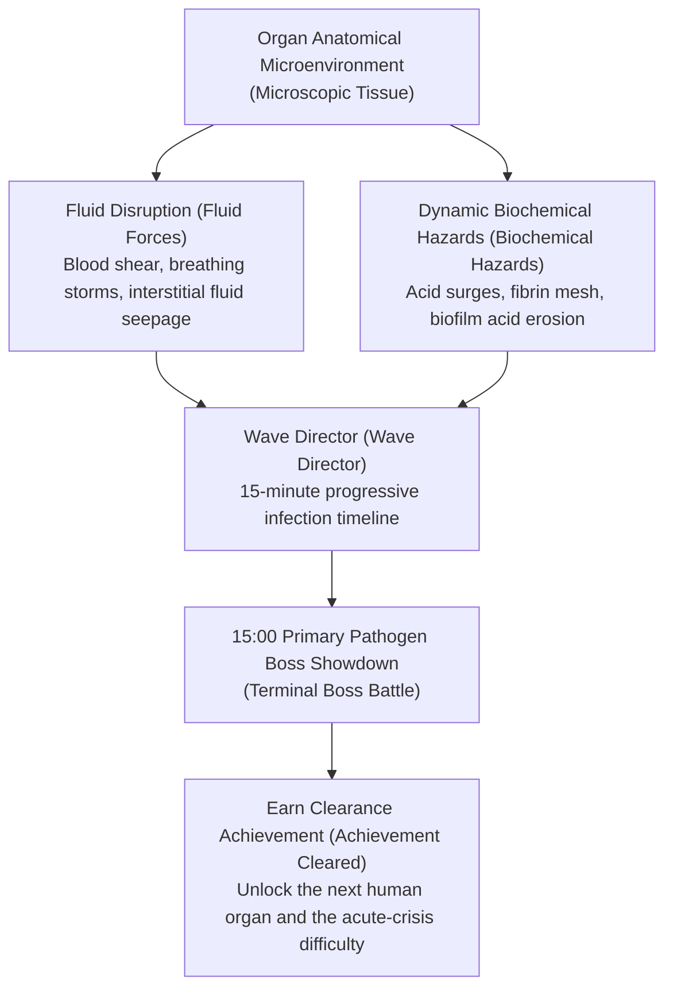
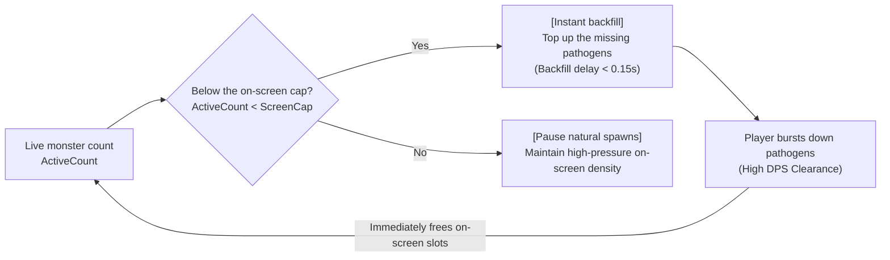

# Project: Phagocyte Stage Pathology Environments, Fluid Mechanics, and Wave Director Spec (Level Environments, Fluid Mechanics & Wave Director)

---

## 1. Stage Design Philosophy: Human Microscopic Tissue Slices

In Phagocyte, stages are never static background images; they are **microscopic pathology tissue slices of real human organs**. Each stage has unique **fluid mechanics (Fluid Mechanics)**, microenvironment hazards, and physiological events, and players must adapt swim trajectories and skill loadouts to the fluid signature.



---

## 2. Core Rules, Difficulty Tiers, and Achievement Unlocks (Dual Track)

Every map is divided into "Normal" and "Hard" acute-crisis difficulties. **Except for the starting map, all later maps and higher difficulties unlock by earning the corresponding achievement milestones**:

| Difficulty Tier | Unlock Condition (Achievement-Driven) | Survival Time | Monster Stat Modifiers | Environment and Fluid Modifiers | First-Clear Reward |
| :--- | :--- | :--- | :--- | :--- | :--- |
| **Normal<br>(Normal)** | Map 01 unlocked by default;<br>later maps require the previous map's clearance achievement (e.g. `wound_clear`) | 15:00 showdown | Baseline HP ($100\%$),<br>baseline run speed ($100\%$) | Gentle fluid-impact cycles,<br>sparse environmental hazards. | **1 microtubule talent point**<br>(Talent Point) |
| **Hard<br>(Hard)** | Unlocked after earning that map's Normal clearance achievement | 15:00 showdown | Monster HP $+40\%$,<br>monster move speed $+20\%$ | Environmental hazard frequency $+50\%$,<br>stronger fluid thrust, toxic contamination. | **1 microtubule talent point**<br>(Talent Point) |

> [!NOTE]
> Clearing Normal and Hard on each map grants 1 talent point apiece, so all 5 maps steadily provide 10 talent points in total, an important driver for unlocking keystones on the hematopoietic stem cell tree.

---

## 3. Five Human Organ Stages in Detail (The 5 Organ Stages)

All stages are defined in `GameManager.MapData` and located on the corresponding organ in the holographic human body scanner:

### Map 01: Subcutaneous Epidermal Fissure (`acute_wound`)
- **Body location**: Skin and subcutaneous connective tissue (holographic scan: `Vector2(0.26, 0.48)`).
- **Unlock condition**: **Unlocked by default** (no prerequisites).
- **Real medical case**: Mechanical abrasion ruptures microvessels, with exogenous pyogenic bacteria flooding the wound alongside plasma exudate.
- **Exclusive environment mechanic**: None (baseline opening combat map; the fibrin-clot mechanic has been removed).
- **Difficulty differences**:
  - *Normal*: Baseline combat.
  - *Hard (Septic Wound)*: Unlock achievement: `wound_clear`.
- **Wave pacing and key threats (3-minute high-frequency cycle)**:
  - `03:00` Elite ambush: **Coagulase Staphylococcus cluster** (carries a small invulnerable fibrin shield that must be broken with reactive oxygen species).
  - `06:00` First horde: **Dense S. aureus cluster** + twin Staphylococcal elites pincer-flanking left and right.
  - `09:00` Lesser lord: **Pyogenic Streptococcus Chain-Lord (Streptococcus Chain-Lord)** (ultra-long serpentine swim-pierce; breaking it always drops a super-weapon chest).
  - `12:00` Extreme horde: **Pseudomonas aeruginosa biofilm army** (dense field-wide acid-erosion slow).
  - `15:00` Final Boss: **Methicillin-resistant S. aureus Mother Colony (MRSA Super-Colony)**. A giant drug-resistant capsule that splits into 4 high-attack enraged sub-elites when its membrane breaks.

---

### Map 02: Alveolar Gas Microcavity (`alveolar_space`)
- **Body location**: Terminal respiratory airway alveolar gas-exchange interface (holographic scan: `Vector2(0.50, 0.28)`).
- **Unlock condition**: **Unlocked by earning the achievement [Wound Closure: Local Homeostasis] (`wound_clear`)**.
- **Real medical case**: Acute respiratory viral infection with damaged surfactant and violent breathing airflow impacts.
- **Exclusive environment mechanic**:
  - **Hyperoxic Pockets (Hyperoxic Pockets)**: the scene floats cyan translucent high-oxygen bubbles; players inside overclock their mitochondria for a temporary CDR $+25\%$.
- **Difficulty differences**:
  - *Normal*: High-oxygen bubbles refresh frequently.
  - *Hard (Acute Respiratory Distress ARDS)*: Unlock achievement: `alveolar_clear`. High-oxygen bubbles are smothered by inflammatory exudate and disabled.
- **Wave pacing and key threats (3-minute high-frequency cycle)**:
  - `03:00` Elite ambush: **Spike-disguised coronavirus** (short-range blink stabs that apply slow).
  - `06:00` First horde: **Respiratory syncytial virus particle storm** + twin spike-coronavirus chargers.
  - `09:00` Lesser lord: **Mutant Influenza Tempest Core (Flu-Drift Cyclone)** (full-screen antigenic drift every 30 seconds, forcibly clearing targeted-crit marks).
  - `12:00` Extreme horde: **Ultra-dense influenza particle tempest** (tests high-frequency AOE screen-clear output).
  - `15:00` Final Boss: **Fused Syncytial Virus Complex (Syncytial Mega-Capsid)**. Releases field-wide alveolar traction cilia that restrict movement, forcing high-pressure output inside a shrinking arena.

---

### Map 03: Hepatic Sinusoid Microcirculation (`hepatic_sinusoid`)
- **Body location**: Hepatic lobule endothelial capillary network (holographic scan: `Vector2(0.42, 0.38)`).
- **Unlock condition**: **Unlocked by earning the achievement [Clear Breathing: Air-Blood Barrier] (`alveolar_clear`)**.
- **Real medical case**: Gut-derived endotoxins and blood-borne pathogens invade the portal vein, activating the liver reticuloendothelial detox system.
- **Exclusive environment mechanic**:
  - **Bile Acid Drift (Bile Acid Drift)**: periodically sweeps a micro bile-salt hydrolysis current from left to right, weakening all entities' armor (Armor zeroed for 3 seconds).
  - **Endothelial Fenestrae (Endothelial Fenestrae)**: micro endothelial sieve pores line the ground; hypertrophic cells cannot pass (dash does not go through walls).
- **Difficulty differences**:
  - *Normal*: Long bile-acid intervals with ample detox compensation.
  - *Hard (Acute Liver Failure)*: Unlock achievement: `hepatic_clear`. Bile-acid corrosion becomes permanent, the acidic environment drains 1% of max health per second, and monsters gain a frenzied life-steal trait.
- **Wave pacing and key threats (3-minute high-frequency cycle)**:
  - `03:00` Elite ambush: **Endotoxic Gram-negative rods** (release a wide-area septic-shock wave on death).
  - `06:00` First horde: **High-speed E. coli swim wave** + twin endotoxic elites.
  - `09:00` Lesser lord: **Tuberculous Granuloma Behemoth (TB Granuloma Behemoth)** (coated in a dense waxy thick wall that demands sustained armor-breaking attacks).
  - `12:00` Extreme horde: **Candida pseudohypha piercing tide** (dense advancing needle-like hyphae).
  - `15:00` Final Boss: **Malignant Plasmodium Schizont Complex (Plasmodium Macro-Schizont)**. Periodically devours surrounding red blood cells to heal, bursting into countless small merozoites when it ruptures.

---

### Map 04: Gastric Hyperacid Mucosa (`gastric_lumen`)
- **Body location**: Gastric fundic glands and gastric epithelial mucus gel layer (holographic scan: `Vector2(0.58, 0.40)`).
- **Unlock condition**: **Unlocked by earning the achievement [Portal Scavenger: Detox Stronghold] (`hepatic_clear`)**.
- **Real medical case**: Gastric mucosal barrier breach exposes gastric acid (pH 1.5-2.0) directly, with deep colonization by acid-resistant rods.
- **Exclusive environment mechanic**:
  - **Acid Surge (Acid Surge)**: the ground periodically surges with highly corrosive gastric-acid tidal waves; entities outside mucus shelters take sustained strong-acid DoT.
  - **Neutralization Zones (Neutralization Zones)**: local alkaline halos generated by Helicobacter pylori hydrolyzing urea, where players can shelter by positioning.
- **Difficulty differences**:
  - *Normal*: Long surge intervals with generous mucus shelter coverage.
  - *Hard (Acute Gastric Perforation)*: Unlock achievement: `gastric_clear`. The whole field stays hyperacidic at all times, and mucus shelters are dissolved by pepsin.
- **Wave pacing and key threats (3-minute high-frequency cycle)**:
  - `03:00` Elite ambush: **Flagellar H. pylori lancers** (ultra-fast spiral dives into the gastric epithelium with armor-piercing defense break).
  - `06:00` First horde: **Norovirus particle suicide tide** + twin H. pylori drills.
  - `09:00` Lesser lord: **Vacuolating Toxin VacA Secretor** (leaves continuously spreading strong-acid mucus pools on the ground).
  - `12:00` Extreme horde: **High-acid-tolerant mixed-bacteria tide** + acid-surge cycle shortened to 10 seconds.
  - `15:00` Final Boss: **H. pylori Biofilm Mother Core (H. pylori Biofilm Core)**. Releases potent toxins and spiral storms, leaving large permanent strong-acid sludge fields on the ground.

---

### Map 05: Blood-Brain Barrier Capillaries (`blood_brain_barrier`)
- **Body location**: Central nervous system microvascular network (holographic scan: `Vector2(0.50, 0.11)`).
- **Unlock condition**: **Unlocked by earning the achievement [Acid-Proof Rampart: Mucosal Reconstruction] (`gastric_clear`)**.
- **Real medical case**: Neurotropic pathogens or prions breach tight junctions (Tight Junctions), triggering acute central infection.
- **Exclusive environment mechanic**:
  - **Astrocyte End-Feet Obstruction (Astrocyte End-feet)**: irregular glial protrusions jut across the scene, forming a maze of narrow channels.
- **Difficulty differences**:
  - *Normal*: Wide vessel lumens.
  - *Hard (Acute Meningoencephalitis)*: Unlock achievement: `bbb_clear`. Neurotransmitters go violently haywire, with neural electric pulses randomly perturbing player movement, and elite monsters gain stealth.
- **Wave pacing and key threats (3-minute high-frequency cycle)**:
  - `03:00` Elite ambush: **Rabies retrograde particles** (high-speed blink shots along neural synapses).
  - `06:00` First horde: **Varicella-zoster virus clusters** + twin rabies blink assassins.
  - `09:00` Lesser lord: **Toxoplasma Giant Pseudocyst (Toxoplasma Mega-Cyst)** (fires lethal tachyzoites in all eight directions when its HP hits zero).
  - `12:00` Extreme horde: **Neurotropic virus high-pressure storm** (field-wide high-frequency neural shocks interfering with controls).
  - `15:00` Final Boss: **Misfolded Prion Crystal (PrPsc Amyloid Aggregate)**. Cannot be digested by conventional immune weapons; its crystalline shell must be shattered with overloaded reactive oxygen species or repeated macrophage ruptures.

---

## 4. Combat Wave Director: 3-Minute High-Frequency Evolution Timeline and Dynamic Backfill

### 4.1 3-Minute High-Frequency Wave Evolution Timeline (3-Minute Escalation Timeline)

To completely eliminate the dullness and drag of the traditional 5-minute pacing, all stages share a **3-minute dynamic flow rhythm (3-Minute Dynamic Loop)**:

```mermaid
timeline
    title 15-Minute Standard Infection Wave Timeline (3-Minute Cycle)
    00:00 - 03:00 : Invasion and Colonization (Phase 1) : 03:00 First mechanic elite ambush (single-unit test)
    03:00 - 06:00 : Local Inflammation (Phase 2) : 06:00 First small horde + double-elite pincer (AOE test)
    06:00 - 09:00 : Tissue Infiltration (Phase 3) : 09:00 Mid-stage lesser-lord showdown (phase-change mechanic / guaranteed super-weapon chest)
    09:00 - 12:00 : Systemic Dissemination (Phase 4) : 12:00 Mega-horde desperate tide + mixed arms (super-weapon build check)
    12:00 - 15:00 : Terminal Crisis (Phase 5) : Dense mixed packs of malignant cancer cells and prions (extreme survival)
    15:00 : Locked-Arena Showdown : Primary pathogen Boss arrives - break it to clear or enter endless mode
```

---

### 4.2 On-Screen Monster Cap and "Faster Kills, Faster Respawns" Dynamic Backfill (Kill-Driven Dynamic Backfill)

Traditional survivor-likes often lock total monster counts to fixed wave spawns, so every player who survives 15 minutes ends with highly homogeneous kill counts and scores. To completely break that tedium, Phagocyte introduces the **[concurrent active monster cap + kill-driven instant backfill (Kill-Driven Dynamic Backfill)]** system:



#### 1. On-Screen Monster Density Cap (Screen Active Cap)
- **Normal cap**: during regular infection waves, the maximum simultaneously alive pathogen count is strictly locked at **300** (`MAX_ACTIVE_NORMAL = 300`).
- **Horde cap**: during extreme horde events at `06:00`, `12:00`, etc., the cap dynamically expands to **450** (`MAX_ACTIVE_SWARM = 450`).
- This protects render frame rate (60 FPS) on low-end hardware and mobile devices while preserving the airtight microscopic pathogen-encirclement pressure.

#### 2. Instant Deficit Backfill Loop (Instant Deficit Backfill Loop)
- The spawner (`PathogenSpawner`) polls the total live monster count every frame (or at the very high frequency of $0.15$ seconds):
  $$\text{Deficit} = \text{ScreenCap} - \text{ActiveCount}$$
- As soon as player kills push $\text{Deficit} > 0$, the spawner **immediately backfills new monsters 150-250px outside the camera view boundary** until the cap is full again.
- **Faster kills mean faster monster refresh**:
  - **Extreme-output builds (high DPS / completed super-weapons)**: clear 30-50 per second, and the system backfills an equal 30-50 per second. Total kills over a full 15-minute run can reach **5,000 - 8,000**, earning massive ATP EXP surges to level 60+.
  - **Pure turtling defense builds (low DPS / evasion kiting)**: clear slowly, keep the field permanently full at the 300 cap, and the spawner stays dormant with no backfill. A full 15-minute run may only kill **800 - 1,200**, with levels stalled around 20.

#### 3. Avoiding Score Homogenization and Expressing Build Depth
- **Survival is just a passing grade; throughput is true strength**: surviving to 15:00 no longer means a full score. Final scores diverge by a huge **5-8x margin** driven by "total kills (Total Kills)" and "kills per minute (KPM)"!
- This strongly incentivizes players to chase the most extreme output builds, rush the fast two-in-one super-weapon evolutions, and dive into packs for aggressive melee clears instead of passively kiting to stall.

---

## 5. Endgame: Endless Cytokine Storm Mode

When a player clears "Hard" acute-crisis difficulty on any map, the endless endgame challenge unlocks:
- Surviving past 15:00 no longer forces settlement; the run enters [Systemic Cytokine Storm Endless Mode (Endless Mode)].
- For the full spec, see the dedicated document: **[`docs/endgame.md`](file:///Users/zelin/project/Phagocyte/docs/endgame.md)**.
