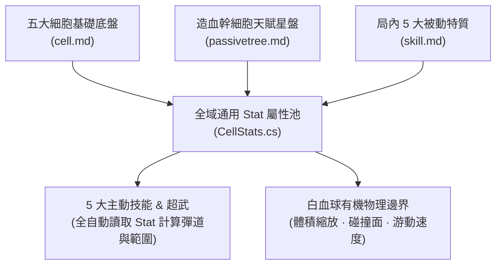
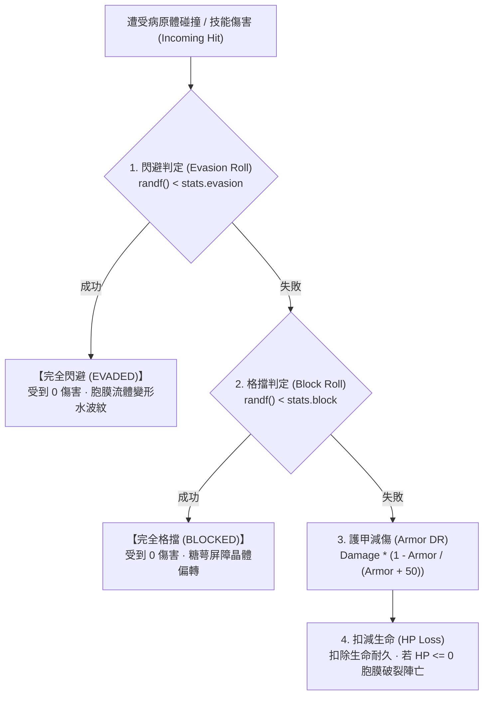

# 《Project: Phagocyte》全域通用 Stat 數值系統規格書 (Universal Stat System Specification)

---

## 1. 數值哲學：100% 全域通用 Stat 屬性矩陣

為貫徹 Survivor-like 的極致模組化、可平衡性與豐富的構築（Build）多樣性，《Project: Phagocyte》的數值架構**徹底剔除任何「單一技能特化私有屬性」**（例如嚴格禁止出現「抗體射程+10%」或「酸液半徑+20%」等私有變量）。

所有白血球底盤、局外造血幹細胞天賦星盤、局內被動特質（細胞器）以及升級加成，**100% 操作同一個全域通用 Stat 屬性池**：

```
                    ┌─────────────────────────┐
                    │ 全域通用 Stat 字典 (Pool) │
                    └────────────┬────────────┘
         ┌───────────────────────┼───────────────────────┐
         ▼                       ▼                       ▼
【通用戰鬥屬性 (Combat - 10項)】     【通用生存屬性 (Defense - 7項)】   【通用機制屬性 (Utility - 1項)】
· Might (傷害倍率)                  · Max Health (最大生命)          · Magnet (趨化拾取半徑)
· Area (範圍/體積)                  · Health Regen (自癒率)
· CDR (冷卻縮減)                    · Armor (膜剛性/減傷)
· Projectile Speed (彈道速度)       · Move Speed (移動速度)
· Duration (持續時間)               · Evasion (流體閃避率)
· Amount (額外發射數量)             · Block (糖萼格擋率)
· Pierce (穿透次數)                 · Life Steal (受體汲取/吸血)
· Knockback (擊退力道)
· Crit Chance (特異性暴擊率)
· Crit Damage (暴擊傷害倍率)
```



---

## 2. 屬性底層計算模型 (`Stat.cs` & `CellStats.cs`)

每個屬性封裝為獨立的數值對象，嚴格遵守**「簡約、無複雜 Scaling」**原則，僅採用標準的雙軌基礎疊加計算：

$$\text{FinalValue} = (\text{BaseValue} + \text{FlatBonus}) \times (1.0 + \text{PercentBonus})$$

```csharp
// scripts/core/Stat.cs
public class Stat
{
    public float BaseValue { get; set; } = 0.0f;
    public float FlatBonus { get; set; } = 0.0f;
    public float PercentBonus { get; set; } = 0.0f;

    public Stat(float baseValue = 0.0f)
    {
        BaseValue = baseValue;
    }

    public float GetValue()
    {
        return (BaseValue + FlatBonus) * (1.0f + PercentBonus);
    }

    public void AddModifier(float flat, float pct)
    {
        FlatBonus += flat;
        PercentBonus += pct;
    }

    public void Reset()
    {
        FlatBonus = 0.0f;
        PercentBonus = 0.0f;
    }
}
```

> [!IMPORTANT]
> **拒絕隱性複合 Scaling 原則**：
> - 🚫 不做屬性間的交叉非線性轉換（如「每 100 點生命增加 5% 傷害」）。
> - ✅ 保持各屬性完全獨立運算，公式透明，便於後續數值平衡調優與極速 Debug。

---

## 3. 全域通用屬性字典規範表 (Universal Stat Dictionary)

所有屬性鍵名統一使用蛇形命名法（Snake_case），並在 `scripts/core/CellStats.cs` 中註冊（共 18 項）：

| 屬性標識 (Key) | 顯示名稱 | 基準預設值 | 類別 | 影響範圍與通用運算規則 |
| :--- | :--- | :--- | :--- | :--- |
| `might` | **力量 / 傷害倍率** | `1.0` (100%) | 戰鬥 | 全域傷害乘數。影響所有直擊、DoT 酸蝕、地雷引信爆破傷害。 |
| `area` | **範圍 / 體積** | `1.0` (100%) | 戰鬥/形態 | 幾何尺寸乘數。等比縮放投射物尺寸、爆炸半徑、噴霧角度以及**玩家細胞本體碰撞受擊面**。 |
| `cooldown_reduction` | **冷卻縮減 (CDR)** | `0.0` (0%) | 戰鬥 | 縮短所有主動技能循環週期。計算公式：$T_{\text{actual}} = T_{\text{base}} \times (1.0 - \text{CDR})$，硬上限 `0.75` (75%)。 |
| `projectile_speed` | **彈道速度** | `1.0` (100%) | 戰鬥 | 所有飛行實體（抗體、穿孔射線、飛濺酸液、彈射抓手）的飛行速度乘數。 |
| `duration` | **持續時間** | `1.0` (100%) | 戰鬥 | 場上留存實體（酸霧殘留、補體陣列地雷、黏網陷阱）的存活時間乘數。 |
| `amount` | **額外數量** | `0` (發) | 戰鬥 | **固定增加所有技能單次發射/生成個數**（如抗體 $+1$ 枚、穿孔長矛 $+1$ 束、偽足多出 $+1$ 抓手）。 |
| `pierce` | **穿透次數** | `0` (次) | 戰鬥 | 投射物貫穿病原體的額外次數（穿透後繼續飛行）。 |
| `knockback` | **擊退力道** | `1.0` (100%) | 戰鬥 | 任何技能或細胞邊界命中敵人時施加的推擠衝量倍率。 |
| `crit_chance` | **特異性暴擊率** | `0.05` (5%) | 戰鬥 | 命中敵人時觸發致命特異性暴擊的機率。 |
| `crit_damage` | **暴擊傷害倍率** | `2.0` (200%) | 戰鬥 | 觸發暴擊時的結算傷害乘數。 |
| `max_health` | **最大生命值** | `100.0` | 生存 | 細胞膜破裂前可承受的最大耐久上限。 |
| `health_regen` | **生命自癒率** | `0.0` (HP/s) | 生存 | 每秒自動修復的細胞膜生命值。 |
| `armor` | **膜剛性 / 護甲** | `0.0` (點) | 生存 | 通用邊際減傷公式：$\text{DR} = \frac{\text{Armor}}{\text{Armor} + 50.0}$。 |
| `move_speed` | **游動速度** | `230.0` (px/s) | 生存/機動 | 玩家細胞常態巡航下的基礎游動速度。 |
| `evasion` | **流體閃避率** | `0.0` (0%) | 生存/機動 | 胞膜阿米巴流體變形完全免傷機率。硬上限設為 `0.60` (60%)。受擊第一順位判定。 |
| `block` | **糖萼格擋率** | `0.0` (0%) | 生存/防護 | 表面緻密糖萼屏障偏轉阻絕傷害機率。硬上限設為 `0.75` (75%)。受擊第二順位判定。 |
| `life_steal` | **受體汲取 / 命中吸血** | `0.0` (0%) | 生存/續航 | 任何攻擊或傷害命中敵人時觸發自體修復的機率（觸發時固定回復 1 點 HP）。硬上限設為 `0.20` (20%)。 |
| `magnet` | **趨化引力 (拾取)** | `150.0` (px) | 機制 | 自動吸附周邊 ATP 經驗滴與抗原碎片的有效半徑。 |

---

## 4. 動態屬性聯動規範

雖然拒絕二次複雜 Scaling，但以下基礎物理與防禦屬性具備直接的直覺幾何與受擊聯動：

### 4.1 體積與範圍縮放 (`area` -> 碰撞體與 AoE)
- **碰撞體等比放大**：細胞多邊形碰撞半徑 $R = R_{\text{base}} \times \text{area}$。
- **技能彈道等比放大**：所有主動技能生成的判定圈或 Sprite 尺寸直接乘以 $\text{area}$。
- 體現「範圍越大，打得越廣，但受擊面積也越大」的經典 PoE 風格平衡。

### 4.2 游動速度 (`move_speed` -> 物理位移)
- 玩家細胞在 `_PhysicsProcess` 中的基礎游動速度向量 $V = \text{InputDirection} \times \text{move_speed}$。
- 當處於特定器官流體力學（如血流剪切、肺泡氣流）中時，環境流體向量直接與本體速度進行線性向量疊加。

### 4.3 受擊結算管線 (Damage Resolution Pipeline)
當玩家細胞受到病原體碰撞或飛行物傷害時，遵循四階段漏斗式順序判定：


