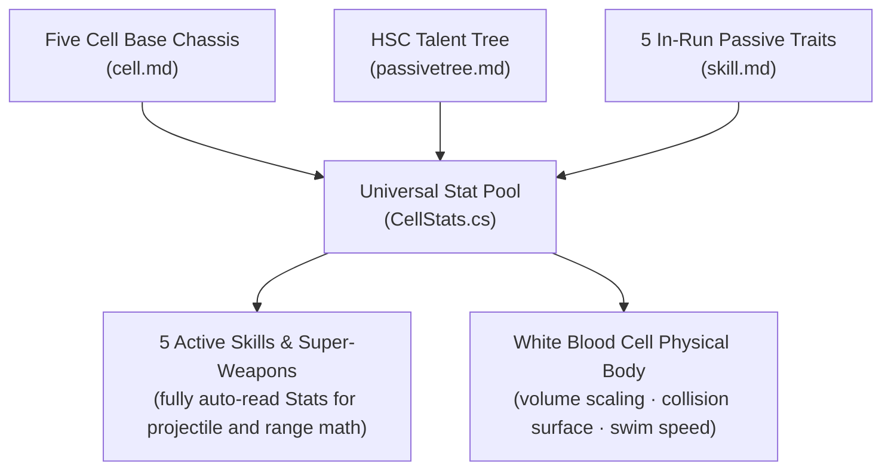
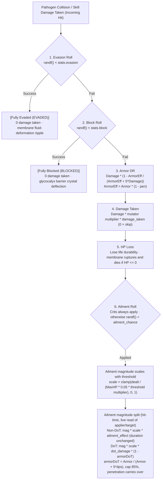

# Project: Phagocyte Universal Stat System Specification

---

## 1. Stat Philosophy: 100% Universal Stat Attribute Matrix

To uphold the extreme modularity, balanceability, and build diversity of a Survivor-like, the stat architecture of Project: Phagocyte **eliminates every per-skill private stat** (private variables such as "+10% antibody range" or "+20% acid radius" are strictly forbidden).

All white blood cell chassis, out-of-run hematopoietic stem cell (HSC) talent tree, in-run passive traits (organelles), and level-up bonuses operate **100% on the same universal Stat pool**:

```
                    ┌─────────────────────────┐
                    │ Universal Stat Pool     │
                    └────────────┬────────────┘
          ┌───────────────────────┼───────────────────────┐
          ▼                       ▼                       ▼
[Combat Stats (23 total)]     [Defense Stats (11 total)]   [Utility Stats (1 total)]
· Damage (generic damage)                 · Max Health          · Magnet (chemotaxis pickup radius)
· Area (range/volume)                  · Health Regen (self-heal rate)
· CDR (cooldown reduction)                    · Armor (membrane rigidity / damage reduction)
· Projectile Speed (projectile velocity)       · Move Speed (movement speed)
· Duration (duration)               · Evasion (fluid dodge chance)
· Amount (bonus projectile count)             · Block (glycocalyx block chance)
· Pierce (pierce count)                 · Life Steal (receptor leech / life steal)
· Crit Chance (specificity crit rate)         · Stagger (deflect / delayed damage)
· Crit Damage (crit damage multiplier)         · Recoup (reclaim / delayed heal)
· Armor Penetration (armor penetration)       · Ailment Threshold (ailment threshold)
· Ailment Chance (ailment trigger chance)
· Dot Damage (damage-over-time multiplier)
· Physical / Fire / Cold / Lightning / Chaos Damage (five damage-type bonuses, sharing the Increased additive pool with `damage`; the skill's `damage_type` decides which one applies)
· Melee / Spell / AoE / Projectile / Minion Damage (tag-conditional bonuses, applying only to skills with the matching tag; sharing the Increased additive pool with `damage`)
· Ailment Effect (ailment strength multiplier; excludes DoT damage, which is handled by `dot_damage`)
```


```mermaid
graph TD
    CHASSIS["Five Cell Base Chassis<br>(cell.md)"] --> POOL["Universal Stat Pool<br>(CellStats.cs)"]
    TREE["HSC Talent Tree<br>(passivetree.md)"] --> POOL
    PASSIVES["5 In-Run Passive Traits<br>(skill.md)"] --> POOL
    POOL --> ACTIVES["5 Active Skills & Super-Weapons<br>(fully auto-read Stats for projectile and range math)"]
    POOL --> BODY["White Blood Cell Physical Body<br>(volume scaling · collision surface · swim speed)"]
```

---

## 2. Underlying Stat Computation Model (`Stat.cs` & `CellStats.cs`)

Each stat is encapsulated as an independent value object, using the standard dual-track additive formula:

$$\text{FinalValue} = (\text{BaseValue} + \text{FlatBonus}) \times (1.0 + \text{PercentBonus})$$

The Flat/Pct pools are fed by three sources (Vistrace-style, see `StatBlock.ScaledRecord` / `StatRule`): direct bonuses, scaled bonuses, and built-in cross-stat rules.

Scaled bonuses (per-modifier scaling): `value × (sourceStat / scalePer)`, explicitly declared on the modifier entry via `scaling_stat` / `scale_per`
(optional on both gear and talents; omitting them preserves the legacy behavior); any stat change triggers
an immediate `RecomputeScaled` recompute (fixed-point cap of 8 passes; cycles warn — the convention is acyclic).

Built-in cross-stat rules: `flat += ratio × sourceStat` (flat channel only), registered via `AddStatRule`,
likewise recomputed immediately and removable precisely.

```csharp
// scripts/core/Stat.cs
public class Stat
{
    public float BaseValue { get; set; } = 0.0f;
    public float FlatBonus { get; set; } = 0.0f;
    public float PercentBonus { get; set; } = 0.0f;

    public Stat(float baseValue = 0.0f)
    {
        BaseValue = baseValue;
    }

    public float GetValue()
    {
        return (BaseValue + FlatBonus) * (1.0f + PercentBonus);
    }

    public void AddModifier(float flat, float pct)
    {
        FlatBonus += flat;
        PercentBonus += pct;
    }

    public void Reset()
    {
        FlatBonus = 0.0f;
        PercentBonus = 0.0f;
    }
}
```

> [!IMPORTANT]
> **Explicit Scaling Principle** (replacing the old "no implicit compound scaling" rule):
> - ✅ Cross-stat conversion is allowed (e.g. "+1 armor per 50 max health"), but must be explicitly declared on the data entry (`scaling_stat` / `scale_per`); implicit hardcoding is forbidden.
> - ✅ Scaled bonuses recompute immediately, and the value is guaranteed final before `StatChanged` fires; removal rolls back precisely.
> - 🚫 The scaling graph is acyclic by convention; cycles are truncated with a warning, and no behavior may depend on cycles.

---

## 3. Universal Stat Dictionary Specification (Universal Stat Dictionary)

All stat keys use snake_case naming and are registered in `scripts/core/StatBlock.cs` (35 total):

| Stat Key (Key) | Display Name | Base Default | Category | Scope and Generic Computation Rules |
| :--- | :--- | :--- | :--- | :--- |
| `damage` | **Generic Damage** | `1.0` (100%) | Combat | Generic base damage bonus. Forms the Increased additive pool together with the five damage-type bonuses and tag bonuses. |
| `area` | **Range / Volume** | `1.0` (100%) | Combat/Morphology | Geometry size multiplier. Scales projectile size, explosion radius, spray angle, and the **player cell's own collision hit surface** proportionally. |
| `cooldown_reduction` | **Cooldown Reduction (CDR)** | `0.0` (0%) | Combat | Shortens the cycle period of all active skills. Formula: $T_{\text{actual}} = T_{\text{base}} \times (1.0 - \text{CDR})$, hard-capped at `0.75` (75%). |
| `projectile_speed` | **Projectile Speed** | `1.0` (100%) | Combat | Flight-speed multiplier for all flying entities (antibodies, perforin beams, splashing acid, rebound grapples). |
| `duration` | **Duration** | `1.0` (100%) | Combat | Lifetime multiplier for persistent field entities (acid mist residue, complement array mines, web traps). |
| `amount` | **Bonus Count** | `0` (shots) | Combat | **Flat bonus to every skill's per-cast spawn count** (e.g. antibodies $+1$ round, perforin lances $+1$ beam, pseudopod $+1$ extra grapple). |
| `pierce` | **Pierce Count** | `0` (hits) | Combat | Bonus times a projectile keeps flying after punching through pathogens. |
| `crit_chance` | **Specificity Crit Chance** | `0.05` (5%) | Combat | Chance to land a lethal specificity crit when hitting an enemy. |
| `crit_damage` | **Crit Damage Multiplier** | `2.0` (200%) | Combat | Final damage multiplier applied when a crit triggers. |
| `armor_penetration` | **Armor Penetration** | `0.0` (0%) | Combat | Armor penetration ratio frozen at fire time: $\text{Armor}_{\text{eff}} = \text{Armor} \times (1.0 - \text{Pen})$, hard-capped at `1.0` (100%). |
| `ailment_chance` | **Ailment Trigger Chance** | `1.0` (100%) | Combat | Chance to apply an `on_hit` ailment on hit (frozen at fire time); crits always apply. Hard-capped at `1.0` (100%). |
| `ailment_threshold` | **Ailment Threshold** | `1.0` (100%) | Defense | Own ailment-threshold multiplier: $\text{Threshold} = \text{MaxHP} \times 0.05 \times \text{Mult}$, floored at `0.0` only, with no upper cap. |
| `dot_damage` | **Damage-Over-Time Multiplier** | `1.0` (100%) | Combat | Global DoT damage multiplier, multiplied with `damage` at resolution. Read live from the applier on hit: $\text{dps} = \text{mag} \times \text{scale} \times \text{dot\_damage}$ (non-player appliers count as `1.0`). |
| `physical_damage` | **Physical Damage** | `1.0` (100%) | Combat | Physical-type damage bonus, added into the Increased pool with `damage` (`damage_type: physical` skills). |
| `fire_damage` | **Fire Damage** | `1.0` (100%) | Combat | Fire-type damage bonus, added into the Increased pool with `damage`. |
| `cold_damage` | **Cold Damage** | `1.0` (100%) | Combat | Cold-type damage bonus, added into the Increased pool with `damage`. |
| `lightning_damage` | **Lightning Damage** | `1.0` (100%) | Combat | Lightning-type damage bonus, added into the Increased pool with `damage`. |
| `chaos_damage` | **Chaos Damage** | `1.0` (100%) | Combat | Chaos-type damage bonus, added into the Increased pool with `damage`. |
| `melee_damage` | **Melee Damage** | `1.0` (100%) | Combat | Tag-conditional bonus: only `Melee`-tagged skills benefit, added into the Increased pool. |
| `spell_damage` | **Spell Damage** | `1.0` (100%) | Combat | Tag-conditional bonus: only `Spell`-tagged skills benefit, added into the Increased pool. |
| `aoe_damage` | **Area Damage** | `1.0` (100%) | Combat | Tag-conditional bonus: only `AOE`-tagged skills benefit, added into the Increased pool. |
| `projectile_damage` | **Projectile Damage** | `1.0` (100%) | Combat | Tag-conditional bonus: only `Projectile`-tagged skills benefit, added into the Increased pool. |
| `minion_damage` | **Minion Damage** | `1.0` (100%) | Combat | Tag-conditional bonus: only `Minion`-tagged skills benefit, added into the Increased pool. |
| `ailment_effect` | **Ailment Effect** | `1.0` (100%) | Combat | Ailment strength multiplier (excludes DoT damage, which is handled by `dot_damage`). Read live from the applier on hit: non-DoT channels use $\text{mag} = \text{mag} \times \text{scale} \times \text{ailment\_effect}$, duration unaffected (non-player appliers count as `1.0`). |
| `max_health` | **Max Health** | `100.0` | Defense | Maximum durability cap before the cell membrane ruptures. |
| `health_regen` | **Health Regen Rate** | `0.0` (HP/s) | Defense | Cell membrane health automatically repaired per second. |
| `armor` | **Membrane Rigidity / Armor** | `0.0` (points) | Defense | POE-style marginal damage reduction: $\text{DR} = \frac{\text{Armor}}{\text{Armor} + 5.0 \times \text{Damage}}$, so large hits penetrate deeper. DoT runs on the same-shaped curve using per-second dps: $\text{DR}_{\text{dot}} = \frac{\text{Armor}}{\text{Armor} + 5.0 \times \text{dps}}$ (`DotArmorFactor` constant is tunable; raising it weakens reduction), likewise subject to armor penetration with an 85% cap. |
| `damage_taken` | **Damage Taken** | `1.0` (100%) | Defense | Damage-taken multiplier (independent of the armor curve; below 1 is reduction). Player defense: $\text{mult} = \text{mutator multiplier} \times \text{damage\_taken}$, applied once each at direct-hit and DoT entry; delayed-pool drain is not multiplied again; `0` means unset and is skipped (consistent with the pipeline guard). |
| `move_speed` | **Swim Speed** | `230.0` (px/s) | Defense/Mobility | Base swim speed of the player cell under normal cruising. |
| `evasion` | **Fluid Evasion Chance** | `0.0` (0%) | Defense/Mobility | Chance for amoeboid membrane fluid deformation to fully avoid damage. Hard-capped at `0.60` (60%). First check on being hit. |
| `block` | **Glycocalyx Block Chance** | `0.0` (0%) | Defense/Protection | Chance for the dense surface glycocalyx barrier to deflect and negate damage. Hard-capped at `0.75` (75%). Second check on being hit. |
| `life_steal` | **Receptor Leech / Life on Hit** | `0.0` (0%) | Defense/Sustain | Chance for any attack or damage hit on an enemy to trigger self-repair (restores a flat 1 HP when triggered). Hard-capped at `0.20` (20%). |
| `stagger` | **Deflect / Delayed Damage** | `0.0` (0%) | Defense/Buffer | Proportion of hit damage diverted into the delayed-damage pool (decays exponentially over 4 seconds as armor-ignoring DoT), player-only, direct hits only. Hard-capped at `0.60` (60%). |
| `recoup` | **Reclaim / Delayed Heal** | `0.0` (0%) | Defense/Sustain | Proportion of a direct hit recovered in installments over 4 seconds (ignores heal lockout), player-only. Hard-capped at `0.30` (30%). |
| `magnet` | **Chemotaxis Pull (Pickup)** | `150.0` (px) | Utility | Radius for automatically attracting nearby ATP experience drops and antigen fragments. |

### 3.1 Energy Constraint Layer (Not the 36th Stat)

Organelle chamber energy is a **constraint layer, not a universal Stat**: `CellStats` holds no `energy` slot, and no organelle `modifiers` / `drawback` may reference `energy`. Energy model (used vs. cap): used = sum of positive costs, cap = 6 + sum of generation (`energy_cost == -1` means `+1` generation and always carries a heavy downside); legal iff used <= cap and item count <= 4. The backpack (run-scoped, cap 12) never counts toward energy. Hard-cap review (Phase 4): chamber CDR total `+0.26` + maxed passive `+0.40` + chassis `0.10` is still clamped by `0.75`; chamber `evasion +0.02` / `block +0.04` are micro-tuning only, far below the `0.60` / `0.75` caps; the single `amount +1` source is locked behind a 4-cost item (2/3 of the base budget), `4+3` overloads, `4+1+1` is a full build.

---

## 4. Dynamic Stat Linkage Rules

Although secondary compound scaling is rejected, the following basic physical and defensive stats have direct, intuitive geometric and on-hit linkages:

### 4.1 Volume and Range Scaling (`area` -> Colliders and AoE)
- **Proportional collider growth**: the cell polygon collision radius is $R = R_{\text{base}} \times \text{area}$.
- **Proportional skill projectile growth**: the hit circle or sprite size of every active-skill spawn is multiplied directly by $\text{area}$.
- This embodies the classic PoE-style tradeoff: "bigger area hits wider, but also takes hits over a larger surface."

### 4.2 Swim Speed (`move_speed` -> Physical Displacement)
- The player cell's base swim velocity vector in `_PhysicsProcess` is $V = \text{InputDirection} \times \text{move_speed}$.
- Inside organ-specific fluid dynamics (blood shear flow, alveolar airflow), the ambient fluid vector adds linearly to the body velocity.

### 4.3 Damage Resolution Pipeline (Damage Resolution Pipeline)
When the player cell takes pathogen collision or projectile damage, it follows a funnel-style sequential resolution:


```mermaid
flowchart TD
    Hit["Pathogen Collision / Skill Damage Taken (Incoming Hit)"] --> EvCheck{"1. Evasion Roll<br>randf() < stats.evasion"}
    EvCheck -- Success --> Evaded["[Fully Evaded (EVADED)]<br>0 damage taken · membrane fluid-deformation ripple"]
    EvCheck -- Fail --> BlkCheck{"2. Block Roll<br>randf() < stats.block"}
    BlkCheck -- Success --> Blocked["[Fully Blocked (BLOCKED)]<br>0 damage taken · glycocalyx barrier crystal deflection"]
    BlkCheck -- Fail --> ArmorDR["3. Armor DR<br>Damage * (1 - ArmorEff / (ArmorEff + 5*Damage))<br>ArmorEff = Armor * (1 - pen)"]
    ArmorDR --> TakenMult["4. Damage Taken<br>Damage * mutator multiplier * damage_taken (0 = skip)"]
    TakenMult --> HPLoss["5. HP Loss<br>Lose life durability · membrane ruptures and dies if HP <= 0"]
    HPLoss --> AilRoll{"6. Ailment Roll<br>Crits always apply · otherwise randf() < ailment_chance"}
    AilRoll -- Applied --> AilScale["Ailment magnitude scales with threshold<br>scale = clamp(dealt / (MaxHP * 0.05 * threshold multiplier), 0, 1)"]
    AilScale --> AilMag["Ailment magnitude split (hit-time, live read of applier/target)<br>Non-DoT: mag * scale * ailment_effect (duration unchanged)<br>DoT: mag * scale * dot_damage * (1 - armorDoT)<br>armorDoT = Armor / (Armor + 5*dps), cap 85%, penetration carries over"]
```
