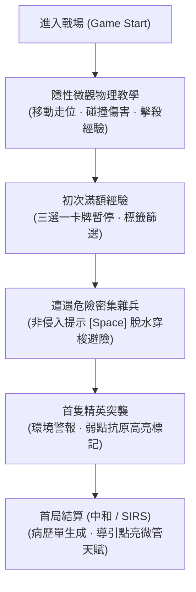
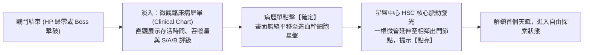

# 《Project: Phagocyte》新手引導與直覺 UI/UX 規範書 (Onboarding & Intuitive UI/UX)

---

## 1. 新手教學核心設計原則 (Onboarding Philosophy)

在《Phagocyte》中，我們堅持 **「以直覺的介面反饋替代生硬的文字說教」**。

作為一款快節奏的微觀動作肉鴿遊戲，**打斷玩家心流的大段彈窗教學是最糟糕的體驗**。我們的設計準則是：
- **見形知意（Intuitive by Design）**：靠真實生物物理、顯微鏡視覺反饋與音效引導，讓玩家憑直覺本能探索。
- **無侵入式微引導（Non-Intrusive Micro-Cues）**：絕不暫停遊戲強制彈出對話框；必要的操作指引以懸浮呼吸燈、環境波紋與動態按鍵圖元自然融入 HUD。
- **漸進式揭露（Progressive Disclosure）**：只在玩家生理或環境狀態初次觸發特定機制時，才以極簡形式提示該關鍵功能。

---

## 2. 核心戰鬥中的「必要最低限度引導」清單

雖然追求極簡，但以下 **5 項核心操作與獨特機制** 必須在首局遊玩的前 3 分鐘內以最輕量的方式完成引導：

| 教學項目 | 觸發時機 | 介面呈現方式 (UI/UX) | 核心學習目標 |
| :--- | :--- | :--- | :--- |
| **1. 移動與碰撞傷害 (Move & Contact)** | 戰鬥開始前 5 秒 | 細胞周圍浮現微弱的按鍵呼吸圈（`[W][A][S][D]` 或 左搖桿）；前方 150px 處刷新 2 隻靜止的微型葡萄球菌。 | 理解白血球貼怪會被啃咬扣血，保持距離走位、用技能清怪，享受阿米巴邊緣形變反饋。 |
| **2. 經驗吸收與初次升級 (ATP & Card Draft)** | 吞噬第 3 隻病原體， 首次升級時 | 遊戲時間以 0.5 秒的時間平滑進入慢動作（Bullet Time）最後定格，三選一突變卡以顯微載玻片樣式浮現。 | 理解「吞噬轉化為經驗」，主動技能與被動特質的分野。 |
| **3. 脫水穿梭避險微操 (Squeeze Mode)** | 首次受到碰撞傷害， 或周邊病原體 $>15$ 隻 | 細胞頭頂彈出極簡短懸浮文字：`按住 [Space] 脫水穿梭`（手把顯示 `[L2]`），細胞邊界泛出淡青色緊繃光澤。 | 理解「體積縮小 40%、移速增加、縮小接觸面」，用於高壓突圍。 |
| **4. 超武質變合成預兆 (Evolution Synergy)** | 任意主動技能達到 Lv.5 時 | 在局內三選一介面中，對應被動特質卡牌外框泛出金色共鳴光環，卡面角標浮現 `【超武催化劑】` 標籤。 | 直覺理解「滿級主動 ＋ 對應被動 = 超武質變」的二合一配裝公式。 |
| **5. 流體環境互動波紋 (Fluid Shear / Drift)** | 踏入氣流或吸力場時 | 畫面四周浮現微觀流體動態箭頭粒子（如同顯微鏡下的液流拖尾），細胞邊界產生傾斜拉扯形變。 | 玩家無需讀字，一眼看懂「此處有強流體推力，需逆流或借力游動」。 |

---

## 3. 直覺化 UI/UX 視覺語言規範 (Diegetic & Sensory Cues)

為了消弭傳統龐雜 UI 的認知負擔，所有生理狀態均映射為顯微鏡下的有機物理視覺：

### 3.1 生命膜耐久度 (Health & Membrane Integrity)
- **非傳統血條**：細胞膜外圈包裹一層「菲涅爾螢光膜（Fresnel Membrane Ring）」。
  - 膜健康（$100\%$）：鮮亮青藍色，邊界張力充沛。
  - 膜受損（$<50\%$）：轉為高頻焦躁的橙紅色微顫，邊界向外微幅脫落細碎顆粒。
  - 瀕死危象（$<20\%$）：全螢幕四周浮現暗紅色溶血光暈（非傳統刺眼紅屏，而是帶有組織液酸蝕質感的暗調暈影），心跳脈衝音效低沉響起。

### 3.2 攻擊冷卻與自動開火 (Cooldowns & Auto-fire)
- **主動武器全自動循環**：玩家不需要手動瞄準普通雜兵，主動技能冷卻完畢自動向最近敵方開火。
- **冷卻指示器**：HUD 槽位中的細胞器圖示外圈有細微順時針充能進度環，開火瞬間爆發微幅螢光光暈。

### 3.3 敵方抗原與弱點標記 (Opsonin & Weakpoints)
- 當敵人受到【調理素】標記或處於易傷狀態時，敵人頭頂浮現微小的 Y 型螢光受體標記，受到攻擊時爆出大號亮黃色暴擊數值。

---

## 4. 局後引導：病歷單與星盤初次啟動

當玩家完成或終止第一局戰鬥時，介面以流暢的轉場銜接至局外養成：

1. **病歷單的幽默與成就感**：
   - 即便新手第一局很快破膜陣亡，病歷單也不會給予挫敗打擊，而是顯示臨床診斷：`【急性炎性反應 · 代償終止】`，並結算本局吞噬的病原體總數與成就進度。
2. **星盤的視覺引導**：
   - 玩家首次獲得微管天賦點進入星盤時，**絕不彈出大段操作說明**。
   - 系統自動將相機鏡頭平滑聚焦在中央發光的 HSC 細胞核，並沿著微管向玩家所選細胞的起始門戶發出一道柔和的流動電脈衝，玩家自然會點擊該發光囊泡完成點亮。

---

## 5. 設計防呆與檢核清單 (Anti-Frustration Checklist)

- [ ] **無操作防呆**：若玩家開局 5 秒完全未輸入任何移動指令，細胞微幅向前漂移並自動吞食路徑上的第一隻微型雜兵，直觀展示吞噬概念。
- [ ] **零強制閱讀**：全遊戲內不存在任何「必須點擊 OK 才能繼續」的教學彈窗。
- [ ] **控制自定義與預設支援**：鍵盤（WASD）、滑鼠、手把（左右類比搖桿）隨插即用，操作提示圖示依據當前輸入設備無縫切換。
- [ ] **隨時可查閱的顯微檔案館**：所有病原體弱點、器官流體機制與技能公式，隨時可在主選單【微觀檔案館（Codex）】中查閱，把學習的主動權徹底交還給玩家。
