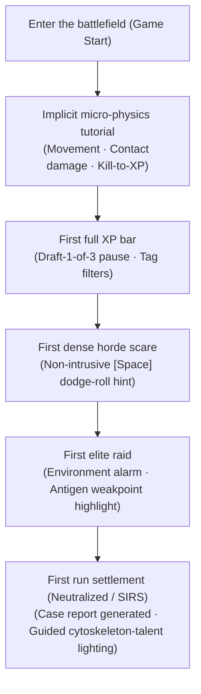
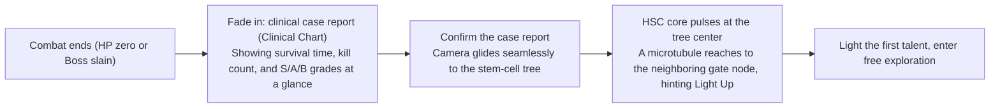

# Project: Phagocyte — Onboarding & Intuitive UI/UX (Onboarding & Intuitive UI/UX)

---

## 1. Core Onboarding Design Principles (Onboarding Philosophy)

In *Phagocyte*, we insist on **"replacing stiff text lectures with intuitive interface feedback"**.

As a fast-paced microscopic action roguelite, **long modal tutorials that break player flow are the worst possible experience**. Our guidelines:
- **Intuitive by Design**: rely on real biophysics, microscope visuals, and audio cues so players explore by instinct.
- **Non-Intrusive Micro-Cues**: never pause the game for forced dialogs; necessary control hints blend into the HUD naturally as floating breathing lights, environment ripples, and dynamic key glyphs.
- **Progressive Disclosure**: a key feature is hinted in the most minimal form only the first time the player's physiology or the environment actually triggers that mechanic.

```mermaid
flowchart TD
    A["Enter the battlefield (Game Start)"] --> B["Implicit micro-physics tutorial<br>(Movement · Contact damage · Kill-to-XP)"]
    B --> C["First full XP bar<br>(Draft-1-of-3 pause · Tag filters)"]
    C --> D["First dense horde scare<br>(Non-intrusive [Space] dodge-roll hint)"]
    D --> E["First elite raid<br>(Environment alarm · Antigen weakpoint highlight)"]
    E --> F["First run settlement (Neutralized / SIRS)<br>(Case report generated · Guided cytoskeleton-talent lighting)"]
```

---

## 2. Minimum Necessary In-Combat Guidance Checklist

Minimalist as we are, the following **4 core moves and signature mechanics** must be taught in the lightest possible way within the first 3 minutes of the first run:

| Tutorial Item | Trigger | Presentation (UI/UX) | Core Learning Goal |
| :--- | :--- | :--- | :--- |
| **1. Move & Contact** | Combat start | Spawn 2 stationary micro-staphylococci 150px ahead. | Learn that hugging monsters as a white blood cell means getting bitten and losing HP — keep distance, kite, clear with skills, and enjoy the amoeba-edge deformation feedback. |
| **2. XP Absorption & First Level-Up (ATP & Card Draft)** | On the 3rd pathogen kill, first level-up | Game time eases into slow motion (Bullet Time) over 0.5 seconds, then freezes, with the draft-1-of-3 mutation cards surfacing like microscope slides. | Learn that "kills convert into XP", and the split between active skills and passive traits. |
| **3. Dodge Roll (Dodge Roll)** | On first contact damage, or when nearby pathogens exceed $>15$ | A minimal floating line pops over the cell: `Press [Space] to roll` (gamepad shows `[L2]`), with a pale-white burst halo flashing across the cell boundary. | Learn "1 charge, 2.5s recharge, 0.22s invulnerable dash" for clutch escapes under pressure. |
| **4. Super-Weapon Fusion Omen (Evolution Synergy)** | Any active skill reaches Lv.5 | In the in-run draft UI, the matching passive trait card glows with a golden resonance rim, with a `[Super-Weapon Catalyst]` tag floating at the card corner. | Intuitively grasp the two-in-one loadout formula of "maxed active + matching passive = super-weapon transformation". |

---

## 3. Intuitive UI/UX Visual Language (Diegetic & Sensory Cues)

To erase the cognitive load of traditionally bloated UI, every physiological state maps to organic under-the-microscope physics visuals:

### 3.1 Health & Membrane Integrity (Health & Membrane Integrity)
- **No traditional HP bar**: the membrane is wrapped in a "Fresnel Membrane Ring".
  - Healthy membrane ($100\%$): vivid cyan-blue with taut boundaries.
  - Damaged membrane ($<50\%$): shifts to anxiously flickering orange-red micro-tremor, shedding fine granules outward.
  - Near-death crisis ($<20\%$): dark-red hemolysis halos surface on all four screen edges (not a glaring red flash, but a dim tissue-acid-etched vignette), with a low-pitched heartbeat pulse sounding.
### 3.2 Attack Cooldowns & Auto-Fire (Cooldowns & Auto-fire)
- **All active weapons cycle fully automatically**: players never aim manually at ordinary mobs — active skills fire at the nearest enemy on cooldown.
- **Cooldown indicators**: organelle icons in HUD slots carry a fine clockwise charge ring; firing bursts a subtle fluorescent halo.
### 3.3 Enemy Antigens & Weakpoint Marks (Opsonin & Weakpoints)
- When an enemy carries an [opsonin] mark or sits in a vulnerable state, a tiny Y-shaped fluorescent receptor mark floats overhead, bursting oversized bright-yellow crit numbers when struck.

---

## 4. Post-Run Guidance: First Opening of the Case Report and Talent Tree

When the player finishes or aborts the first run, the interface flows seamlessly into out-of-run progression:

```mermaid
flowchart LR
    A["Combat ends (HP zero or Boss slain)"] --> B["Fade in: clinical case report (Clinical Chart)<br>Showing survival time, kill count, and S/A/B grades at a glance"]
    B --> C["Confirm the case report<br>Camera glides seamlessly to the stem-cell tree"]
    C --> D["HSC core pulses at the tree center<br>A microtubule reaches to the neighboring gate node, hinting Light Up"]
    D --> E["Light the first talent, enter free exploration"]
```

1. **Humor and accomplishment in the case report**:
   - Even if a rookie's membrane ruptures quickly in run one, the report never punishes — instead it shows the clinical diagnosis `[Acute inflammatory response · Compensated termination]`, plus total pathogens killed and achievement progress.
2. **Visual guidance on the talent tree**:
   - When players first enter the tree with talent points, **no long how-to text ever pops up**.
   - The system smoothly focuses the camera on the glowing HSC nucleus at the center and sends a soft flowing electric pulse along the microtubule toward the player's cell gate — players naturally click the glowing vesicle to light it.

---

## 5. Anti-Frustration Design Checklist (Anti-Frustration Checklist)

- [ ] **Idle-input safety**: if the player gives zero movement input for the first 5 seconds, the cell drifts slightly forward and auto-kills the first micro-mob in its path, demonstrating the clear-and-kill concept visually.
- [ ] **Zero forced reading**: no "must click OK to continue" tutorial popup exists anywhere in the game.
- [ ] **Customizable controls with sensible defaults**: keyboard (WASD), mouse, and gamepad (twin sticks) all plug-and-play, with prompt glyphs switching seamlessly to the active input device.
- [ ] **Always-browsable microscopy archive**: all pathogen weaknesses, organ environment mechanics, and skill formulas stay browsable in the main-menu [Microscopy Archive (Codex)], handing the initiative for learning fully back to the player.
