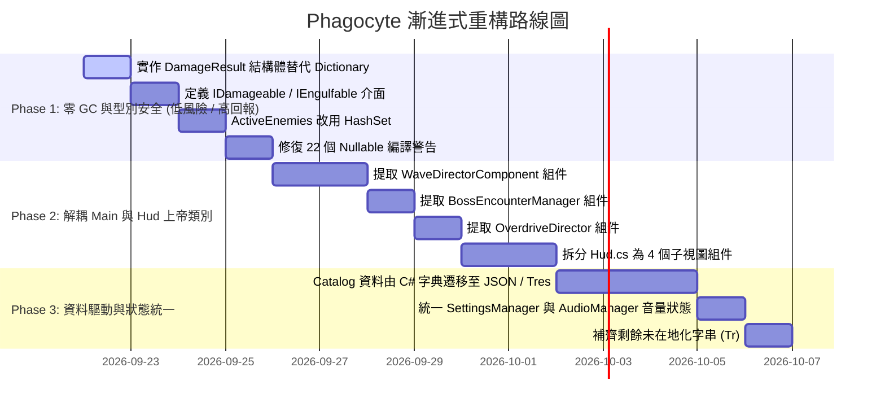

# 《Project: Phagocyte》專案代碼審查與架構優化建議書 (Code Review & Architecture Guide)

> **專案技術棧**：Godot 4.x (.NET 8 / C# 12) ｜ **總規模**：~115 個 C# 原始碼檔案，約 30,000+ 行程式碼，45 套單元/整合測試  
> **核心目標**：Clean Code、SOLID 物件導向架構、記憶體零 GC 壓力、型別安全、組件化解耦與資料驅動。

---

## 1. 總覽與健康度診斷 (Executive Summary)

《Project: Phagocyte》在底層微觀生物主題呈現、高併發戰鬥管線（如 `QuadTree<T>` 空間劃分、`ProjectileManager` 的 MultiMesh GPU 批次渲染、`DamageNumberSpawner` 的結構體物件池繪製、FastNoiseLite 動態變形多邊形同步）以及測試防護網（45 套自動化測試，且具備 `TestHarness` 獨立存檔隔離）上展示了極高的工程完成度。

然而，隨著功能自早期原型迅速擴充為擁有 20+ 種病原體、5 種白血球底盤、30+ 種生化技能與終局細胞因子風暴模式的完整肉鴿遊戲，系統架構中累積了顯著的技術債：

1. **巨型類別／上帝物件 (God Objects)**：`Main.cs` (1,284 行)、`Hud.cs` (1,232 行)、`GameManager.cs` (967 行)、`PassiveTreeView.cs` (1,160 行) 各自承擔了 6 到 18 項互不相干的職責。
2. **資料與邏輯耦合 (Data-as-Code)**：超過 1,500 行的技能、病原體、地圖、成就、天賦星盤配置以 `Godot.Collections.Dictionary` 靜態字典形式寫死在 C# 代碼中。
3. **熱點路徑微分配 (GC Micro-Allocations in Hot Paths)**：每次武器命中時均呼叫 `new Dictionary` 回傳傷害資訊，敵人全域追蹤採用 `List<BaseEnemy>` 進行線性搜尋與移除，目標索敵遍歷未善用現有的 `QuadTree`。
4. **鴨子型別與缺乏介面契約 (Duck-Typing)**：廣泛使用 `HasMethod("take_damage")`、`Call("be_engulfed")` 等字串反射式動態分派，放棄了 C# 編譯期型別安全與效能優勢，並產生了 22 個編譯警告。
5. **UI 與業務邏輯強耦合**：UI 腳本直接呼叫遊戲狀態切換、暫停與時間縮放、敵人計數和天賦購買。

---

## 2. 當前架構問題深度診斷

### 🔴 2.1 上帝類別 (God Classes) 職責過載

#### ① `Main.cs`（1,284 行，承擔 18 項職責）
- **現狀**：
  - 角色切換與場景初始化 (`_Ready`)
  - 天賦加成解析與掛載 (`ApplyTreeLoadout`)
  - 成就信號雙軌監聽 (`ConnectAchievementEvents`)
  - 背景 Shader 顏色動態注入 (`ConfigureMapEnvironment`)
  - 15:00 波次時間軸與 5 大階段進階觸發 (`ProcessWaveDirector`)
  - 精英怪、次級領主、終末原發 Boss、無盡模式跨界 Boss 突襲的生命週期控制
  - 殺戮驅動即時回補計算 (`ProcessDynamicBackfill`)
  - 中立紅血球與毒素囊泡數量維持 (`ProcessNeutralMatter`)
  - 宿主潰爛酸蝕環境定時生成 (`ProcessHostUlceration`)
  - 5 大器官專屬流體力學推進 (`ProcessOrganEnvironment`, `ProcessMapMechanics`)
  - 無盡過載階梯 5 種危害循環 (`ProcessOverdriveEnvironment`)
  - 負面病理詞綴定時灼燒與漂移 (`ProcessAfflictions`)
  - 新手教學導引怪生成 (`SpawnTutorialGuides`)
  - 戰鬥結算、臨床評級評分、Steam 排行榜上報 (`EndRun`)
- **壞味道與風險**：
  - 違反**單一職責原則 (SRP)**。任何關卡波次調整、危害數值微調或結算公式修改，都必須修改同一個巨型類別。
  - 無法針對波次導演、無盡階梯或結算演算法單獨撰寫無頭單元測試。

#### ② `Hud.cs`（1,232 行，承擔 10+ 項職責）
- **現狀**：
  - 生命／經驗條即時刷新與低血量漸顯脈衝
  - 關卡計時器與無盡過載暗金計時
  - 10 個技能槽位圖示、CD 進度條與 Tooltip 懸停
  - 暫停選單按鈕與全域 `Engine.TimeScale` 慢動作控制
  - Codex 百科、設定選單、天賦星盤覆蓋層的動態呼出
  - 成就橫幅動畫推進
  - 新手教學提示狀態機（WASD 呼吸圈、脫水穿梭提示、周圍敵怪計數）
  - `_Ready()` 包含長達 95 行的節點尋找與 `??` 舊路徑降級相容邏輯
- **壞味道與風險**：
  - UI 視圖直接依賴領域實體（如 `BaseEnemy.ActiveEnemies`、`PassiveTreeManager`）。
  - 視圖層、控制層、資料格式化層完全混雜在一起。

#### ③ `GameManager.cs`（967 行）
- **現狀**：
  - 包含了約 700 行的靜態 Dictionary 資料表（30 個技能詳細數據、19 種病原體屬性、5 大地圖配置）。
  - 同時掌管出戰角色選擇、地圖解鎖狀態、雙軌難度、無盡模式狀態、多國語言切換與場景載入。
- **壞味道與風險**：
  - 企劃調整數值必須修改 C# 程式碼並重新編譯。
  - 字典鍵均為字串，容易因手民之誤產生潛在執行期錯誤。

---

### 🔴 2.2 高頻戰鬥熱點路徑中的記憶體微分配與線性搜尋

Survivor-like 遊戲在同屏 300～500 隻怪物、數十發穿透子彈與 DoT 燃燒情況下，每秒有數千次傷害判定。

#### ① `BaseSkill.GetCalculatedDamage` 堆疊微分配
```csharp
// 現有程式碼 (BaseSkill.cs:179-220)：每次傷害結算都 new 一個 Godot.Collections.Dictionary！
public Dictionary GetCalculatedDamage(float baseDmg)
{
    var result = new Dictionary
    {
        ["damage"] = baseDmg,
        ["is_crit"] = false
    };
    // ... 計算過程
    return result;
}
```
- **影響**：1 秒內數百次武器擊中會產生上千個短生命週期的小字典物件，頻繁觸發 .NET Gen0 垃圾回收，造成微卡頓 (Micro-stutter)。

#### ② `BaseEnemy.ActiveEnemies` 的線性搜尋與移除
```csharp
// 現有程式碼 (BaseEnemy.cs:68-81, 485-488)
public static readonly List<BaseEnemy> ActiveEnemies = new();

public override void _EnterTree()
{
    if (!ActiveEnemies.Contains(this)) // O(N) 線性遍歷！
        ActiveEnemies.Add(this);
}
public override void _ExitTree()
{
    ActiveEnemies.Remove(this); // O(N) 線性搜尋與陣列搬移！
}
```
- **影響**：在 500 隻敵怪同屏且殺戮回補極快的情況下，每秒頻繁的重生與死亡會導致巨量的線性掃描。

#### ③ `TargetingService` 未復用既有的空間劃分
- `TargetingService.cs` 的 `GetNearestEnemy` 與 `GetEnemiesInRadius` 每次呼叫都是對 `ActiveEnemies` 進行 $O(N)$ 遍歷。
- 專案內部已存在極度優異的 `QuadTree<T>`（`ProjectileManager` 正在使用），索敵系統卻未共用此空間索引。

#### ④ `PassiveTreeView.cs` 逐幀重新排序
- 在 `_Draw()` 呼叫中，每幀都呼叫 `ordered.Sort((a, b) => ...)` 針對 50+ 個天賦節點重新排序，應在佈局初始化時快取排序結果。

---

### 🟡 2.3 鴨子型別 (Duck-Typing) 與缺乏介面契約

專案中大量出現類似以下代碼：
```csharp
// 廣泛散佈於 CombatHelper.cs, BaseCell.cs, AilmentController.cs, TargetingService.cs
if (enemy.HasMethod("be_engulfed"))
    enemy.Call("be_engulfed", this);

if (target.HasMethod("take_damage"))
    target.Call("take_damage", damage, source, isCrit);

if (Stats.HasMethod("add_modifier"))
    Stats.Call("add_modifier", stat, flat, percent);
```
- **缺點**：
  - 每次呼叫皆透過 Godot Variant 反射橋接，失去 C# 的虛擬函式直接分派效能。
  - 編譯器無法檢查函式名稱或參數簽章，重命名方法極易導致靜默失效。
  - 引發了 22 個與 Nullable / 型別轉換相關的編譯警告。

---

### 🟡 2.4 雙向循環依賴與跨模組耦合

1. **`MapEnvironment` ↔ `Main`**：
   `MapEnvironment.cs` 中的方法簽章直接宣告為 `public void Tick(Main main, float dt)`，子類環境透過 `main.Player` 和 `main.EnemyContainer` 直接向下滲透，造成環境策略與場景上帝物件的雙向耦合。
2. **`AchievementManager` ↔ `GameManager` ↔ `PassiveTreeManager`**：
   成就解鎖時直接靜態呼叫 `GameManager.UnlockClass(...)` 與 `PassiveTreeManager.AddBonusPoints(...)`，跨模組副作用缺乏中介或事件機制。
3. **音量狀態雙重儲存**：
   `SettingsManager` 與 `AudioManager` 各自維護一份 `MasterVolume`、`BgmVolume`、`SfxVolume`，存在狀態不同步的潛在風險。
4. **硬編碼文字與未完全在地化**：
   `UpgradeManager.cs` 第 283 行包含硬編碼的中文回血提示字串，`HoloBodyScanner.cs` 與 `RunRecordsModal.cs` 存在部分未走 `Tr()` 的英文硬編碼。

---

## 3. 架構重構與 Clean Code 改善方案

### 💡 建議 1：將 `Main.cs` 解耦為節點組件系統 (Component-Based Orchestration)

將原本全部塞在 `Main.cs` 的邏輯拆分為主場景底下的子節點（組件），每個組件只管一件事：

```
Main (Node2D, Main.cs - 僅剩 ~150 行組裝邏輯)
├── WaveDirector (Node, WaveDirectorComponent.cs - 專職 15:00 波次與回補)
├── BossController (Node, BossEncounterManager.cs - 專職次級領主與終末 Boss 生命週期)
├── OverdriveSystem (Node, OverdriveDirector.cs - 專職無盡階梯與酸蝕浪湧)
├── NeutralMatterSystem (Node, NeutralMatterManager.cs - 專職紅血球與毒囊維持)
├── OrganEnvironment (Node, 實作 IEnvironmentContext)
├── CombatSystem (Node, 專案既有的 ProjectileManager / DamageNumberSpawner)
└── SettlementController (Node, RunSettlementService.cs - 專職生化評分與天梯上報)
```

#### 代碼重構對比：
**重構前 (`Main.cs`)**：
```csharp
// Main 既要算波次，又要回補怪物，還要管酸潮圈，還要管結算
public override void _PhysicsProcess(double delta)
{
    float dt = (float)delta;
    ProcessWaveDirector();
    ProcessOrganEnvironment(dt);
    ProcessMapMechanics(dt);
    ProcessOverdriveEnvironment(dt);
    ProcessAfflictions(dt);
    ProcessNeutralMatter(dt);
    ProcessHostUlceration(dt);
    ProcessDynamicBackfill();
}
```

**重構後 (`Main.cs`)**：
```csharp
public partial class Main : Node2D
{
    [Export] public WaveDirectorComponent? WaveDirector { get; private set; }
    [Export] public BossEncounterManager? BossManager { get; private set; }
    [Export] public OverdriveDirector? OverdriveDirector { get; private set; }
    [Export] public NeutralMatterManager? NeutralMatter { get; private set; }
    
    public override void _Ready()
    {
        InitializeSubsystems();
    }
    // Main 僅作為子系統之間的通訊中介，自身不承擔任何具體計時與生成業務！
}
```

---

### 💡 建議 2：消除熱點路徑 GC，全面採用 `readonly struct`

將武器計算與數值傳遞從 `Dictionary` 改為 C# 9+ 的 `readonly record struct`，在堆疊 (Stack) 上配置，達成 0 GC：

```csharp
// 新增: scripts/combat/DamageResult.cs
namespace Phagocyte.Combat;

public readonly record struct DamageResult(float Damage, bool IsCrit)
{
    public static readonly DamageResult Zero = new(0.0f, false);
}
```

在 `BaseSkill.cs` 中重構：
```csharp
// 重構後：零堆疊記憶體分配
public DamageResult GetCalculatedDamage(float baseDmg)
{
    if (Stats is CellStats cs)
    {
        float might = cs.GetStat("might");
        float dmg = baseDmg * might;
        if (cs.RollCritical())
        {
            return new DamageResult(dmg * cs.GetStat("crit_damage"), true);
        }
        return new DamageResult(dmg, false);
    }
    return new DamageResult(baseDmg, false);
}
```

---

### 💡 建議 3：建立清晰的領域介面，根除字串鴨子型別

在 `scripts/combat/` 與 `scripts/core/` 定義核心行為契約：

```csharp
// scripts/combat/IDamageable.cs
namespace Phagocyte.Combat;

public interface IDamageable
{
    void TakeDamage(float damage, Node2D? source = null, bool isCrit = false);
    void TakeDoTDamage(float dotDamage);
}

// scripts/combat/IEngulfable.cs
namespace Phagocyte.Combat;

public interface IEngulfable
{
    bool CanBeEngulfed { get; }
    float GetAtpValue();
    int GetBaseScore();
    void BeEngulfed(Node2D? predator);
    void OnEngulfAttemptFailed(Node2D? predator);
}

// scripts/core/IStatHost.cs
namespace Phagocyte.Core;

public interface IStatHost
{
    float GetStat(string statName);
    void AddModifier(string statName, float flat, float percent);
    void RemoveModifier(string statName, float flat, float percent);
}
```

讓 `BaseEnemy` 與 `BaseCell` 顯式實作這些介面。
`CombatHelper`、`AilmentController` 與 `TargetingService` 改寫為：
```csharp
// 重構後：完全型別安全、零反射開銷
if (target is IDamageable damageable)
{
    damageable.TakeDamage(damage, source, isCrit);
}

if (enemy is IEngulfable engulfable && engulfable.CanBeEngulfed)
{
    engulfable.BeEngulfed(this);
}
```

---

### 💡 建議 4：敵人追蹤改用 `HashSet`，並將索敵接入 `QuadTree`

#### ① 優化敵人登錄
```csharp
// scripts/enemies/BaseEnemy.cs
public abstract partial class BaseEnemy : Node2D, IDamageable, IEngulfable
{
    private static readonly HashSet<BaseEnemy> _activeEnemies = new();
    public static IReadOnlyCollection<BaseEnemy> ActiveEnemies => _activeEnemies;

    public override void _EnterTree()
    {
        base._EnterTree();
        _activeEnemies.Add(this); // O(1)
    }

    public override void _ExitTree()
    {
        _activeEnemies.Remove(this); // O(1)
        base._ExitTree();
    }
}
```

#### ② 讓 `TargetingService` 共用 `QuadTree`
在 `ProjectileManager.cs` 中建構的 `QuadTree<BaseEnemy>`，可以透過靜態唯讀屬性或提供空間查詢服務 `SpatialQueryService.FindNearestEnemy(Vector2 pos, float radius)`，將武器索敵開銷由 $O(N)$ 降至 $O(\log N)$。

---

### 💡 建議 5：將靜態 Catalog 資料從程式碼中抽出 (Data-Driven Architecture)

將 `GameManager`、`AchievementManager`、`PassiveTreeManager` 中上千行的 Dictionary 改為強型別配置檔：

```csharp
// scripts/core/data/SkillDefinition.cs
public record SkillDefinition(
    string Id,
    string NameKey,
    string DescKey,
    string BioKey,
    string IconSymbol,
    int MaxLevel,
    float BaseCooldown,
    bool IsPassive,
    string ClassId
);
```

**儲存方案建議**：
- **方案 A (推薦)**：將技能、怪物、地圖與成就資料移至 `assets/data/skills.json`、`pathogens.json`。
- **方案 B**：利用 Godot 原生 `Resource` (`.tres`)，方便在 Godot 編輯器 Inspector 中可視化調整數值。

---

### 💡 建議 6：解除環境系統與場景的循環耦合

定義 `IEnvironmentContext` 介面，讓環境策略不再直接依賴 `Main`：

```csharp
// scripts/environment/IEnvironmentContext.cs
public interface IEnvironmentContext
{
    Vector2 ArenaSize { get; }
    BaseCell? Player { get; }
    Node2D? EnemyContainer { get; }
    void SpawnHazard(Node2D hazard);
    void PlayAudio(string sfxName, float pitch = 1.0f);
}
```

`MapEnvironment.cs` 改為：
```csharp
public abstract class MapEnvironment
{
    public abstract void Tick(IEnvironmentContext context, float dt);
}
```
這樣一來，單元測試只需傳入一個 Mock Context 即可驗證各器官環境流體力學與危害邏輯。

---

### 💡 建議 7：模組化拆分 `Hud.cs`

將現有 1,232 行的 `Hud.cs` 拆為專屬子視圖，並遵循中介者模式 (Mediator Pattern)：

```
scenes/ui/hud/
├── VitalsView.cs       // 專注處理 HP、經驗值、等級顯示與動態血量條
├── SkillBarView.cs     // 專注處理 10 個技能槽位與冷卻遮罩
├── WaveTimerView.cs    // 專注處理計時、蜂擁警報、階段標籤
├── PauseMenuView.cs    // 專注處理暫停、繼續、重開、設定
└── TutorialCueView.cs  // 專注處理 WASD、Space 懸浮提示
```
`Hud.cs` 作為外層 Coordinator，僅負責轉發玩家事件至對應子視圖。

---

## 4. 重構階段路線圖 (Refactoring Roadmap)



### 第一階段：零 GC 與型別安全 (預計 1~2 天，零風險)
- **目標**：不改變任何場景節點結構的前提下，純程式碼層面優化熱點效能與消除編譯警告。
- **產出**：
  - `DamageResult` 結構體取代堆疊配置。
  - `IDamageable`、`IEngulfable`、`IStatHost` 介面落地。
  - 修正所有 22 個 `CS8600` ~ `CS8625` 編譯警告。

### 第二階段：解耦上帝節點 (預計 3~4 天，中度架構調整)
- **目標**：將 `Main.cs` (1284 行) 與 `Hud.cs` (1232 行) 拆分，單一類別維持在 300 行以內。
- **產出**：
  - `WaveDirectorComponent`、`BossEncounterManager`、`OverdriveDirector` 獨立為 Node 組件。
  - `Hud` 拆分子視圖。
  - 現有 45 套測試全部驗證通過。

### 第三階段：資料驅動與配置化 (預計 2~3 天)
- **目標**：分離資料與代碼，提升未來的擴充性與平衡調整效率。
- **產出**：
  - 抽離技能與怪物 Catalog 至資料檔。
  - 健全 EventBus 機制，解開成就系統與管理器的靜態強耦合。

---

## 5. 結論

《Project: Phagocyte》具有扎實的演算法與高效能圖形渲染底子。只要依循上述建議逐步收攏上帝物件、消除微分配並導入型別安全契約，整個專案的可讀性、可擴展性以及多人維護性將大幅提升，為後續 Steam 商業化發布與內容擴展建立健康穩固的架構基礎。
